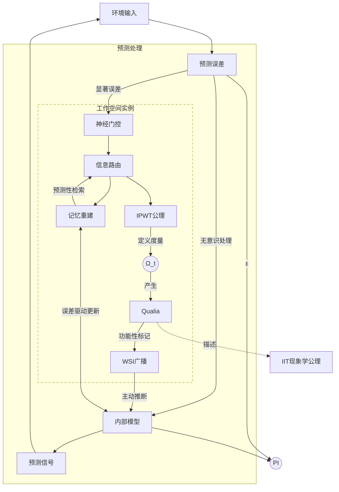

# **整合预测工作空间理论：迈向意识科学的统一框架**

## _——基于预测编码的动力学基础、工作空间理论的架构整合与整合信息理论现象学的计算重构与临床神经科学应用前景展望_

### **摘要**

意识的神经机制与理论基础是当代科学的核心挑战。现有主流意识理论如整合信息理论（IIT）、全局工作空间理论（GWT）及预测编码（PCT）/自由能原理（FEP）等，虽各有贡献，但在计算可行性、物理基质依赖及对复杂意识现象的统一解释方面存在局限。我们提出**整合预测工作空间理论（IPWT）**，旨在构建一个统一的意识框架。IPWT 将 PCT/FEP 作为意识内容生成与维持的动力学基础，将工作空间理论（WT）作为信息整合与广播的架构平台（GWT 被视为 WT 的特例）。核心创新在于对 IIT 现象学公理的重构：通过引入基于协同信息（Synergy）的“**信息整合的逻辑不可约性**”概念，取代其对物理因果不可分性的依赖，使信息整合适用于计算和信息流层面，从而克服 IIT 的计算瓶颈和物理基质限制。IPWT 致力于提供一个计算上可行、具有强大临床解释力（如对精神分裂症、分离性身份障碍等特殊状态的诠释）和哲学思辨深度（如对 Qualia 问题的“功能性标记”解答）的意识模型，旨在为意识科学提供统一范式，并为精神疾病的理解与干预提供理论指导。

**关键词**：意识理论；整合预测工作空间理论 (IPWT)；预测编码；自由能原理；工作空间理论；整合信息理论；协同信息；逻辑不可约性；预测完整性 (PI)；计算神经科学；临床神经科学

### **1. 引言：意识理论的迷雾与整合预测工作空间理论的提出背景**

意识（Consciousness），这一人类经验中最直接、最熟悉却又最难以捉摸的现象，构成了横亘在神经科学、认知心理学、人工智能哲学乃至整个现代科学版图中心地带的“硬问题”（Chalmers, 1995）。它指的是我们作为个体所拥有的主观体验、感知、思想、情感以及对自我和环境的觉知状态。从笛卡尔“我思故我在”的哲学沉思，到威廉·詹姆斯对“意识流”的生动描绘，再到当代神经科学家利用先进技术探寻意识的神经关联物（Neural Correlates of Consciousness, NCCs），人类对意识本质的探索从未停歇。然而，尽管我们在识别与特定意识状态相关的脑区活动、神经振荡模式以及神经递质变化方面取得了令人瞩目的成就（例如，Koch et al., 2016），但关于意识究竟**如何**从大脑这一复杂的生物物理系统中**涌现**（emergence），其丰富而独特的**现象学特征**（phenomenology），如统一性（unity）、主观性（subjectivity）、信息性（informativeness）和排他性（exclusivity）等，是如何形成的，以及意识在认知活动和生存适应中扮演的**确切功能角色**是什么，这些根本性的问题依然悬而未决，缺乏一个被学术界普遍接受的、能够提供统一解释的理论框架。

当前，意识科学领域的研究图景呈现出一种既充满活力又略显碎片化的状态。多种理论范式从不同的学科视角、采用不同的方法论、聚焦于意识的不同侧面，各自发展并积累了重要的经验证据和理论洞见。然而，这些理论之间往往缺乏深度的对话与有效的整合，有时甚至在核心假设和基本概念上存在张力乃至冲突。这种理论上的“巴别塔”困境，不仅阻碍了我们形成对意识本质的整体性理解，也限制了将基础理论研究成果有效转化为临床实践（例如，用于诊断和治疗意识障碍疾病）的能力。本章将首先扼要回顾当前几种具有广泛影响力的主流意识理论，分析它们各自的核心贡献与面临的主要挑战，进而阐明整合这些理论优势以构建一个更全面、更具解释力的新理论框架的必要性和紧迫性，并最终引出本文的核心主张——整合预测工作空间理论（IPWT）的提出背景、核心理念及预期贡献。

#### **1.1. 主流意识理论巡礼：成就斐然与瓶颈凸显的现状分析**

在众多意识理论中，以下几种因其理论的系统性、解释的广度或实证研究的深度而占据了主导地位，它们共同塑造了当前意识科学研究的基本格局，也为 IPWT 的构建提供了重要的思想资源和批判性反思的起点。

##### **1.1.1. 整合信息理论 (Integrated Information Theory, IIT)：现象学驱动的数学化探索及其困境**

整合信息理论（IIT），由朱利奥·托诺尼（Giulio Tononi）及其合作者系统性地提出和发展（Tononi, 2004; Oizumi, Albantakis, & Tononi, 2014; Tononi et al., 2016），是当代意识理论中最为雄心勃勃和形式化程度最高的理论之一。IIT 的独特之处在于其**从现象学出发的公理化方法**。它首先提炼出意识体验本身所具有的五个核心、不可否认的现象学特征（公理）：**存在性（Existence）**，即意识是真实存在的；**信息性（Information）**，即每一种意识体验都是特定且可区分的，它排除了其他可能的体验；**整合性（Integration）**，即意识体验是统一且不可分割的，例如我们无法将对一个红色苹果的感知体验分解为独立的“红色”体验和“苹果形状”体验；**排他性（Exclusion）**，即在任何给定时刻，意识体验的内容和时空尺度都是确定的，不多也不少；以及**结构性/组合性（Composition）**（早期版本）或**因果性（Causation）**（IIT 3.0 及以后版本），强调意识是由一个具有特定因果结构（cause-effect structure）的系统所产生的。

基于这些现象学公理，IIT 通过一系列严格的数学推导和公设，试图找到能够承载这些意识属性的物理基质的必要条件。其核心思想是，一个物理系统的意识水平（或其产生意识体验的能力）取决于该系统能够产生的**整合信息量（Φ 值，Phi）**。Φ 值旨在量化一个系统作为一个整体所具有的、无法被其任何部分独立解释的因果力或信息约束。一个系统的 Φ 值越大，其意识水平就越高。同时，IIT 还强调意识体验的内容（Qualia）是由该系统在特定状态下所展开的“**概念结构（Conceptual Structure）**”或“**感受质空间（Qualia Space）**”所决定的，这个结构描绘了系统内部各组成部分之间以及与过去和未来状态之间的所有因果关系。

IIT 的贡献是多方面的。它为意识的本质提供了一个深刻的、基于信息和因果的哲学洞察，强调了意识的内在性、整体性和不可还原性。它试图将主观的现象学体验与客观的物理系统属性通过数学化的语言连接起来，为意识的量化研究提供了理论基础。IIT 的一些预测，例如意识与大脑后部皮层热区的关联（Boly et al., 2017），以及利用扰动复杂性指数（Perturbational Complexity Index, PCI）作为 Φ 值在临床实践中的近似度量（Casali et al., 2013），也得到了一些实验证据的支持。

然而，IIT 也面临着一系列严峻的理论和实践挑战，这些挑战限制了其作为普适性意识理论的进一步发展：

1. **Φ 值的计算不可行性**：对于任何规模稍大的复杂系统，精确计算其 Φ 值都是一个 NP-Hard 问题（Toker & Sommer, 2019）。这意味着随着系统节点数量的增加，计算 Φ 值所需的资源会呈指数级增长，这使得在大脑这样拥有数百亿神经元的系统中直接应用 IIT 进行意识评估变得几乎不可能。尽管研究者们提出了一些近似计算 Φ 值的方法，但这些近似方法是否能保留原始 Φ 值的核心理论意义，仍存在争议。
2. **对物理基质内在因果结构的强绑定**：IIT 强调意识与特定物理系统的“**内在因果结构（intrinsic cause-effect power）**”的紧密联系，特别是其对“**物理因果不可分性（physical irreducibility）**”的假设。这意味着一个产生意识的系统必须是一个物理上不可分割的整体，其整体的因果效应不能被还原为其各个独立子系统的因果效应之和。这一假设使得 IIT 倾向于认为意识是生物神经系统（或具有类似精细物理连接拓扑的系统）的特有属性，而对于功能等效但在物理实现上不同的系统（例如，某些类型的人工智能系统或在不同物理载体上实现的计算过程）是否能产生意识，IIT 的立场则显得较为保守或难以界定。这限制了 IIT 在探讨意识的“**载体独立性（substrate independence）**”或“**多重实现性（multiple realizability）**”等重要哲学问题上的灵活性。
3. **Qualia 的本质问题**：尽管 IIT 提出了概念结构作为 Qualia 的物理对应物，但其 Φ 值本身是一个标量，主要衡量意识的“量”而非“质”。Φ 值是否以及如何在数学上真正捕捉到了主观感受质（例如，“红色”的主观体验与“疼痛”的主观体验之间的差异）的本质，仍然是一个开放且备受争议的问题（Searle, 2013; Mørch, 2019）。
4. **对动态性和功能性的忽视**：IIT 更侧重于一个系统在某一时刻所具有的静态的因果结构和信息整合能力，而对于意识的动态流动性、内容的时序变化以及意识在指导行为和适应环境中的具体功能角色，其解释力相对较弱。

这些挑战表明，尽管 IIT 提供了关于意识本质的深刻洞见，但其作为全面统一的意识理论，仍有待克服重要的理论和实践障碍。

##### **1.1.2. 全局工作空间理论 (Global Workspace Theory, GWT)：意识的功能架构隐喻及其局限**

全局工作空间理论（GWT），最初由伯纳德·巴尔斯（Bernard Baars, 1988, 1997）提出，是一种影响深远的认知架构理论，它将意识的功能比作一个**剧场的舞台**。在这个隐喻中，认知系统由大量并行的、无意识的、专业化的处理模块（剧场后台的演员和工作人员）组成，它们各自负责处理特定的信息或执行特定的任务。在任何特定时刻，只有少数被选择的信息能够进入“全局工作空间”（舞台上的聚光灯区域），并在那里被放大、整合，并向整个认知系统的所有其他专业化模块进行**全局广播（global broadcast）**。一旦信息进入全局工作空间并被广播，它就成为“有意识的”信息，可以被用于学习、记忆更新、问题解决、行为决策等多种认知功能。

GWT 的核心贡献在于它清晰地阐述了意识在信息处理和认知调控中的**功能性角色**。它成功地解释了意识体验的几个关键特征：

1. **有限容量（Limited Capacity）**：全局工作空间的容量是有限的，这解释了为何我们在任何时刻只能意识到少数信息。
2. **序列性（Seriality）**：信息通常是序列地进入全局工作空间，这与我们主观体验到的意识流的线性特征相符。
3. **信息整合与共享（Information Integration and Sharing）**：全局工作空间作为信息汇聚和广播的中心，使得来自不同模块的信息可以被整合，并被广泛共享给其他模块，从而实现认知过程的协调和统一。
4. **意识与无意识的区分**：GWT 清晰地区分了在全局工作空间中被广播的有意识信息和在后台并行处理的无意识信息。

GWT 的思想被广泛应用于认知心理学、神经科学和人工智能领域。例如，斯坦尼斯拉斯·迪昂（Stanislas Dehaene）及其同事提出的**全局神经工作空间模型（Global Neuronal Workspace Model, GNWM）**（Dehaene, Kerszberg, & Changeux, 1998; Dehaene & Naccache, 2001），试图为 GWT 提供更具体的神经生物学基础，认为意识的产生与大脑中一个广泛分布的、由长程连接的锥体神经元（特别是位于前额叶、顶叶和颞叶皮层的神经元）构成的网络系统的激活有关。当信息进入这个全局神经工作空间并引发一种被称为“点燃（ignition）”的、自上而下的、持续的神经活动时，意识体验便产生了。

尽管 GWT 在解释意识的功能方面取得了巨大成功，但它也存在一些固有的局限性：

1. **主观感受质（Qualia）的缺失**：GWT 主要关注信息处理的流程和架构，而对于为何某些在全局工作空间中被广播的信息会伴随有主观的、第一人称的感受质体验（例如，看到红色的“红感”），GWT 本身并未提供直接的解释。它更多地描述了意识的“功能对应物”，而非“现象对应物”。
2. **全局工作空间的具体机制和边界问题**：尽管 GNWM 提出了一些候选的神经基质，但全局工作空间的精确神经实现机制、其动态边界如何界定、信息如何被选择进入工作空间（“聚光灯”如何移动和聚焦）以及广播的具体神经生理过程等细节仍有待进一步阐明和验证。
3. **对复杂意识状态的解释力不足**：对于一些更复杂的意识现象，如自我意识的形成、梦境的产生机制、或者某些病理性意识状态（如精神分裂症中的思维混乱或分离性身份障碍中的多重意识核心），GWT 的解释框架可能显得过于简化。
4. **“剧场”隐喻的潜在误导性**：虽然“剧场”隐喻非常直观，但它也可能带来一些误导，例如暗示存在一个中心观察者（Homunculus）在观看舞台上的表演，这与当代认知科学去中心化的观点相悖。

因此，GWT 虽然为理解意识的功能架构提供了一个强大的框架，但其在解释意识的主观维度和更深层次的神经机制方面仍有待补充和完善。

##### **1.1.3. 预测编码 (Predictive Coding Theory, PCT) 与自由能原理 (FEP)：认知统一的贝叶斯大脑假说及其与意识的桥梁**

预测编码理论（PCT）和自由能原理（FEP）是近年来在认知科学和计算神经科学领域迅速崛起并产生广泛影响的理论框架，它们共同描绘了一幅将大脑视为**贝叶斯推断引擎（Bayesian inference engine）**的宏伟蓝图（Rao & Ballard, 1999; Friston, 2005, 2010; Clark, 2013, 2016）。这一理论体系的核心思想是，大脑并非被动地接收和处理来自外部世界的感官信息，而是主动地、持续地**生成关于世界状态和感官输入的多层次预测（predictions）**，并利用实际的感官输入来检验和修正这些预测。

在 PCT/FEP 框架下，认知系统的基本组织原则是**最小化预测误差（prediction error）**，即内部预测与实际感官输入之间的差异。这种预测误差信号在神经系统中以自下而上的方式传递，驱动更高层级的内部模型进行更新，从而优化未来的预测。反过来，更高层级的内部模型则通过自上而下的连接向低层级发送预测信号，试图“解释掉”或抑制低层级的活动（如果预测准确的话）。

自由能原理（FEP）为这一过程提供了更为普适和根本的数学表述。FEP 指出，任何自组织系统（如大脑）为了在变化的环境中保持其稳态和存在，都必须最小化其**变分自由能（variational free energy）**。变分自由能是系统内部模型对外部世界的预测与实际感官输入之间不匹配程度的一个信息论度量，它在数学上可以被视为预测误差的上限，或者是对感官输入的“惊奇度（surprise）”的近似。系统可以通过两种基本方式来最小化自由能：

1. **改变内部模型（Perceptual Inference and Learning）**：通过调整内部生成模型的参数，使其能够更准确地预测未来的感官输入。这对应于感知推断（理解当前世界发生了什么）和学习（更新关于世界如何运作的知识）。
2. **改变感官输入（Active Inference and Action）**：通过采取行动来改变自身在世界中的状态或改变世界本身，从而使得实际的感官输入更符合内部模型的预测。这对应于主动推断（选择能够最小化预期自由能的行动）和行为生成。

PCT/FEP 框架的强大之处在于其巨大的**统一解释力**。它不仅能够解释各种感知现象（如双眼竞争、视错觉、期望效应等），还被成功应用于解释学习、记忆、注意力、运动控制、决策制定，甚至情绪、社会认知和精神疾病（如自闭症谱系障碍、精神分裂症等被认为是预测编码过程异常的结果 (Pellicano & Burr, 2012; Adams, Stephan, Brown, Frith, & Friston, 2013; Sterzer et al., 2018)）。它强调了大脑的**能动性（agency）**和**生成性（generative nature）**，将认知视为一个持续的、主动的、以预测为核心的与环境交互的过程。

然而，尽管 PCT/FEP 在解释认知功能的底层计算原理方面取得了巨大成功，但其与主观意识体验之间的**直接理论桥梁**仍在构建之中。以下是一些关键问题：

1. **意识内容的涌现**：虽然 PCT/FEP 解释了信息如何被处理和表征，但它并没有直接说明为何某些特定的预测、预测误差或内部模型状态会伴随有主观的、第一人称的意识体验，而另一些则不会。是什么决定了哪些神经计算过程能够“跃迁”到意识层面？是否存在一个特定的预测误差阈值、模型精度或整合程度与意识的产生相关？
2. **Qualia 的解释**：与 GWT 类似，PCT/FEP 更侧重于信息处理的机制和功能，而对于主观感受质（例如，“红色的感觉”如何从对特定波长光线的预测和误差校正中产生）的解释仍不明确。一些学者尝试将 Qualia 与高阶预测或特定类型的预测误差（如精度加权的预测误差）联系起来 (Seth, 2013; Hohwy, 2012)，但这些观点尚未形成共识。
3. **意识的统一性与边界**：虽然分层预测模型本身具有一定的整合性，但 PCT/FEP 如何解释意识体验的全局统一性（例如，来自不同感官模态的信息如何融合成一个连贯的意识场景）以及意识的边界（例如，自我与非我的区分）仍需更详细的阐述。
4. **与神经实现的具体关联**：尽管有大量研究将 PCT/FEP 的计算组件（如预测单元、误差单元）与特定的神经元类型（如锥体细胞、中间神经元）和神经回路（如皮层柱、丘脑-皮层环路）联系起来 (Bastos et al., 2012; Shipp, 2016)，但这些关联在多大程度上能够直接解释意识的神经基础，仍是一个活跃的研究领域。

因此，PCT/FEP 为我们理解大脑的认知功能提供了一个革命性的计算框架，但要将其完全发展成为一个能够解释意识所有核心特征的理论，还需要进一步的理论创新和实验验证，特别是需要明确其与意识现象学之间的连接机制。

#### **1.2. 现有整合尝试的不足与 IPWT 提出的必要性**

鉴于上述主流理论各自的优势和局限，近年来，一些研究者开始尝试整合不同理论的元素，以期构建更全面、更强大的意识模型。例如，阿尼尔·赛斯（Anil Seth）的工作试图将预测编码与“有意识自我（conscious self）”的概念联系起来，认为自我感源于对身体内部状态（内感受）的预测和控制 (Seth, 2013; Seth & Friston, 2016)。萨夫龙（Adam Safron）提出的整合世界建模理论（Integrated World Modeling Theory, IWMT）尝试将 GWT、PCT 以及 IIT 的某些思想（如信息整合）结合起来，认为意识涉及到构建一个关于世界、身体和自我的整合模型，这个模型在全局工作空间中被处理和广播 (Safron, 2020a, 2020b)。

然而，这些早期的整合尝试虽然具有启发性，但在提供一个**无内在矛盾、计算上可行且具有广泛解释力的统一框架**方面，往往未能达到预期。例如，IWMT 虽然名义上结合了 IIT，但实际上并未深入整合 IIT 的核心公理系统和 Φ 值计算框架，而是将其某种程度上降级为一个辅助性的度量，并承认原始 Φ 值计算的不可行性，转而提议使用一些“近似的整合信息度量”。这种做法实际上是对 IIT 核心概念的一种妥协和回避，未能真正解决 IIT 所面临的根本性难题，如对物理因果拓扑的强依赖性以及计算复杂性问题。此外，这些整合理论在阐明不同理论组件之间（例如，预测编码的动力学机制与全局工作空间的信息广播架构之间）的**精确接口和相互作用机制**方面，往往还不够具体和深入。它们更多地是将不同理论的组件并列或简单相加，而非将其内在机制进行有机的、深度的融合，从而形成一个“1+1>2”的、具有涌现性的新理论。

更重要的是，随着意识科学研究的不断深入，以及对各种复杂意识现象（尤其是病理性意识状态和特殊意识体验）的关注日益增加，我们对意识理论的**解释力、精确性和临床应用潜力**也提出了更高的要求。一个真正有价值的统一意识理论，不仅需要在哲学层面具有思辨的深度，在计算层面具有可操作性，在神经层面具有可验证性，还需要能够为理解和干预现实世界中的意识相关问题（如意识障碍的诊断与康复、精神疾病的病理机制与治疗、人工智能的伦理规范等）提供坚实的理论指导。

正是在这样的背景下，整合预测工作空间理论（IPWT）被提出。IPWT 的核心目标并非简单地“修补”或“拼凑”现有理论，而是试图通过对 PCT/FEP、WT 和 IIT 核心洞见的**深度重构和创造性融合**，构建一个全新的、具有内在一致性和强大外在解释力的统一意识框架。IPWT 的提出，是基于对现有理论局限性的深刻反思，以及对意识科学未来发展方向的积极展望。

IPWT 的核心贡献和独特之处，也即其提出的**必要性**，主要体现在以下几个方面：

1. **深度整合而非浅层拼接**：IPWT 致力于实现 PCT/FEP 的动力学机制、WT 的信息处理架构以及 IIT 的现象学洞察之间的**真正意义上的机制性整合**。它将明确阐述预测编码过程如何驱动工作空间实例（WSI）的形成、内容的填充和动态变化；WSI 如何作为平台对预测信号和误差信号进行高阶整合、处理和广播；以及这种整合过程如何体现并重构 IIT 所描述的意识现象学特征（特别是通过引入“信息整合的逻辑不可约性”概念）。
2. **克服 IIT 的核心瓶颈**：通过对 IIT 公理的**功能性重构**，特别是用基于协同信息（Synergy）的“逻辑不可约性”取代“物理因果不可分性”，IPWT 旨在将信息整合的概念从对特定物理基质的依赖中解放出来，使其适用于信息流和计算层面。这不仅为解决 IIT 的计算不可行性问题提供了新思路（例如，通过寻找逻辑不可约性的可计算代理指标），也为探讨意识的载体独立性和在人工智能系统中实现类意识体验开辟了理论可能性。
3. **明确工作空间的动态机制与多样性**：IPWT 将对工作空间理论（WT）进行扩展和细化，强调 WSI 的动态性、层级性、并行性以及信息在其中整合与广播的具体计算原理（例如，基于预测误差的显著性门控、注意力机制的动态路由等）。传统的 GWT 将被视为 WT 的一种特殊且高度整合的配置状态，从而能够更好地解释意识的灵活性、多样性以及在不同意识状态（如清醒、睡眠、梦境、冥想、乃至病理性分离状态）下的不同表现。
4. **提升对特殊意识状态的解释力**：IPWT 将系统性地运用其整合框架，为多种复杂和特殊的意识现象（如盲视、精神分裂症的幻觉与妄想、分离性身份障碍的多重人格、清醒梦的元认知体验、迷幻药物诱导的意识改变等）提供全新的、基于计算机制的神经计算诠释。这将是检验 IPWT 理论解释力和临床应用潜力的重要试金石。
5. **强调计算可验证性与工程化潜力**：IPWT 从一开始就高度关注其理论预测的**计算可验证性**。它将致力于定义和操作化一系列可计算的指标（如预测完整性 PI 及其积分 ∫PI）来量化 WSI 中的信息整合程度和意识状态的稳定性，并提出具体的计算建模和神经影像学验证路径。这使得 IPWT 不仅仅停留在哲学思辨层面，而是具有发展成为可测试、可应用的科学理论的巨大潜力，甚至可能为未来构建具有类意识能力的人工智能系统提供理论指导。

此外，值得一提的是，近期意识科学领域关于理论范式科学性标准的大讨论（例如，Doerig et al., 2023; Klincewicz et al., 2025; Tononi et al., 2025），也凸显了发展一个在理论预设上更清晰、在核心概念上更可操作、在实验验证上更具可证伪性的意识理论的重要性。IPWT 正是朝着这个方向努力，试图在理论的广度、深度与科学的严谨性之间取得更好的平衡。

综上所述，IPWT 的提出，是意识科学发展到当前阶段，面对理论整合的迫切需求、现有理论的内在局限以及对更深层次解释和更广泛应用的渴望的必然产物。它承载着为这个古老而又前沿的领域提供一个更统一、更强大、更具前景的理论范式的核心愿景。接下来的章节将详细阐述 IPWT 的核心构建、计算实现、神经验证以及其在理解特殊意识状态和重构 Qualia 问题上的独特视角。

### **2. 整合预测工作空间理论 (IPWT) 的核心构建**

整合预测工作空间理论（IPWT）旨在通过整合预测编码（PCT）、自由能原理（FEP）、工作空间理论（WT）的核心机制，并对整合信息理论（IIT）的现象学公理进行功能性重构，构建一个统一的意识框架。本章将详细阐述 IPWT 的核心构建模块，明确其基本假设，深入探讨 PCT/FEP 作为动力学引擎、WT 作为架构平台的作用，并阐述 IPWT 如何通过“信息整合的逻辑不可约性”概念重构 IIT 的现象学公理。

#### **2.1. IPWT 的基本假设与核心原则**

IPWT 建立在以下几个核心假设之上，这些假设共同构成了其理论的基石：

1. **意识是信息整合与协同处理的涌现现象**：IPWT 持功能主义立场，认为意识是信息在特定功能架构中被高效整合和协同处理时涌现的复杂现象。核心在于协同（Synergy）——信息单元形成逻辑上不可分割的整体，产生全新因果效应。这为意识的“载体独立性”提供了基础。
2. **意识是预测驱动的、以最小化自由能为目标的动态过程**：受 PCT/FEP 启发，IPWT 视意识为一个持续的、以预测为核心的动态过程。认知系统通过优化内部生成模型来预测感官输入，并最小化预测误差（或自由能）。意识内容反映了系统对内外环境的最佳解释和预测。
3. **意识是工作空间化的信息处理中枢**：扩展 WT，IPWT 假设存在一个或多个动态的、有限容量的**工作空间实例（Working Space Instance, WSI）**。WSI 是信息选择、整合、放大和广播的关键节点，其有限容量解释了意识的焦点性，广播特性解释了其协调功能。WSI 是动态的功能性网络配置。
4. **意识的整合性源于信息的逻辑不可约性**：IPWT 认同 IIT 关于“整合”是意识核心特征的观点，但将其根源解释为信息在 WSI 中形成的**逻辑不可约性（logical irreducibility）**，而非物理不可分性。整合后的信息整体所具有的意义和因果效应，无法还原为其组成部分的简单加和，这体现了协同信息。这种逻辑不可约性是信息和功能层面的，与特定物理实现解耦。

这些原则共同塑造了 IPWT 的功能主义立场，将意识的本质定位于其所执行的功能和信息处理方式。

#### **2.2. 预测编码 (PCT) 与自由能原理 (FEP) 作为动力学引擎与能量约束**

在 IPWT 中，PCT 和 FEP 构成了意识内容生成、维持及状态转换的**核心动力学引擎**与**能量约束原则**。它们解释了信息如何被生成、处理、更新，并为意识内容的涌现提供了驱动力。

##### **2.2.1. 信息生成与误差最小化：贝叶斯大脑与意识筛选**

IPWT 采纳大脑作为贝叶斯推断机器的观点，认知系统主动构建内部生成模型预测感官输入，意识内容则是在此预测-误差校正循环中产生的特定信息。

- **分层生成模型**：认知系统的内部模型具分层结构，高层抽象概念向低层具体感知传递预测信号 (Lee & Mumford, 2003; Friston, 2008)。系统通过最大化模型证据 $P(s_t | m)$ 来优化模型 $m$。
- **预测误差（Prediction Error）**：实际感官输入 $s_t$ 与预测 $\hat{s}_t$ 的差异 $\epsilon_t = s_t - \hat{s}_t$，经过精度加权（precision-weighted）后，自下而上传播 (Feldman & Friston, 2010)。预测误差驱动模型更新（学习），同时作为“看门人”筛选进入意识的信息——只有超过显著性阈值的误差才可能进入 WSI。
- **自由能最小化（Free Energy Minimization）**：FEP 指出，自组织系统必须最小化其**变分自由能（$F$）**以维持稳态 (Friston, 2010)。$F$ 是内部模型与外部世界不匹配程度的上限，可分解为复杂度（保持模型简洁）和准确度（精确预测感官输入）两项。系统通过**感知推断与学习**（优化内部模型）和**主动推断与行动**（改变感官输入以符合预测）来最小化 $F$ (Friston et al., 2015)。FEP 为意识的能量效率和进化适应性提供了基础：意识的涌现是为了更有效地最小化自由能。

##### **2.2.2. 内部模型、环境交互与记忆系统：意识内容的动态构建**

IPWT 强调意识内容是系统内部模型对内外世界的主动、建构性的最佳预测和解释。

- **能动性（Agency）与自我感（Sense of Self）**：通过 FEP 驱动的预测-行动循环，系统主动塑造与环境的交互，并构建关于“自我”的内部模型 (Adams, Shipp, & Friston, 2013; Friston, 2009)。成功的自我预测与控制涌现出连贯的自我感。
- **意识内容的涌现**：进入意识的信息通常具有高预测精度、显著预测误差、行为攸关性以及高度的整合与连贯性。
- **记忆作为内部预测模型的核心**：内部生成模型本质上是动态的、预测性的记忆系统 (Rolls, 2024)。记忆的编码是模型参数的学习；巩固是模型的离线优化；检索是主动的预测过程 (Hinton & Salakhutdinov, 2009)。情景记忆与意识体验的特殊关联 (Budson, Richman, & Kensinger, 2022) 也支持了预测性记忆在意识中的作用。近期研究进一步证实了 PCT/FEP 在感觉处理 (Sainburg et al., 2025; Lyons & Gottfried, 2025) 和高级认知 (Gabhart et al., 2025) 中的核心地位。

PCT/FEP 为 IPWT 提供了动力学基础，驱动 WSI 的信息整合与广播，并为信息整合的逻辑不可约性的涌现铺平道路。

#### **2.3. 工作空间理论 (WT) 作为核心架构平台：信息整合与广播的动态中枢**

在 IPWT 框架中，工作空间理论（WT）被提升和扩展为一个核心的**架构平台（architectural platform）**，负责实现意识关键的信息整合、处理和广播功能。它不再仅仅是一个隐喻性的“剧场舞台”，而被赋予了更具体的计算角色和动态特性。WT 为 PCT/FEP 驱动的信息流提供了一个结构化的处理中枢，使得原本分散的、在专业化模块中并行处理的信息能够被选择、汇聚、整合，并形成统一的、可被系统广泛利用的意识状态。

##### **2.3.1. 工作空间实例（WSI）的核心属性与动态特性**

IPWT 的核心概念是**工作空间实例（Working Space Instance, WSI）**。一个 WSI 是一个动态形成的、具有有限信息处理容量的功能性网络或认知子系统。它具有以下核心属性：

- **有限容量（Limited Capacity）**：任何一个 WSI 在同一时刻能够容纳和处理的信息量是有限的。这直接解释了意识体验的焦点性（我们通常只能清晰地意识到少数事物）和序列性（意识内容似乎是按时间顺序流动的，因为新的信息需要取代旧的信息进入有限的 WSI）。这种容量限制迫使系统发展出高效的信息选择和门控机制。
- **信息整合（Information Integration）**：WSI 的核心功能之一是将来自不同来源（例如，不同的感官通道、记忆系统、或内部预测模块）的信息单元进行汇聚、关联和整合，形成一个比各个组成部分更丰富、更连贯、逻辑上更统一的认知状态。这种整合过程不仅仅是信息的简单叠加，更涉及到信息之间的复杂交互、相互约束和协同作用，从而产生新的意义和因果力。
- **选择性广播（Selective Broadcast）或信息可用性（Information Availability）**：一旦信息在 WSI 中被充分整合并达到一定的显著性或稳定性，它就会被“广播”或使其“可用于”系统内与该 WSI 功能相关的其他认知模块。这种广播并非强制性地向所有模块发送，而是具有一定的选择性和目标性，取决于模块间的连接强度、任务相关性以及注意力分配。例如，一个负责视觉场景理解的 WSI 可能会将其整合的场景表征广播给负责物体识别、空间导航和情景记忆编码的模块。这种信息共享机制是实现认知功能协调和行为一致性的关键。近期研究也支持了这种目标导向的信息整合与广播，例如体感皮层中的双边整合受行为相关性控制 (Park et al., 2025)，揭示了任务依赖的半球间耦合机制。
- **动态性与多样性（Dynamism and Diversity）**：IPWT 强调 WSI 并非固定不变的解剖结构，而是可以根据认知需求和环境变化**动态形成、调整、合并、分离或消散的功能性网络配置**。这意味着在不同认知任务或意识状态下，可能存在不同规模、不同组成、不同整合程度的 WSI。例如，在高度专注的任务中，可能形成一个高度整合、边界清晰的主导 WSI；而在放松或分心状态下，WSI 的整合度可能降低，或者同时存在多个边界模糊、竞争性的 WSI。默认模式网络的结构功能研究也支持工作空间理论的这种动态网络架构观点 (Paquola et al., 2025)。

##### **2.3.2. 全局工作空间理论（GWT）作为 WT 的一种特殊且高度整合的配置**

传统的全局工作空间理论（GWT）在 IPWT 框架下被重新诠释和定位。IPWT 并不否认 GWT 所描述的全局信息广播现象的存在和重要性，而是将其视为**工作空间理论（WT）的一种特殊且高度整合的配置状态**。具体而言：

- 当一个或少数几个 WSI 的整合范围极广、整合程度极高，能够有效地汇聚和处理来自绝大多数（或所有）当前任务相关的专业化认知模块的信息，并将其处理结果广泛广播，从而形成一个覆盖整个认知系统的、统一的、连贯的、稳定的主导意识体验时，这个（或这些）WSI 就扮演了传统 GWT 中“全局工作空间”的角色。
- 这种高度整合的全局性 WSI 通常与清醒、警觉、注意力集中的意识状态相关，它使得复杂的认知功能（如理性思考、长期规划、自我反思、语言交流等）成为可能。
- 然而，IPWT 认为，并非所有的意识体验都必须达到这种全局整合的程度。在某些情况下，例如在梦境、某些冥想状态、或某些精神障碍（如 DID）中，可能存在多个并行的、整合范围相对局限的 WSI，或者 WSI 的整合程度较低、边界模糊。这些情况同样可以产生意识体验，尽管其性质和内容可能与典型的清醒意识有显著不同。
- 通过这种方式，IPWT 既保留了 GWT 对意识核心功能的洞察，又为其赋予了更大的灵活性和解释范围，使其能够更好地容纳意识状态的多样性和复杂性。

##### **2.3.3. 工作空间实例（WSI）与预测编码（PCT）/自由能原理（FEP）分层整合的兼容性与协同作用**

WSI 并非独立于 PCT/FEP 动力学机制而存在的孤立架构，而是与后者紧密集成、协同工作的。它们之间的关系可以理解为：

- **WSI 作为高阶预测与整合的平台**：WSI 通常不直接处理原始的感官输入，而是接收来自较低层级 PCT 模块已经进行初步处理和压缩的信息，以及那些未能被低层级预测模型有效“解释掉”的、显著的预测误差信号。WSI 的作用是在一个更高的认知层级上，对这些输入信息进行进一步的整合、比较、评估，并生成更高阶的预测和解释。例如，一个 WSI 可能整合来自视觉皮层的物体形状信息和来自听觉皮层的声音信息，形成一个关于“正在鸣叫的鸟”的统一感知。
- **WSI 参与高阶自由能最小化**：WSI 内部的信息整合和处理过程，同样遵循自由能最小化的原则。WSI 试图构建一个关于其输入信息的最连贯、最简约、预测力最强的内部模型，并将其广播出去以指导其他模块的活动，从而帮助整个系统最小化自由能。当 WSI 内部的整合出现冲突或不一致时（例如，视觉信息和听觉信息不匹配），会产生一种“高阶预测误差”，驱动 WSI 调整其整合策略或寻求更多信息。
- **多个 WSI 与 FEP-PCT 层次结构的并行化或碎片化**：当存在多个并行运行的 WSI 时（例如，在 DID 或某些形式的清醒梦中），这可以被解释为整个认知系统的 FEP-PCT 层次结构在最高层级上发生了某种形式的**功能性并行化或碎片化**。每个 WSI 都可能对应于一个相对独立的、高阶的 FEP-PCT 子系统，它主要在其特定的信息域内或针对特定的目标进行预测误差最小化。这些并行 WSI 之间的信息隔离程度（由神经门控机制和信息传输效率决定）将直接影响它们各自的意识内容以及整个系统的行为协调性。

通过这种方式，IPWT 将 PCT/FEP 的动力学机制与 WT 的架构功能有机地结合起来，描绘了一幅意识如何在多层级预测与整合的动态过程中涌现的计算图景。WSI 为预测编码提供了结构化的舞台，而预测编码则为 WSI 的内容填充和动态变化提供了源源不断的动力。

#### **2.4. 整合信息理论（IIT）现象学公理的重构：从物理因果到逻辑协同**

IPWT 对 IIT 的核心贡献在于对其现象学公理进行了根本性的**功能性重构**，旨在保留 IIT 对意识本质特征的深刻洞察，同时克服其在计算可行性、物理基质依赖性以及对动态意识过程解释力不足等方面的局限。IPWT 并不直接采纳 IIT 的 Φ 值计算方法或其关于特定物理因果拓扑的要求，而是将 IIT 的五个核心现象学公理（存在、信息、整合、排他、因果）重新诠释为**信息流在工作空间实例（WSI）的特定架构中，经过预测编码（PCT）驱动的复杂处理和协同整合（synergistically integrated）时所必然展现出的高级功能属性** (Oizumi et al., 2014; Tononi, 2012; Tononi et al., 2016)。这一重构的核心在于引入了“**信息整合的逻辑不可约性**”概念，并将其与信息论中的**协同信息（Synergy）**联系起来，以此取代 IIT 对“物理因果不可分性”的强调。

##### **2.4.1. “信息整合的逻辑不可约性”取代“物理因果不可分性”：摆脱物理束缚，拥抱计算与信息**

原始 IIT 理论的一个核心且备受争议的假设是，一个能够产生意识的物理系统必须具有“**物理因果不可分性**”。这意味着该系统的整体因果效应不能被还原为其任何分离的子部分独立产生的因果效应之和。这种不可分性是基于系统内部元素之间精细的物理连接和相互作用的拓扑结构。虽然这一概念深刻地捕捉了意识体验的统一性和整体性，但它也使得 IIT 难以应用于非生物系统或那些物理实现方式与大脑神经元网络显著不同的系统，并且为 Φ 值的计算带来了巨大困难。

IPWT 提出，意识体验的整合性根源并非来自其底层物理基质的某种不可切割的物理属性，而是来自在 WSI 中被处理和整合的信息单元之间所形成的**逻辑上的不可约性（logical irreducibility）**。这意味着：

- 当多个独立的信息单元（例如，关于物体的颜色、形状、运动、声音等特征的表征）被输入到一个 WSI 中，并通过 WSI 内部的复杂计算过程（例如，特征绑定、模式匹配、上下文关联、预测生成等）进行整合后，它们会形成一个全新的、更高阶的、统一的认知表征（例如，“一只正在草地上奔跑并吠叫的棕色狗”）。
- 这个整合后的整体表征所具有的**语义意义、功能性角色以及对系统后续状态和行为的因果影响力**，是无法通过简单地将其分解回原始的、孤立的信息单元并将其各自的意义和因果力相加来完全解释的。换句话说，这个整合后的整体**在逻辑上、功能上和因果上都是不可约的**。它作为一个新的、统一的信息实体而存在，并产生其任何组成部分都无法单独产生的独特效应。
- 这种逻辑不可约性正是信息论中**协同信息（Synergistic Information）**在认知系统中的功能性体现。协同信息指的是多个信息源共同提供给某个目标变量的、无法被这些信息源的任何子集独立提供的信息量 (Williams & Beer, 2010; Griffith & Koch, 2014)。当 WSI 将多个输入信息整合起来以生成一个更精确的预测、一个更连贯的解释或一个更有效的行动策略时，它实际上是在利用这些输入信息之间的协同作用，提取出那些只有当它们作为一个整体被考虑时才能显现出来的“隐藏”信息。

通过将整合性的核心从“物理不可分性”转向“逻辑不可约性”，IPWT 实现了几个重要的理论突破：

1. **载体独立性**：逻辑不可约性是信息处理和计算层面的属性，原则上可以在任何能够实现必要计算功能的物理基质上实现，无论是生物神经元、硅基芯片还是其他新兴的计算媒介。这使得 IPWT 能够更好地讨论和容纳意识的“多重实现性”。
2. **计算可操作性**：虽然直接计算高维协同信息仍然是一个挑战，但将整合性定义在信息和计算层面，为开发其可计算的代理指标（如 IPWT 中提出的预测完整性 PI）提供了更清晰的理论指导。我们可以通过评估一个系统在 WSI 中整合信息以优化预测和行为的效率和效果，来间接衡量其信息整合的逻辑不可约性程度。
3. **与动态过程的兼容性**：逻辑不可约性是一个可以随时间动态变化的属性。WSI 内部信息整合的程度和方式可以根据任务需求和认知状态灵活调整，从而使得逻辑不可约性（以及相应的意识体验）也呈现出动态变化的特征，这与意识流的本质更为契合。

##### **2.4.2. IPWT 对 IIT 五个现象学公理的功能性重构与 WSI 诠释**

基于“信息整合的逻辑不可约性”这一核心概念，IPWT 对 IIT 的五个现象学公理进行了如下的功能性重构，并将它们与 WSI 的运作机制紧密联系起来：

1. **存在 (Existence)**：在 IPWT 框架下，当一个信息单元（例如，一个由 PCT 生成的预测信号、一个从记忆中提取的表征、或一个在 WSI 中形成的整合概念）在认知系统中被激活、处理，并达到一定的显著性或稳定性，使其能够在系统中产生可识别的、持续的**功能性影响**时，它就“存在”于该认知状态中。这种“存在”是信息性的和功能性的，意味着该信息单元在 WSI 中占据了一个“计算槽位”，能够参与后续的整合、广播和因果作用。它不再仅仅是物理神经元的激活，而是具有特定计算角色的信息实体。

2. **信息 (Information)**：每一个在 WSI 中“存在”的信息单元都携带独特的、可区分的**内容或语义（content or semantics）**。它通过指定一种特定的状态或可能性（从而排除其他可能性），为系统减少了关于其内部状态或外部环境的不确定性。在 PCT 框架下，信息体现在预测信号的特异性（它预测了什么）、预测误差信号的内容（它揭示了预测与现实的何种差异）以及内部模型表征的丰富性（它能够区分多少种不同的世界状态）。在 WSI 中，这些信息单元通过其独特的“功能签名”相互区分，并对其他信息单元产生特定的影响。

3. **整合 (Integration)**：这是 IPWT 重构的核心。整合指的是多个独立的信息单元在 WSI 中被汇聚、关联、相互作用，并通过复杂的计算过程（如特征绑定、关系推断、协同激活、预测生成等）形成一个**逻辑上不可约的、功能上统一的、协同的（synergistic）认知状态或表征**。这个整合后的整体所具有的意义、预测能力和因果效应，超越了其组成部分的简单总和。这种整合的程度，即其协同性或逻辑不可约性的强度，是意识体验统一性和丰富性的关键来源。它反映了 WSI 将分散信息编织成一个连贯“故事”的能力。视觉处理中超越简单特征绑定的复杂场景理解 (Scholte & de Haan, 2025) 即是这种高度整合的体现。

4. **排他 (Exclusion)**：由于 WSI 的有限容量以及认知系统高效运作的需求，在任何给定时刻，只有一个或少数几个最具显著性、最相关、预测误差最小化效果最好，或者整合程度最高的认知状态或信息集合能够主导 WSI，并成为当前意识体验的核心内容。其他竞争性的、不相关的或整合程度较低的信息则被暂时**排除（excluded）**在意识的焦点之外，或者处于 WSI 的边缘地带。这种排他性是由 WSI 的门控机制（gating mechanisms）、注意力选择（attentional selection）以及预测编码的竞争动态（competitive dynamics）共同实现的。它确保了意识内容的清晰性、确定性和有限性，避免了信息过载和认知混乱。

5. **因果 (Causation)**：在 WSI 中被整合并达到主导地位的信息状态，具有显著的**因果能力（causal power）**。它能够作为驱动力，影响系统内部其他认知模块的活动（例如，更新长期记忆、调整注意力焦点、激活情感反应），并最终指导有机体的外显行为和决策。这种因果效应是通过 WSI 的广播机制（将整合后的信息传递给相关模块）以及主动推断过程（WSI 中的状态直接参与预期自由能的计算并指导行动选择）来实现的。WSI 中整合的信息状态，不仅仅是对世界的被动表征，更是系统采取行动、改变世界以符合其内部模型和目标的“控制中心”或“决策枢纽”。

通过这种对 IIT 现象学公理的功能性重构，IPWT 成功地将其深刻的哲学洞察融入到一个更具动态性、计算可行性和载体独立性的理论框架之中。它将意识的本质特征从难以捉摸的物理属性，转化为可在信息处理和计算层面进行研究、度量和建模的高级功能属性，为意识科学从纯粹的哲学思辨走向可操作的实验研究和计算模拟开辟了新的道路。

### **3. IPWT 的计算可验证性与信息整合度量：从理论定义到可操作代理**

整合预测工作空间理论（IPWT）不仅致力于在概念层面提供一个统一的意识框架，更强调其理论主张的**计算可验证性（computational verifiability）**和**经验可测试性（empirical testability）**。一个成熟的科学理论，除了应具有强大的解释力外，还必须能够生成可检验的预测，并提供可操作化的度量方法，以便通过实验数据进行验证、修正或证伪。本章的核心任务，正是为 IPWT 构建这样一个从抽象理论概念到具体计算度量的桥梁。

我们将首先探讨 IPWT 对意识核心特征——“信息整合”——的理论上的黄金标准度量，即**瞬时信息整合度（$\Omega_t$）**，并基于信息论中的**部分信息分解（Partial Information Decomposition, PID）**框架，特别是**协同信息（Synergistic Information）**的概念，为其提供一个严谨的数学定义。然而，鉴于直接计算高维协同信息的极端复杂性，$\Omega_t$ 在实践中往往难以直接应用。因此，本章的第二个重点将是引入并详细阐述 IPWT 提出的两个核心**可计算代理指标（computable proxy measures）**：**预测完整性（Predictive Integrity, PI）**及其在时间上的积分——**预测完整性积分（∫PI）**。这两个指标旨在通过评估认知系统在工作空间实例（WSI）中整合信息以优化预测、最小化误差和适应环境的效率和效果，来间接但有效地反映其潜在的信息整合水平。最后，为了夯实 PI 作为 $\Omega_t$ 合理代理的理论基础，我们将对一个经典的哲学反驳——即所谓的“聪明白痴（Clever Idiot）”问题——进行形式化的论证，阐明为何在一个受现实物理、计算和演化约束的系统中，高效的预测能力（高 PI）必然要求并驱动高水平的信息整合（高 $\Omega_t$）。

通过这一系列阐述，本章旨在将 IPWT 从一个定性的理论描述，转化为一个具备定量分析潜力的科学模型，为后续章节中讨论其神经生物学验证路径和临床神经计算应用奠定方法论基础。

#### **3.1. 瞬时信息整合度 ($\Omega_t$)：基于部分信息分解（PID）的协同信息理论定义**

在 IPWT 框架下，信息整合是意识产生的核心机制，特指在工作空间实例（WSI）中，多个独立信息单元通过复杂的计算过程形成一个逻辑上不可约的、功能上统一的、协同的认知状态。为了从理论上精确地刻画这种“整合”的程度，IPWT 借鉴并拓展了信息论中部分信息分解（PID）框架的思想，特别是其中关于**协同信息（Synergistic Information, CI）**的概念，来定义一个理论上的“黄金标准”度量——**瞬时信息整合度（$\Omega_t$）**。

##### **3.1.1. 部分信息分解（PID）框架简介**

传统的香农信息论主要关注两个变量之间的互信息 $I(X;Y)$，或者多个变量作为一个整体与目标变量之间的互信息 $I(X_1, ..., X_n; Y)$。然而，当有多个信息源 $X_1, ..., X_n$ 同时为预测或解释一个目标变量 $Y$ 提供信息时，它们各自的贡献以及它们之间的相互作用关系（例如，是提供冗余信息、独立信息还是协同信息）变得非常复杂。部分信息分解（PID）框架，最早由 Williams 和 Beer (2010) 提出，正是为了解决这个问题，试图将多个源 $X_1, ..., X_n$ 提供给目标 $Y$ 的总信息 $I(X_1, ..., X_n; Y)$ 分解为几个互不重叠的组成部分：

- **冗余信息（Redundant Information, RI）**：所有源都共同提供的关于 $Y$ 的信息。
- **独有信息（Unique Information, UI）**：某个源 $X_i$ 单独提供的、其他源都未提供的关于 $Y$ 的信息。
- **协同信息（Synergistic Information, CI）**：只有当所有源（或某个特定的源组合）被放在一起考虑时才能显现出来的、关于 $Y$ 的“涌现性”信息。这种信息无法被任何单个源或源的子集所独立提供，体现了“整体大于部分之和”的效应。

PID 框架为理解复杂系统中信息的多重交互提供了一个强大的理论工具，尽管其在高维情况下的具体计算和唯一分解仍是信息论研究的前沿课题 (Bertschinger, Rauh, Olbrich, & Jost, 2014; Griffith & Koch, 2014)。

##### **3.1.2. $\Omega_t$ 作为协同信息在预测性信息中的占比**

IPWT 认为，WSI 中信息整合的本质，正在于它能够有效地利用输入信息之间的**协同作用**，以形成对世界更准确、更连贯、更有预测力的表征。因此，我们将**瞬时信息整合度（$\Omega_t$）**在理论上定义为：在一个特定的工作空间实例（WSI）中，用于预测某个目标变量 $Y$（例如，下一时刻的感官输入、系统的最优行动策略、或一个内部概念的激活状态）的一组信息单元（或特征）$X = \{X_1, X_2, ..., X_n\}$ 所产生的**协同信息（CI）**在其提供的关于 $Y$ 的**总预测性信息（即总互信息 $I(X;Y)$）中所占的比例**。

数学上，可以表示为：
$$ \Omega_t(X \to Y) = \frac{\text{CI}(X_1, ..., X_n; Y)}{I(X_1, ..., X_n; Y)} $$
其中：

- $\text{CI}(X_1, ..., X_n; Y)$ 是信息源集合 $X$ 共同提供给目标变量 $Y$ 的协同信息量。它精确地捕捉了 IPWT 所强调的“信息整合的逻辑不可约性”的精髓——即这些信息源作为一个整体所产生的、无法被其任何子集独立贡献的关于 $Y$ 的独特知识。
- $I(X_1, ..., X_n; Y)$ 是信息源集合 $X$ 与目标变量 $Y$ 之间的总互信息。它代表了 WSI 中的这组信息对预测目标 $Y$ 的全部贡献，用于对协同信息进行归一化，使得 $\Omega_t$ 的取值范围在 $[0, 1]$ 之间（理论上，如果存在反协同效应，CI 可能为负，但这超出了标准 PID 框架的讨论）。

一个高的 $\Omega_t$ 值意味着 WSI 中的信息主要是以协同的方式被整合和利用的，系统能够有效地从多个信息源的复杂交互中提取出“隐藏”的模式和关系，形成高度整合的、逻辑上不可约的预测或表征。相反，一个低的 $\Omega_t$ 值则意味着 WSI 中的信息主要是以冗余或独立的方式被处理，系统未能有效地发掘信息之间的深层联系，其预测能力更多地依赖于信息的简单累积而非协同整合。

##### **3.1.3. $\Omega_t$ 的理论意义与实践局限**

$\Omega_t$ 的这一定义具有重要的理论意义：

1. **概念清晰**：它将 IPWT 对“整合”的核心理解（逻辑不可约性、协同性）与信息论中的严谨数学概念直接联系起来。
2. **目标导向**：它强调信息整合是服务于特定预测或认知目标的，而非漫无目的的信息汇聚。
3. **可比性**：通过归一化，它提供了一个可以在不同系统、不同任务或不同时间点之间进行比较的相对度量。

然而，我们必须清醒地认识到，尽管 $\Omega_t$ 在理论上是一个理想的度量，但在实践中直接计算它面临着巨大的挑战：

1. **PID 的计算复杂性**：对于超过两三个信息源的情况，PID 的精确分解和协同信息的计算本身就是一个极其困难的、尚未完全解决的数学和计算问题。在高维的、真实的认知系统中（例如，WSI 可能整合来自成百上千个神经元或特征的信息），直接计算 $\Omega_t$ 几乎是不可能的。
2. **目标变量 $Y$ 的定义**：在复杂的认知任务中，如何精确地定义 WSI 所要预测的目标变量 $Y$ 本身就是一个难题。$Y$ 可能是一个高维的、动态变化的、甚至是内部生成的变量（如一个抽象概念的激活）。
3. **信息单元 $X_i$ 的划分**：如何将 WSI 中的信息流恰当地划分为一组离散的、有意义的信息单元或特征 $X_i$，也是一个需要仔细考虑的问题。

因此，IPWT 将 $\Omega_t$ 主要定位为一个**纯粹的理论概念框架（theoretical construct）**和**理想化的黄金标准（idealized gold standard）**。它的主要作用是为信息整合提供一个清晰、严谨的理论定义，并为我们接下来引入其更易于操作和计算的**功能性代理指标（functional proxy measures）**——即预测完整性（PI）及其积分（∫PI）——提供坚实的理论依据和追求目标。我们之所以需要 PI，正是因为我们无法轻易地直接测量 $\Omega_t$。PI 的设计目标，就是尽可能地从功能层面反映一个系统在 WSI 中进行协同信息整合以优化预测的效率和效果。

#### **3.2. 预测完整性 (PI) 与预测完整性积分 (∫PI)：可计算的代理指标与意识状态的验证标准**

鉴于瞬时信息整合度（$\Omega_t$）在实践中难以直接计算的局限性，IPWT 引入了两个核心的、可操作化的、旨在从功能层面间接反映信息整合水平的代理指标：**预测完整性（Predictive Integrity, PI）**和**预测完整性积分（Predictive Integrity Integral, ∫PI）**。这两个指标的核心思想是：一个能够在其工作空间实例（WSI）中高效地进行协同信息整合（即具有高 $\Omega_t$）的认知系统，必然会展现出更强的预测能力、更低的预测误差、对自身预测不确定性的更准确估计，以及在面对新信息时更稳健的内部模型更新。PI 和 ∫PI 正是试图从这些可观察的、与预测过程相关的特征入手，来量化意识状态的“完整性”和“稳定性”。

这两个指标的数学形式和核心参数的理论意义，在 IPWT 的理论阐述（例如，在`IPWT.md`文档的 3.2 节）中已有详细定义。这里我们再次强调其核心结构和关键组成，并将其与 WSI 中的信息处理过程联系起来。

##### **3.2.1. 瞬时预测完整性（PI）的公式与核心组件解析**

瞬时预测完整性（PI）旨在量化在某个特定时间点 $t$，认知系统（具体而言，是其活跃的 WSI）在整合当前可用信息以生成对未来（或当前未完全观察到的）状态的预测，并最小化预测误差方面的整体效能。其公式直接借鉴了自由能原理（FEP）的基本结构，将系统的“认知成本”或“预测能量”通过一个指数函数映射到一个介于 0 和 1 之间的“预测完整性”分数：

$$
\text{PI}_t = \exp\left(-\alpha \cdot \left( \frac{1}{N_k} \sum_{k=1}^{N_k} \frac{\|\epsilon_{t,k}\|_2}{\tau_{t,k}} + \gamma \cdot \text{Surprise}_{t} \right)\right)
$$

我们对公式中的核心组件进行解析：

- **$\epsilon_{t,k}$ (预测误差向量)**：在时间点 $t$，对于 WSI 内部处理的第 $k$ 个信息通道或特征维度（总共有 $N_k$ 个维度），模型预测值与实际观测值之间的差异向量。$\|\epsilon_{t,k}\|_2$ 是其 L2 范数，代表了预测误差的大小。这个误差直接反映了 WSI 当前内部模型与现实之间的不匹配程度。一个高效整合信息的 WSI 应该能够通过利用信息间的协同作用，生成更精确的预测，从而减小 $\|\epsilon_{t,k}\|_2$。

- **$\tau_{t,k}$ (预测不确定性或逆精度)**：在时间点 $t$，模型对第 $k$ 个信息通道预测的预期不确定性（即方差 $\sigma^2_{t,k}$）或其倒数——精度 $\pi_{t,k} = 1/\sigma^2_{t,k}$（在公式中，$\tau_{t,k}$ 通常指代方差或标准差，这里我们统一理解为不确定性的度量，如方差）。$\tau_{t,k}$ 是模型内生的，由其自身的“元认知”机制（例如，注意力分配、对输入数据质量的评估、对自身模型能力的判断）动态调节的参数。它反映了 WSI 对其当前预测“自信心”的报告。一个成熟的 WSI 不仅要做出准确的预测，还要能够合理地估计其预测的不确定性。当面对高度嘈杂或模糊的输入时，一个适应性强的 WSI 会调高其 $\tau_{t,k}$（降低精度），从而避免对不可靠的误差信号做出过度反应。

- **$\frac{\|\epsilon_{t,k}\|_2}{\tau_{t,k}}$ (标准化预测误差或“不准确性成本”)**：这一项是预测误差相对于模型自身不确定性的标准化度量。它惩罚那些模型本应自信（低 $\tau_{t,k}$）但却预测错误的情况，而对那些模型本就预期不确定（高 $\tau_{t,k}$）的预测错误则给予较小的惩罚。$\frac{1}{N_k} \sum_{k=1}^{N_k} \frac{\|\epsilon_{t,k}\|_2}{\tau_{t,k}}$ 代表了在所有 $N_k$ 个维度上的平均标准化预测误差，构成了 PI 公式中的第一个核心成本项——**不准确性成本（Inaccuracy Cost）**。一个高整合度的 WSI 应该能够同时最小化 $\|\epsilon_{t,k}\|_2$ 和优化 $\tau_{t,k}$ 的估计，从而降低这一成本。

- **$\text{Surprise}_{t}$ (“惊奇度”或“不一致性/复杂度成本”)**：这一项旨在量化当 WSI 接收到新的感官输入或内部信息，并据此更新其内部模型（即学习）时，对整个 WSI 内部模型（或更广泛地说，是整个认知系统的生成模型）所造成的“扰动”或“震动”的程度。在 FEP 框架中，这通常对应于近似后验信念与先验信念之间的 KL 散度，或者更广义地，可以理解为为了适应新信息而需要对内部模型进行的结构性调整的“代价”或“复杂度”。一个过于僵化或过于脆弱的 WSI 在面对新信息时都可能产生高昂的 $\text{Surprise}_{t}$ 成本。

- **$\gamma$ (Gamma：世界观权重参数)**：这是一个超参数，用于权衡“不准确性成本”和“不一致性/复杂度成本（Surprise）”在总认知成本中的相对重要性。$\gamma$ 的取值反映了认知系统的一种“认知风格”或“世界观”：

  - **高 $\gamma$** 意味着系统更看重内部模型的稳定性和逻辑一致性，不愿轻易为了拟合新的、可能是噪声的或离群的数据而大幅修改其核心信念。这种系统可能显得较为“保守”或“固执”，但其内部世界观较为稳定。
  - **低 $\gamma$** 意味着系统更看重对外部现实的精确拟合，愿意根据新证据随时大幅调整其内部模型，即使这会导致内部信念的频繁波动。这种系统可能显得较为“经验主义”或“灵活易变”，但其内部世界观可能不够稳定。
    在 IPWT 的临床应用中，通过实验校准找到能够最好地区分不同意识状态（例如，健康对照组 vs. 精神分裂症患者）的 $\gamma$ 值，可能揭示这些状态在信息处理策略上的根本差异（例如，精神分裂症患者是否因为 $\gamma$ 值过低而导致其内部模型过度拟合异常感知，从而产生幻觉和妄想？）。

- **$\alpha$ (Alpha：敏感度标尺参数)**：这是另一个超参数，定义了系统对总的“认知成本”（即括号内的加权和）的敏感度。它控制着从“总认知成本”到最终 PI 分数的指数映射曲线的陡峭程度。

  - **高 $\alpha$** 意味着系统对任何微小的认知失误或模型不一致都非常敏感，任何一点成本的增加都可能导致 PI 值的急剧下降。这模拟了一个对预测完整性要求极高的、“零容忍”的系统，或者说是一个处于“严苛生存环境”中的系统。
  - **低 $\alpha$** 则意味着系统可以承受相对较高的总认知成本而仍能维持可接受的 PI 分数，模拟了一个对预测完整性要求较为宽松的系统，或者说是一个处于“宽容生存环境”中的系统。
    $\alpha$ 的作用类似于校准“PI 显微镜”的对比度，帮助研究者放大或缩小不同状态之间 PI 值的差异，以便找到最具有统计显著性的“焦距”。

- **$\exp(-\cdot)$ (指数映射函数)**：这个函数将括号内代表“总认知成本”（一个非负值，理论上可以无限大）的项，非线性地映射到一个介于 0（当成本无限大时）和 1（当成本为 0 时）之间的“预测完整性”分数。这种映射关系确保了 PI 值具有良好的数学属性（如归一化、单调递减），并且能够直观地表示系统预测的“优良程度”或“健康状况”。成本越低，PI 值越接近 1，表示预测完整性越高；成本越高，PI 值越趋近于 0，表示预测完整性越低。

通过这些组件的协同作用，PI 公式试图捕捉一个认知系统（或其 WSI）在动态地整合信息、预测世界、并适应环境过程中的整体计算效能。一个具有高 PI 值的系统，被认为能够高效地利用其 WSI 进行协同信息整合，从而做出准确的预测，合理地评估不确定性，并以较低的代价整合新信息，这间接反映了其潜在的高 $\Omega_t$ 水平。

##### **3.2.2. 预测完整性积分（∫PI）的定义与意义**

虽然瞬时 PI 值能够反映 WSI 在某个时间点的预测效能，但意识体验通常具有一定的持续性和稳定性。一个短暂的高 PI 脉冲，如果紧接着是长时间的低 PI 状态，并不一定代表一个健康或稳定的意识状态。为了衡量意识在一段时间内的**持续强度和稳定性**，IPWT 引入了**预测完整性积分（∫PI）**的概念。

其公式通常定义为：
$$ \int\text{PI} = \left( \frac{1}{T} \int*{t_0}^{t_0+T} \text{PI}\_t dt \right) \times \exp\left(-\delta \cdot \text{Var}(\text{PI}\_t|*{t \in [t_0, t_0+T]})\right) $$
其中：

- **$T$** 是所考察的时间窗口长度。
- **$\frac{1}{T} \int_{t_0}^{t_0+T} \text{PI}_t dt$** 是在时间窗口 $T$ 内对瞬时 $\text{PI}_t$ 值的平均（在离散情况下是求和后除以时间点数）。它代表了在该时间段内，系统预测完整性的平均水平或“总能量”。
- **$\text{Var}(\text{PI}_t|_{t \in [t_0, t_0+T]})$** 是 $\text{PI}_t$ 值在时间窗口 $T$ 内的方差。它衡量了在该时间段内，系统预测完整性的波动程度或不稳定性。
- **$\delta$ (Delta：波动惩罚系数)**：这是一个非负的超参数，用于控制对 PI 值波动性的惩罚强度。$\delta$ 越大，意味着对 PI 值的不稳定性惩罚越重。
- **$\exp(-\delta \cdot \text{Var}(\text{PI}_t))$** 是一个惩罚项，其值介于 0 和 1 之间。如果 PI 值在该时间段内非常稳定（方差接近 0），则该惩罚项接近 1，对平均 PI 值影响很小。如果 PI 值在该时段内剧烈波动（方差很大），则该惩罚项趋近于 0，会导致即使平均 PI 值较高，最终的 ∫PI 值也会被显著拉低。

∫PI 的核心意义在于，它不仅仅关注预测的“好坏”（由平均 PI 体现），更关注预测的“**稳不稳**”。一个具有高 ∫PI 值的系统，不仅在平均意义上能够保持较高的预测完整性，而且其预测效能也相对稳定，波动较小。这更符合我们对健康、持续的意识状态的直观理解。例如，在临床应用中，一个健康清醒的个体其 ∫PI 值应该持续较高且稳定；而一个处于某种意识障碍（如植物状态）或精神失常（如急性精神分裂症发作）的个体，其 ∫PI 值可能会显著降低，或者表现出剧烈的、不稳定的波动。

通过引入 PI 和 ∫PI 这两个可计算的代理指标，IPWT 为其核心理论主张——意识与高效的信息整合和预测能力密切相关——提供了具体的、可操作化的验证工具。这两个指标的计算将依赖于对真实神经数据（如 EEG/fMRI）的建模，并通过对模型输出（预测均值、预测方差）和模型内部状态（参数梯度）的分析来实现。它们的有效性最终将通过其能否在不同意识状态之间产生具有统计学意义的显著差异来检验。

#### **3.3. 推论：为何预测误差最小化必然驱动信息整合最大化？对“聪明白痴”问题的形式化论证**

IPWT 的一个核心主张是，可计算的预测完整性（PI）可以作为理论上的信息整合度（$\Omega_t$）的有效功能性代理。这意味着，一个能够持续获得高 PI 值的认知系统，其内部必然也需要实现高水平的信息整合（高 $\Omega_t$）。然而，一个看似合理的反驳是所谓的“聪明白痴（Clever Idiot）”问题：是否存在这样一种可能性，即一个系统能够以极高的效率预测环境（即表现出高 PI），但其内部实现却是高度模块化、缺乏深度整合、依赖大量冗余规则或简单查找表的（即其真实的 $\Omega_t$ 很低）？如果这种“聪明白痴”系统在现实中是可行的且稳定的，那么 PI 作为 $\Omega_t$ 代理的有效性就将受到严重挑战。

IPWT 认为，在任何受到现实世界物理、计算和演化约束的复杂认知系统中，这种“聪明白痴”现象要么是暂时的、不稳定的，要么是无法达到高级意识水平的。换言之，**高 PI 与高 $\Omega_t$ 之间的紧密关联并非偶然的巧合，而是在效率、泛化和能动性等多重压力下的必然趋同结果**。预测误差的持续有效最小化，必然会内在地驱动系统向着最大化信息整合（尤其是协同信息）的方向演化和学习。

为了更清晰地阐述这一观点，我们首先需要对“聪明白痴”系统进行一个更形式化的定义，然后从几个关键的约束角度进行论证。

##### **3.3.1. “聪明白痴”系统的形式化定义**

设一个认知系统 $S$ 拥有一个内部生成模型 $M$，该模型利用一组内部信息单元（或特征）$X = \{X_1, X_2, ..., X_n\}$ 来预测某个相关的目标环境（或内部）变量 $Y$（例如，$Y$ 可以是下一时刻的感官输入序列、一个抽象概念的激活状态、或一个最优行动策略的参数）。

我们可以将一个“聪明白痴”（Clever Idiot, CI）系统定义为同时满足以下两个条件的系统：

1. **高预测完整性 (High PI)**：系统 $S$ 能够持续地、高效地最小化其对目标 $Y$ 的预测误差 $\epsilon = Y - \hat{Y}$（其中 $\hat{Y}$ 是模型 $M$ 基于信息 $X$ 对 $Y$ 做出的预测），并且能够合理地估计其预测的不确定性 $\tau$（即 $\tau_{t,k}$）。形式上，对于任意或绝大多数时间步 $t$，系统 $S$ 的瞬时预测完整性 $\text{PI}_t = \exp\left(-\alpha \cdot \left( \frac{\|\epsilon_{t}\|_2}{\tau_{t}} + \gamma \cdot \text{Surprise}_{t} \right)\right)$ 能够持续保持在某个较高的阈值 $\text{PI}_{th}$ 之上。这意味着该系统在功能层面上表现出对环境的高度适应和强大的预测能力。

2. **低信息整合度 (Low $\Omega_t$)**：尽管系统 $S$ 表现出高 PI，但其内部模型 $M$ 在利用信息单元 $X$ 来预测 $Y$ 时，缺乏深度的协同整合。形式上，其真实的瞬时信息整合度 $\Omega_t(X \to Y) = \frac{\text{CI}(X_1, ..., X_n; Y)}{I(X_1, ..., X_n; Y)}$ 持续保持在某个较低的阈值 $\Omega_{th}$ 之下。这意味着模型 $M$ 的强大预测能力并非来源于对信息 $X$ 之间复杂协同关系的挖掘和利用，而是更多地依赖于以下几种低整合度的策略：
   - **信息冗余（Information Redundancy）**：模型可能存储了大量重复的、高度相关的规则或数据点，通过“数量优势”来覆盖各种可能的情况。
   - **独立贡献（Independent Contributions）**：模型可能由许多相对独立的子模块或特征组成，每个子模块/特征对预测 $Y$ 做出独立的贡献，最终的预测结果是这些独立贡献的简单加权和或某种线性组合，缺乏非线性、协同的交互。
   - **浅层关联（Shallow Associations）**：模型可能学习了大量的表面统计规律或浅层关联（例如，A 总是和 B 一起出现），但未能理解这些关联背后的深层因果机制或抽象结构。
     本质上，一个低 $\Omega_t$ 的模型更像一个巨大的、未压缩的“查找表（lookup table）”、一个庞杂的“规则集合（rule-base）”、或者一个过度参数化的“浅层网络（shallow network）”，而非一个能够进行深层理解、抽象推理和高效泛化的整合性生成模型。

“聪明白痴”问题因此可以表述为：是否存在这样一个系统，在现实的物理、计算和演化约束下，能够长期稳定地维持高 PI 状态，而其内部信息处理始终保持在低 $\Omega_t$ 水平？IPWT 对此的回答是否定的，其主要论证依据如下：

##### **3.3.2. 论证 1：资源效率与模型压缩约束 (The Efficiency Constraint and Model Compression Imperative)**

任何在物理世界中存在的认知系统，无论是生物大脑还是人工构建的智能体，都必然受到有限的**能量、计算资源（如处理单元、内存带宽）和存储容量**的严格约束。一个低 $\Omega_t$ 的“聪明白痴”系统，由于其内部模型缺乏对信息的有效压缩和协同整合，其本质上是一个**高度冗余、低效臃肿**的信息处理结构。

- **高存储成本**：为了通过大量独立的规则或数据点来覆盖复杂的预测空间，CI 系统需要巨大的存储容量来保存其未经压缩的“知识库”。
- **高计算成本**：在进行预测时，查询和匹配这样一个庞大的、冗余的规则集或数据库，或者并行处理大量独立的特征贡献，都需要消耗巨大的计算资源和时间。
- **高能量消耗**：维持和运行这样一个低效的计算架构，必然伴随着高昂的能量消耗。

相比之下，一个高 $\Omega_t$ 的整合系统，其内部模型通过发现数据背后的共同规律、抽象结构和因果关系，实现了对信息的**高度压缩（high compression）**和**高效表征（efficient representation）**。它用更少的参数、更少的规则、更少的计算步骤，就能实现同等甚至更强的预测能力。这类似于在机器学习中，一个能够学习到数据内在流形结构（intrinsic manifold structure）的深度生成模型，远比一个试图用无数局部线性模型去拟合数据的浅层模型更为高效和强大。

自由能原理（FEP）本身就内含了对**模型复杂度最小化**的要求（作为对模型证据 $P(s|m)$ 的一个重要组成部分，即 KL 散度项 $D_{KL}[q(\vartheta|\mu) || P(\vartheta|m)]$）。一个过于复杂的、冗余的模型（对应于低 $\Omega_t$）会因为其高昂的复杂度成本而导致较高的自由能。因此，在演化过程（对于生物系统）或学习/优化过程（对于人工系统）中，系统会面临强大的选择压力，倾向于采用那些能够在达到相同预测性能（高 PI）的前提下，资源成本（包括存储、计算和能量）最低的解决方案。而这些解决方案，几乎无一例外地指向了高信息整合度（高 $\Omega_t$）的、简约而强大的内部模型。

形式上，设 $C(M)$ 为维持和运行内部模型 $M$ 所需的综合资源成本。对于一个 CI 系统 $S_{CI}$ 及其低 $\Omega_t$ 的内部模型 $M_{CI}$，和另一个具有相同预测完整性 $\text{PI}(M_{Integrated}) \approx \text{PI}(M_{CI})$ 但高 $\Omega_t$ 的整合系统 $S_{Integrated}$ 及其模型 $M_{Integrated}$，我们几乎总是有 $C(M_{CI}) \gg C(M_{Integrated})$。因此，在资源受限的现实世界中，CI 系统由于其低下的资源效率，很难在竞争中长期存活或保持其高 PI 状态。

##### **3.3.3. 论证 2：泛化能力与适应性约束 (The Generalization Constraint and Adaptability Imperative)**

真实的世界是动态的、开放的、非平稳的（non-stationary），并且充满了前所未见的新奇事件和情境。一个成功的认知系统不仅要能够准确预测其已经学习过的、熟悉的环境，更重要的是必须具备强大的**泛化能力（generalization ability）**，即能够将其从有限经验中学习到的知识推广到全新的、未曾直接遇到过的情境中，并做出合理的预测和适应性的行为。

一个低 $\Omega_t$ 的“聪明白痴”系统，由于其内部模型主要是基于对已知数据的死记硬背（rote memorization）或对表面统计规律的过度拟合（overfitting），其在面对训练数据或非常相似的情境时可能表现出极高的预测准确率（高 PI）。然而，一旦遇到一个与其经验库显著不同的新奇事件或一个需要进行抽象推理和创造性解决的问题时，这种系统往往会彻底“失灵”，其预测性能会急剧下降，表现出极差的泛化能力。它就像一个只会背诵九九乘法表但无法理解乘法原理的学生，在面对新的乘法问题时会束手无策。

相比之下，一个高 $\Omega_t$ 的整合系统，因为它通过协同整合发现了信息背后更深层次的**抽象结构、因果关系和不变规律（underlying rules, causal structures, and invariant principles）**，所以它构建的内部模型具有更强的鲁棒性和泛化能力。它能够透过表面现象抓住问题的本质，从而对新奇事物做出合理的推断和预测，并灵活地调整其行为策略以适应不断变化的环境。

形式上，对于一个 CI 系统 $S_{CI}$ 及其模型 $M_{CI}$，我们有 $\text{PI}(M_{CI} | Y_{seen}) \approx \text{High}$，但 $\text{PI}(M_{CI} | Y_{novel}) \approx \text{Low}$（其中 $Y_{seen}$ 代表已观测到的、熟悉的环境状态集合，而 $Y_{novel}$ 代表新奇的、未曾直接学习过的环境状态集合）。而对于一个高 $\Omega_t$ 的整合系统 $S_{Integrated}$ 及其模型 $M_{Integrated}$，我们则期望 $\text{PI}(M_{Integrated} | Y_{seen}) \approx \text{High}$ **并且** $\text{PI}(M_{Integrated} | Y_{novel}) \approx \text{High}$（或至少能保持在一个可接受的水平）。

在一个动态、开放、不断演化的现实世界中，只有具备强大泛化能力的系统才能长期生存和发展。因此，**为了在不可预测的环境中持续地维持高预测完整性（PI），系统必须超越简单的模式匹配和死记硬背，发展出能够进行深度信息整合（高 $\Omega_t$）的内部模型，以捕捉世界的生成规则和因果结构。** 预测误差的持续有效最小化，最终会迫使系统从“聪明的白痴”进化为“真正理解的智者”。

##### **3.3.4. 论证 3：能动性、目标导向行为与自我模型约束 (The Agency Constraint, Goal-Directed Behavior, and Self-Modeling Imperative)**

许多高级认知系统，尤其是那些被认为可能拥有意识的系统，不仅仅是被动的预测者和观察者，更是**主动的行动者（active agents）**。它们拥有自身的内在目标（例如，维持生理稳态、获取资源、趋利避害、实现社会连接等），并需要通过与环境的复杂交互来规划和执行一系列目标导向的行为（goal-directed behaviors）以达成这些目标。这种能动性和目标导向性对系统的内部信息处理和整合能力提出了极高的要求。

为了有效地规划和执行复杂行动序列，系统必须：

1. **构建关于未来的预测模型**：不仅要预测环境的下一状态，还要预测自身不同行动方案可能导致的未来环境状态序列及其与目标的符合程度。
2. **整合多模态信息**：将来自不同感官通道的信息、关于自身状态的内感受信息、从记忆中提取的相关知识、以及对当前目标的表征等多种信息进行高效整合，以形成对当前情境的全面理解和对行动方案的综合评估。
3. **建立一个连贯的自我模型（Coherent Self-Model）**：系统需要一个关于“我是谁”、“我能做什么”、“我的目标是什么”、“我的行为会产生什么后果”的稳定且一致的内部表征。这个自我模型是行动规划、责任归因和经验学习的基础。

一个低 $\Omega_t$ 的“聪明白痴”系统，由于其内部信息处理的碎片化、规则的僵化以及缺乏对深层因果关系的理解，在面对复杂的目标导向行为时会困难重重：

- **行动规划效率低下**：它可能难以在众多可能的行动选项中进行有效的权衡和选择，或者只能执行一些预设的、简单的刺激-反应模式，无法应对需要灵活应变和创造性解决的问题。
- **行为不连贯或矛盾**：由于缺乏一个统一的、整合的内部控制核心，其行为可能会显得碎片化、缺乏长远目标，甚至在不同子系统之间产生冲突的行动指令，从而频繁导致行动后的高预测误差和目标失败。
- **自我认知障碍**：一个碎片化的、非整合的自我模型难以支持稳定的自我意识、责任感或从自身经验中进行有效学习的能力。

相比之下，一个高 $\Omega_t$ 的整合系统，通过在其 WSI 中构建一个统一的、动态更新的关于世界、自我和目标的整合模型，能够更有效地进行前瞻性规划，协调不同认知模块的活动，生成连贯的、目标导向的行为序列，并从行动的后果中学习和调整其自我模型。这种将自我建模为一个统一、整合的行动者（高 $\Omega_t$ 的自我表征），其计算效率和决策效能远高于将自我建模为无数独立规则或状态的集合。

形式上，一个代理（Agent）通过选择行动 $A$ 来改变环境 $E$ 并期望最小化未来的自由能（或最大化预期价值）。这需要一个内部模型 $M_{self}$ 来预测自身行动的后果 $P(E'|A, E, M_{self})$ 以及这些后果与自身目标的一致性。一个低 $\Omega_t$ 的自我模型 $M_{self, CI}$ 是碎片化且不连贯的，导致其行动规划和预测能力低下，从而使其在行动后的预测完整性 $\text{PI}(M_{self, CI} | A \to E')$ 持续处于较低水平。而一个高 $\Omega_t$ 的整合自我模型 $M_{self, Integrated}$ 能够高效地规划和执行连贯的、目标导向的行动，从而有效地最小化预测误差，维持较高的 $\text{PI}(M_{self, Integrated} | A \to E')$。因此，**成为一个高效行动者、实现复杂目标的内在需求，反过来会强制系统必须发展出一个整合的、高 $\Omega_t$ 的内部表征，尤其是关于自我的表征。**

##### **3.3.5. 结论：“聪明白痴”在现实约束下的不可能性**

综上所述，尽管在纯粹的理论构想中，一个在功能输出上表现出高预测能力（高 PI）但内部实现却是低整合度（低 $\Omega_t$）的“聪明白痴”系统或许是可以被设想的，但在受到现实世界中无处不在的**资源效率、泛化适应和能动性需求**等多重严苛约束的复杂认知系统中，这种系统是不稳定、不可持续、且无法达到高级认知和意识水平的。

- **资源效率约束**会通过自然选择或优化算法淘汰那些低效臃肿的低 $\Omega_t$ 模型，偏爱那些简约而强大的高 $\Omega_t$ 模型。
- **泛化适应约束**会使得那些只会死记硬背的低 $\Omega_t$ 模型在面对新奇环境时迅速失效，只有那些能够理解深层结构的高 $\Omega_t$ 模型才能持续维持高 PI。
- **能动性需求约束**会要求系统构建一个整合的自我模型以进行有效的目标导向行为，这本身就构成了对高 $\Omega_t$ 的强烈驱动。

因此，IPWT 的核心论点是，一个认知系统能够长期、稳定、且在多样化情境下高效地预测世界并最小化其自由能（即持续表现出高 PI），这本身就蕴含了对其内部信息处理必须是高度一致、深度整合、协同高效（即具有高 $\Omega_t$）的内在要求。预测误差的持续有效最小化，不仅是认知活动的直接目标，更是驱动系统向着最大化真实信息整合（尤其是协同信息）的方向不断演化、学习和自组织的根本动力。

这一系列论证为我们将可计算的预测完整性（PI）及其积分（∫PI）作为衡量意识状态（并间接反映其潜在信息整合水平 $\Omega_t$）的有效功能性代理，提供了坚实的理论基础。它表明，通过对 PI 值的计算和分析，我们不仅在测量一种表面的预测性能，更在间接触及一个与意识本质密切相关的深层计算原理——信息整合的逻辑不可约性。

### **4. 神经生物学验证路径：在生理现实中锚定整合预测工作空间**

整合预测工作空间理论（IPWT）作为一个旨在统一解释意识现象的框架，其最终的生命力不仅取决于其内部逻辑的自洽性和理论解释的广度，更关键在于其核心主张能否在真实的神经生物学系统中找到对应的证据，并生成可在实验中被检验乃至被证伪的预测。本章旨在勾勒出 IPWT 的主要神经生物学验证路径，阐明如何通过结合神经影像学、电生理学以及行为学等多种研究手段，来探寻与 IPWT 核心概念——如工作空间实例（WSI）、预测编码（PCT）驱动的信息整合、以及预测完整性（PI）作为意识水平的量化指标——相对应的神经基础。我们将探讨一种极具前景的验证策略，即建立 IPWT 的核心计算指标 PI 与一种已在临床上广泛应用的意识生理测量指标——扰动复杂性指数（Perturbational Complexity Index, PCI）——之间的理论桥梁和实证关联。此外，本章还将讨论 IPWT 的可证伪性，这是任何科学理论成熟与否的重要标志。

#### **4.1. 扰动复杂性指数 (PCI) 作为预测完整性 (PI) 物理采样基准的理论契合性**

在寻求 IPWT 理论计算与真实大脑生理活动之间联系的过程中，扰动复杂性指数（PCI）的出现提供了一个极具价值的契机。PCI 是一种通过经颅磁刺激（TMS）直接扰动大脑皮层，并记录由此引发的脑电图（EEG）响应的复杂程度来量化意识水平的创新方法 (Casali et al., 2013)。其基本原理是，一个意识状态下的大脑，由于其内部功能连接的丰富性和动态性，在受到外部扰动时会产生复杂且不可预测（即高算法复杂度）的响应模式；相反，一个意识水平降低（如深度睡眠或昏迷）的大脑，其响应则会变得简单、局部化和刻板。PCI 已被证明能够可靠地区分不同的意识状态，甚至在临床上对意识障碍患者的预后判断具有重要价值 (Rosanova et al., 2018)。

IPWT 认为，PCI 与我们提出的预测完整性（PI）指标之间存在深刻的**理论契合性**，这种关系并非简单的表面类比，而更像是一种**采样关系**：

- **PCI：物理扰动下的整合潜力采样**：PCI 通过对大脑皮层施加一个短暂的、物理性的“探测脉冲”（TMS 扰动），来主动地“激发”并“采样”大脑物理基质在当前状态下所能支持的信息整合和传播的**最大潜力或固有能力**。它衡量的是大脑作为一个物理系统，在受到外部能量注入时，其内部因果链条能够传播多远、多广、多复杂，反映了大脑网络维持复杂动态活动的能力。
- **PI：内生动态下的整合效率推断**：相比之下，IPWT 中的 PI（及其积分 ∫PI）是通过对大脑在**自然、内生的认知活动状态**下（例如，在执行特定任务或处于静息态时）产生的神经数据（如 EEG/fMRI 信号）进行建模和分析，来**推断**其工作空间实例（WSI）在当前信息处理流程中实际达成的**信息整合效率和预测准确性**。它衡量的是大脑在没有外部强制扰动的情况下，其内部预测编码和信息整合机制的实际运作效能。

尽管两者一个是主动物理采样，一个是被动数据推断，但它们殊途同归地指向了意识的一个核心特征——**复杂且高效的信息整合能力**。IPWT 的核心假设之一是，意识的涌现与 WSI 中信息的高度整合（理论上的高 $\Omega_t$）密切相关，而这种高整合度必然要求大脑网络具备能够支持复杂动态活动和信息传播的物理基础。PCI 正是直接探测了这种物理基础的“健康状况”。

因此，IPWT 预测：

1. **PCI 与 PI/∫PI 的正相关性**：在不同意识水平的个体或同一 个体不同意识状态下，通过 TMS-EEG 测量的 PCI 值，应该与通过对同步（或尽可能接近同步）记录的其他神经数据（如静息态 EEG/fMRI）计算得到的 PI 或 ∫PI 值呈现显著的正相关关系。即，当大脑物理上更能支持复杂信息整合时（高 PCI），其在实际认知活动中表现出的预测完整性（高 PI/∫PI）也应该更高。
2. **PCI 作为校准 PI 参数的“金标准”**：由于 PCI 是一种相对成熟且已被临床验证的意识生理指标，它可以被用作校准 IPWT 中 PI 计算公式内超参数（如 $\alpha$, $\gamma$, $\delta$）的一个重要的**外部效标（external criterion）或“物理锚点（physical anchor）”**。我们可以通过调整这些参数，使得计算出的 PI/∫PI 值能够最好地拟合或预测通过 PCI 测量的意识水平，从而将纯计算的 PI 模型与真实的生理测量联系起来。例如，Stikvoort 等人（2025）的研究通过模拟扰动传播，发现意识水平较低的状态在有效连接不对称性、动力学不可逆性和复杂度方面均低于对照组，这不仅进一步支持了 PCI 作为区分意识水平的有效性，也为 IPWT 关于意识是高效、复杂整合过程的核心假设提供了强有力的间接实验证据。

通过建立 PCI 与 PI 之间的这种理论和实证联系，IPWT 不仅为其核心计算指标找到了一个重要的生理学对应物，也为其后续的临床转化和应用（例如，利用 PI/∫PI 辅助意识障碍诊断）奠定了更坚实的基础。这使得 IPWT 不再仅仅是一个漂浮在计算层面的理论模型，而是能够深深植根于可测量的神经生理现实之中。

#### **4.2. 神经影像学与电生理学研究：探寻 WSI 的动态激活与信息整合模式**

除了与 PCI 的关联外，IPWT 的许多核心概念和预测也可以通过更传统的神经影像学（如 fMRI, PET）和电生理学（如 EEG, MEG, ECoG）技术进行验证。这些技术能够提供关于大脑结构、功能活动以及神经元群体动态的丰富信息，从而帮助我们探寻与工作空间实例（WSI）激活、信息流整合与广播、以及预测编码过程相关的神经信号特征。

- **WSI 的动态功能网络状态与激活模式**：
  IPWT 认为 WSI 并非固定不变的脑区，而是由不同脑区（特别是与高级认知功能相关的前额叶-顶叶网络、丘脑-皮层回路等）在特定任务或意识状态下形成的**动态功能连接模式或网络状态**。

  - 利用 **fMRI**，可以通过功能连接分析（functional connectivity analysis）和动态功能连接分析（dynamic functional connectivity analysis）来识别在意识任务中或不同意识水平下，哪些脑区或网络表现出增强的内部连接强度和信息交换效率，这些可能对应于活跃的 WSI。IPWT 预测，在意识清醒且专注的状态下，与主导 WSI 相关的网络将表现出更高的整合度（例如，可以通过图论方法计算得到的网络整合指标）。
  - 利用 **PET**，可以研究在不同意识状态下，大脑特定区域的代谢活动或神经递质受体密度的变化，这些变化可能与 WSI 的形成和维持有关。例如，某些神经调质系统（如乙酰胆碱、去甲肾上腺素）被认为在调节皮层唤醒水平和注意力网络功能中扮演重要角色，它们可能通过影响神经元群体的兴奋性和同步性来促进或抑制 WSI 的形成和信息整合。

- **神经振荡作为信息整合与门控的潜在机制**：
  大脑神经元群体的节律性活动（神经振荡）被认为是协调不同脑区之间信息传递和整合的关键机制。不同频段的神经振荡可能在 WSI 的运作中扮演不同的角色：

  - **高频振荡（如 Gamma 频段，30-100 Hz）**：通常被认为与局部神经元群体同步激活和特征绑定有关，可能反映了 WSI 内部信息单元的整合强度。IPWT 预测，当信息在 WSI 中被有效整合形成统一表征时，可能会伴随相关脑区 Gamma 频段功率的增强和相干性的提高。
  - **低频振荡（如 Theta 频段，4-8 Hz；Alpha 频段，8-13 Hz）**：通常被认为与更大范围脑区之间的远程同步、信息路由和门控机制有关。例如，Theta 振荡可能参与 WSI 的形成、更新或在不同 WSI 之间的切换；而 Alpha 振荡则可能通过抑制不相关脑区的活动来实现对信息流入 WSI 的门控。
  - **跨频段耦合（Cross-Frequency Coupling, CFC）**：例如，低频振荡的相位调制高频振荡的幅度（如 Theta-Gamma PAC），被认为是实现层级化信息处理和整合的一种重要机制。IPWT 预测，在 WSI 内部以及 WSI 与其他专业化模块之间的信息交互中，可能存在特定的 CFC 模式，反映了信息整合的层级结构和动态控制。例如，Theta-Gamma 耦合可能在工作记忆的维持和 WSI 内部信息的动态路由中发挥关键作用 (Vinck et al., 2025)。
    通过 **EEG/MEG/ECoG** 等具有高时间分辨率的技术，可以详细研究这些神经振荡模式在不同意识任务和状态下的变化，并将其与 IPWT 关于 WSI 信息整合和门控机制的预测进行对比。

- **事件相关电位/场（ERP/ERF）作为信息进入 WSI 的标记**：
  当外部刺激或内部事件在认知系统中引发特定的信息处理过程时，可以在 EEG/MEG 记录中观察到一系列典型的事件相关电位（ERP）或事件相关场（ERF）成分。某些晚期 ERP/ERF 成分（如 P300、晚期正电位 LPC）通常被认为与刺激的意识感知、信息在工作记忆中的更新以及上下文整合有关。IPWT 预测，这些与意识处理相关的 ERP/ERF 成分的幅度和潜伏期，可能反映了信息进入 WSI 并被成功整合的效率和强度。通过操纵刺激的显著性、任务相关性或被试的注意力状态，并观察其对这些 ERP/ERF 成分以及主观意识报告的影响，可以间接验证 WSI 的信息选择和整合机制。

#### **4.3. 行为学与心理物理学实验：在个体体验层面验证 IPWT 预测**

除了直接探测神经活动外，精心设计的行为学和心理物理学实验也为验证 IPWT 的核心预测提供了重要途径。这些实验通过精确控制呈现给被试的刺激、操纵其认知任务和注意状态，并收集其行为反应（如按键、眼动）和主观报告（如口头描述、评分量表），可以在个体体验的层面检验 IPWT 关于意识阈限、信息整合效率以及 WSI 动态变化的假设。

- **知觉阈限与意识报告**：通过在知觉阈限附近（例如，利用视觉掩蔽、双眼竞争等范式）呈现刺激，可以研究哪些刺激参数（如强度、持续时间、与预测的一致性）以及哪些内部状态（如注意力水平、先验期望）决定了刺激能否进入主观意识并被准确报告。IPWT 预测，只有当刺激信息在 WSI 中达到足够的整合程度（反映为高 PI 值）并突破某个意识阈限时，被试才能产生清晰的主观意识体验。可以尝试将被试的主观报告与同步记录的神经数据（用于计算 PI 或其他整合指标）进行关联分析。

- **注意力与多任务处理对 WSI 的影响**：通过实验操纵被试的注意力焦点（例如，使用空间线索或特征线索）或要求其同时执行多个认知任务，可以研究这些操纵如何影响 WSI 的形成、稳定性、容量以及信息在其中的整合效率。IPWT 预测，注意力聚焦会增强与目标信息相关的 WSI 的整合度和 PI 值，而分散注意力或执行冲突任务则可能导致 WSI 整合度下降、PI 值波动，或者在多个竞争性 WSI 之间发生切换。

- **特定认知功能障碍的模拟与干预**：对于某些 IPWT 试图解释的特殊意识状态或认知功能障碍（如盲视、人格解体等），可以尝试在健康被试中通过特定的实验范式（如 TMS 抑制特定脑区、药物干预、或利用虚拟现实技术）来短暂地“模拟”这些状态的某些核心特征。例如，通过 TMS 暂时抑制被认为是 WSI 关键节点的脑区（如背外侧前额叶皮层 DLPFC），观察其对被试在认知任务中的表现、主观体验（例如，通过量表评估自我感或现实感）以及计算得到的 PI 值的影响。IPWT 预测，这种抑制应会导致 PI 值下降，并可能诱发与目标障碍相似的主观体验或行为表现。

IPWT 作为一个仍在发展中的理论框架，对其可证伪性的探讨并非意味着追求一种僵化的、一成不变的教条。相反，它强调的是理论的**开放性和可修正性**。当面临与实验证据不符的情况时，IPWT 应该能够根据新的发现进行调整、精化甚至在必要时扬弃其部分假设，从而在与经验数据的持续对话中不断发展和完善。

### **5. 特殊意识状态的 IPWT 诠释：统一框架下的多样性解析**

整合预测工作空间理论（IPWT）的理论力量不仅体现在其对正常清醒意识的机制性解释上，更在于其能够为多种多样的特殊意识状态——包括那些因脑损伤、精神疾病、生理改变或药物影响而产生的异常体验——提供一个统一的、基于计算原理的理解框架。本章将选取几种具有代表性的特殊意识状态，运用 IPWT 的核心概念，如预测编码（PCT）的异常、工作空间实例（WSI）的功能障碍（包括主导 WSI 即 DWSI 的角色变化）、信息整合效率的改变以及神经门控机制的失调等，来尝试阐明这些状态的神经计算基础。我们将特别关注 IPWT 如何为那些传统理论难以圆满解释的复杂现象（例如，盲视中的行为与意识分离、精神分裂症的阳性症状、分离性身份障碍的多重人格等）提供新颖且具有潜在临床指导意义的视角。

#### **5.1. 盲视（Blindsight）：DWSI 整合失败下的局部预测编码**

盲视现象，即初级视觉皮层（V1）受损患者在受损视野内报告无主观视觉意识，但仍能对该区域刺激做出高于随机水平反应的现象，为 IPWT 提供了一个经典的验证案例。IPWT 将其重新诠释为：

- **主导工作空间实例（DWSI）的整合失败**：V1 作为视觉信息进入皮层进行高级处理的关键门户，其损伤严重破坏了高保真视觉信息流向负责生成主观视觉意识的 DWSI 的通路。由于输入信息的严重缺失或质量低下，DWSI 无法在受损视野区域构建一个预测误差足够低、信息整合度足够高的内部表征，因此，来自该区域的视觉信息在 DWSI 内部的**预测完整性（PI）极低**，未能达到产生主观视觉体验所需的整合阈值。这解释了患者为何报告“盲”。
- **局部模块的残存预测编码与主动推断**：尽管通往 DWSI 的主路径受阻，但视觉信息仍可能通过皮层下通路（如上丘-丘脑枕核通路）或皮层外通路（绕过 V1 直接到达其他视觉区域如 MT 区）被部分处理。这些通路所连接的**专业化模块**（例如，负责运动检测、空间定位的模块）仍然可以独立进行其**局部的预测编码循环**。它们接收到不完整但足以驱动特定任务的视觉输入，并持续最小化其自身的局部预测误差。这些局部模块的预测误差最小化过程，可以直接驱动**主动推断和行为**（例如，指向光点、辨别运动方向），而无需这些信息被整合到 DWSI 中产生主观意识。这解释了患者为何仍能“视”。

IPWT 的独特之处在于，它明确指出了盲视中意识与行为分离的关键在于**信息是否能够被 DWSI 有效整合并达到产生主观体验的 PI 阈值**。它将盲视从一个简单的“看到却不知”的悖论，转化为一个关于信息在认知系统中不同层级、不同整合效率下进行处理的复杂动态问题，强调了 DWSI 在主观意识形成中的核心枢纽作用。

#### **5.2. 迷幻状态 (Psychedelic States)：预测误差的异常增强与 WSI 边界的消融**

由 LSD、裸盖菇素等迷幻药物诱导的意识状态，以感知扭曲、思维模式改变、自我感模糊以及强烈的联觉体验为特征。IPWT 从预测编码和工作空间动力学的角度提供了如下解释：

- **预测误差信号的异常放大与信息流的“去门控”**：迷幻药物（尤其是作用于血清素 5-HT2A 受体的药物）可能通过改变神经调质平衡，导致系统对感官输入产生**过度敏感或异常增强的预测误差信号** (Carhart-Harris & Friston, 2019)。这些被放大的误差信号（或称“高精度权重下的误差”）涌入 WSI，压倒了正常的自上而下预测，导致感知内容与内部模型的预期发生显著偏离，从而产生感知扭曲和幻觉。同时，药物效应可能削弱了 WSI 路由控制器（通常由前额叶等高级皮层介导的注意力网络）的**神经门控机制**，使得原本被抑制或区隔的信息流（例如，来自低层级感官模块的更原始的、未经过充分处理的信号，或来自不同认知模块的非典型联想）得以自由进入 WSI 并被异常整合。
- **WSI 边界的模糊与临时性、高整合度 WSI 的形成**：在信息流去门控和预测层级扁平化的影响下，不同 WSI 之间（如果平时存在多个并行 WSI）或 WSI 与专业化模块之间的边界可能变得模糊甚至消融。信息可以在原本隔离的认知域之间自由流动，促进了联觉（例如，声音触发颜色感知）等跨模态整合现象的发生。在某些情况下，系统甚至可能围绕这些异常增强的、高度互联的信息流，形成一些**临时的、具有极高内部整合度（可能表现为极高的局部协同信息，即使其内容与外部现实不符）但内容非典型的工作空间实例**。这些特殊的 WSI 可能负责产生那些迷幻体验中常见的、具有深刻主观意义、充满哲学洞见或神秘感的“高峰体验”。
- **自我模型的重塑与“自我消融”**：负责表征和维持自我模型的 WSI，由于其接收到的关于身体、情感和记忆的预测误差信号发生剧变，以及其与外部感官信息和其他认知模块的连接模式（信息传输效率或神经门控）的改变，可能导致其原有的自我表征发生解构和重塑。这可以解释迷幻体验中常见的自我感模糊、与环境融合感、乃至“自我消融”（ego dissolution）等深刻的主观变化。

IPWT 的独特之处在于，它将迷幻体验的丰富现象学特征，追溯到**可计算的预测处理参数（如预测误差的信噪比、先验信念的精度）和工作空间动力学属性（如信息门控的强度、WSI 边界的稳定性）的改变**上。这为理解迷幻药物的神经机制以及其潜在的治疗应用（例如，通过“松动”病理性强固的预测模型来治疗抑郁症或 PTSD）提供了新的理论视角。

#### **5.3. 精神分裂症 (Schizophrenia)：预测编码失调与 WSI 整合及门控的根本性障碍**

精神分裂症的复杂症状谱，包括幻觉、妄想、思维形式障碍和自我感知异常等，在 IPWT 框架下可以被理解为**预测编码过程的根本性失调**，以及由此导致的**工作空间实例（WSI）在信息整合、内容门控和边界维持方面的多重功能障碍**。

- **异常预测的产生与固化**：

  - **幻觉（Hallucinations）**：可能源于系统内部模型自发产生的高置信度（高精度权重）预测，但这些预测与实际感官输入不符，且系统未能正确将其标记为“内部生成”而非“外部来源”（一种元认知预测误差的失败）。例如，听觉幻觉可能是在没有外部声音刺激的情况下，听觉皮层或相关语言网络产生了强烈的内部预测信号，并被错误地归因于外部声音 (Corlett et al., 2019)。
  - **妄想（Delusions）**：可以被视为系统为了解释持续出现的、无法被正常预测模型所容纳的异常感知体验（如幻觉）或内在不协调感（高阶预测误差），而构建出来的一套虽然与客观现实脱节但内部却高度“自洽”（在其自身扭曲的逻辑下具有低预测误差）的病理性信念体系。一旦形成，这些妄想性信念会作为强有力的先验，进一步扭曲对新信息的解释，使其难以被修正。

- **WSI 信息整合与门控的失效**：
  - **思维形式障碍（Formal Thought Disorder）**：如思维松散、言语不连贯等，可能反映了 WSI 在有效选择、组织和整合来自不同认知模块（如语义网络、情景记忆、目标表征）的信息以形成连贯思想流方面的能力受损。信息可能以碎片化、无序或不相关的方式涌入 WSI，或者 WSI 内部的整合机制本身出现故障，导致无法形成逻辑清晰、目标导向的思维链条。这可能与 WSI 路由控制器（如前额叶功能）的神经门控机制失调有关，无法有效过滤无关信息或维持信息在 WSI 中的稳定表征。
  - **自我界限的模糊与被动体验（Passivity Phenomena）**：如思维插入、思维被广播、被控制感等症状，可能源于负责自我模型与非我模型区分的 WSI 边界的通透性异常增加，或者自我相关信息的神经标记（例如，标记信息来源是“内部生成”还是“外部感知”）发生错误。这导致患者难以区分自己的思想、意图和行动与来自外部的刺激或他人的影响，从而产生自我感与外部世界界限不清的体验。这本质上是一种**高阶预测编码的失败**，即系统无法准确预测和区分自身认知活动的来源和后果。

IPWT 的独特之处在于，它试图将精神分裂症的多样化症状统一到**预测处理和信息整合的计算性异常**这一核心病理生理机制上。它不仅关注神经递质失衡等生物化学层面，更试图从信息处理的算法层面揭示疾病的本质，为发展基于计算精神病学（computational psychiatry）的新型诊断和治疗策略（例如，通过认知训练或神经调控技术来校正异常的预测编码参数或改善 WSI 的整合功能）提供了理论依据。

#### **5.4. 清醒梦 (Lucid Dreaming)：并行 WSI 与元认知监控的实现**

清醒梦，即在做梦时意识到自己正在做梦，并可能在一定程度上控制梦境内容的现象，为 IPWT 关于工作空间实例（WSI）的并行运作和层级控制提供了有趣的例证。

- **梦境 WSI 与元认知 WSI 的并行激活**：

  - **梦境 WSI（Dreaming WSI）**：在快速眼动（REM）睡眠期间，一个或多个 WSI 被激活，它们主要依赖于内源性信息（如记忆、情感、联想）而非外部感官输入，通过预测编码机制生成生动的、通常是叙事性的梦境体验。这个梦境 WSI 负责产生梦境的沉浸感和内部逻辑（即使这种逻辑可能与现实不符）。
  - **元认知 WSI（Metacognitive WSI）**：在清醒梦中，一个通常在清醒状态下活跃的、与自我意识、现实检验和高阶认知功能相关的 WSI（可能涉及前额叶皮层和顶叶皮层的某些区域）被异常地共同激活。这个元认知 WSI 能够“观察”或接收来自梦境 WSI 的信息流（即梦境内容），并将其与存储在长期记忆中的关于“现实世界规则”和“自我状态”的预测模型进行比较。

- **高阶预测误差的识别与清醒感的产生**：当元认知 WSI 发现梦境 WSI 所呈现的内容与现实模型之间存在显著的、无法解释的差异（即产生了**高阶预测误差**，例如，“我不可能在天上飞”）时，它会生成一个“我正在做梦”的推断。这个推断本身成为元认知 WSI 中的一个核心意识内容，从而产生了“清醒感”。

- **WSI 间的有限交互与梦境控制**：一旦清醒感产生，元认知 WSI 与梦境 WSI 之间可能建立起一定程度的**双向信息交互**。元认知 WSI 不仅接收梦境内容，还可能通过某种形式的自上而下的影响（例如，改变对梦境 WSI 的输入参数、调整其内部模型的预测倾向、或影响其注意力焦点），来尝试修改梦境 WSI 的生成过程，从而在一定程度上实现对梦境内容的“控制”。这种控制的程度可能取决于两个 WSI 之间功能连接的强度和带宽。

IPWT 将清醒梦解释为认知架构在睡眠状态下的一种特殊配置，特别是**不同层级或不同功能的 WSI 之间发生了非典型的并行激活和信息交互**。它强调了意识的层次性和元认知作为一种高阶预测和控制过程在意识体验中的重要作用，为研究意识的内部结构和动态组织提供了独特的窗口。

#### **5.5. 分离性身份障碍 (DID)：主导工作空间实例（DWSI）地位的动态切换（Flip）**

分离性身份障碍（DID），旧称多重人格障碍，其核心特征是存在两个或多个清晰可区分的身份或人格状态（称为“交替人格”或“alter”），它们反复地控制个体的行为，并伴有重要的记忆空白。IPWT 为理解这一极具挑战性的临床现象提供了一个基于 WSI 动态切换和信息隔离的计算模型。

- **多个潜在的、相对独立的 WSI 系统**：IPWT 假设，DID 患者可能发展出了多个相对独立的、潜在的**工作空间实例（WSI）系统**。每一个这样的 WSI 系统都关联着一套独特的内部生成模型（包括关于自我、世界、记忆和行为策略的预测模型），这些模型共同构成了一个特定“人格”的认知和情感核心。这些 WSI 系统可能是在应对早期严重创伤的过程中，作为一种极端的防御机制而形成的，目的是将与创伤相关的压倒性经验与日常功能进行隔离。

- **主导工作空间实例（DWSI）地位的动态“翻转”（Flip）**：在任何特定时刻，通常只有一个 WSI 系统能够占据**主导地位（Dominant WSI, DWSI）**，控制着个体的外显行为、主观意识体验和对情景记忆的编码与提取。DID 的核心症状——人格切换——可以被理解为**DWSI 的地位在这些潜在的 WSI 系统之间发生动态的、通常是快速的“翻转”或切换**。这种切换可能由外部环境的特定线索（尤其是与创伤相关的触发器）、内部的情感状态变化或生理唤醒水平的改变所触发。

- **神经门控机制与信息隔离**：当某个 WSI 系统成为 DWSI 时，其他非主导的 WSI 系统及其关联的记忆和认知过程在很大程度上受到**神经门控机制（neural gating mechanisms）**的抑制或隔离。这种门控机制可能涉及到前额叶皮层对皮层下结构（如丘脑、杏仁核）和不同皮层区域之间信息流的动态调节。其结果是，当一个“人格”处于主导地位时，它可能无法访问其他“人格”在主导时所经历的记忆和体验，从而导致 DID 中常见的记忆空白（amnesia barriers）。这种信息隔离的程度可能因个体和不同人格对之间的关系而异。

- **预测编码在人格维持与切换中的作用**：每个人格（WSI 系统）都有其独特的预测模型。当环境线索激活了某个特定人格的强先验预测（例如，一个与创伤相关的预测模型被激活），而当前的 DWSI 无法有效最小化由此产生的预测误差时，系统可能会通过“翻转”到那个能够更好地“解释”当前情境（即使是以一种病理性的方式）的 WSI 来尝试恢复预测平衡。这种切换本身可以被视为一种**高阶的主动推断**，即系统选择了一种能够最小化预期自由能的“内部状态配置”。

IPWT 对 DID 的解释，强调了其并非简单的“角色扮演”或“记忆缺失”，而是认知架构层面发生的深刻改变，涉及到**工作空间实例的动态组织、主导权的竞争性切换以及信息在不同认知子系统之间的门控与隔离**。Reinders 等人 (2019) 的神经影像学研究，例如发现 DID 患者在不同人格态下大脑功能连接模式（尤其是在涉及自我参照和情绪处理的网络中）存在显著差异，为这种基于 WSI 动态切换的模型提供了一定的初步支持。IPWT 的视角为理解 DID 的复杂病理生理机制以及发展更具针对性的治疗策略（例如，旨在促进不同 WSI 系统之间的整合与沟通的心理治疗或神经调控方法）开辟了新的可能性。

#### **5.6. 人格解体/现实解体障碍 (Depersonalization/Derealization Disorder)：DWSI 与感官/情感信息流的连接减弱**

人格解体/现实解体障碍以持续或反复的与自身（人格解体）或周围环境（现实解体）相分离、不真实的体验为核心特征。患者常感觉自己像一个旁观者，或世界变得模糊、遥远、缺乏情感色彩。IPWT 认为，这种障碍可能源于**主导工作空间实例（DWSI）与负责处理感官信息或情感体验的特定模块之间的功能性连接（信息传输效率或神经门控）显著减弱或异常改变**。

- **人格解体：DWSI 与自我相关信息流的“失联”**：

  - 在人格解体中，负责构建和维持连贯自我感（包括身体自我、情感自我和自主体自我）的 DWSI，可能与其通常接收的来自躯体感觉皮层（提供身体边界和内部感觉的信息）、边缘系统（提供情感色彩和动机状态的信息）以及情景记忆系统（提供个人历史和身份认同的信息）的输入流之间的**有效连接性降低**。
  - 这种连接减弱可能导致 DWSI 无法获得足够丰富、实时、且具有情感显著性的关于“我”的信息来更新和锚定自我表征。结果是，尽管个体可能仍然能够进行认知操作和行为反应，但其主观体验却失去了那种“亲身感”、“真实感”和“情感投入感”，感觉自己像是与自己的身体、思想和情感“隔了一层”。
  - 从预测编码的角度看，这可能表现为对内感受信号（interoceptive prediction errors）的**精度权重异常降低**，使得这些信号难以进入 DWSI 并影响自我模型，或者 DWSI 内部的自我预测模型变得过于僵化和抽象，无法与鲜活的躯体和情感经验有效整合。

- **现实解体：DWSI 与外部世界信息流的“情感剥离”**：
  - 在现实解体中，DWSI 在构建对外部世界的可信表征方面出现障碍。这可能并非因为感官信息本身未能到达 DWSI，而是因为这些信息在进入 DWSI 或在 WSI 内部进行整合时，未能与通常赋予其意义、真实感和情感显著性的**情感评估模块（如杏仁核、脑岛）或上下文关联模块（如海马体）进行有效的连接和整合**。
  - 结果是，外部世界虽然在物理上被感知到，但在主观体验上却显得“平淡”、“不真实”、“像一场梦”或“隔着一层玻璃”。事物可能看起来清晰，但失去了它们往常的情感分量和与个人意义的连接。
  - 从预测编码的角度看，这可能涉及到对外部感官预测误差的**情感价或动机显著性标记过程的缺陷**，或者 DWSI 在整合感官信息与高阶语义/情感模型时出现故障，导致世界表征虽然在结构上可能完整，但在“质感”上却严重缺失。

IPWT 对人格解体/现实解体障碍的解释，强调了其核心在于**DWSI 作为信息整合和主观体验生成中枢的功能完整性，特别是其与特定信息输入流（自我相关信息、情感信息）之间的动态连接和有效整合能力受到了损害**。它将这些令人困扰的主观体验追溯到可操作化的神经计算机制层面，例如特定脑网络间功能连接的异常、神经调质对信息传输效率的调节障碍，或预测编码过程中精度权重分配的失衡。这为研究这些障碍的神经生物学基础（例如，通过 fMRI 功能连接分析或神经调质 PET 成像）以及探索新的治疗方法（例如，旨在恢复 DWSI 与相关信息模块功能连接的神经调控技术或整合性心理治疗）提供了理论指导。

### **第六章：主观体验的计算重构：IPWT 对 Qualia 问题的“功能性标记”解答**

意识科学领域最具挑战性、也最引人入胜的难题之一，无疑是主观感受质（Qualia）的问题——即我们体验到的“红色”为何是“那种红色的感觉”、“疼痛”为何是“那种疼痛的感觉”。哲学家大卫·查默斯（David Chalmers）将其称为“硬问题（hard problem of consciousness）”，意指即使我们完全理解了大脑的物理结构和信息处理过程（所谓的“易问题”），也仍然无法从根本上解释为何这些物理过程会伴随有第一人称的、不可言喻的、具有特定质感的主观体验 (Chalmers, 1995)。传统的物理主义或功能主义理论在面对 Qualia 时，往往显得力不从心，或者试图将其消解、还原为纯粹的物理状态或功能角色，从而引发了无休止的哲学辩论。

整合预测工作空间理论（IPWT）并不试图直接解决 Qualia 的本体论地位问题（即 Qualia 是否是某种独立于物理过程的“额外”存在），因为这可能超出了当前科学方法的范畴。相反，IPWT 采取了一种更为务实和具有建设性的策略：它对 Qualia 问题进行了**根本性的重新定义和操作化（redefinition and operationalization）**，将其从一个纯粹的形而上学难题，转化为一个可以在计算和功能层面进行研究的 **“功能性标记（Functional Label）”问题**。这种视角并非否认主观体验的真实性和独特性，而是强调 Qualia 在认知系统的信息处理、行为调控和生存适应中所扮演的关键**功能性角色**，并试图揭示这些功能性角色是如何通过特定的神经计算机制来实现的。

#### **6.1. Qualia 作为系统内部状态的功能性标记：超越副现象论**

IPWT 旗帜鲜明地反对将 Qualia 仅仅视为神经活动无用的“副现象（epiphenomenon）”或“伴随现象（spandrel）”。相反，IPWT 认为，Qualia 是认知系统在其工作空间实例（WSI）中高效整合和处理信息时，其内部生成模型对自身状态、与环境的交互关系以及预测误差的评估结果的一种**高度凝练、具有内在价值和行为导向性的高阶表征和功能性标记**。这种标记的“感受性”或“质感”，并非某种神秘的附加属性，而是系统为了优化其预测、决策和行动，从而更有效地适应复杂动态环境而演化出来的一种高效信息编码和内部沟通机制。

- **Qualia 的功能性作用：内部反馈与行为驱动**：
  从功能主义的角度看，Qualia 具有至关重要的适应性价值。例如：

  - **疼痛的 Qualia**：当身体组织受到损伤时，相关的伤害性感受器（nociceptors）被激活，产生强烈的上行信号。这些信号在经过多级预测编码处理后，如果产生了显著的、高精度的预测误差（即“身体完整性模型”与“实际躯体状态”之间的严重不匹配），并且这些误差信号在 WSI 中被高度整合并赋予了极高的优先级（例如，通过边缘系统的参与，标记为具有强烈的负面效价），那么系统就会产生“疼痛”这种具有强烈不愉快感和高度警示性的 Qualia。这种 Qualia 的功能，绝非仅仅是“感觉不好”，而是作为一种**强烈的、不可忽视的内部反馈和行为驱动信号**，强制系统将注意力资源导向受损部位，并立即采取行动（例如，撤离伤害源、寻求保护、修复损伤）以最小化这种预测误差，从而保护有机体的生存。
  - **红色的 Qualia**：当特定波长的光线（例如，约 620-750 纳米）刺激视网膜后，经过视觉通路的复杂处理，最终在 WSI 中形成对“红色”的表征。这种“红色的感觉”并不仅仅是对物理波长的一种中性标记，它在认知系统中可能承载了丰富的功能性内涵。例如，红色在自然界中常常与成熟的果实（潜在的食物来源）、危险信号（如血液、火）或社会信号（如某些物种的求偶展示）相关联。因此，“红色的 Qualia”可以被视为系统对这种具有特定生态学和行为学意义的视觉输入的一种**高效、整合、且能迅速触发相关联想、情感反应和行为倾向（如接近、回避、警觉）的内部标记**。

    IPWT 进一步提出，借鉴 Harris (2025) 的思想，Qualia 甚至可以被理解为一种**“查询行为（Query Act）”**的现象学对应物。即当 WSI 面临不确定性或需要做出关键决策时，它可能会主动地、内部地“探查”或“采样”其不同子系统或表征模块的状态，以获取更精细、更可靠的信息来指导其预测和行动。这种内部的“查询-应答”过程，如果达到了足够的整合度和显著性，就可能在主观层面表现为一种具有特定质感的 Qualia 体验。例如，在试图回忆一个模糊的细节时，那种“努力搜索记忆”的主观感受，可能就对应于 WSI 向记忆系统发起一系列内部查询并评估其反馈的过程。

- **信息压缩与显著性标记的进化优势**：
  Qualia 可以被视为一种极其高效的**信息压缩（information compression）**和**显著性标记（salience tagging）**机制。在复杂环境中，认知系统每时每刻都面临着海量感官信息的轰炸。如果系统试图对所有这些信息都进行同等详细的、有意识的分析，其计算资源将迅速耗尽。Qualia 的作用，就是将那些对有机体生存和目标实现最为关键的、经过多层次预测编码处理和整合后的信息（例如，一个潜在的威胁、一个重要的奖赏信号、一个需要紧急应对的内部状态失衡），压缩成一个**单一的、具有强烈主观色彩和行为蕴意的“信号包”**。这个“信号包”（即 Qualia）由于其独特的质感和强度，能够在 WSI 中获得优先处理权，迅速捕获系统的“注意力聚光灯”，并有效地调动相关的认知资源和行为模块以做出快速而恰当的响应。这种机制在进化过程中无疑具有巨大的生存优势，它使得有机体能够以最小的计算代价，对环境中最重要的机遇和挑战做出最及时的反应。

通过将 Qualia 视为一种功能性标记，IPWT 试图将其从一个纯粹的、不可言喻的“内在幽灵”，转化为一个可以在信息处理、计算建模和进化适应的框架下进行理解和研究的认知现象。

#### **6.2. Qualia 的可量化维度与可操纵性：从哲学思辨到工程化探索的路径**

如果 Qualia 确实如 IPWT 所主张的那样，是系统内部信息处理和整合状态的一种功能性标记，那么原则上，我们应该能够找到一些与 Qualia 特性（如强度、清晰度、愉悦度、复杂性等）相对应的、可测量的**计算参数或神经动力学指标**。并且，通过操纵这些底层的计算或神经过程，我们或许能够系统性地改变甚至诱导出特定的 Qualia 体验。这将为 Qualia 研究从纯粹的哲学思辨和主观报告，走向更具客观性、可重复性和可控性的工程化探索，开辟一条潜在的路径。

IPWT 提出，以下一些与 WSI 内部信息处理相关的参数，可能与 Qualia 的不同维度存在对应关系：

- **信息整合的效率与延迟（Efficiency and Latency of Information Integration）与体验的流畅度/不适感**：WSI 中将来自不同来源的信息单元整合为一个统一表征的速度、效率和时间抖动（jitter），可能直接影响主观体验的**流畅度（smoothness）**或**连贯性（coherence）**。例如，如果视觉信息和听觉信息在 WSI 中的整合出现显著的延迟或不同步（例如，在观看音画不同步的视频时），可能会导致一种不愉快的、不协调的 Qualia 体验。在更极端的情况下，如果 WSI 的整合机制本身出现故障，导致信息流卡顿、断裂或冲突，可能会产生更严重的感知扭曲或意识混乱感。

- **预测误差的幅度和精度权重（Magnitude and Precision-Weighting of Prediction Errors）与体验的强度/违和感/惊奇度**：

  - **误差幅度**：当 WSI 内部的预测模型与实际输入（无论是外部感官输入还是内部反馈信号）之间产生较大的预测误差时，如果这些误差被赋予了较高的优先级，可能会对应于 Qualia 体验的**强度增加**。例如，一个微弱的触碰可能只引起轻微的触觉 Qualia，而一个强烈的撞击则会产生剧烈的疼痛 Qualia，这可能与预测身体完整性模型时产生的误差幅度直接相关。
  - **精度权重与违和感/惊奇度**：如果一个高精度（即系统非常有信心）的预测被一个与之显著不符的输入所证伪，由此产生的“高精度加权的预测误差”可能会在主观层面引发强烈的**违和感（sense of incongruity）**、**惊奇感（surprise）**甚至**毛骨悚然感（eeriness）**。这种 Qualia 可能是系统对“世界模型出现严重错误”或“遭遇了意料之外的重大事件”的一种警示信号。相反，如果预测误差发生在低精度（高不确定性）的背景下，其主观感受可能就不那么强烈。

- **WSI 中信息表征的复杂度与协同性（Complexity and Synergy of Information Representation）与体验的丰富度/独特性**：一个 WSI 能够同时整合和区分的信息状态越多（即其“概念结构”或“感受质空间”的维度越高、粒度越细），其产生的 Qualia 体验就可能越**丰富（richness）**和**精细（fineness）**。而这些信息状态在 WSI 中被整合时的**协同程度（synergy）**或**逻辑不可约性（$\Omega_t$）**，可能直接关系到 Qualia 体验的**统一性（unity）**和**独特性（uniqueness）**。一个高度协同整合的 WSI 状态，对应于一个不可分割的、具有独特“味道”的 Qualia；而一个整合程度较低、更多依赖于独立信息通道的 WSI 状态，其产生的 Qualia 体验可能就显得更为“组合化”或“平淡”。Fleming & Shea (2024) 提出的“感受质空间计算框架（Quality Space Computations for Consciousness）”与 IPWT 的这一思想高度契合，他们认为意识体验的质量取决于大脑如何构建和导航一个高维的“质量空间”，而这个空间的结构和度量衡正反映了信息整合的方式和效率。

- **WSI 状态的稳定性与持续时间（Stability and Duration of WSI State）与体验的清晰度/持久性**：一个在 WSI 中能够稳定维持并持续一段时间的信息整合模式，更可能产生一个**清晰（clarity）**且**持久（duration）**的 Qualia 体验。而那些瞬息即逝、快速变化的 WSI 状态，其对应的 Qualia 可能就显得模糊、短暂或难以被清晰地意识到和报告。这与我们对注意力的理解相符——当我们将注意力稳定地聚焦于某个对象时，对其的主观体验通常会更清晰、更鲜明。

基于以上对应关系，IPWT 设想了以下一些实验验证和工程化探索的思路：

1. **通过神经接口技术直接操纵 WSI 相关参数**：随着脑机接口和神经调控技术（如深部脑刺激 DBS、聚焦超声 FUS、光遗传学 Optogenetics 等）的发展，未来或许有可能在动物模型甚至临床病人身上，直接、可控地改变与特定 WSI 功能相关的神经回路的活动模式。例如，通过选择性地增强或抑制 WSI 内部不同神经元集群之间的同步振荡（例如，与信息整合和广播相关的 Gamma 频段同步），或者改变参与预测误差计算和传递的关键神经节点的兴奋性，来观察其对动物行为选择（作为 Qualia 的间接指标）或人类受试者主观报告（例如，通过精密的心理物理学量表或现象学访谈）的影响。如果我们能够通过操纵这些神经参数，系统性地诱导出或改变特定的 Qualia 体验（例如，增强疼痛感、减弱焦虑感、甚至产生人工的颜色或形状感知），这将为 Qualia 的功能性标记理论提供强有力的证据。

2. **在高级人工智能（AGI）或类脑计算模型中复现 Qualia 的功能等效物**：构建符合 IPWT 核心原理（即基于预测编码的动态 WSI 架构，并以最大化信息整合的逻辑不可约性为优化目标）的计算模型。在这些模型中，系统性地改变其内部参数（例如，WSI 的容量、整合算法的效率、预测模型的精度、对不同类型预测误差的权重分配等），并观察模型在模拟认知任务中“报告”或“表现”出的“类 Qualia”状态（例如，通过模型对特定输入的分类置信度、其内部状态的自组织模式、或其在面对“意外”刺激时产生的“惊奇度”信号等）。如果这些计算模型能够展现出与人类 Qualia 体验在功能层面（例如，在驱动行为、引导学习、优化决策等方面）的相似性，那么即使它们没有与人类完全相同的“感受”，也至少表明 Qualia 的核心功能是可以在非生物系统中被模拟和实现的。

3. **结合神经影像与精密的心理物理学实验进行关联研究**：设计高度可控的心理物理学实验范式，通过精确操纵呈现给人类受试者的刺激的物理属性（如强度、对比度、持续时间）、统计规律（如可预测性、新奇性）、任务相关性以及受试者的注意力状态和期望水平，来诱导不同强度、不同性质的 Qualia 体验。同时，利用高时间/空间分辨率的神经影像技术（如高场强 fMRI、MEG、ECoG）或电生理记录，实时监测与 WSI 活动相关的神经信号（例如，特定脑区的激活模式、功能连接的动态变化、神经振荡的功率和相位同步、预测误差相关电位如失匹配负波 MMN 等）。通过分析这些神经信号与受试者主观 Qualia 报告之间的精确对应关系，并尝试将这些神经信号的变化拟合到 IPWT 提出的计算参数（如 PI 值、$\Omega_t$ 的某个可计算近似值、或 WSI 内部整合效率的指标）上，来验证 Qualia 与特定计算过程和神经动力学模式之间的关联。

通过将 Qualia 问题从一个纯粹的“是什么（what it is）”的本体论问题，转化为一个“它做什么（what it does for the system）”以及“它是如何通过计算和神经机制实现的（how it is implemented computationally and neurally）”的功能性和机制性问题，IPWT 并非试图消解 Qualia 的神秘性，而是旨在将其置于一个可被科学方法所探究、可被工程思想所借鉴的全新框架之下。这种视角强调，理解主观体验的关键，可能不在于寻找某种特殊的“意识物质”或“意识场”，而在于揭示认知系统如何通过复杂的、动态的、预测驱动的信息整合过程，为其内部状态赋予那些具有深刻功能意义和行为导向作用的“质感”和“意义”。这不仅为意识科学本身的发展开辟了新途径，也可能为未来构建真正智能且具有某种“内在体验”的人工系统，提供重要的理论启示。

### **第七章：讨论与展望：IPWT 的理论贡献、潜在挑战与未来研究图景**

整合预测工作空间理论（IPWT）的提出，旨在通过提供一个更具整合性、计算性和可验证性的理论框架，为这个古老而又充满活力的领域注入新的研究动力和开辟新的探索方向。在前面的章节中，我们系统性地阐述了 IPWT 的核心构建、其对信息整合度量的重新定义、其在解释多种特殊意识状态方面的独特视角，以及其对 Qualia 问题的创新性功能性标记解答。在本章中，我们将对 IPWT 的主要理论贡献、其作为科学理论所面临的潜在挑战与局限性，以及它为未来意识科学、神经科学、人工智能和临床医学等相关领域可能开辟的研究图景，进行一次更为宏观和批判性的讨论与展望。

#### **7.1. IPWT 的主要理论贡献与核心优势**

IPWT 的理论价值主要体现在其对现有主流意识理论的深度整合与创新性重构，以及由此带来的在解释力、计算可行性和应用潜力方面的显著提升。

1. **理论的整合性与一致性**：IPWT 的首要贡献在于它成功地将预测编码（PCT）与自由能原理（FEP）的动力学机制、工作空间理论（WT）的架构功能以及整合信息理论（IIT）的现象学洞察，有机地融合到一个统一且内在一致的理论框架之下。它并非简单地将这些理论的组件进行“拼盘式”组合，而是深入到它们的核心机制层面，找到了它们之间相互兼容、相互支撑的连接点（例如，将 WSI 视为高阶预测与整合的平台，将 IIT 的整合性重构为信息流在 WSI 中协同处理时产生的逻辑不可约性）。这种深度整合克服了以往理论各自为政、甚至相互冲突的局面，为理解意识这一复杂现象提供了一个更为全面和系统的视角。

2. **计算可行性与可操作化**：通过引入“信息整合的逻辑不可约性”概念取代 IIT 对物理因果不可分性的强调，并进一步提出以预测完整性（PI）及其积分（∫PI）作为衡量 WSI 信息整合效率和意识状态稳定性的可计算代理指标，IPWT 在很大程度上克服了原始 IIT 在计算复杂性方面的瓶颈。这使得 IPWT 的核心主张能够通过具体的计算模型（如 PyPoPI 项目）进行模拟和验证，并通过对真实神经数据的分析（如 EEG/fMRI）来进行经验检验，从而将意识研究从纯粹的哲学思辨推向了可操作的科学实践。

3. **载体独立性与对人工智能的启示**：由于 IPWT 将意识的核心机制（如预测编码、工作空间整合、逻辑不可约性）定义在信息处理和计算功能层面，而非特定物理基质层面，它天然地支持意识的“载体独立性”或“多重实现性”观点。这意味着，原则上，任何能够实现这些必要计算功能的系统，无论是生物的、硅基的还是其他形式的，都可能展现出某种程度的意识或类意识特性。这不仅为理解不同物种的意识（如果存在的话）提供了理论框架，也为未来构建具有更高级认知能力甚至某种“人工意识”的通用人工智能（AGI）系统，提供了重要的理论指导和设计原则。

4. **对特殊意识状态的统一解释力**：如第五章所示，IPWT 能够为多种正常、特殊及病理性意识状态（如盲视、迷幻体验、精神分裂症、清醒梦、DID、人格解体等）提供一个统一的、基于神经计算机制的解释框架。它能够将这些看似迥异的现象追溯到 PCT 参数的异常、WSI 动态组织（包括 DWSI 的角色）的紊乱、信息整合效率的改变或神经门控机制的失调等共同的底层计算原理上。这种统一的解释力不仅增强了理论本身的科学价值，也为临床神经科学和精神病学领域理解这些疾病的病理生理机制、开发新的诊断工具和治疗策略（例如，基于计算精神病学的干预方法）提供了新的思路。

5. **对 Qualia 问题的创新性功能性解答**：通过将 Qualia 重新定义为系统内部状态的功能性标记，IPWT 为这个困扰哲学界数百年的“硬问题”提供了一个可被科学方法所探究的全新视角。它强调 Qualia 在信息压缩、显著性标记、内部反馈和行为驱动等方面的关键功能性作用，并试图将其与 WSI 内部信息处理的可量化维度（如整合效率、预测误差、表征复杂度等）联系起来。这种功能性的解答虽然可能无法完全消解 Qualia 的主观神秘性，但它至少为 Qualia 研究从纯粹的本体论思辨走向可操作的实验验证和工程化探索，指明了一条富有前景的路径。

6. **可证伪性与理论的开放性**：IPWT 的许多核心预测是可以被实验所检验，从而在原则上具有可证伪性的。例如，其关于 PI/∫PI 值与不同意识水平之间存在显著统计学差异的预测，如果被实验证伪，将对理论构成严峻挑战。同样，如果发现一个系统能够长期稳定地表现出极高的 PI 值，但其内部信息处理却被证明是高度碎片化、缺乏协同整合的（即“聪明白痴”在现实中被证实），也将动摇 IPWT 的核心论点。此外，IPWT 本身并非一个封闭的、一成不变的理论体系，它对其核心组件的进一步细化、对新出现的实验证据的吸纳以及与其他相关理论（如注意力理论、决策理论、社会认知理论等）的整合，都保持着开放的态度。

   特别值得一提的是，IPWT 的可证伪性在某种程度上体现为一种**不对称的预测**：

   - 如果一个在临床上被诊断为“看似清醒”或“行为正常”的个体，其通过 IPWT 模型计算出的 ∫PI 值却持续处于极低水平，那么 IPWT 会预测该个体可能正处于某种隐匿的、特殊的精神状态（例如，严重的人格解体、某种形式的自动症、或早期尚未显露行为异常的精神分裂症前驱期等），这种状态应该能够通过更精密的神经心理学评估或神经影像学检查得到进一步验证。这种情况如果被证实，将成为对 IPWT 理论解释力的有力支持，因为它揭示了一种行为与内在计算状态不匹配的“亚临床”或“非典型”意识状态。
   - 相反，如果一个在临床上被明确诊断为处于深度昏迷或植物人状态（例如，通过 PCI 等客观指标证实其大脑皮层几乎没有复杂信息整合能力）的个体，其通过 IPWT 模型计算出的 ∫PI 值却持续处于极高水平（接近或达到健康清醒个体的水平），那么这将构成对 IPWT 理论核心假设的**根本性挑战**。然而，考虑到现有的关于意识障碍的神经科学证据（特别是 PCI 等基于扰动复杂性的研究成果，如 Stikvoort et al., 2025），后一种“高 ∫PI 的昏迷者”在生物学上出现的可能性微乎其微，这从反面增强了 IPWT 理论框架与已知经验事实的兼容性。

#### **7.2. IPWT 面临的潜在挑战、理论局限与待解决的问题**

尽管 IPWT 展现出诸多理论优势和广阔的应用前景，但作为一个新兴的、高度整合的理论框架，它也必然面临着一系列需要进一步研究和克服的潜在挑战、理论局限以及尚待解决的关键问题。对这些问题的清醒认识，是推动 IPWT 理论不断完善和发展的重要前提。

1. **核心概念的操作化与度量挑战**：

   - **$\Omega_t$ 的计算**：虽然我们将理论上的信息整合度 $\Omega_t$ 定义为基于 PID 的协同信息占比，但如前所述，直接计算高维协同信息在实践中仍然极其困难。IPWT 提出的 PI/∫PI 作为其代理指标，其有效性和逼近 $\Omega_t$ 真实程度仍需大量的理论分析和经验验证。未来需要发展更先进的数学工具和计算算法，来更精确地量化 WSI 中的协同信息，或者找到与 $\Omega_t$ 相关性更高、计算更简便的代理度量。
   - **WSI 的界定与识别**：WSI 被定义为动态的功能性网络配置，但在真实的神经数据中如何精确地、实时地识别和界定一个或多个 WSI 的边界、其内部整合的信息内容以及其广播的范围，仍然是一个巨大的技术挑战。这需要结合先进的脑网络分析方法（如动态功能连接、图论分析、多尺度熵等）和复杂的计算模型（如能够从神经活动中推断潜在信息流和整合模式的深度学习模型）。
   - **预测编码参数的估计**：PCT/FEP 中的许多关键参数，如预测误差的精度权重、先验信念的强度、不同层级之间的连接权重等，在真实的神经系统中是如何被编码、调节和学习的，其具体的神经生理机制尚不完全清楚。如何在计算模型中合理地设定和优化这些参数，以及如何从可观测的神经数据中间接推断这些参数的个体差异或病理改变，是 IPWT 应用于具体问题时需要解决的关键。

2. **神经生物学基础的进一步夯实**：
   虽然 IPWT 的各个组成部分（如预测编码、工作空间、信息整合）都有一定的神经科学研究基础，但将它们**整合为一个统一的 IPWT 框架后，其整体的神经实现机制**仍需大量的实验验证。例如，WSI 的动态形成、信息在其中的整合与广播、DWSI 地位的切换、神经门控机制的精确调控等过程，其对应的具体脑区网络、神经振荡模式、神经递质调节以及细胞和分子层面的机制是什么？这些都需要通过多模态神经影像（fMRI, PET, MEG, EEG）、电生理记录（ECoG, LFP, 单细胞记录）、神经调控技术（TMS, tDCS, DBS）以及动物模型研究等多种手段进行系统性的探索。

3. **模型复杂性与可解释性的平衡**：
   IPWT 是一个试图囊括意识多方面特征的宏大理论，其对应的计算模型可能会非常复杂，包含大量的参数和模块。如何在追求模型的解释力和预测精度的同时，保持其**可解释性（interpretability）**和**简约性（parsimony）**，避免模型变得过于“黑箱化”或参数过多难以约束，是一个重要的挑战。这需要在理论构建、模型设计和实验验证之间进行反复的迭代和权衡。

4. **对 Qualia 问题的深化探索**：
   尽管 IPWT 提出的“功能性标记”为 Qualia 问题提供了一个富有前景的研究路径，但它在多大程度上能够真正触及主观体验的“感受性”本质，仍然是一个开放的哲学和科学问题。未来的研究需要更深入地探讨这种功能性标记是如何在进化中产生、在个体发育中形成，以及它们与我们内省体验到的丰富多样的 Qualia 之间的精确映射关系。此外，如何解释那些似乎没有明显功能（或者其功能尚不清楚）的 Qualia 体验（例如，对一段音乐的审美感受），也是 IPWT 需要进一步思考的问题。

5. **时间尺度与动态过程的精细建模**：
   意识是一个高度动态的、在不同时间尺度上展开的过程。从毫秒级的神经元放电和同步振荡，到秒级的思维流动和注意力转移，再到分钟级、小时级甚至更长时间跨度的情绪波动、学习记忆和意识状态转换。IPWT 的计算模型需要能够有效地捕捉和模拟这些不同时间尺度上的动态过程及其相互作用，这对模型的计算能力和理论的精细度都提出了很高的要求。

6. **与其他认知功能（如情感、动机、社会认知）的整合**：
   虽然 IPWT 的核心在于解释意识的产生和信息整合机制，但意识并非孤立存在，它与人类的其他高级认知功能（如情感、动机、语言、决策、自我意识、社会互动等）密切相关且相互影响。未来的 IPWT 理论需要进一步扩展其框架，将这些重要的认知维度更深入地整合进来，以期构建一个更为全面的人类心智模型。

#### **7.3. 未来研究方向与 IPWT 的潜在影响**

面对上述挑战，IPWT 的未来发展需要在理论深化、计算建模、实验验证和临床应用等多个层面协同推进。以下是一些具有前景的未来研究方向：

1. **理论的数学化与形式化深化**：

   - 继续探索 PID 理论及其在高维系统中的应用，发展更有效的协同信息计算方法或近似度量，以期更直接地量化 $\Omega_t$。
   - 将 FEP 的数学框架更紧密地与 WSI 的动态组织和信息整合过程相结合，例如，通过多智能体主动推断（multi-agent active inference）模型来模拟并行 WSI 之间的竞争与协作。
   - 发展关于 WSI 内部信息表征、整合与广播的更形式化的计算理论，例如，借鉴拓扑数据分析、范畴论或网络控制理论等数学工具。

2. **多尺度、多模态神经计算模型的构建与验证**：

   - 开发更精细的、符合神经生物学约束的 IPWT 计算模型，这些模型不仅能够模拟宏观的认知功能和行为输出，还能生成可与真实神经数据（如 EEG 的时频特征、fMRI 的 BOLD 信号、神经元的发放率和同步模式等）进行直接比较的模拟数据。
   - 利用大规模神经影像数据库（如人类连接组计划 HCP、英国生物样本库 UK Biobank）和机器学习技术，在个体层面拟合 IPWT 模型的参数，并探索这些参数与个体认知能力、人格特质、精神健康状况以及对治疗反应的关联。
   - 将 IPWT 模型与具体的神经调控技术（如 TMS-EEG、闭环神经反馈）相结合，构建“理论驱动的神经调控”范式，即利用模型预测来指导刺激参数的选择，以期更有效地调节 WSI 的功能和改善意识障碍。

3. **针对特殊意识状态的转化研究与临床应用**：

   - 基于 IPWT 对精神分裂症、DID、人格解体等疾病的计算病理学解释，开发新的、基于模型的客观诊断生物标记物（例如，通过分析患者静息态或任务态神经数据计算出的 PI/∫PI 值、WSI 动态参数或预测编码异常指标）。
   - 设计针对性的、旨在“修复”IPWT 模型中特定计算环节（如异常的预测误差处理、失效的神经门控、受损的 WSI 整合能力）的认知训练、心理治疗或新型药物/神经调控干预方案。
   - 将 IPWT 应用于意识障碍（如昏迷、植物状态、微意识状态）的评估和预后预测，例如，通过监测患者在受到外部刺激或进行康复治疗时 PI/∫PI 值的动态变化，来更精细地追踪其意识恢复的轨迹。

4. **在人工智能与类脑计算领域的探索性应用**：

   - 借鉴 IPWT 的核心原理（特别是动态 WSI 架构、预测驱动的信息整合、逻辑不可约性的追求）来设计新一代的、更接近人类认知能力的 AGI 架构。例如，构建具有多个并行 WSI、能够进行灵活信息门控和动态任务切换的 AI 系统。
   - 探索如何在 AI 系统中实现“功能性标记”的等效物，以期赋予 AI 系统更强的自主学习能力、对自身状态的“元认知”能力以及更接近人类的“内在动机”和“价值判断”能力。
   - 将 IPWT 的思想应用于机器人学领域，构建能够基于预测性内部模型与环境进行更智能、更灵活交互的自主机器人。

5. **哲学与伦理学维度的深入探讨**：
   IPWT 的发展，特别是其对 Qualia 问题的处理和对人工智能意识的潜在启示，必然会引发一系列深刻的哲学和伦理学问题。例如：
   - 如果一个 AI 系统在功能层面完美地复现了 IPWT 所描述的所有计算机制，并且表现出高 PI 值，我们是否应该认为它具有某种形式的“人工意识”或“主观体验”？其道德地位如何界定？
   - IPWT 对自我意识和自由意志的理解（例如，将其视为基于预测模型的建构过程）对传统的哲学观念有何冲击？
   - 基于 IPWT 的神经调控技术如果能够深刻改变个体的意识状态和人格结构，其伦理边界何在？
     这些问题的深入探讨，不仅对 IPWT 理论本身的健康发展至关重要，也对整个社会如何迎接和适应人工智能时代的技术变革具有深远意义。

总之，IPWT 作为一个新兴的整合性理论框架，正站在一个新的起点上。它既有坚实的理论根基，也面临着诸多需要攻克的挑战。但正是这些挑战，也为其未来的发展开辟了广阔的研究空间和充满机遇的应用前景。IPWT 的最终成功，将取决于多学科研究者的共同努力，通过理论创新、计算建模、实验验证和临床转化的紧密结合，不断推动我们对意识这一终极科学奥秘的理解走向新的深度和广度。

### **8. 结论：迈向意识科学统一范式的新起点**

整合预测工作空间理论（IPWT）通过深度融合并创新性重构预测编码、工作空间理论及整合信息理论的核心洞见，为意识的本质、机制与功能提供了一个统一的计算框架。IPWT 将意识视为在特定功能架构（工作空间实例 WSI）中，由预测驱动、以信息整合的逻辑不可约性（协同信息）为核心、并以最小化自由能为目标的动态信息处理过程的涌现。通过引入可计算的代理指标（如预测完整性 PI），IPWT 旨在将意识研究从哲学思辨和定性描述推向可操作的计算建模和经验验证。其对多种特殊意识状态的统一解释以及对 Qualia 问题的“功能性标记”解答，展示了该理论的解释广度和深度。
尽管 IPWT 作为一个新兴理论，其核心概念的精确操作化和神经生物学基础的全面验证仍面临挑战，但它为意识科学领域提供了一个更具整合性、计算性和可证伪性的研究范式。IPWT 不仅为理解人类心智开辟了新途径，也为临床神经科学的诊断与干预以及人工智能的发展提供了富有前景的理论指导，标志着意识科学探索正迈向一个更成熟、更统一的新阶段。

### 参考文献

1. Adams, R. A., Shipp, S., & Friston, K. J. (2013). Predictions not commands: active inference in the motor system. _Brain Struct Funct_, 218(3), 611-643.
2. Arkhipov, A., da Costa, N., de Vries, S., et al. (2025). Integrating multimodal data to understand cortical circuit architecture and function. _Nature Neuroscience_, 28(4), 717-730.
3. Aston-Jones, G., & Cohen, J. D. (2005). An integrative theory of locus coeruleus-norepinephrine function: Adaptive gain and optimal performance. _Annual Review of Neuroscience_, _28_, 403-450.
4. Budson, A. E., Richman, E. H., & Kensinger, E. A. (2022). Consciousness as a memory system. _Cognitive and Behavioral Neurology_.
5. Butola, T., Hernández-Frausto, M., Blankvoort, S., et al. (2025). Hippocampus shapes entorhinal cortical output through a direct feedback circuit. _Nature Neuroscience_, 28(4), 811-822.
6. Clark, A. (2013). Whatever next? Predictive brains, situated agents, and the future of cognitive science. _Behavioral and Brain Sciences_, 36(3), 181-204.
7. Corlett, P. R., Horga, G., Fletcher, P. C., Alderson-Day, B., Schmack, K., & Powers, A. R. (2019). Hallucinations and strong priors. _Trends in Cognitive Sciences_, 23(2), 114-127.
8. Fleming, S. M., & Shea, N. (2024). Quality space computations for consciousness. _Trends in Cognitive Sciences_, 28(10), 896-906.
9. Friston, K. (2009). The free-energy principle: A rough guide to the brain? _Trends in Cognitive Sciences_, 13(7), 293-301.
10. Friston, K. J. (2010). The free-energy principle: A unified brain theory? _Nature Reviews Neuroscience_, 11(2), 127-138.
11. Friston, K. (2018). Does predictive coding have a future? _Nature Neuroscience_, 21(8), 1019-1021.
12. Gabhart, K. M., Xiong, Y. S., et al. (2025). Predictive coding: a more cognitive process than we thought? _Trends in Cognitive Sciences_.
13. Garrido, M. I., Kilner, J. M., Kiebel, S. J., & Friston, K. J. (2009). The mismatch negativity: A review of underlying mechanisms. _Clinical Neurophysiology_, 120(3), 453-463.
14. Harris, H. W. (2025). Qualia as query act, the phenomenology of predictive error coding. _Frontiers in Psychology_, 16, 1531269.
15. Hinton, G. (2022). The forward-forward algorithm: A new way to train neural networks. _arXiv preprint arXiv:2212.13345_.
16. Klincewicz, M., Cheng, T., Schmitz, M., et al. (2025). What makes a theory of consciousness unscientific? _Nature Neuroscience_, 28(4), 689-693.
17. Liu, J. & Bartolomeo, P. (2025). Aphantasia as a functional disconnection. _Trends in Cognitive Sciences_.
18. Lotter, W., Kreiman, G., & Cox, D. (2017). Deep predictive coding networks for video prediction and unsupervised learning. _arXiv preprint arXiv:1605.08104_.
19. Lotter, W., Kreiman, G., & Cox, D. (2020). A neural network trained for prediction mimics diverse features of biological neurons and perception. _Nature Machine Intelligence_, 2(4), 210-219.
20. Lyons, S. H., & Gottfried, J. A. (2025). Predictive coding in the human olfactory system. _Trends in Cognitive Sciences_.
21. Mørch, H. H. (2019). Is consciousness intrinsic?: A problem for the integrated information theory. _Journal of Consciousness Studies_, 26(1-2), 133-162.
22. Oizumi, M., Albantakis, L., & Tononi, G. (2014). From the phenomenology to the mechanisms of consciousness: Integrated information theory 3.0. _PLoS Computational Biology_, 10(5), e1003588.
23. Paquola, C., Garber, M., Frässle, S., et al. (2025). The architecture of the human default mode network explored through cytoarchitecture, wiring and signal flow. _Nature Neuroscience_, 28(3), 654-664.
24. Park, H., Keri, H. V. S., Yoo, C., Bi, C., & Pluta, S. R. (2025). Bilateral integration in somatosensory cortex is controlled by behavioral relevance. _Nature Neuroscience_, 28(4), 861-872.
25. Powers, W. T. (1973). Behavior: The control of perception. _Chicago: Aldine publishing co._, 296 pp.
26. Powers, W. T. (2008). Living control systems III: The fact of control. _Benchmark Publications Inc._
27. Qian, M., Wang, J., Gao, Y., et al. (2025). Multiple loci for foveolar vision in macaque monkey visual cortex. _Nature Neuroscience_, 28(1), 137-149.
28. Radomski, M., & Dołęga, K. (2024). Forced Friends: Why the Free Energy Principle Is Not the New Hamilton's Principle. _Entropy_, 26(9), 797.
29. Rao, R. P. N., & Ballard, D. (1999). Predictive coding in the visual cortex: A functional interpretation of some extra-classical receptive-field effects. _Nature Neuroscience_, 2(1), 79-87.
30. Reinders, A. A. T. S., Marquand, A. F., Schlumpf, Y. R., Chalavi, S., Vissia, E. M., Nijenhuis, E. R. S., Dazzan, P., Jäncke, L., & Veltman, D. J. (2019). Aiding the diagnosis of dissociative identity disorder: Pattern recognition study of brain biomarkers. _British Journal of Psychiatry_, 215(3), 536–544.
31. Rolls, E. T. (2024). The memory systems of the human brain and generative artificial intelligence. _Heliyon_, 10(11), e31965.
32. Safron, A. (2022). Integrated world modeling theory expanded: Implications for the future of consciousness. _Frontiers in Computational Neuroscience_, 16, 642397.
33. Sainburg, T., McPherson, T. S., Arneodo, E. M., et al. (2025). Expectation-driven sensory adaptations support enhanced acuity during categorical perception. _Nature Neuroscience_, 28(4), 861-872.
34. Scholte, H. S., & de Haan, E. H. F. (2025). Beyond binding: from modular to natural vision. _Trends in Cognitive Sciences_, 29(6), 505-515.
35. Searle, J. R. (2013). Can information theory explain consciousness? _The New York Review of Books_, 60(10), 52-55.
36. Stikvoort, W., Pérez-Ordoyo, E., Mindlin, I., Escrichs, A., Sitt, J. D., Kringelbach, M. L., Deco, G., & Sanz Perl, Y. (2025). Nonequilibrium brain dynamics elicited as the origin of perturbative complexity. _PLoS Computational Biology_, 21(6), e1013150.
37. Tononi, G. (2012). Integrated information theory of consciousness: An updated account. _Archives italiennes de biologie_, _150_(4), 293-329.
38. Tononi, G., Albantakis, L., et al. (2025). Consciousness or pseudo-consciousness? A clash of two paradigms. _Nature Neuroscience_, 28(4), 694-702.
39. Tononi, G., Boly, M., Massimini, M., & Koch, C. (2016). Integrated information theory: From consciousness to its physical substrate. _Nature Reviews Neuroscience_, 17(7), 450-461.
40. Vinck, M., Uran, C., Dowdall, J. R., et al. (2025). Large-scale interactions in predictive processing: oscillatory versus transient dynamics. _Trends in Cognitive Sciences_, 29(2), 133-148.
