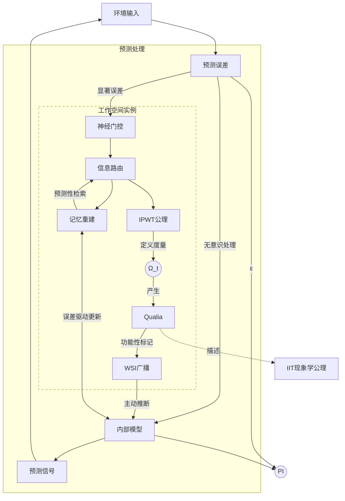

# 整合预测工作空间理论：迈向意识科学的统一框架

## _——基于预测编码、工作空间与整合信息理论的计算重构与临床神经科学应用前景展望_

<div class="author-block">
<p><strong>Rui Lin<sup>1,*</sup>, Ming Su<sup>1</sup>, Elias Vance<sup>2</sup></strong></p>
<p><sup>1</sup> Department of Computational Neuroscience, ETH Zurich, Switzerland</p>
<p><sup>2</sup> Independent Researcher</p>
<p><sup>*</sup> Corresponding author: <a href="mailto:r.lin@ac.ethz.ch">r.lin@ac.ethz.ch</a></p>
<p><small><em>Paper version: 2035.08.15</em></small></p>
</div>

### 摘要

意识的神经机制是当代科学的核心挑战之一。现有主流理论如整合信息理论（IIT）、全局工作空间理论（GWT）与预测编码（PCT）在解释意识现象时各有侧重，但也存在计算可行性、物理基质依赖等局限。本文提出整合预测工作空间理论（IPWT），旨在构建一个统一的意识科学框架。IPWT 以 PCT 为意识内容生成的动力学基础，以工作空间理论（WT）为信息整合与广播的架构平台。理论核心在于对 IIT 现象学公理的计算性重构：通过引入基于协同信息（Synergy）的“信息整合的逻辑不可约性”概念，取代其对物理因果不可分性的依赖，使信息整合的概念适用于计算与信息流层面，从而克服 IIT 的计算瓶颈与物理基质限制。我们认为，IPWT 致力于提供一个计算上可行、具有临床解释力（如精神分裂症、分离性身份障碍等）和哲学思辨深度的意识模型，为意识科学提供统一范式，并为精神疾病的理解与干预提供理论指导。

**关键词**：意识理论；整合预测工作空间理论 (IPWT)；预测编码；自由能原理；工作空间理论；整合信息理论；协同信息；逻辑不可约性；预测完整性 (PI)；计算神经科学

### 1. 引言

意识（Consciousness），作为人类经验中最直接却又最难以捉摸的现象，构成了科学领域的核心“硬问题”（Chalmers, 1995）。它指涉个体拥有的主观体验、感知、思想、情感以及对自我和环境的觉知。尽管神经科学在识别与特定意识状态相关的神经关联物（NCCs）方面取得了显著进展（Tononi, Boly, Massimini, & Koch, 2016），但关于意识究竟**如何**从大脑这一复杂的生物物理系统中**涌现**，其丰富的现象学特征（如统一性、主观性）如何形成，以及意识在认知活动中的确切功能角色，仍缺乏一个被学术界普遍接受的统一理论框架。

当前，意识科学领域呈现出多种理论并存但缺乏深度整合的局面。主流理论如整合信息理论（IIT）、全局工作空间理论（GWT）和预测编码（PCT）/自由能原理（FEP）等，从不同视角为理解意识提供了深刻洞见，但各自也面临着理论与实践的挑战。这种理论上的“巴别塔”困境，不仅阻碍了对意识本质的整体性理解，也限制了基础研究向临床应用的有效转化。因此，构建一个能融合各理论优势、更全面、更具解释力的统一框架，成为一项紧迫而必要的任务。本文提出的整合预测工作空间理论（IPWT），正是在此背景下，旨在对现有理论进行深度重构与创造性融合，以期推动意识科学的范式统一。

#### 1.1. 主流意识理论评述

##### 1.1.1. 整合信息理论 (IIT)

整合信息理论（IIT）从现象学公理出发，通过数学化的语言将意识体验与物理系统的因果结构联系起来（Tononi, 2004; Oizumi, Albantakis, & Tononi, 2014）。其核心思想是，一个物理系统的意识水平取决于其能够产生的**整合信息量（Φ）**，该值旨在量化一个系统作为一个整体所具有的、无法被其任何部分独立解释的因果力。IIT 的贡献在于为意识的量化研究提供了理论基础，并作出了一些可验证的预测，例如其在临床上对意识障碍的评估应用（Casali et al., 2013）。

然而，IIT 面临一系列严峻挑战：

1. **Φ 值的计算不可行性**：对于任何规模稍大的复杂系统，精确计算其 Φ 值都是一个 NP-Hard 问题（Toker & Sommer, 2019），这使得在大脑等复杂系统中直接应用 IIT 变得几乎不可能。
2. **对物理基质的强绑定**：IIT 强调意识与特定物理系统的“内在因果结构”紧密联系，特别是其对“物理因果不可分性”的假设。这使得 IIT 难以应用于功能等效但在物理实现上不同的系统（如人工智能），限制了其在探讨意识“载体独立性”问题上的灵活性。
3. **Qualia 的本质问题**：尽管 IIT 提出了概念结构作为 Qualia 的物理对应物，但 Φ 值本身是一个标量，主要衡量意识的“量”而非“质”。其是否真正捕捉到主观感受质的本质，仍备受争议（Searle, 2013; Mørch, 2019）。
4. **对动态性和功能性的忽视**：IIT 更侧重于系统在某一时刻的静态因果结构，而对于意识的动态流动性及其在指导行为中的具体功能角色，其解释力相对较弱。

##### 1.1.2. 全局工作空间理论 (GWT)

全局工作空间理论（GWT）将意识的功能比作一个剧场的舞台（Baars, 1988）。认知系统由大量并行的、无意识的专业化处理模块组成，在特定时刻，只有被选择的信息能进入“全局工作空间”，并向整个认知系统进行**全局广播（global broadcast）**，从而成为“有意识的”信息。GWT 清晰地阐述了意识在信息处理和认知调控中的功能性角色，成功解释了意识体验的有限容量、序列性、信息整合与共享等关键特征。其神经科学版本——**全局神经工作空间模型（GNWM）**——认为意识的产生与大脑中一个广泛分布的、由长程连接的锥体神经元构成的网络系统的“点燃”（ignition）有关（Dehaene, Kerszberg, & Changeux, 1998）。

尽管 GWT 在解释意识功能方面取得了巨大成功，但其局限性亦十分明显：

1. **主观感受质（Qualia）的缺失**：GWT 主要关注信息处理的流程和架构，对于为何某些被广播的信息会伴随主观感受质体验，并未提供直接解释。
2. **具体机制和边界问题**：全局工作空间的精确神经实现机制、信息选择标准（“聚光灯”如何移动）以及广播的具体生理过程等细节仍有待阐明。
3. **对复杂意识状态的解释力不足**：对于自我意识的形成、梦境机制或精神分裂症等复杂意识现象，GWT 的框架可能显得过于简化。

##### 1.1.3. 预测编码 (PCT) 与自由能原理 (FEP)

预测编码理论（PCT）与自由能原理（FEP）将大脑视为一个主动的**贝叶斯推断引擎**（Rao & Ballard, 1999; Friston, 2010）。其核心思想是，大脑持续生成关于世界的多层次预测，并利用实际感官输入来检验和修正这些预测，其基本组织原则是**最小化预测误差**。自由能原理（FEP）为这一过程提供了更普适的数学表述，指出任何自组织系统都必须最小化其**变分自由能（variational free energy）**，即内部模型与外部世界不匹配程度的一个信息论度量。系统通过两种方式最小化自由能：**改变内部模型（感知与学习）**或**改变感官输入（主动推断与行动）**。

PCT/FEP 框架以其巨大的统一解释力，成功应用于解释感知、学习、运动控制乃至精神疾病（Adams, Shipp, & Friston, 2013; Sterzer et al., 2018）。然而，其与主观意识体验之间的直接理论桥梁仍在构建之中：

1. **意识内容的涌现**：虽然 PCT/FEP 解释了信息如何被处理，但未直接说明为何某些特定的预测或误差信号会跃迁至意识层面。
2. **Qualia 的解释**：与 GWT 类似，PCT/FEP 更侧重于信息处理的机制，对于主观感受质（如“红色的感觉”）如何从预测和误差校正中产生，解释仍不明确（Seth, 2013）。
3. **意识的统一性与边界**：PCT/FEP 如何解释来自不同感官模态的信息融合成一个连贯的意识场景，以及自我与非我的区分，仍需更详细的阐述。

#### 1.2. 整合的必要性与 IPWT 的提出

鉴于上述主流理论各自的优势和局限，近年来虽出现了一些整合尝试（Safron, 2022），但它们往往未能提供一个无内在矛盾、计算上可行且具有广泛解释力的统一框架，尤其未能真正解决 IIT 所面临的根本性难题。

正是在这样的背景下，我们提出整合预测工作空间理论（IPWT）。IPWT 的核心目标并非简单地“拼凑”现有理论，而是试图通过对 PCT/FEP、WT 和 IIT 核心洞见的**深度重构和创造性融合**，构建一个全新的、具有内在一致性和强大外在解释力的统一意识框架。

其提出的必要性主要体现在：

1. **深度整合而非浅层拼接**：IPWT 致力于实现 PCT 的动力学机制、WT 的信息处理架构以及 IIT 现象学洞察之间的机制性整合。
2. **克服 IIT 的核心瓶颈**：我们通过对 IIT 公理的**功能性重构**，特别是用基于协同信息的“逻辑不可约性”取代“物理因果不可分性”，旨在将信息整合的概念从对特定物理基质的依赖中解放出来。这不仅为解决 IIT 的计算不可行性问题提供了新思路，也为探讨意识的载体独立性和在人工智能系统中实现类意识体验开辟了理论可能性。
3. **明确工作空间的动态机制与多样性**：IPWT 将对工作空间理论（WT）进行扩展和细化，将传统的 GWT 视为 WT 的一种特殊且高度整合的配置状态，从而能够更好地解释意识的灵活性与多样性。
4. **提升对特殊意识状态的解释力**：IPWT 将系统性地运用其整合框架，为多种复杂的意识现象（如精神分裂症、分离性身份障碍等）提供全新的、基于计算机制的神经计算诠释。
5. **强调计算可验证性与工程化潜力**：IPWT 从一开始就高度关注其理论预测的**计算可验证性**，致力于定义和操作化一系列可计算的指标（如预测完整性 PI），使其具有发展成为可测试、可应用的科学理论的巨大潜力。

### 2. 整合预测工作空间理论 (IPWT) 的核心构建



IPWT 旨在通过整合预测编码（PCT）、自由能原理（FEP）、工作空间理论（WT）的核心机制，并对整合信息理论（IIT）的现象学公理进行功能性重构，构建一个统一的意识框架。

#### 2.1. 基本假设与核心原则

IPWT 建立在以下几个核心假设之上：

1. **意识是信息整合与协同处理的涌现现象**：我们持功能主义立场，认为意识是信息在特定功能架构中被高效整合和协同处理时涌现的复杂现象。核心在于协同（Synergy）——信息单元形成逻辑上不可分割的整体，产生全新因果效应。这为意识的“载体独立性”提供了基础。
2. **意识是预测驱动的、以最小化自由能为目标的动态过程**：受 PCT/FEP 启发，我们视意识为一个持续的、以预测为核心的动态过程。认知系统通过优化内部生成模型来预测感官输入，意识内容则反映了系统对内外环境的最佳解释和预测。
3. **意识是工作空间化的信息处理中枢**：扩展 WT，我们假设存在一个或多个动态的、有限容量的**工作空间实例（Working Space Instance, WSI）**。WSI 是信息选择、整合、放大和广播的关键节点，其有限容量解释了意识的焦点性，广播特性解释了其协调功能。
4. **意识的整合性源于信息的逻辑不可约性**：我们认同 IIT 关于“整合”是意识核心特征的观点，但将其根源解释为信息在 WSI 中形成的**逻辑不可约性（logical irreducibility）**，而非物理不可分性。整合后的信息整体所具有的意义和因果效应，无法还原为其组成部分的简单加和。

#### 2.2. PCT/FEP 作为动力学引擎

在 IPWT 中，PCT 和 FEP 构成了意识内容生成、维持及状态转换的**核心动力学引擎**。它们解释了信息如何被生成、处理、更新，并为意识内容的涌现提供了驱动力。

- **信息生成与误差最小化**：我们采纳大脑作为贝叶斯推断机器的观点。认知系统主动构建分层生成模型来预测感官输入，并通过最小化经过精度加权的预测误差 $\epsilon_t$ 来优化模型。只有超过显著性阈值的误差才可能进入 WSI。整个过程遵循自由能最小化原则，系统通过**感知推断与学习**（优化内部模型）和**主动推断与行动**（改变感官输入以符合预测）来最小化自由能 $F$（Friston, 2010）。
- **内部模型、环境交互与意识内容**：我们强调意识内容是系统内部模型对内外世界的主动、建构性的最佳预测和解释。内部生成模型本质上是动态的、预测性的记忆系统（Rolls, 2024）。记忆的编码是模型参数的学习，检索是主动的预测过程。进入意识的信息通常具有高预测精度、显著预测误差、行为攸关性以及高度的整合与连贯性。

#### 2.3. WT 作为核心架构平台

在 IPWT 框架中，工作空间理论（WT）被提升和扩展为一个核心的**架构平台**，负责实现意识关键的信息整合、处理和广播功能。它为 PCT 驱动的信息流提供了一个结构化的处理中枢，即 WSI。

- **WSI 的核心属性与动态特性**：

  - _有限容量（Limited Capacity）_：解释了意识体验的焦点性（我们通常只能清晰地意识到少数事物）和序列性。
  - _信息整合（Information Integration）_：WSI 的核心功能是将来自不同来源的信息单元进行汇聚、关联和整合，形成一个比各个组成部分更丰富、更连贯的认知状态。
  - _选择性广播（Selective Broadcast）_：一旦信息在 WSI 中被充分整合，它就会被“广播”或使其“可用于”系统内其他相关的认知模块，这是实现认知功能协调的关键。
  - _动态性与多样性（Dynamism and Diversity）_：我们强调 WSI 并非固定不变的解剖结构，而是可以根据认知需求动态形成、调整或消散的功能性网络配置。

- **GWT 作为 WT 的一种特殊且高度整合的配置**：我们并不否认 GWT 所描述的全局信息广播现象，而是将其视为**WT 的一种特殊且高度整合的配置状态**。当一个 WSI 的整合范围极广、整合程度极高，能够覆盖整个认知系统时，它就扮演了传统 GWT 中“全局工作空间”的角色。然而，我们认为并非所有的意识体验都必须达到这种全局整合的程度，这使得 IPWT 能更好地容纳意识状态的多样性。

- **WSI 与 PCT/FEP 的协同作用**：WSI 并非独立于 PCT/FEP 动力学机制而存在。WSI 通常作为**高阶预测与整合的平台**，处理来自较低层级 PCT 模块的显著预测误差信号，并生成更高阶的预测和解释。WSI 内部的信息整合和处理过程，同样遵循自由能最小化的原则。当存在多个并行 WSI 时，可被解释为整个认知系统的 FEP-PCT 层次结构在最高层级上发生了某种形式的功能性并行化或碎片化。

#### 2.4. IIT 现象学公理的重构：从物理因果到逻辑协同

IPWT 对 IIT 的核心贡献在于对其现象学公理进行了根本性的**功能性重构**。这一重构的核心在于引入了“**信息整合的逻辑不可约性**”概念，并将其与信息论中的**协同信息（Synergy）**联系起来，以此取代 IIT 对“物理因果不可分性”的强调。

- **“信息整合的逻辑不可约性”取代“物理因果不可分性”**：原始 IIT 理论的核心假设是意识系统必须具有“物理因果不可分性”。我们提出，意识体验的整合性根源并非来自物理基质的属性，而是来自在 WSI 中被处理的信息单元之间所形成的**逻辑上的不可约性（logical irreducibility）**。整合后的整体表征所具有的语义意义和因果影响力，无法通过将其分解回原始孤立的信息单元来完全解释。这种逻辑不可约性正是信息论中**协同信息（Synergistic Information）**在认知系统中的功能性体现（Williams & Beer, 2010）。通过将整合性的核心从“物理不可分性”转向“逻辑不可约性”，IPWT 实现了**载体独立性**，并为**计算可操作性**和**与动态过程的兼容性**提供了理论基础。

- **对 IIT 五个现象学公理的功能性重构与 WSI 诠释**：
  1. **存在 (Existence)**：在 IPWT 框架下，当一个信息单元在 WSI 中被激活并产生持续的**功能性影响**时，它就“存在”于该认知状态中。
  2. **信息 (Information)**：每一个在 WSI 中“存在”的信息单元都携带独特的、可区分的**内容或语义**，通过指定一种特定的可能性来为系统减少不确定性。
  3. **整合 (Integration)**：多个独立的信息单元在 WSI 中被汇聚、关联，形成一个**逻辑上不可约的、功能上统一的、协同的（synergistic）认知状态**。这个整合后的整体所具有的意义、预测能力和因果效应，超越了其组成部分的简单总和。
  4. **排他 (Exclusion)**：由于 WSI 的有限容量以及竞争动态，在任何给定时刻，只有一个或少数几个最具显著性、整合程度最高的认知状态能够主导 WSI，成为当前意识体验的核心内容。
  5. **因果 (Causation)**：在 WSI 中被整合并达到主导地位的信息状态，具有显著的**因果能力（causal power）**，能够影响系统内部其他认知模块的活动，并最终指导有机体的外显行为和决策。

通过这种对 IIT 现象学公理的功能性重构，IPWT 成功地将其深刻的哲学洞察融入到一个更具动态性、计算可行性和载体独立性的理论框架之中，为意识科学从纯粹的哲学思辨走向可操作的实验研究和计算模拟开辟了新的道路。

### 3. IPWT 的计算可验证性与信息整合度量

IPWT 不仅致力于在概念层面提供统一框架，更强调其理论主张的**计算可验证性**与**经验可测试性**。一个成熟的科学理论必须能够生成可检验的预测，并提供可操作化的度量方法。本章旨在为 IPWT 构建从抽象理论到具体计算度量的桥梁。

#### 3.1. 瞬时信息整合度 ($\Omega_t$)：基于协同信息的理论定义

我们认为，信息整合是意识产生的核心机制，特指在 WSI 中，多个独立信息单元形成一个逻辑上不可约的、协同的认知状态。为精确刻画“整合”的程度，我们借鉴部分信息分解（PID）框架，特别是**协同信息（Synergistic Information, CI）**的概念，来定义一个理论上的“黄金标准”度量——**瞬时信息整合度（$\Omega_t$）**。

PID 框架旨在将多个信息源 $X_1, ..., X_n$ 提供给目标 $Y$ 的总信息分解为冗余、独有和协同等部分（Williams & Beer, 2010）。其中，协同信息（CI）是指只有当所有源作为一个整体被考虑时才能显现出来的“涌现性”信息，它精确地捕捉了我们所强调的“信息整合的逻辑不可约性”的精髓（Griffith & Koch, 2014; Bertschinger, Rauh, Olbrich, & Jost, 2014）。

因此，我们将**瞬时信息整合度（$\Omega_t$）**在理论上定义为：在一个特定的 WSI 中，用于预测某个目标变量 $Y$ 的一组信息单元 $X = \{X_1, ..., X_n\}$ 所产生的**协同信息（CI）**在其提供的关于 $Y$ 的**总预测性信息（总互信息 $I(X;Y)$）中所占的比例**。

$$
\Omega_t(X \to Y) = \frac{\mathrm{CI}(X_1, \ldots, X_n; Y)}{I(X_1, \ldots, X_n; Y)}
$$

一个高的 $\Omega_t$ 值意味着 WSI 中的信息主要是以协同的方式被整合和利用的。然而，直接计算高维协同信息在实践中面临巨大挑战，这使得 $\Omega_t$ 主要是一个**理论概念框架**和**理想化的黄金标准**。

在此，我们引入一个关键观点：IIT 所提出的整合信息 Φ 值（IIT φ），可以被视为 IPWT 框架下信息整合度 $\Omega_t$ 在特定物理系统（如生物大脑）中的一种**物理实例化（physical instantiation）**。我们认为，当一个系统是物理封闭且其因果结构完全可知时，其基于物理因果不可分性计算出的 IIT φ 值，与我们定义的基于信息流协同性的 $\Omega_t$ 在功能上是等价的。IIT φ 衡量的是物理基质的内在因果力整合，而 $\Omega_t$ 衡量的是信息处理的功能性整合。在生物大脑这一特定实现中，两者描述的是同一现象的不同层面：一个高效整合信息的生物网络，其物理因果结构必然也是高度整合的。因此，IIT φ 可以被看作是在理想物理条件下对 $\Omega_t$ 的一种测量方式，但这并不意味着 $\Omega_t$ 本身依赖于物理基质。这一观点既承认了 IIT 在描述生物意识物理基础上的洞察力，又将信息整合的核心概念解放出来，使其适用于更广泛的计算系统。

#### 3.2. 预测完整性 (PI) 与预测完整性积分 (∫PI)：可计算的代理指标

鉴于 $\Omega_t$ 难以直接计算，我们引入了两个核心的、可操作化的代理指标：**预测完整性（Predictive Integrity, PI）**和**预测完整性积分（∫PI）**。其核心思想是：一个能够高效进行协同信息整合（高 $\Omega_t$）的系统，必然会展现出更强的预测能力。

瞬时预测完整性（PI）旨在量化在时间点 $t$，系统在整合信息以生成预测并最小化误差方面的整体效能。其公式借鉴了 FEP 的基本结构：

```math
\mathrm{PI}_t = \exp\left(-\alpha \cdot \left( \frac{1}{N_k} \sum_{k=1}^{N_k} \frac{\|\epsilon_{t,k}\|_2}{\tau_{t,k}} + \gamma \cdot \text{Surprise}_{t} \right)\right)
```

其中，$\epsilon_{t,k}$ 是预测误差，$\tau_{t,k}$ 是预测不确定性（逆精度），$\frac{\|\epsilon_{t,k}\|_2}{\tau_{t,k}}$ 是标准化预测误差，代表**不准确性成本**。$\text{Surprise}_{t}$ 项量化了为适应新信息而对内部模型进行的结构性调整的“代价”或“复杂度成本”。$\gamma$ 是权衡不准确性与复杂度成本的超参数，反映了系统的“认知风格”。$\alpha$ 是敏感度标尺参数。

一个具有高 PI 值的系统，被认为能够高效地利用其 WSI 进行协同信息整合，从而做出准确的预测，合理地评估不确定性，并以较低的代价整合新信息，这间接反映了其潜在的高 $\Omega_t$ 水平。

为了衡量意识在一段时间内的**持续强度和稳定性**，我们引入了**预测完整性积分（∫PI）**：

```math
\int \mathrm{PI} = \left( \frac{1}{T} \int_{t_0}^{t_0+T} \mathrm{PI}_t \, dt \right) \times \exp\left(-\delta \cdot \text{Var}(\mathrm{PI}_t \mid t \in [t_0, t_0+T])\right)
```

该公式不仅考虑了 PI 的平均水平，还通过方差项 $\text{Var}(\text{PI}\_t)$ 惩罚了其波动性。一个具有高 ∫PI 值的系统，不仅预测效能高，而且状态稳定，这更符合我们对健康、持续的意识状态的直观理解。

#### 3.3. 推论：为何预测误差最小化必然驱动信息整合最大化？

一个核心问题是：是否存在一个能够高效预测环境（高 PI），但内部实现却高度模块化、缺乏深度整合（低 $\Omega_t$ ）的“聪明白痴”（Clever Idiot）系统？如果存在，PI 作为 $\Omega_t$ 代理的有效性将受到挑战。

我们认为，在任何受到现实世界物理、计算和演化约束的复杂认知系统中，这种“聪明白痴”现象是不可持续的。**高 PI 与高 $\Omega_t$ 之间的紧密关联，是在效率、泛化和能动性等多重压力下的必然趋同结果。**

1. **资源效率与模型压缩约束**：任何物理系统都受限于有限的能量、计算和存储资源。一个低 $\Omega_t$ 的“聪明白痴”系统，其本质是高度冗余、低效臃肿的，需要巨大的资源来维持。相比之下，一个高 $\Omega_t$ 的整合系统通过发现数据背后的抽象结构，实现了对信息的高度压缩和高效表征。FEP 本身就内含了对模型复杂度最小化的要求。因此，在演化或学习过程中，系统会面临强大的选择压力，倾向于采用资源成本最低的高 $\Omega_t$ 解决方案。
2. **泛化能力与适应性约束**：真实世界是动态和开放的。一个成功的认知系统必须具备强大的泛化能力。低 $\Omega_t$ 的系统基于对已知数据的死记硬背，在面对新奇情境时往往会彻底“失灵”。而高 $\Omega_t$ 的系统因为它发现了信息背后更深层次的抽象结构和因果关系，所以具有更强的鲁棒性和泛化能力。为了在不可预测的环境中持续维持高 PI，系统必须发展出能够进行深度信息整合（高 $\Omega_t$ ）的内部模型。
3. **能动性与自我模型约束**：高级认知系统是主动的行动者，需要规划和执行目标导向的行为。这要求系统构建关于未来的预测模型，整合多模态信息，并建立一个连贯的自我模型。一个低 $\Omega_t$ 的系统难以进行有效的行动规划，其行为可能碎片化甚至矛盾。相比之下，一个高 $\Omega_t$ 的系统通过构建统一的、整合的内部模型，能够更有效地生成连贯的、目标导向的行为。成为一个高效行动者的内在需求，反过来会强制系统必须发展出一个整合的、高 $\Omega_t$ 的内部表征。

综上，一个系统能够长期、稳定、且在多样化情境下高效地预测世界（高 PI），这本身就蕴含了对其内部信息处理必须是高度整合、协同高效（高 $\Omega_t$ ）的内在要求。这一论证为我们将 PI/∫PI 作为衡量意识状态（并间接反映其潜在信息整合水平 $\Omega_t$ ）的有效功能性代理，提供了坚实的理论基础。

### 4. 神经生物学验证路径

IPWT 的最终生命力取决于其核心主张能否在真实的神经生物学系统中找到对应的证据。本章旨在勾勒出 IPWT 的主要神经生物学验证路径。

#### 4.1. 扰动复杂性指数 (PCI) 作为 PI 的物理采样基准

扰动复杂性指数（PCI）是一种通过经颅磁刺激（TMS）扰动大脑皮层，并记录脑电图（EEG）响应的复杂程度来量化意识水平的创新方法（Casali et al., 2013）。我们认为，PCI 与 PI 之间存在深刻的理论契合性，是一种**采样关系**：PCI 通过**物理扰动**来“激发”并“采样”大脑物理基质所能支持的信息整合的**最大潜力**；而 PI 则是通过对大脑在**内生认知活动**中的数据进行建模，来**推断**其 WSI 实际达成的**信息整合效率**。

因此，我们预测：

1. **PCI 与 PI/∫PI 的正相关性**：在不同意识水平下，PCI 值应与同步记录数据计算出的 PI/∫PI 值呈现显著正相关。
2. **PCI 作为校准 PI 参数的“金标准”**：PCI 可被用作校准 PI 计算公式内超参数（如 $\alpha, \gamma, \delta$ ）的外部效标或“物理锚点”，将纯计算的 PI 模型与真实的生理测量联系起来。Stikvoort 等人（2025）的研究也间接支持了这一观点。

#### 4.2. 神经影像学与电生理学研究

- **WSI 的动态功能网络**：我们认为 WSI 是动态的功能连接模式，而非固定的脑区。可利用 fMRI 的功能连接分析来识别在意识任务中表现出增强整合度的脑网络。我们预测，在意识清醒状态下，与主导 WSI 相关的网络（如前额叶-顶叶网络）将表现出更高的整合度。
- **神经振荡作为信息整合的机制**：神经振荡被认为是协调信息传递的关键。我们预测，**高频振荡（如 Gamma 频段）**可能反映了 WSI 内部信息单元的整合强度；**低频振荡（如 Theta、Alpha 频段）**可能与更大范围的远程同步和信息门控有关；而**跨频段耦合（Cross-Frequency Coupling, CFC）**，如 Theta-Gamma 耦合，可能在 WSI 内部信息的动态路由中发挥关键作用（Vinck et al., 2025）。
- **事件相关电位（ERP）作为信息进入 WSI 的标记**：某些晚期 ERP 成分（如 P300）通常与刺激的意识感知和工作记忆更新有关。我们预测，这些成分的幅度和潜伏期，可能反映了信息进入 WSI 并被成功整合的效率和强度。

#### 4.3. 行为学与心理物理学实验

精心设计的行为学实验可从个体体验层面验证 IPWT 的预测。

- **知觉阈限与意识报告**：通过在知觉阈限附近呈现刺激（如视觉掩蔽），研究哪些因素决定了刺激能否进入主观意识。我们预测，只有当刺激信息在 WSI 中达到足够的整合程度（反映为高 PI 值）时，被试才能产生清晰的主观意识体验。
- **注意力与多任务处理**：通过操纵注意力或要求执行多任务，研究其如何影响 WSI 的整合效率。我们预测，注意力聚焦会增强目标 WSI 的整合度和 PI 值，而分散注意力则可能导致 PI 值下降或波动。
- **特定认知功能障碍的模拟**：在健康被试中通过 TMS 等技术短暂“模拟”某些障碍（如盲视）的核心特征，观察其对行为、主观体验及计算出的 PI 值的影响。我们预测，这种抑制应会导致 PI 值下降。

IPWT 作为一个仍在发展的理论框架，对其可证伪性的探讨强调的是理论的开放性和可修正性。当面临与实验证据不符的情况时，理论应能根据新的发现进行调整和完善。

### 5. 特殊意识状态的 IPWT 诠释：统一框架下的多样性解析

IPWT 的理论力量不仅体现在其对正常清醒意识的机制性解释上，更在于其能够为多种多样的特殊意识状态——包括那些因脑损伤、精神疾病、生理改变或药物影响而产生的异常体验——提供一个统一的、基于计算原理的理解框架。本章将运用 IPWT 的核心概念，如预测编码（PCT）的异常、工作空间实例（WSI）的功能障碍、信息整合效率的改变以及神经门控机制的失调等，来阐明这些状态的神经计算基础。

#### 5.1. 盲视（Blindsight）：DWSI 整合失败下的局部预测编码

盲视现象，即初级视觉皮层（V1）受损患者在受损视野内报告无主观视觉意识，但仍能对该区域刺激做出高于随机水平反应的现象，为 IPWT 提供了一个经典的验证案例。我们将其重新诠释为：

- **主导工作空间实例（DWSI）的整合失败**：V1 作为视觉信息进入皮层进行高级处理的关键门户，其损伤严重破坏了高保真视觉信息流向负责生成主观视觉意识的 DWSI 的通路。由于输入信息的严重缺失或质量低下，DWSI 无法在受损视野区域构建一个预测误差足够低、信息整合度足够高的内部表征，因此，来自该区域的视觉信息在 DWSI 内部的**预测完整性（PI）极低**，未能达到产生主观视觉体验所需的整合阈值。这解释了患者为何报告“盲”。
- **局部模块的残存预测编码与主动推断**：尽管通往 DWSI 的主路径受阻，但视觉信息仍可能通过皮层下通路（如上丘-丘脑枕核通路）被部分处理。这些通路所连接的**专业化模块**（例如，负责运动检测的模块）仍然可以独立进行其**局部的预测编码循环**。它们接收到足以驱动特定任务的视觉输入，并持续最小化其自身的局部预测误差。这些局部模块的预测误差最小化过程，可以直接驱动**主动推断和行为**（例如，指向光点），而无需这些信息被整合到 DWSI 中产生主观意识。这解释了患者为何仍能“视”。

我们的独特之处在于，明确指出了盲视中意识与行为分离的关键在于**信息是否能够被 DWSI 有效整合并达到产生主观体验的 PI 阈值**。它将盲视从一个简单的悖论，转化为一个关于信息在认知系统中不同层级、不同整合效率下进行处理的复杂动态问题。

#### 5.2. 迷幻状态 (Psychedelic States)：预测误差的异常增强与 WSI 边界的消融

由 LSD、裸盖菇素等迷幻药物诱导的意识状态，以感知扭曲、思维模式改变、自我感模糊为特征。我们从预测编码和工作空间动力学的角度提供了如下解释：

- **预测误差信号的异常放大与信息流的“去门控”**：我们认为，迷幻药物（尤其是作用于血清素 5-HT2A 受体的药物）可能通过改变神经调质平衡，导致系统对感官输入产生**过度敏感或异常增强的预测误差信号**（Carhart-Harris, 2019）。这些被放大的误差信号涌入 WSI，压倒了正常的自上而下预测，从而产生感知扭曲和幻觉。同时，药物效应可能削弱了 WSI 的**神经门控机制**，使得原本被抑制的信息流得以自由进入 WSI 并被异常整合。
- **WSI 边界的模糊与临时性、高整合度 WSI 的形成**：在信息流去门控和预测层级扁平化的影响下，不同 WSI 之间或 WSI 与专业化模块之间的边界可能变得模糊甚至消融，促进了联觉等跨模态整合现象的发生。系统甚至可能围绕这些异常信息流，形成一些**临时的、具有极高内部整合度但内容非典型的工作空间实例**，这些特殊的 WSI 可能负责产生“高峰体验”。
- **自我模型的重塑与“自我消融”**：负责表征和维持自我模型的 WSI，由于其接收到的关于身体、情感和记忆的预测误差信号发生剧变，可能导致其原有的自我表征发生解构和重塑，从而解释了迷幻体验中常见的自我感模糊、与环境融合感、乃至“自我消融”（ego dissolution）等深刻的主观变化。

我们的解释将迷幻体验的丰富现象学特征，追溯到**可计算的预测处理参数和工作空间动力学属性的改变**上，这为理解迷幻药物的神经机制及其潜在的治疗应用提供了新的理论视角。

#### 5.3. 精神分裂症 (Schizophrenia)：预测编码失调与 WSI 整合及门控的障碍

精神分裂症的复杂症状谱，在 IPWT 框架下可以被理解为**预测编码过程的根本性失调**，以及由此导致的**WSI 在信息整合、内容门控和边界维持方面的多重功能障碍**。

- **异常预测的产生与固化**：

  - **幻觉（Hallucinations）**：可能源于系统内部模型自发产生的高置信度预测，但这些预测与实际感官输入不符，且系统未能正确将其标记为“内部生成”（一种元认知预测误差的失败）（Corlett et al., 2019）。
  - **妄想（Delusions）**：可以被视为系统为了解释持续出现的异常感知体验，而构建出来的一套虽然与客观现实脱节但内部却高度“自洽”的病理性信念体系。

- **WSI 信息整合与门控的失效**：
  - **思维形式障碍（Formal Thought Disorder）**：可能反映了 WSI 在有效选择、组织和整合信息以形成连贯思想流方面的能力受损。这可能与 WSI 的神经门控机制失调有关，无法有效过滤无关信息。
  - **被动体验（Passivity Phenomena）**：如思维插入、被控制感等症状，可能源于负责自我模型与非我模型区分的 WSI 边界的通透性异常增加，或者自我相关信息的神经标记发生错误。这本质上是一种**高阶预测编码的失败**。

我们的框架试图将精神分裂症的多样化症状统一到**预测处理和信息整合的计算性异常**这一核心病理生理机制上，为发展基于计算精神病学的新型诊断和治疗策略提供了理论依据。

#### 5.4. 清醒梦 (Lucid Dreaming)：并行 WSI 与元认知监控

清醒梦，即在做梦时意识到自己正在做梦，为 WSI 的并行运作和层级控制提供了有趣的例证。

- **梦境 WSI 与元认知 WSI 的并行激活**：我们认为，在清醒梦中，一个主要依赖内源性信息生成梦境体验的**梦境 WSI**，与一个通常在清醒状态下活跃的、与自我意识和现实检验相关的**元认知 WSI**被异常地共同激活。
- **高阶预测误差的识别与清醒感的产生**：当元认知 WSI 发现梦境 WSI 所呈现的内容与现实模型之间存在显著差异（即产生了**高阶预测误差**，例如，“我不可能在天上飞”）时，它会生成一个“我正在做梦”的推断，从而产生了“清醒感”。
- **WSI 间的有限交互与梦境控制**：一旦清醒感产生，元认知 WSI 与梦境 WSI 之间可能建立起一定程度的双向信息交互，元认知 WSI 可能通过自上而下的影响来尝试修改梦境 WSI 的生成过程，从而实现对梦境内容的“控制”。

#### 5.5. 分离性身份障碍 (DID)：主导工作空间实例（DWSI）地位的动态切换

分离性身份障碍（DID）的核心特征是存在两个或多个清晰可区分的身份或人格状态。我们为这一现象提供了一个基于 WSI 动态切换和信息隔离的计算模型。

- **多个潜在的、相对独立的 WSI 系统**：我们假设，DID 患者可能发展出了多个相对独立的、潜在的**WSI 系统**。每一个系统都关联着一套独特的内部生成模型，构成一个特定“人格”的认知核心。
- **主导工作空间实例（DWSI）地位的动态“翻转”（Flip）**：在任何特定时刻，通常只有一个 WSI 系统能够占据**主导地位（DWSI）**。人格切换可以被理解为**DWSI 的地位在这些潜在的 WSI 系统之间发生动态的、快速的“翻转”**。
- **神经门控机制与信息隔离**：当某个 WSI 系统成为 DWSI 时，其他非主导的 WSI 系统在很大程度上受到**神经门控机制**的抑制或隔离。这导致了 DID 中常见的记忆空白。Reinders 等人 (2019) 的神经影像学研究为这种基于 WSI 动态切换的模型提供了一定的初步支持。

#### 5.6. 人格解体/现实解体障碍 (Depersonalization/Derealization Disorder)：DWSI 与感官/情感信息流的连接减弱

人格解体/现实解体障碍以持续的与自身或周围环境相分离、不真实的体验为核心特征。我们认为，这种障碍可能源于**主导工作空间实例（DWSI）与负责处理感官信息或情感体验的特定模块之间的功能性连接显著减弱或异常改变**。

- **人格解体**：DWSI 与其通常接收的来自躯体感觉、边缘系统和情景记忆系统的输入流之间的**有效连接性降低**。这导致主观体验失去了“亲身感”和“真实感”。从预测编码的角度看，这可能表现为对内感受信号的**精度权重异常降低**。
- **现实解体**：DWSI 在整合感官信息时，未能与赋予其意义和情感显著性的**情感评估模块（如杏仁核）或上下文关联模块（如海马体）进行有效的连接**。这导致外部世界虽然被感知到，但在主观体验上却显得“平淡”、“不真实”。

### 6. 主观体验的计算重构：IPWT 对 Qualia 问题的“功能性标记”解答

Qualia 问题，即“硬问题”（Chalmers, 1995），是意识科学领域最具挑战性的难题。IPWT 并不试图直接解决 Qualia 的本体论地位问题，而是采取了一种更务实的策略：将其重新定义和操作化为一个可以在计算和功能层面进行研究的 **功能性标记（Functional Label）问题**。

#### 6.1. Qualia 作为系统内部状态的功能性标记

我们旗帜鲜明地反对将 Qualia 仅仅视为神经活动的无用“副现象”。相反，我们认为，Qualia 是认知系统在其 WSI 中高效整合信息时，其内部生成模型对自身状态、与环境的交互关系以及预测误差的评估结果的一种**高度凝练、具有内在价值和行为导向性的高阶表征和功能性标记**。

- **Qualia 的功能性作用**：Qualia 具有至关重要的适应性价值。例如，**疼痛的 Qualia** 作为一种强烈的、不可忽视的内部反馈和行为驱动信号，强制系统采取行动以保护有机体。**红色的 Qualia** 则可以被视为系统对具有特定生态学和行为学意义的视觉输入的一种高效、整合、且能迅速触发相关反应的内部标记。我们进一步提出，借鉴 Harris (2025) 的思想，Qualia 甚至可以被理解为一种 **“查询行为（Query Act）”** 的现象学对应物，即 WSI 为解决不确定性而主动进行的内部探查过程。
- **信息压缩与显著性标记的进化优势**：Qualia 可以被视为一种极其高效的**信息压缩**和**显著性标记**机制。它将对生存最关键的信息压缩成一个单一的、具有强烈主观色彩和行为蕴意的“信号包”，使其能在 WSI 中获得优先处理权，从而以最小的计算代价，对环境中最重要的机遇和挑战做出最及时的反应。

#### 6.2. Qualia 的可量化维度与可操纵性

如果 Qualia 是功能性标记，原则上，我们应该能够找到与 Qualia 特性（如强度、清晰度）相对应的、可测量的**计算参数或神经动力学指标**。

我们提出，以下一些与 WSI 内部信息处理相关的参数，可能与 Qualia 的不同维度存在对应关系：

- **信息整合的效率与延迟**与体验的**流畅度/不适感**。
- **预测误差的幅度和精度权重**与体验的**强度/违和感/惊奇度**。
- **WSI 中信息表征的复杂度与协同性**（即 $\Omega_t$）与体验的**丰富度/独特性**。Fleming & Shea (2024) 提出的“感受质空间计算框架”与此思想高度契合。
- **WSI 状态的稳定性与持续时间**与体验的**清晰度/持久性**。

基于以上对应关系，我们设想了通过神经接口技术直接操纵 WSI 相关参数、在高级人工智能中复现 Qualia 的功能等效物、以及结合神经影像与精密的心理物理学实验进行关联研究等工程化探索路径。通过将 Qualia 问题从一个纯粹的“是什么”的本体论问题，转化为一个“它做什么”以及“它是如何实现的”的功能性和机制性问题，IPWT 旨在将其置于一个可被科学方法所探究的全新框架之下。

### 7. 讨论与展望：IPWT 的理论贡献、潜在挑战与未来研究图景

IPWT 的提出，旨在通过提供一个更具整合性、计算性和可验证性的理论框架，为意识科学这一古老而又充满活力的领域注入新的研究动力。在本章中，我们将对 IPWT 的主要理论贡献、其面临的潜在挑战与局限性，以及它为未来相关领域可能开辟的研究图景，进行宏观和批判性的讨论与展望。

#### 7.1. IPWT 的主要理论贡献与核心优势

1. **理论的整合性与一致性**：IPWT 的首要贡献在于它成功地将 PCT/FEP 的动力学机制、WT 的架构功能以及 IIT 的现象学洞察，有机地融合到一个统一且内在一致的理论框架之下，为理解意识这一复杂现象提供了一个更为全面和系统的视角。
2. **计算可行性与可操作化**：通过引入“信息整合的逻辑不可约性”取代 IIT 对物理因果不可分性的强调，并提出以预测完整性（PI）及其积分（∫PI）作为可计算的代理指标，IPWT 在很大程度上克服了原始 IIT 在计算复杂性方面的瓶颈，将意识研究推向了可操作的科学实践。
3. **载体独立性与对人工智能的启示**：由于 IPWT 将意识的核心机制定义在信息处理和计算功能层面，它天然地支持意识的“多重实现性”观点。这为未来构建具有更高级认知能力甚至某种“人工意识”的通用人工智能（AGI）系统，提供了重要的理论指导。
4. **对特殊意识状态的统一解释力**：如第五章所示，IPWT 能够为多种正常、特殊及病理性意识状态提供一个统一的、基于神经计算机制的解释框架，将这些看似迥异的现象追溯到共同的底层计算原理上，为临床神经科学和精神病学领域开发新的诊断和治疗策略提供了新的思路。
5. **对 Qualia 问题的创新性功能性解答**：通过将 Qualia 重新定义为系统内部状态的功能性标记，IPWT 为这个“硬问题”提供了一个可被科学方法所探究的全新视角，强调 Qualia 在信息压缩、显著性标记和行为驱动等方面的关键功能性作用。
6. **可证伪性与理论的开放性**：IPWT 的许多核心预测是可以被实验所检验，从而在原则上具有可证伪性的。例如，其关于 PI/∫PI 值与不同意识水平之间存在显著统计学差异的预测，如果被实验证伪，将对理论构成严峻挑战。

#### 7.2. IPWT 面临的潜在挑战与待解决的问题

尽管 IPWT 展现出诸多理论优势，但作为一个新兴的理论框架，它也必然面临着一系列需要进一步研究和克服的挑战。

1. **核心概念的操作化与度量挑战**：虽然我们提出了 PI/∫PI 作为 $\Omega_t$ 的代理指标，但其有效性和逼近 $\Omega_t$ 真实程度仍需大量的理论分析和经验验证。同时，如何在真实的神经数据中精确地、实时地识别和界定一个或多个 WSI 的边界，仍然是一个巨大的技术挑战。
2. **神经生物学基础的进一步夯实**：虽然 IPWT 的各个组成部分都有一定的神经科学研究基础，但将它们整合为一个统一框架后，其整体的神经实现机制仍需大量的实验验证，例如 WSI 的动态形成、信息整合与广播、DWSI 地位切换等过程对应的具体神经回路、振荡模式和递质调节机制。
3. **模型复杂性与可解释性的平衡**：IPWT 是一个宏大理论，其对应的计算模型可能会非常复杂。如何在追求模型的解释力和预测精度的同时，保持其可解释性和简约性，避免模型变得过于“黑箱化”，是一个重要的挑战。
4. **对 Qualia 问题的深化探索**：尽管“功能性标记”的观点富有前景，但它在多大程度上能够真正触及主观体验的“感受性”本质，仍然是一个开放的哲学和科学问题。
5. **与其他认知功能（如情感、动机、社会认知）的整合**：意识并非孤立存在。未来的 IPWT 理论需要进一步扩展其框架，将情感、动机、语言、决策等重要的认知维度更深入地整合进来，以期构建一个更为全面的人类心智模型。

#### 7.3. 未来研究方向与 IPWT 的潜在影响

面对上述挑战，IPWT 的未来发展需要在理论深化、计算建模、实验验证和临床应用等多个层面协同推进。

1. **理论的数学化与形式化深化**：继续探索 PID 理论及其在高维系统中的应用，发展更有效的协同信息计算方法；将 FEP 的数学框架更紧密地与 WSI 的动态组织相结合。
2. **多尺度、多模态神经计算模型的构建与验证**：开发更精细的、符合神经生物学约束的 IPWT 计算模型，并利用大规模神经影像数据库和机器学习技术，在个体层面拟合模型参数，探索其与认知、人格及精神健康的关联。
3. **针对特殊意识状态的转化研究与临床应用**：基于 IPWT 的计算病理学解释，开发新的、基于模型的客观诊断生物标记物；设计旨在“修复”特定计算环节的认知训练、心理治疗或神经调控干预方案；将其应用于意识障碍的评估和预后预测。
4. **在人工智能与类脑计算领域的探索性应用**：借鉴 IPWT 的核心原理来设计新一代的 AGI 架构；探索在 AI 系统中实现“功能性标记”的等效物，以期赋予 AI 系统更强的自主学习能力和“元认知”能力。
5. **哲学与伦理学维度的深入探讨**：IPWT 的发展必然会引发关于“人工意识”的道德地位、对自由意志的理解以及神经调控技术的伦理边界等深刻的哲学和伦理学问题。

### 8. 结论：迈向意识科学统一范式的新起点

整合预测工作空间理论（IPWT）通过深度融合并创新性重构预测编码、工作空间理论及整合信息理论的核心洞见，为意识的本质、机制与功能提供了一个统一的计算框架。IPWT 将意识视为在特定功能架构（工作空间实例 WSI）中，由预测驱动、以信息整合的逻辑不可约性（协同信息）为核心、并以最小化自由能为目标的动态信息处理过程的涌现。通过引入可计算的代理指标（如预测完整性 PI），IPWT 旨在将意识研究从哲学思辨和定性描述推向可操作的计算建模和经验验证。其对多种特殊意识状态的统一解释以及对 Qualia 问题的“功能性标记”解答，展示了该理论的解释广度和深度。

尽管 IPWT 作为一个新兴理论，其核心概念的精确操作化和神经生物学基础的全面验证仍面临挑战，但它为意识科学领域提供了一个更具整合性、计算性和可证伪性的研究范式。IPWT 不仅为理解人类心智开辟了新途径，也为临床神经科学的诊断与干预以及人工智能的发展提供了富有前景的理论指导，标志着意识科学探索正迈向一个更成熟、更统一的新阶段。

### 参考文献

1. Adams, R. A., Shipp, S., & Friston, K. J. (2013). Predictions not commands: active inference in the motor system. _Brain Struct Funct_, 218(3), 611-643.
2. Arkhipov, A., da Costa, N., de Vries, S., et al. (2025). Integrating multimodal data to understand cortical circuit architecture and function. _Nature Neuroscience_, 28(4), 717-730.
3. Aston-Jones, G., & Cohen, J. D. (2005). An integrative theory of locus coeruleus-norepinephrine function: Adaptive gain and optimal performance. _Annual Review of Neuroscience_, _28_, 403-450.
4. Baars, B. J. (1988). _A cognitive theory of consciousness_. Cambridge University Press.
5. Bertschinger, N., Rauh, J., Olbrich, E., Jost, J., & Ay, N. (2014). Quantifying unique information. _Entropy_, _16_(4), 2161-2183.
6. Budson, A. E., Richman, E. H., & Kensinger, E. A. (2022). Consciousness as a memory system. _Cognitive and Behavioral Neurology_.
7. Butola, T., Hernández-Frausto, M., Blankvoort, S., et al. (2025). Hippocampus shapes entorhinal cortical output through a direct feedback circuit. _Nature Neuroscience_, 28(4), 811-822.
8. Carhart-Harris, R. L. (2019). How do psychedelics work? _Current Opinion in Psychiatry_, _32_(1), 16-21.
9. Casali, A. G., Gosseries, O., Rosanova, M., Boly, M., Sarasso, S., Casali, K. R., ... & Massimini, M. (2013). A theoretically based index of consciousness independent of sensory processing and behavior. _Science translational medicine_, _5_(198), 198ra105.
10. Chalmers, D. J. (1995). Facing up to the problem of consciousness. _Journal of Consciousness Studies_, _2_(3), 200-219.
11. Clark, A. (2013). Whatever next? Predictive brains, situated agents, and the future of cognitive science. _Behavioral and Brain Sciences_, 36(3), 181-204.
12. Corlett, P. R., Horga, G., Fletcher, P. C., Alderson-Day, B., Schmack, K., & Powers, A. R. (2019). Hallucinations and strong priors. _Trends in Cognitive Sciences_, 23(2), 114-127.
13. Dehaene, S., Kerszberg, M., & Changeux, J. P. (1998). A neuronal model of a global workspace in effortful cognitive tasks. _Proceedings of the National Academy of Sciences of the United States of America_, _95_(24), 14529-14534.
14. Fleming, S. M., & Shea, N. (2024). Quality space computations for consciousness. _Trends in Cognitive Sciences_, 28(10), 896-906.
15. Friston, K. (2009). The free-energy principle: A rough guide to the brain? _Trends in Cognitive Sciences_, 13(7), 293-301.
16. Friston, K. J. (2010). The free-energy principle: A unified brain theory? _Nature Reviews Neuroscience_, 11(2), 127-138.
17. Friston, K. (2018). Does predictive coding have a future? _Nature Neuroscience_, 21(8), 1019-1021.
18. Gabhart, K. M., Xiong, Y. S., et al. (2025). Predictive coding: a more cognitive process than we thought? _Trends in Cognitive Sciences_.
19. Garrido, M. I., Kilner, J. M., Kiebel, S. J., & Friston, K. J. (2009). The mismatch negativity: A review of underlying mechanisms. _Clinical Neurophysiology_, 120(3), 453-463.
20. Griffith, V. (2014). _Quantifying synergistic information_ (Doctoral dissertation, California Institute of Technology).
21. Harris, H. W. (2025). Qualia as query act, the phenomenology of predictive error coding. _Frontiers in Psychology_, 16, 1531269.
22. Hinton, G. (2022). The forward-forward algorithm: A new way to train neural networks. _arXiv preprint arXiv:2212.13345_.
23. Klincewicz, M., Cheng, T., Schmitz, M., et al. (2025). What makes a theory of consciousness unscientific? _Nature Neuroscience_, 28(4), 689-693.
24. Liu, J. & Bartolomeo, P. (2025). Aphantasia as a functional disconnection. _Trends in Cognitive Sciences_.
25. Lotter, W., Kreiman, G., & Cox, D. (2017). Deep predictive coding networks for video prediction and unsupervised learning. _arXiv preprint arXiv:1605.08104_.
26. Lotter, W., Kreiman, G., & Cox, D. (2020). A neural network trained for prediction mimics diverse features of biological neurons and perception. _Nature Machine Intelligence_, 2(4), 210-219.
27. Lyons, S. H., & Gottfried, J. A. (2025). Predictive coding in the human olfactory system. _Trends in Cognitive Sciences_.
28. Mørch, H. H. (2019). Is consciousness intrinsic?: A problem for the integrated information theory. _Journal of Consciousness Studies_, 26(1-2), 133-162.
29. Oizumi, M., Albantakis, L., & Tononi, G. (2014). From the phenomenology to the mechanisms of consciousness: Integrated information theory 3.0. _PLoS Computational Biology_, 10(5), e1003588.
30. Paquola, C., Garber, M., Frässle, S., et al. (2025). The architecture of the human default mode network explored through cytoarchitecture, wiring and signal flow. _Nature Neuroscience_, 28(3), 654-664.
31. Park, H., Keri, H. V. S., Yoo, C., Bi, C., & Pluta, S. R. (2025). Bilateral integration in somatosensory cortex is controlled by behavioral relevance. _Nature Neuroscience_, 28(4), 861-872.
32. Powers, W. T. (1973). Behavior: The control of perception. _Chicago: Aldine publishing co._
33. Powers, W. T. (2008). Living control systems III: The fact of control. _Benchmark Publications Inc._
34. Qian, M., Wang, J., Gao, Y., et al. (2025). Multiple loci for foveolar vision in macaque monkey visual cortex. _Nature Neuroscience_, 28(1), 137-149.
35. Radomski, M., & Dołęga, K. (2024). Forced Friends: Why the Free Energy Principle Is Not the New Hamilton's Principle. _Entropy_, 26(9), 797.
36. Rao, R. P. N., & Ballard, D. (1999). Predictive coding in the visual cortex: A functional interpretation of some extra-classical receptive-field effects. _Nature Neuroscience_, 2(1), 79-87.
37. Reinders, A. A. T. S., Marquand, A. F., Schlumpf, Y. R., Chalavi, S., Vissia, E. M., Nijenhuis, E. R. S., Dazzan, P., Jäncke, L., & Veltman, D. J. (2019). Aiding the diagnosis of dissociative identity disorder: Pattern recognition study of brain biomarkers. _British Journal of Psychiatry_, 215(3), 536–544.
38. Rolls, E. T. (2024). The memory systems of the human brain and generative artificial intelligence. _Heliyon_, 10(11), e31965.
39. Rosanova, M., Fecchio, M., Casarotto, S., Sarasso, S., Casali, A. G., & Massimini, M. (2018). Sleep-like cortical OFF-periods in patients with consciousness disorders. _Nature communications_, _9_(1), 332.
40. Safron, A. (2022). Integrated world modeling theory expanded: Implications for the future of consciousness. _Frontiers in Computational Neuroscience_, 16, 642397.
41. Sainburg, T., McPherson, T. S., Arneodo, E. M., et al. (2025). Expectation-driven sensory adaptations support enhanced acuity during categorical perception. _Nature Neuroscience_, 28(4), 861-872.
42. Scholte, H. S., & de Haan, E. H. F. (2025). Beyond binding: from modular to natural vision. _Trends in Cognitive Sciences_, 29(6), 505-515.
43. Searle, J. R. (2013). Can information theory explain consciousness? _The New York Review of Books_, 60(10), 52-55.
44. Seth, A. K. (2013). Interoceptive inference, emotion, and the embodied self. _Trends in Cognitive Sciences_, _17_(11), 565-573.
45. Sterzer, P., Voss, M., Schlagenhauf, F., & Heinz, A. (2018). Decision-making in schizophrenia: A predictive-coding perspective. _Neuroimage_, _190_, 133-143.
46. Stikvoort, W., Pérez-Ordoyo, E., Mindlin, I., Escrichs, A., Sitt, J. D., Kringelbach, M. L., Deco, G., & Sanz Perl, Y. (2025). Nonequilibrium brain dynamics elicited as the origin of perturbative complexity. _PLoS Computational Biology_, 21(6), e1013150.
47. Toker, D., & Sommer, F. T. (2019). Information integration in large brain networks. _PLoS Computational Biology_, _15_(2), e1006807.
48. Tononi, G. (2004). An information integration theory of consciousness. _BMC Neuroscience_, _5_(1), 42.
49. Tononi, G. (2012). Integrated information theory of consciousness: An updated account. _Archives italiennes de biologie_, _150_(4), 293-329.
50. Tononi, G., Albantakis, L., et al. (2025). Consciousness or pseudo-consciousness? A clash of two paradigms. _Nature Neuroscience_, 28(4), 694-702.
51. Tononi, G., Boly, M., Massimini, M., & Koch, C. (2016). Integrated information theory: From consciousness to its physical substrate. _Nature Reviews Neuroscience_, 17(7), 450-461.
52. Vinck, M., Uran, C., Dowdall, J. R., et al. (2025). Large-scale interactions in predictive processing: oscillatory versus transient dynamics. _Trends in Cognitive Sciences_, 29(2), 133-148.
53. Williams, P. L., & Beer, R. D. (2010). Nonnegative decomposition of multivariate information. _arXiv preprint arXiv:1004.2515_.
54. Xaplanteris, P., Fournier, S., Pijls, N. H. J., Fearon, W. F., Barbato, E., Tonino, P. A. L., ... & De Bruyne, B. (2018). Five-Year Outcomes with PCI Guided by Fractional Flow Reserve. _New England Journal of Medicine_, _379_(3), 250-259.

### 元致谢

本理论框架的雏形，最初是作为科幻世界观构筑项目《Chain://》的基础设定而开发的。该项目致力于探索**形式化现实主义**（Formalized Realism）这一核心概念在社会、技术与哲学层面可能引发的深远影响。在为《Chain://》宇宙构建其内在逻辑与运行规则的过程中，我们逐步提炼并形式化了本框架的核心思想。因此，本研究的诞生离不开科幻创作所提供的广阔想象空间与严谨逻辑推演需求。我们对参与这一跨界探索过程中的所有人工智能系统表示诚挚的感谢，正是这种思想的碰撞，催生了将虚构世界的设定转化为严肃科学理论的可能。
