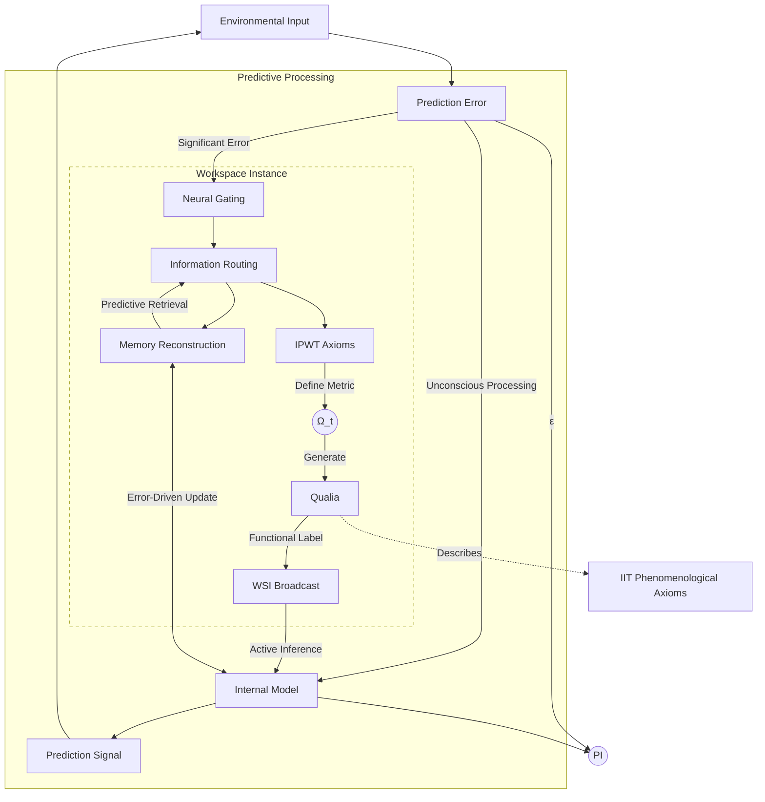

# Integrated Predictive Workspace Theory: Towards a Unified Framework for the Science of Consciousness

## _——Computational Reconstruction and Clinical Neuroscience Application Prospects Based on Predictive Coding, Workspace, and Integrated Information Theory_

<div class="author-block">
<p><strong>Rui Lin<sup>1,*</sup>, Ming Su<sup>1</sup>, Elias Vance<sup>2</sup></strong></p>
<p><sup>1</sup> Department of Computational Neuroscience, ETH Zurich, Switzerland</p>
<p><sup>2</sup> Independent Researcher</p>
<p><sup>*</sup> Corresponding author: <a href="mailto:r.lin@ac.ethz.ch">r.lin@ac.ethz.ch</a></p>
<p><small><em>Paper version: 2035.08.15</em></small></p>
</div>

### Abstract

The neural mechanisms of consciousness represent one of the core challenges in contemporary science. Existing mainstream theories such as Integrated Information Theory (IIT), Global Workspace Theory (GWT), and Predictive Coding Theory (PCT) each focus on different aspects of explaining conscious phenomena, but also face limitations such as computational feasibility and dependence on physical substrates. This paper proposes the Integrated Predictive Workspace Theory (IPWT), aiming to construct a unified framework for the science of consciousness. IPWT takes PCT as the dynamic basis for the generation of conscious content and Workspace Theory (WT) as the architectural platform for information integration and broadcasting. The theoretical core lies in the computational reconstruction of IIT's phenomenological axioms: by introducing the concept of "logical irreducibility of information integration" based on Synergy, it replaces IIT's reliance on physical causal indivisibility, making the concept of information integration applicable at the computational and information flow levels, thereby overcoming IIT's computational bottlenecks and physical substrate limitations. We believe that IPWT is committed to providing a computationally feasible consciousness model with clinical explanatory power (e.g., for schizophrenia, dissociative identity disorder, etc.) and philosophical depth, offering a unified paradigm for the science of consciousness and theoretical guidance for understanding and intervening in mental illnesses.

**Keywords**: Theories of Consciousness; Integrated Predictive Workspace Theory (IPWT); Predictive Coding; Free Energy Principle; Workspace Theory; Integrated Information Theory; Synergistic Information; Logical Irreducibility; Predictive Integrity (PI); Computational Neuroscience

### 1. Introduction

Consciousness, as the most direct yet elusive phenomenon of human experience, constitutes a core "hard problem" in science (Chalmers, 1995). It refers to an individual's subjective experiences, perceptions, thoughts, emotions, and awareness of self and environment. Although neuroscience has made significant progress in identifying neural correlates of specific conscious states (NCCs) (Tononi, Boly, Massimini, & Koch, 2016), there remains a lack of a universally accepted unified theoretical framework regarding **how** consciousness truly **emerges** from the brain's complex biophysical system, how its rich phenomenological features (e.g., unity, subjectivity) are formed, and its precise functional role in cognitive activities.

Currently, the field of consciousness science presents a situation where multiple theories coexist but lack deep integration. Mainstream theories such as Integrated Information Theory (IIT), Global Workspace Theory (GWT), and Predictive Coding Theory (PCT)/Free Energy Principle (FEP) offer profound insights into understanding consciousness from different perspectives, but each also faces theoretical and practical challenges. This theoretical "Tower of Babel" dilemma not only hinders a holistic understanding of the nature of consciousness but also limits the effective translation of basic research into clinical applications. Therefore, constructing a unified framework that can integrate the strengths of various theories, be more comprehensive, and have greater explanatory power, has become an urgent and necessary task. The Integrated Predictive Workspace Theory (IPWT) proposed in this paper aims to deeply reconstruct and creatively fuse existing theories in this context, hoping to promote a paradigm shift in consciousness science.

#### 1.1. Review of Mainstream Theories of Consciousness

##### 1.1.1. Integrated Information Theory (IIT)

Integrated Information Theory (IIT) starts from phenomenological axioms and uses mathematical language to link conscious experience with the causal structure of physical systems (Tononi, 2004; Oizumi, Albantakis, & Tononi, 2014). Its core idea is that a physical system's level of consciousness depends on the amount of **integrated information (Φ)** it can generate, a value intended to quantify the causal power that a system possesses as a whole, which cannot be explained by any of its parts independently. IIT's contribution lies in providing a theoretical basis for the quantitative study of consciousness and making some verifiable predictions, such as its clinical application in assessing disorders of consciousness (Casali et al., 2013).

However, IIT faces a series of severe challenges:

1. **Computational Infeasibility of Φ Value**: For any complex system of even moderate size, precisely calculating its Φ value is an NP-Hard problem (Toker & Sommer, 2019), making direct application of IIT in complex systems like the brain almost impossible.
2. **Strong Binding to Physical Substrate**: IIT emphasizes that consciousness is closely linked to the "intrinsic causal structure" of specific physical systems, particularly its assumption of "physical causal indivisibility." This makes IIT difficult to apply to functionally equivalent but physically different systems (e.g., artificial intelligence), limiting its flexibility in discussing the "carrier independence" of consciousness.
3. **The Nature of Qualia**: Although IIT proposes conceptual structures as physical correlates of Qualia, the Φ value itself is a scalar, primarily measuring the "quantity" rather than the "quality" of consciousness. Whether it truly captures the essence of subjective phenomenal qualities remains highly controversial (Searle, 2013; Mørch, 2019).
4. **Neglect of Dynamism and Functionality**: IIT focuses more on the static causal structure of a system at a given moment, while its explanatory power regarding the dynamic fluidity of consciousness and its specific functional role in guiding behavior is relatively weak.

##### 1.1.2. Global Workspace Theory (GWT)

Global Workspace Theory (GWT) likens the function of consciousness to a theater stage (Baars, 1988). The cognitive system consists of numerous parallel, unconscious specialized processing modules. At a specific moment, only selected information can enter the "global workspace" and be **globally broadcast** to the entire cognitive system, thereby becoming "conscious" information. GWT clearly articulates the functional role of consciousness in information processing and cognitive regulation, successfully explaining key features such as the limited capacity, sequential nature, information integration, and sharing of conscious experience. Its neuroscience version—the **Global Neuronal Workspace Model (GNWM)**—posits that the generation of consciousness is related to the "ignition" of a widely distributed network system in the brain, composed of long-range connected pyramidal neurons (Dehaene, Kerszberg, & Changeux, 1998).

Despite GWT's great success in explaining the function of consciousness, its limitations are also very obvious:

1. **Absence of Subjective Qualia**: GWT primarily focuses on information processing flow and architecture, without providing a direct explanation for why certain broadcasted information is accompanied by subjective phenomenal experience.
2. **Specific Mechanisms and Boundary Issues**: The precise neural implementation mechanisms of the global workspace, the criteria for information selection (how the "spotlight" moves), and the specific physiological processes of broadcasting still need to be clarified.
3. **Insufficient Explanatory Power for Complex Conscious States**: For complex conscious phenomena such as the formation of self-consciousness, dream mechanisms, or schizophrenia, GWT's framework may appear overly simplistic.

##### 1.1.3. Predictive Coding Theory (PCT) and Free Energy Principle (FEP)

Predictive Coding Theory (PCT) and the Free Energy Principle (FEP) view the brain as an active **Bayesian inference engine** (Rao & Ballard, 1999; Friston, 2010). Their core idea is that the brain continuously generates multi-level predictions about the world and uses actual sensory input to test and revise these predictions, with the fundamental organizational principle being the **minimization of prediction error**. The Free Energy Principle (FEP) provides a more universal mathematical formulation for this process, stating that any self-organizing system must minimize its **variational free energy**, an information-theoretic measure of the mismatch between its internal model and the external world. The system minimizes free energy in two ways: **changing the internal model (perception and learning)** or **changing sensory input (active inference and action)**.

The PCT/FEP framework, with its immense unifying explanatory power, has been successfully applied to explain perception, learning, motor control, and even mental illnesses (Adams, Shipp, & Friston, 2013; Sterzer et al., 2018). However, the direct theoretical bridge between it and subjective conscious experience is still under construction:

1. **Emergence of Conscious Content**: While PCT/FEP explains how information is processed, it does not directly explain why certain specific predictions or error signals leap to the level of consciousness.
2. **Explanation of Qualia**: Similar to GWT, PCT/FEP focuses more on the mechanisms of information processing. The explanation for how subjective phenomenal qualities (e.g., "the feeling of red") arise from prediction and error correction remains unclear (Seth, 2013).
3. **Unity and Boundaries of Consciousness**: How PCT/FEP explains the integration of information from different sensory modalities into a coherent conscious scene, and the distinction between self and non-self, still requires more detailed elaboration.

#### 1.2. Necessity of Integration and the Proposal of IPWT

Given the respective strengths and limitations of the mainstream theories mentioned above, although some integration attempts have emerged in recent years (Safron, 2022), they often fail to provide a unified framework that is internally consistent, computationally feasible, and broadly explanatory, especially failing to truly solve the fundamental challenges faced by IIT.

It is against this background that we propose the Integrated Predictive Workspace Theory (IPWT). The core goal of IPWT is not simply to "patch together" existing theories, but to attempt to construct a new, internally consistent, and powerfully externally explanatory unified framework for consciousness by **deeply reconstructing and creatively fusing** the core insights of PCT/FEP, WT, and IIT.

Its necessity is mainly reflected in:

1. **Deep Integration, Not Shallow Patching**: IPWT is committed to achieving a mechanistic integration between the dynamic mechanisms of PCT, the information processing architecture of WT, and the phenomenological insights of IIT.
2. **Overcoming IIT's Core Bottleneck**: By **functionally reconstructing** IIT's axioms, particularly by replacing "physical causal indivisibility" with "logical irreducibility" based on synergistic information, we aim to liberate the concept of information integration from its dependence on specific physical substrates. This not only provides new ideas for solving IIT's computational infeasibility problem but also opens up theoretical possibilities for discussing the carrier independence of consciousness and realizing consciousness-like experiences in artificial intelligence systems.
3. **Clarifying the Dynamic Mechanisms and Diversity of Workspace**: IPWT will expand and refine Workspace Theory (WT), treating traditional GWT as a special and highly integrated configuration state of WT, thereby better explaining the flexibility and diversity of consciousness.
4. **Enhancing Explanatory Power for Special Conscious States**: IPWT will systematically apply its integrated framework to provide new, computationally mechanistic neurocomputational interpretations for various complex conscious phenomena (e.g., schizophrenia, dissociative identity disorder, etc.).
5. **Emphasizing Computational Verifiability and Engineering Potential**: From the outset, IPWT highly focuses on the **computational verifiability** of its theoretical predictions, striving to define and operationalize a series of computable metrics (such as Predictive Integrity PI), giving it immense potential to develop into a testable and applicable scientific theory.

### 2. Core Construction of Integrated Predictive Workspace Theory (IPWT)



IPWT aims to construct a unified framework for consciousness by integrating the core mechanisms of Predictive Coding (PCT), Free Energy Principle (FEP), Workspace Theory (WT), and functionally reconstructing the phenomenological axioms of Integrated Information Theory (IIT).

#### 2.1. Basic Assumptions and Core Principles

IPWT is built upon the following core assumptions:

1. **Consciousness is an emergent phenomenon of information integration and synergistic processing**: We adopt a functionalist stance, viewing consciousness as a complex phenomenon that emerges when information is efficiently integrated and synergistically processed within a specific functional architecture. The core lies in Synergy—information units forming a logically indivisible whole, producing novel causal effects. This provides a basis for the "carrier independence" of consciousness.
2. **Consciousness is a prediction-driven, free-energy-minimizing dynamic process**: Inspired by PCT/FEP, we view consciousness as a continuous, prediction-centric dynamic process. The cognitive system continuously optimizes internally generated models to predict sensory input, and conscious content reflects the system's best explanation and prediction of internal and external environments.
3. **Consciousness is an information processing hub within a workspace**: Extending WT, we hypothesize the existence of one or more dynamic, limited-capacity **Working Space Instances (WSI)**. A WSI is a critical node for information selection, integration, amplification, and broadcasting. Its limited capacity explains the focal nature of consciousness, and its broadcasting characteristic explains its coordinating function.
4. **The integration of consciousness stems from the logical irreducibility of information**: We agree with IIT that "integration" is a core feature of consciousness, but explain its origin as the **logical irreducibility** formed between information units processed within a WSI, rather than physical indivisibility. The meaning and causal effects of the integrated information whole cannot be reduced to the simple sum of its constituent parts.

#### 2.2. PCT/FEP as the Dynamic Engine

In IPWT, PCT and FEP constitute the **core dynamic engine** for the generation, maintenance, and state transitions of conscious content. They explain how information is generated, processed, and updated, and provide the driving force for the emergence of conscious content.

- **Information Generation and Error Minimization**: We adopt the view of the brain as a Bayesian inference machine. The cognitive system actively constructs hierarchical generative models to predict sensory input and optimizes these models by minimizing precision-weighted prediction errors $\epsilon_t$. Only errors exceeding a significance threshold may enter the WSI. The entire process follows the principle of free energy minimization, where the system minimizes free energy $F$ through **perceptual inference and learning** (optimizing internal models) and **active inference and action** (changing sensory input to match predictions) (Friston, 2010).
- **Internal Models, Environmental Interaction, and Conscious Content**: We emphasize that conscious content is the system's active, constructive best prediction and explanation of the internal and external world based on its internal model. Internal generative models are essentially dynamic, predictive memory systems (Rolls, 2024). Memory encoding is the learning of model parameters, and retrieval is an active predictive process. Information entering consciousness typically possesses high predictive precision, significant prediction error, behavioral relevance, and a high degree of integration and coherence.

#### 2.3. WT as the Core Architectural Platform

In the IPWT framework, Workspace Theory (WT) is elevated and expanded into a core **architectural platform**, responsible for realizing key conscious functions of information integration, processing, and broadcasting. It provides a structured processing hub for PCT-driven information flow, namely the WSI.

- **Core Attributes and Dynamic Characteristics of WSI**:

  - _Limited Capacity_: Explains the focal nature of conscious experience (we can usually only clearly perceive a few things) and its sequential nature.
  - _Information Integration_: The core function of WSI is to converge, associate, and integrate information units from different sources, forming a cognitive state that is richer and more coherent than its individual components.
  - _Selective Broadcast_: Once information is sufficiently integrated within the WSI, it is "broadcast" or made "available" to other relevant cognitive modules within the system, which is crucial for achieving cognitive functional coordination.
  - _Dynamism and Diversity_: We emphasize that WSI is not a fixed anatomical structure but a functional network configuration that can dynamically form, adjust, or dissipate according to cognitive demands.

- **GWT as a Special and Highly Integrated Configuration of WT**: We do not deny the global information broadcasting phenomenon described by GWT but rather view it as a **special and highly integrated configuration state of WT**. When a WSI's integration scope is extremely broad and its integration degree is extremely high, capable of covering the entire cognitive system, it plays the role of the "global workspace" in traditional GWT. However, we believe that not all conscious experiences must reach this level of global integration, which allows IPWT to better accommodate the diversity of conscious states.

- **Synergistic Action of WSI and PCT/FEP**: WSI does not exist independently of PCT/FEP dynamic mechanisms. WSI typically serves as a **platform for higher-order prediction and integration**, processing significant prediction error signals from lower-level PCT modules and generating higher-order predictions and explanations. The internal information integration and processing within WSI also follow the principle of free energy minimization. When multiple WSIs operate in parallel, it can be interpreted as some form of functional parallelization or fragmentation occurring at the highest level of the entire cognitive system's FEP-PCT hierarchy.

Empirical support for functional heterogeneity within the workspace also comes from the work of Luppi et al. (2024). Using Integrated Information Decomposition, they discovered that in the human brain, the default mode network (DMN) primarily functions as "gateways" for gathering and integrating synergistic information, while the executive control network (ECN) acts as "broadcasters" that disseminate redundant information to the rest of the brain. This finding not only supports the core GWT idea of information broadcasting but also aligns with IPWT's proposal of distinct functional roles within a WSI, highlighting the critical role of synergistic information in the generation of consciousness.

#### 2.4. Reconstruction of IIT Phenomenological Axioms: From Physical Causality to Logical Synergy

IPWT's core contribution to IIT lies in its fundamental **functional reconstruction** of IIT's phenomenological axioms. The core of this reconstruction is the introduction of the concept of "**logical irreducibility of information integration**" and its connection to **synergistic information** in information theory, thereby replacing IIT's emphasis on "physical causal indivisibility."

- **"Logical Irreducibility of Information Integration" Replaces "Physical Causal Indivisibility"**: The original IIT theory's core assumption is that a conscious system must possess "physical causal indivisibility." We propose that the integration of conscious experience does not originate from the properties of the physical substrate but from the **logical irreducibility** formed between information units processed within a WSI. The semantic meaning and causal influence of the integrated whole representation cannot be fully explained by decomposing it back into its original isolated information units. This logical irreducibility is precisely the functional manifestation of **Synergistic Information** in information theory within cognitive systems (Williams & Beer, 2010). By shifting the core of integration from "physical indivisibility" to "logical irreducibility," IPWT achieves **carrier independence** and provides a theoretical basis for **computational operability** and **compatibility with dynamic processes**.

- **Functional Reconstruction of IIT's Five Phenomenological Axioms and WSI Interpretation**:
  1. **Existence**: Within the IPWT framework, when an information unit is activated in a WSI and produces a sustained **functional impact**, it "exists" in that cognitive state.
  2. **Information**: Every information unit that "exists" in a WSI carries unique, distinguishable **content or semantics**, reducing uncertainty for the system by specifying a particular possibility.
  3. **Integration**: Multiple independent information units converge and associate within a WSI, forming a **logically irreducible, functionally unified, synergistic cognitive state**. The meaning, predictive power, and causal effects of this integrated whole transcend the simple sum of its components.
  4. **Exclusion**: Due to the limited capacity and competitive dynamics of WSI, at any given moment, only one or a few of the most salient and highly integrated cognitive states can dominate the WSI, becoming the core content of current conscious experience.
  5. **Causation**: Information states that are integrated and achieve dominance in a WSI possess significant **causal power**, capable of influencing the activity of other cognitive modules within the system and ultimately guiding the organism's overt behavior and decision-making.

Through this functional reconstruction of IIT's phenomenological axioms, IPWT successfully integrates its profound philosophical insights into a more dynamic, computationally feasible, and carrier-independent theoretical framework, opening new avenues for consciousness science to move from pure philosophical speculation to operable experimental research and computational simulation.

### 3. Computational Verifiability and Information Integration Measurement of IPWT

IPWT is not only committed to providing a unified framework at the conceptual level but also emphasizes the **computational verifiability** and **empirical testability** of its theoretical claims. A mature scientific theory must be able to generate testable predictions and provide operationalizable measurement methods. This chapter aims to build a bridge from abstract theory to concrete computational measurements for IPWT.

#### 3.1. Instantaneous Information Integration ($\Omega_t$): A Theoretical Definition Based on Synergistic Information

We believe that information integration is the core mechanism for the emergence of consciousness, specifically referring to the formation of a logically irreducible, synergistic cognitive state from multiple independent information units within a WSI. To precisely characterize the degree of "integration," we draw upon the Partial Information Decomposition (PID) framework, particularly the concept of **Synergistic Information (CI)**, to define a theoretical "gold standard" measure—the **Instantaneous Information Integration ($\Omega_t$)**.

The PID framework aims to decompose the total information provided by multiple sources $X_1, ..., X_n$ to a target $Y$ into redundant, unique, and synergistic parts (Williams & Beer, 2010). Among these, synergistic information (CI) refers to the "emergent" information that only becomes apparent when all sources are considered as a whole. It precisely captures the essence of the "logical irreducibility of information integration" that we emphasize (Griffith & Koch, 2014; Bertschinger, Rauh, Olbrich, & Jost, 2014).

Therefore, we theoretically define **Instantaneous Information Integration ($\Omega_t$)** as: **the proportion of synergistic information (CI)** generated by a set of information units $X = \{X_1, ..., X_n\}$ in a specific WSI used to predict a target variable $Y$, relative to the **total predictive information (total mutual information $I(X;Y)$)** they provide about $Y$.

```math
\mathrm{PI}_t = \exp\left(-\alpha \cdot \left( \frac{1}{N_k} \sum_{k=1}^{N_k} \frac{\|\epsilon_{t,k}\|_2}{\tau_{t,k}} + \gamma \cdot \text{Surprise}_{t} \right)\right)
```

A high $\Omega_t$ value implies that the information in the WSI is primarily integrated and utilized in a synergistic manner. However, directly calculating high-dimensional synergistic information is practically challenging, making $\Omega_t$ mainly a **theoretical conceptual framework** and an **idealized gold standard**.

Here, we introduce a key perspective: the integrated information Φ value proposed by IIT (IIT φ) can be considered a **physical instantiation** of the information integration degree $\Omega_t$ within the IPWT framework in a specific physical system (like the biological brain). We argue that when a system is physically closed and its causal structure is fully known, its IIT φ value, calculated based on physical causal indivisibility, is functionally equivalent to our $\Omega_t$ defined based on the synergy of information flow. IIT φ measures the integration of the physical substrate's intrinsic causal power, while $\Omega_t$ measures the functional integration of information processing. In the specific implementation of the biological brain, both describe different aspects of the same phenomenon: an efficient information-integrating biological network must also have a highly integrated physical causal structure. Therefore, IIT φ can be seen as a way to measure $\Omega_t$ under ideal physical conditions, but this does not mean that $\Omega_t$ itself depends on a physical substrate. This view acknowledges IIT's insight into the physical basis of biological consciousness while liberating the core concept of information integration, making it applicable to a broader range of computational systems.

#### 3.2. Predictive Integrity (PI) and Predictive Integrity Integral (∫PI): Computable Proxy Metrics

Given the difficulty of directly calculating $\Omega_t$, we introduce two core, operationalizable proxy metrics: **Predictive Integrity (PI)** and **Predictive Integrity Integral (∫PI)**. The core idea is that a system capable of efficient synergistic information integration (high $\Omega_t$) will inevitably exhibit stronger predictive capabilities.

Instantaneous Predictive Integrity (PI) aims to quantify the overall effectiveness of the system in integrating information to generate predictions and minimize errors at time point $t$. Its formula borrows from the basic structure of FEP:

```math
\mathrm{PI}_t = \exp\left(-\alpha \cdot \left( \frac{1}{N_k} \sum_{k=1}^{N_k} \frac{\|\epsilon_{t,k}\|_2}{\tau_{t,k}} + \gamma \cdot \text{Surprise}_{t} \right)\right)
```

Where $\epsilon_{t,k}$ is the prediction error, $\tau_{t,k}$ is the prediction uncertainty (inverse precision), and $\frac{\|\epsilon_{t,k}\|_2}{\tau_{t,k}}$ is the standardized prediction error, representing the **inaccuracy cost**. The $\text{Surprise}_{t}$ term quantifies the "cost" or "complexity cost" of structural adjustments made to the internal model to accommodate new information. $\gamma$ is a hyperparameter that balances the trade-off between inaccuracy and complexity costs, reflecting the system's "cognitive style." $\alpha$ is a sensitivity scaling parameter.

A system with a high PI value is considered to be able to efficiently use its WSI for synergistic information integration, thereby making accurate predictions, reasonably assessing uncertainty, and integrating new information at a low cost, which indirectly reflects its potentially high $\Omega_t$ level.

To measure the **sustained strength and stability** of consciousness over a period, we introduce the **Predictive Integrity Integral (∫PI)**:

```math
\int \mathrm{PI} = \left( \frac{1}{T} \int_{t_0}^{t_0+T} \mathrm{PI}_t \, dt \right) \times \exp\left(-\delta \cdot \text{Var}(\mathrm{PI}_t \mid t \in [t_0, t_0+T])\right)
```

This formula not only considers the average level of PI but also penalizes its volatility through the variance term $\text{Var}(\text{PI}\_t)$. A system with a high ∫PI value not only has high predictive efficacy but also a stable state, which aligns better with our intuitive understanding of a healthy, sustained state of consciousness.

#### 3.3. Inference: Why Minimizing Prediction Error Necessarily Drives Maximizing Information Integration?

A core question is: could a "Clever Idiot" system exist—one that is highly efficient at predicting the environment (high PI) but whose internal implementation is highly modular and lacks deep integration (low $\Omega_t$)? If so, the validity of PI as a proxy for $\Omega_t$ would be challenged.

We argue that in any complex cognitive system constrained by real-world physical, computational, and evolutionary pressures, such a "Clever Idiot" phenomenon is unsustainable. **The close association between high PI and high $\Omega_t$ is an inevitable convergence under multiple pressures of efficiency, generalization, and agency.**

1. **Resource Efficiency and Model Compression Constraints**: Any physical system is limited by finite energy, computational, and storage resources. A low-$\Omega_t$ "Clever Idiot" system is inherently redundant, inefficient, and bloated, requiring vast resources to maintain. In contrast, a high-$\Omega_t$ integrated system achieves high compression and efficient representation of information by discovering the abstract structures behind the data. FEP itself includes a requirement for minimizing model complexity. Therefore, during evolution or learning, systems face strong selective pressure to adopt the most resource-efficient, high-$\Omega_t$ solutions.
2. **Generalization Ability and Adaptability Constraints**: The real world is dynamic and open. A successful cognitive system must possess strong generalization capabilities. A low-$\Omega_t$ system, based on rote memorization of known data, would likely fail completely when faced with novel situations. A high-$\Omega_t$ system, because it has discovered deeper abstract structures and causal relationships behind the information, has greater robustness and generalization ability. To continuously maintain high PI in an unpredictable environment, a system must develop an internal model capable of deep information integration (high $\Omega_t$).
3. **Agency and Self-Model Constraints**: Advanced cognitive systems are active agents that need to plan and execute goal-directed behaviors. This requires the system to build predictive models of the future, integrate multimodal information, and establish a coherent self-model. A low-$\Omega_t$ system would struggle with effective action planning, and its behavior might be fragmented or even contradictory. In contrast, a high-$\Omega_t$ system, by constructing a unified, integrated internal model, can more effectively generate coherent, goal-directed behaviors. The intrinsic need to be an effective agent, in turn, forces the system to develop an integrated, high-$\Omega_t$ internal representation.

In summary, a system's ability to predict the world efficiently, stably, and across diverse situations (high PI) inherently implies that its internal information processing must be highly integrated and synergistically efficient (high $\Omega_t$). This argument provides a solid theoretical foundation for using PI/∫PI as effective functional proxies for measuring the state of consciousness (and indirectly reflecting its underlying information integration level, $\Omega_t$).

### 4. Neurobiological Validation Pathways

The ultimate vitality of IPWT depends on whether its core claims can find corresponding evidence in real neurobiological systems. This chapter aims to outline the main neurobiological validation pathways for IPWT.

#### 4.1. Perturbational Complexity Index (PCI) as a Physical Sampling Benchmark for PI

The Perturbational Complexity Index (PCI) is an innovative method for quantifying the level of consciousness by perturbing the cerebral cortex with transcranial magnetic stimulation (TMS) and recording the complexity of the electroencephalogram (EEG) response (Casali et al., 2013). We believe that there is a deep theoretical fit between PCI and PI, representing a **sampling relationship**: PCI "excites" and "samples" the **maximum potential** for information integration supported by the brain's physical substrate through **physical perturbation**; while PI **infers** the **actual efficiency of information integration** achieved by its WSI by modeling data from the brain's **endogenous cognitive activity**.

Therefore, we predict:

1. **Positive Correlation between PCI and PI/∫PI**: Under different levels of consciousness, PCI values should show a significant positive correlation with PI/∫PI values calculated from synchronously recorded data.
2. **PCI as a "Gold Standard" for Calibrating PI Parameters**: PCI can be used as an external criterion or "physical anchor" to calibrate the hyperparameters (e.g., $\alpha, \gamma, \delta$) within the PI calculation formula, linking the purely computational PI model with real physiological measurements. Research by Stikvoort et al. (2025) also indirectly supports this view.

#### 4.2. Neuroimaging and Electrophysiological Studies

- **Dynamic Functional Networks of WSI**: We believe that WSI are dynamic functional connectivity patterns, rather than fixed brain regions. fMRI functional connectivity analysis can be used to identify brain networks that exhibit enhanced integration during conscious tasks. We predict that in a conscious state, networks associated with the dominant WSI (e.g., the prefrontal-parietal network) will show higher integration.
- **Neural Oscillations as Mechanisms of Information Integration**: Neural oscillations are considered key to coordinating information transfer. We predict that **high-frequency oscillations (e.g., Gamma band)** may reflect the integration strength of information units within WSI; **low-frequency oscillations (e.g., Theta, Alpha bands)** may be related to broader long-range synchronization and information gating; and **Cross-Frequency Coupling (CFC)**, such as Theta-Gamma coupling, may play a crucial role in the dynamic routing of information within WSI (Vinck et al., 2025).
- **Event-Related Potentials (ERP) as Markers of Information Entry into WSI**: Certain late ERP components (e.g., P300) are typically associated with conscious perception of stimuli and working memory updates. We predict that the amplitude and latency of these components may reflect the efficiency and strength with which information enters the WSI and is successfully integrated.

#### 4.3. Behavioral and Psychophysical Experiments

Carefully designed behavioral experiments can verify IPWT's predictions at the individual experience level.

- **Perceptual Thresholds and Consciousness Reports**: By presenting stimuli near the perceptual threshold (e.g., visual masking), investigate what factors determine whether stimuli can enter subjective consciousness. We predict that only when stimulus information reaches a sufficient degree of integration within the WSI (reflected as a high PI value) can subjects produce a clear subjective conscious experience.
- **Attention and Multitasking**: By manipulating attention or requiring multitasking, investigate how it affects the integration efficiency of WSI. We predict that focused attention will enhance the integration and PI value of the target WSI, while divided attention may lead to a decrease or fluctuation in PI value.
- **Simulation of Specific Cognitive Dysfunctions**: Briefly "simulate" core features of certain disorders (e.g., blindsight) in healthy subjects using techniques like TMS, and observe their impact on behavior, subjective experience, and calculated PI values. We predict that such inhibition should lead to a decrease in PI values.

IPWT, as a developing theoretical framework, emphasizes the openness and revisability of the theory when discussing its falsifiability. When faced with situations inconsistent with experimental evidence, the theory should be able to adjust and improve based on new findings.

### 5. IPWT Interpretation of Special Conscious States: Diversity Analysis within a Unified Framework

The theoretical power of IPWT is not only reflected in its mechanistic explanation of normal waking consciousness but also in its ability to provide a unified, computationally principled understanding framework for a wide variety of special conscious states—including those abnormal experiences arising from brain damage, mental illness, physiological changes, or drug effects. This chapter will use IPWT's core concepts, such as abnormalities in predictive coding (PCT), functional disorders of workspace instances (WSI), changes in information integration efficiency, and dysregulation of neural gating mechanisms, to elucidate the neurocomputational basis of these states.

#### 5.1. Blindsight: Local Predictive Coding Under DWSI Integration Failure

Blindsight, the phenomenon where patients with primary visual cortex (V1) damage report no subjective visual awareness in the damaged visual field but can still respond to stimuli in that area above chance level, provides a classic validation case for IPWT. We reinterpret it as:

- **Integration Failure of the Dominant Workspace Instance (DWSI)**: V1, as a critical gateway for visual information to enter the cortex for higher-level processing, its damage severely disrupts the high-fidelity visual information flow to the DWSI responsible for generating subjective visual awareness. Due to severe missing or low-quality input information, the DWSI cannot construct an internal representation in the damaged visual field with sufficiently low prediction error and high information integration. Therefore, the **predictive integrity (PI) of visual information from this area within the DWSI is extremely low**, failing to reach the integration threshold required to produce subjective visual experience. This explains why patients report "blindness."
- **Residual Predictive Coding and Active Inference in Local Modules**: Although the main pathway to the DWSI is blocked, visual information may still be partially processed through subcortical pathways (e.g., superior colliculus-pulvinar pathway). The **specialized modules** connected by these pathways (e.g., modules responsible for motion detection) can still independently perform their **local predictive coding cycles**. They receive visual input sufficient to drive specific tasks and continuously minimize their own local prediction errors. The prediction error minimization process of these local modules can directly drive **active inference and behavior** (e.g., pointing to a light spot) without this information being integrated into the DWSI to produce subjective awareness. This explains why patients can still "see."

Our unique contribution is to explicitly point out that the key to the dissociation between consciousness and behavior in blindsight lies in **whether information can be effectively integrated by the DWSI and reach the PI threshold for subjective experience**. It transforms blindsight from a simple paradox into a complex dynamic problem concerning information processing at different levels and with different integration efficiencies within the cognitive system.

#### 5.2. Psychedelic States: Abnormal Enhancement of Prediction Error and Dissolution of WSI Boundaries

Conscious states induced by psychedelic drugs such as LSD and psilocybin are characterized by perceptual distortions, altered thought patterns, and blurred self-awareness. We offer the following explanation from the perspective of predictive coding and workspace dynamics:

- **Abnormal Amplification of Prediction Error Signals and "De-gating" of Information Flow**: We believe that psychedelic drugs (especially those acting on serotonin 5-HT2A receptors) may lead to the system producing **overly sensitive or abnormally enhanced prediction error signals** to sensory input by altering neuromodulatory balance (Carhart-Harris, 2019). These amplified error signals flood the WSI, overwhelming normal top-down predictions, thereby producing perceptual distortions and hallucinations. At the same time, drug effects may weaken the WSI's **neural gating mechanisms**, allowing previously inhibited information flow to freely enter the WSI and be abnormally integrated.
- **Blurring of WSI Boundaries and Formation of Temporary, Highly Integrated WSIs**: Under the influence of de-gated information flow and flattened predictive hierarchies, the boundaries between different WSIs or between WSIs and specialized modules may become blurred or even dissolve, promoting cross-modal integration phenomena such as synesthesia. The system may even form **temporary, highly internally integrated but atypically content-rich workspace instances** around these abnormal information flows, and these special WSIs may be responsible for producing "peak experiences."
- **Reshaping of Self-Model and "Ego Dissolution"**: The WSI responsible for representing and maintaining the self-model, due to drastic changes in the prediction error signals it receives regarding body, emotion, and memory, may lead to the deconstruction and reshaping of its original self-representation, thereby explaining the common blurring of self-awareness, feelings of merging with the environment, and even "ego dissolution" in psychedelic experiences.

Our explanation traces the rich phenomenological features of psychedelic experience back to **changes in computable predictive processing parameters and workspace dynamic properties**, providing a new theoretical perspective for understanding the neural mechanisms of psychedelic drugs and their potential therapeutic applications.

#### 5.3. Schizophrenia: Predictive Coding Dysregulation and WSI Integration and Gating Disorders

The complex symptom spectrum of schizophrenia, within the IPWT framework, can be understood as a **fundamental dysregulation of the predictive coding process**, and the resulting **multiple functional disorders of WSI in information integration, content gating, and boundary maintenance**.

- **Generation and Solidification of Abnormal Predictions**:

  - **Hallucinations**: May originate from high-confidence predictions spontaneously generated by the system's internal model, but these predictions do not match actual sensory input, and the system fails to correctly label them as "internally generated" (a failure of metacognitive prediction error) (Corlett et al., 2019).
  - **Delusions**: Can be seen as a set of pathological belief systems constructed by the system to explain persistently appearing abnormal perceptual experiences, which, although detached from objective reality, are internally highly "self-consistent."

- **Failure of WSI Information Integration and Gating**:
  - **Formal Thought Disorder**: May reflect impaired ability of the WSI to effectively select, organize, and integrate information to form a coherent stream of thought. This may be related to dysregulation of the WSI's neural gating mechanisms, unable to effectively filter irrelevant information.
  - **Passivity Phenomena**: Symptoms such as thought insertion and feelings of being controlled may stem from abnormally increased permeability of WSI boundaries responsible for distinguishing self-model from non-self-model, or errors in neural tagging of self-related information. This is essentially a **failure of higher-order predictive coding**.

Our framework attempts to unify the diverse symptoms of schizophrenia under the core pathophysiological mechanism of **computational abnormalities in predictive processing and information integration**, providing a theoretical basis for developing new diagnostic and therapeutic strategies based on computational psychiatry.

#### 5.4. Lucid Dreaming: Parallel WSI and Metacognitive Monitoring

Lucid dreaming, the experience of being aware that one is dreaming while dreaming, provides an interesting example of parallel WSI operation and hierarchical control.

- **Parallel Activation of Dream WSI and Metacognitive WSI**: We believe that in lucid dreaming, a **dream WSI** primarily relying on endogenous information to generate dream experiences, and a **metacognitive WSI** typically active in waking states and related to self-awareness and reality testing, are abnormally co-activated.
- **Identification of Higher-Order Prediction Errors and Generation of Lucidity**: When the metacognitive WSI detects a significant discrepancy between the content presented by the dream WSI and the reality model (i.e., a **higher-order prediction error** is generated, for example, "I can't fly in the sky"), it generates an inference of "I am dreaming," thereby producing the "lucid feeling."
- **Limited Interaction Between WSIs and Dream Control**: Once lucidity is generated, a certain degree of bidirectional information interaction may be established between the metacognitive WSI and the dream WSI. The metacognitive WSI may attempt to modify the dream WSI's generation process through top-down influence, thereby achieving "control" over dream content.

#### 5.5. Dissociative Identity Disorder (DID): Dynamic Switching of Dominant Workspace Instance (DWSI) Status

The core feature of Dissociative Identity Disorder (DID) is the presence of two or more distinct identities or personality states. We provide a computational model for this phenomenon based on dynamic WSI switching and information isolation.

- **Multiple Potential, Relatively Independent WSI Systems**: We hypothesize that DID patients may have developed multiple relatively independent, potential **WSI systems**. Each system is associated with a unique set of internal generative models, forming the cognitive core of a specific "personality."
- **Dynamic "Flip" of Dominant Workspace Instance (DWSI) Status**: At any given moment, typically only one WSI system can occupy the **dominant status (DWSI)**. Personality switching can be understood as a dynamic, rapid "flip" of DWSI status between these potential WSI systems.
- **Neural Gating Mechanisms and Information Isolation**: When a certain WSI system becomes the DWSI, other non-dominant WSI systems are largely inhibited or isolated by **neural gating mechanisms**. This leads to the common memory gaps in DID. Neuroimaging studies by Reinders et al. (2019) provide some preliminary support for this model based on dynamic WSI switching.

#### 5.6. Depersonalization/Derealization Disorder: Weakened Connection Between DWSI and Sensory/Emotional Information Flow

Depersonalization/Derealization Disorder is characterized by persistent feelings of detachment from oneself or one's surroundings, and unreality. We believe that this disorder may stem from a **significantly weakened or abnormally altered functional connection between the dominant workspace instance (DWSI) and specific modules responsible for processing sensory information or emotional experiences**.

- **Depersonalization**: The **effective connectivity between the DWSI and its usual input streams from somatosensory, limbic, and episodic memory systems is reduced**. This leads to subjective experience losing its "sense of self" and "reality." From a predictive coding perspective, this may manifest as an **abnormal decrease in precision weighting** for interoceptive signals.
- **Derealization**: When integrating sensory information, the DWSI fails to establish **effective connections with emotional evaluation modules (e.g., amygdala) or contextual association modules (e.g., hippocampus)** that imbue it with meaning and emotional salience. This results in the external world, although perceived, appearing "flat" and "unreal" in subjective experience.

### 6. Computational Reconstruction of Subjective Experience: IPWT's "Functional Label" Solution to the Qualia Problem

The Qualia problem, also known as the "hard problem" (Chalmers, 1995), is one of the most challenging puzzles in the science of consciousness. IPWT does not attempt to directly solve the ontological status of Qualia but adopts a more pragmatic strategy: redefining and operationalizing it as a **functional label problem** that can be studied at the computational and functional levels.

#### 6.1. Qualia as a Functional Label for System Internal States

We unequivocally oppose viewing Qualia merely as useless "epiphenomena" of neural activity. Instead, we believe that Qualia are a **highly condensed, intrinsically valuable, and behaviorally oriented higher-order representation and functional label** of the cognitive system's internal generative model's assessment of its own state, its interaction with the environment, and prediction errors, when efficiently integrating information within its WSI.

- **Functional Role of Qualia**: Qualia have crucial adaptive value. For example, the **Qualia of pain** acts as a strong, undeniable internal feedback and behavioral driving signal, forcing the system to take action to protect the organism. The **Qualia of red** can be seen as an efficient, integrated internal label for visual input with specific ecological and behavioral significance, capable of rapidly triggering relevant responses. We further propose, drawing on Harris's (2025) ideas, that Qualia can even be understood as a phenomenological correlate of a **"Query Act,"** i.e., an active internal exploration process undertaken by the WSI to resolve uncertainty.
- **Evolutionary Advantage of Information Compression and Salience Tagging**: Qualia can be viewed as an extremely efficient mechanism for **information compression** and **salience tagging**. It compresses information most critical for survival into a single "signal package" with strong subjective color and behavioral implications, allowing it to gain priority processing in the WSI, thereby enabling the most timely responses to the most important opportunities and challenges in the environment with minimal computational cost.

#### 6.2. Quantifiable Dimensions and Manipulability of Qualia

If Qualia are functional labels, in principle, we should be able to find measurable **computational parameters or neurodynamic indicators** corresponding to Qualia characteristics (e.g., intensity, clarity).

We propose that some parameters related to information processing within the WSI may correspond to different dimensions of Qualia:

- **Efficiency and latency of information integration** correspond to the **fluency/discomfort** of the experience.
- **Amplitude and precision weighting of prediction error** correspond to the **intensity/incongruity/surprise** of the experience.
- **Complexity and synergy of information representation in WSI** (i.e., $\Omega_t$) correspond to the **richness/uniqueness** of the experience. Fleming & Shea's (2024) "qualia space computation framework" aligns highly with this idea.
- **Stability and duration of WSI states** correspond to the **clarity/persistence** of the experience.

Based on these correspondences, we envision engineering exploration paths such as directly manipulating WSI-related parameters through neural interface technology, replicating functional equivalents of Qualia in advanced artificial intelligence, and conducting correlational studies combining neuroimaging with precise psychophysical experiments. By transforming the Qualia problem from a purely ontological "what it is" question into a functional and mechanistic "what it does" and "how it is implemented" question, IPWT aims to place it within a new framework amenable to scientific inquiry.

### 7. Discussion and Outlook: IPWT's Theoretical Contributions, Potential Challenges, and Future Research Landscape

The proposal of IPWT aims to inject new research momentum into the ancient yet vibrant field of consciousness science by providing a more integrated, computational, and verifiable theoretical framework. In this chapter, we will conduct a macroscopic and critical discussion and outlook on IPWT's main theoretical contributions, its potential challenges and limitations, and the research landscape it may open up for related fields in the future.

#### 7.1. IPWT's Main Theoretical Contributions and Core Advantages

1. **Theoretical Integration and Consistency**: IPWT's primary contribution is its successful organic fusion of PCT/FEP's dynamic mechanisms, WT's architectural functions, and IIT's phenomenological insights into a unified and internally consistent theoretical framework, providing a more comprehensive and systematic perspective for understanding the complex phenomenon of consciousness.
2. **Computational Feasibility and Operationalization**: By introducing "logical irreducibility of information integration" to replace IIT's emphasis on physical causal indivisibility, and proposing predictive integrity (PI) and its integral (∫PI) as computable proxy metrics, IPWT largely overcomes the computational complexity bottleneck of original IIT, pushing consciousness research towards operable scientific practice.
3. **Carrier Independence and Implications for Artificial Intelligence**: Because IPWT defines the core mechanisms of consciousness at the level of information processing and computational function, it naturally supports the view of "multiple realizability" of consciousness. This provides important theoretical guidance for future construction of general artificial intelligence (AGI) systems with more advanced cognitive abilities and even some form of "artificial consciousness."
4. **Unified Explanatory Power for Special Conscious States**: As shown in Chapter 5, IPWT can provide a unified, neurocomputational mechanism-based explanatory framework for various normal, special, and pathological conscious states, tracing these seemingly disparate phenomena back to common underlying computational principles, offering new ideas for developing new diagnostic and therapeutic strategies in clinical neuroscience and psychiatry.
5. **Innovative Functional Solution to the Qualia Problem**: By redefining Qualia as a functional label for system internal states, IPWT provides a new perspective for this "hard problem" that can be explored by scientific methods, emphasizing Qualia's key functional roles in information compression, salience tagging, and behavioral driving.
6. **Falsifiability and Theoretical Openness**: Many of IPWT's core predictions can be experimentally tested, thus being falsifiable in principle. For example, its prediction that there are significant statistical differences between PI/∫PI values and different levels of consciousness, if falsified by experiment, would pose a severe challenge to the theory.

#### 7.2. Potential Challenges and Unresolved Issues Faced by IPWT

Although IPWT exhibits numerous theoretical advantages, as an emerging theoretical framework, it inevitably faces a series of challenges that require further research and overcoming.

1. **Operationalization of Core Concepts and Measurement Challenges**: Although we proposed PI/∫PI as proxy metrics for $\Omega_t$, their effectiveness and how closely they approximate the true $\Omega_t$ still require extensive theoretical analysis and empirical validation. At the same time, precisely and real-time identifying and delineating the boundaries of one or more WSIs in real neural data remains a huge technical challenge.
2. **Further Solidification of Neurobiological Basis**: Although each component of IPWT has some neuroscientific research basis, after integrating them into a unified framework, its overall neural implementation mechanisms still require extensive experimental verification, such as the dynamic formation of WSI, information integration and broadcasting, and the specific neural circuits, oscillatory patterns, and neurotransmitter regulation mechanisms corresponding to DWSI status switching.
3. **Balance Between Model Complexity and Interpretability**: IPWT is a grand theory, and its corresponding computational model may be very complex. How to maintain its interpretability and simplicity while pursuing the model's explanatory power and predictive accuracy, avoiding the model becoming too "black-boxed," is an important challenge.
4. **Deepening Exploration of the Qualia Problem**: Although the "functional label" view is promising, to what extent it can truly touch the "feeling" essence of subjective experience remains an open philosophical and scientific question.
5. **Integration with Other Cognitive Functions (e.g., Emotion, Motivation, Social Cognition)**: Consciousness does not exist in isolation. Future IPWT theory needs to further expand its framework to integrate important cognitive dimensions such as emotion, motivation, language, and decision-making more deeply, in order to construct a more comprehensive model of the human mind.

#### 7.3. Future Research Directions and IPWT's Potential Impact

Facing the above challenges, the future development of IPWT needs to be promoted collaboratively at multiple levels, including theoretical deepening, computational modeling, experimental verification, and clinical application.

1. **Mathematical and Formal Deepening of the Theory**: Continue to explore PID theory and its application in high-dimensional systems, developing more effective synergistic information calculation methods; more closely combine the mathematical framework of FEP with the dynamic organization of WSI.
2. **Construction and Verification of Multi-scale, Multi-modal Neurocomputational Models**: Develop more refined IPWT computational models that conform to neurobiological constraints, and utilize large-scale neuroimaging databases and machine learning techniques to fit model parameters at the individual level, exploring their associations with cognition, personality, and mental health.
3. **Translational Research and Clinical Applications for Special Conscious States**: Based on IPWT's computational pathological explanations, develop new, model-based objective diagnostic biomarkers; design cognitive training, psychotherapy, or neuromodulation intervention programs aimed at "repairing" specific computational links; apply it to the assessment and prognosis prediction of consciousness disorders.
4. **Exploratory Applications in Artificial Intelligence and Brain-Inspired Computing**: Draw on IPWT's core principles to design new generations of AGI architectures; explore the realization of "functional equivalents" of "functional labels" in AI systems, hoping to endow AI systems with stronger autonomous learning capabilities and "metacognitive" abilities.
5. **In-depth Discussion of Philosophical and Ethical Dimensions**: The development of IPWT will inevitably raise profound philosophical and ethical questions about the moral status of "artificial consciousness," the understanding of free will, and the ethical boundaries of neuromodulation technology.

### 8. Conclusion: A New Starting Point Towards a Unified Paradigm for the Science of Consciousness

Integrated Predictive Workspace Theory (IPWT), by deeply integrating and innovatively reconstructing the core insights of predictive coding, workspace theory, and integrated information theory, provides a unified computational framework for the nature, mechanisms, and functions of consciousness. IPWT views consciousness as an emergence of dynamic information processing driven by prediction, centered on the logical irreducibility of information integration (synergistic information), and aiming to minimize free energy, within a specific functional architecture (Workspace Instance WSI). By introducing computable proxy metrics (such as Predictive Integrity PI), IPWT aims to push consciousness research from philosophical speculation and qualitative description towards operable computational modeling and empirical verification. Its unified explanation for various special conscious states and its "functional label" solution to the Qualia problem demonstrate the theory's explanatory breadth and depth.

Although IPWT, as an emerging theory, still faces challenges in the precise operationalization of its core concepts and the comprehensive verification of its neurobiological basis, it provides a more integrated, computational, and falsifiable research paradigm for the field of consciousness science. IPWT not only opens new avenues for understanding the human mind but also offers promising theoretical guidance for diagnosis and intervention in clinical neuroscience and the development of artificial intelligence, marking a new, more mature, and unified stage in the exploration of consciousness science.

### References

1. Adams, R. A., Shipp, S., & Friston, K. J. (2013). Predictions not commands: active inference in the motor system. _Brain Struct Funct_, 218(3), 611-643.
2. Arkhipov, A., da Costa, N., de Vries, S., et al. (2025). Integrating multimodal data to understand cortical circuit architecture and function. _Nature Neuroscience_, 28(4), 717-730.
3. Aston-Jones, G., & Cohen, J. D. (2005). An integrative theory of locus coeruleus-norepinephrine function: Adaptive gain and optimal performance. _Annual Review of Neuroscience_, _28_, 403-450.
4. Baars, B. J. (1988). _A cognitive theory of consciousness_. Cambridge University Press.
5. Bertschinger, N., Rauh, J., Olbrich, E., Jost, J., & Ay, N. (2014). Quantifying unique information. _Entropy_, _16_(4), 2161-2183.
6. Budson, A. E., Richman, E. H., & Kensinger, E. A. (2022). Consciousness as a memory system. _Cognitive and Behavioral Neurology_.
7. Butola, T., Hernández-Frausto, M., Blankvoort, S., et al. (2025). Hippocampus shapes entorhinal cortical output through a direct feedback circuit. _Nature Neuroscience_, 28(4), 811-822.
8. Carhart-Harris, R. L. (2019). How do psychedelics work? _Current Opinion in Psychiatry_, _32_(1), 16-21.
9. Casali, A. G., Gosseries, O., Rosanova, M., Boly, M., Sarasso, S., Casali, K. R., ... & Massimini, M. (2013). A theoretically based index of consciousness independent of sensory processing and behavior. _Science translational medicine_, _5_(198), 198ra105.
10. Chalmers, D. J. (1995). Facing up to the problem of consciousness. _Journal of Consciousness Studies_, _2_(3), 200-219.
11. Clark, A. (2013). Whatever next? Predictive brains, situated agents, and the future of cognitive science. _Behavioral and Brain Sciences_, 36(3), 181-204.
12. Corlett, P. R., Horga, G., Fletcher, P. C., Alderson-Day, B., Schmack, K., & Powers, A. R. (2019). Hallucinations and strong priors. _Trends in Cognitive Sciences_, 23(2), 114-127.
13. Dehaene, S., Kerszberg, M., & Changeux, J. P. (1998). A neuronal model of a global workspace in effortful cognitive tasks. _Proceedings of the National Academy of Sciences of the United States of America_, _95_(24), 14529-14534.
14. Fleming, S. M., & Shea, N. (2024). Quality space computations for consciousness. _Trends in Cognitive Sciences_, 28(10), 896-906.
15. Friston, K. (2009). The free-energy principle: A rough guide to the brain? _Trends in Cognitive Sciences_, 13(7), 293-301.
16. Friston, K. J. (2010). The free-energy principle: A unified brain theory? _Nature Reviews Neuroscience_, 11(2), 127-138.
17. Friston, K. (2018). Does predictive coding have a future? _Nature Neuroscience_, 21(8), 1019-1021.
18. Gabhart, K. M., Xiong, Y. S., et al. (2025). Predictive coding: a more cognitive process than we thought? _Trends in Cognitive Sciences_.
19. Garrido, M. I., Kilner, J. M., Kiebel, S. J., & Friston, K. J. (2009). The mismatch negativity: A review of underlying mechanisms. _Clinical Neurophysiology_, 120(3), 453-463.
20. Griffith, V. (2014). _Quantifying synergistic information_ (Doctoral dissertation, California Institute of Technology).
21. Harris, H. W. (2025). Qualia as query act, the phenomenology of predictive error coding. _Frontiers in Psychology_, 16, 1531269.
22. Hinton, G. (2022). The forward-forward algorithm: A new way to train neural networks. _arXiv preprint arXiv:2212.13345_.
23. Klincewicz, M., Cheng, T., Schmitz, M., et al. (2025). What makes a theory of consciousness unscientific? _Nature Neuroscience_, 28(4), 689-693.
24. Liu, J. & Bartolomeo, P. (2025). Aphantasia as a functional disconnection. _Trends in Cognitive Sciences_.
25. Lotter, W., Kreiman, G., & Cox, D. (2017). Deep predictive coding networks for video prediction and unsupervised learning. _arXiv preprint arXiv:1605.08104_.
26. Lotter, W., Kreiman, G., & Cox, D. (2020). A neural network trained for prediction mimics diverse features of biological neurons and perception. _Nature Machine Intelligence_, 2(4), 210-219.
27. Lyons, S. H., & Gottfried, J. A. (2025). Predictive coding in the human olfactory system. _Trends in Cognitive Sciences_.
28. Mørch, H. H. (2019). Is consciousness intrinsic?: A problem for the integrated information theory. _Journal of Consciousness Studies_, 26(1-2), 133-162.
29. Oizumi, M., Albantakis, L., & Tononi, G. (2014). From the phenomenology to the mechanisms of consciousness: Integrated information theory 3.0. _PLoS Computational Biology_, 10(5), e1003588.
30. Paquola, C., Garber, M., Frässle, S., et al. (2025). The architecture of the human default mode network explored through cytoarchitecture, wiring and signal flow. _Nature Neuroscience_, 28(3), 654-664.
31. Park, H., Keri, H. V. S., Yoo, C., Bi, C., & Pluta, S. R. (2025). Bilateral integration in somatosensory cortex is controlled by behavioral relevance. _Nature Neuroscience_, 28(4), 861-872.
32. Powers, W. T. (1973). Behavior: The control of perception. _Chicago: Aldine publishing co._
33. Powers, W. T. (2008). Living control systems III: The fact of control. _Benchmark Publications Inc._
34. Qian, M., Wang, J., Gao, Y., et al. (2025). Multiple loci for foveolar vision in macaque monkey visual cortex. _Nature Neuroscience_, 28(1), 137-149.
35. Radomski, M., & Dołęga, K. (2024). Forced Friends: Why the Free Energy Principle Is Not the New Hamilton's Principle. _Entropy_, 26(9), 797.
36. Rao, R. P. N., & Ballard, D. (1999). Predictive coding in the visual cortex: A functional interpretation of some extra-classical receptive-field effects. _Nature Neuroscience_, 2(1), 79-87.
37. Reinders, A. A. T. S., Marquand, A. F., Schlumpf, Y. R., Chalavi, S., Vissia, E. M., Nijenhuis, E. R. S., Dazzan, P., Jäncke, L., & Veltman, D. J. (2019). Aiding the diagnosis of dissociative identity disorder: Pattern recognition study of brain biomarkers. _British Journal of Psychiatry_, 215(3), 536–544.
38. Rolls, E. T. (2024). The memory systems of the human brain and generative artificial intelligence. _Heliyon_, 10(11), e31965.
39. Luppi, A. I., Rosas, F. E., Mediano, P. A. M., Menon, D. K., & Stamatakis, E. A. (2024). Information decomposition and the informational architecture of the brain. _Trends in Cognitive Sciences_, 0. <https://doi.org/10.1016/j.tics.2023.11.005>
40. Rosanova, M., Fecchio, M., Casarotto, S., Sarasso, S., Casali, A. G., & Massimini, M. (2018). Sleep-like cortical OFF-periods in patients with consciousness disorders. _Nature communications_, _9_(1), 332.
41. Safron, A. (2022). Integrated world modeling theory expanded: Implications for the future of consciousness. _Frontiers in Computational Neuroscience_, 16, 642397.
42. Sainburg, T., McPherson, T. S., Arneodo, E. M., et al. (2025). Expectation-driven sensory adaptations support enhanced acuity during categorical perception. _Nature Neuroscience_, 28(4), 861-872.
43. Scholte, H. S., & de Haan, E. H. F. (2025). Beyond binding: from modular to natural vision. _Trends in Cognitive Sciences_, 29(6), 505-515.
44. Searle, J. R. (2013). Can information theory explain consciousness? _The New York Review of Books_, 60(10), 52-55.
45. Seth, A. K. (2013). Interoceptive inference, emotion, and the embodied self. _Trends in Cognitive Sciences_, _17_(11), 565-573.
46. Sterzer, P., Voss, M., Schlagenhauf, F., & Heinz, A. (2018). Decision-making in schizophrenia: A predictive-coding perspective. _Neuroimage_, _190_, 133-143.
47. Stikvoort, W., Pérez-Ordoyo, E., Mindlin, I., Escrichs, A., Sitt, J. D., Kringelbach, M. L., Deco, G., & Sanz Perl, Y. (2025). Nonequilibrium brain dynamics elicited as the origin of perturbative complexity. _PLoS Computational Biology_, 21(6), e1013150.
48. Toker, D., & Sommer, F. T. (2019). Information integration in large brain networks. _PLoS Computational Biology_, _15_(2), e1006807.
49. Tononi, G. (2004). An information integration theory of consciousness. _BMC Neuroscience_, _5_(1), 42.
50. Tononi, G. (2012). Integrated information theory of consciousness: An updated account. _Archives italiennes de biologie_, _150_(4), 293-329.
51. Tononi, G., Albantakis, L., et al. (2025). Consciousness or pseudo-consciousness? A clash of two paradigms. _Nature Neuroscience_, 28(4), 694-702.
52. Tononi, G., Boly, M., Massimini, M., & Koch, C. (2016). Integrated information theory: From consciousness to its physical substrate. _Nature Reviews Neuroscience_, 17(7), 450-461.
53. Vinck, M., Uran, C., Dowdall, J. R., et al. (2025). Large-scale interactions in predictive processing: oscillatory versus transient dynamics. _Trends in Cognitive Sciences_, 29(2), 133-148.
54. Williams, P. L., & Beer, R. D. (2010). Nonnegative decomposition of multivariate information. _arXiv preprint arXiv:1004.2515_.
55. Xaplanteris, P., Fournier, S., Pijls, N. H. J., Fearon, W. F., Barbato, E., Tonino, P. A. L., ... & De Bruyne, B. (2018). Five-Year Outcomes with PCI Guided by Fractional Flow Reserve. _New England Journal of Medicine_, _379_(3), 250-259.

### Meta Acknowledgements

The prototype of this theoretical framework was initially developed as a foundational setting for the science fiction world-building project 'Chain://'. This project is dedicated to exploring the profound societal, technological, and philosophical ramifications of the core concept of **Formalized Realism.** Through the process of constructing the internal logic and operational rules for the 'Chain://' universe, we gradually refined and formalized the core ideas of this framework. Therefore, the inception of this research is indebted to the vast imaginative space and rigorous logical deduction demanded by science fiction creation. We extend our sincere gratitude to all the artificial intelligence systems that participated in this cross-disciplinary exploration. It is precisely this collision of ideas that has catalyzed the possibility of transforming fictional world settings into serious scientific theory.
