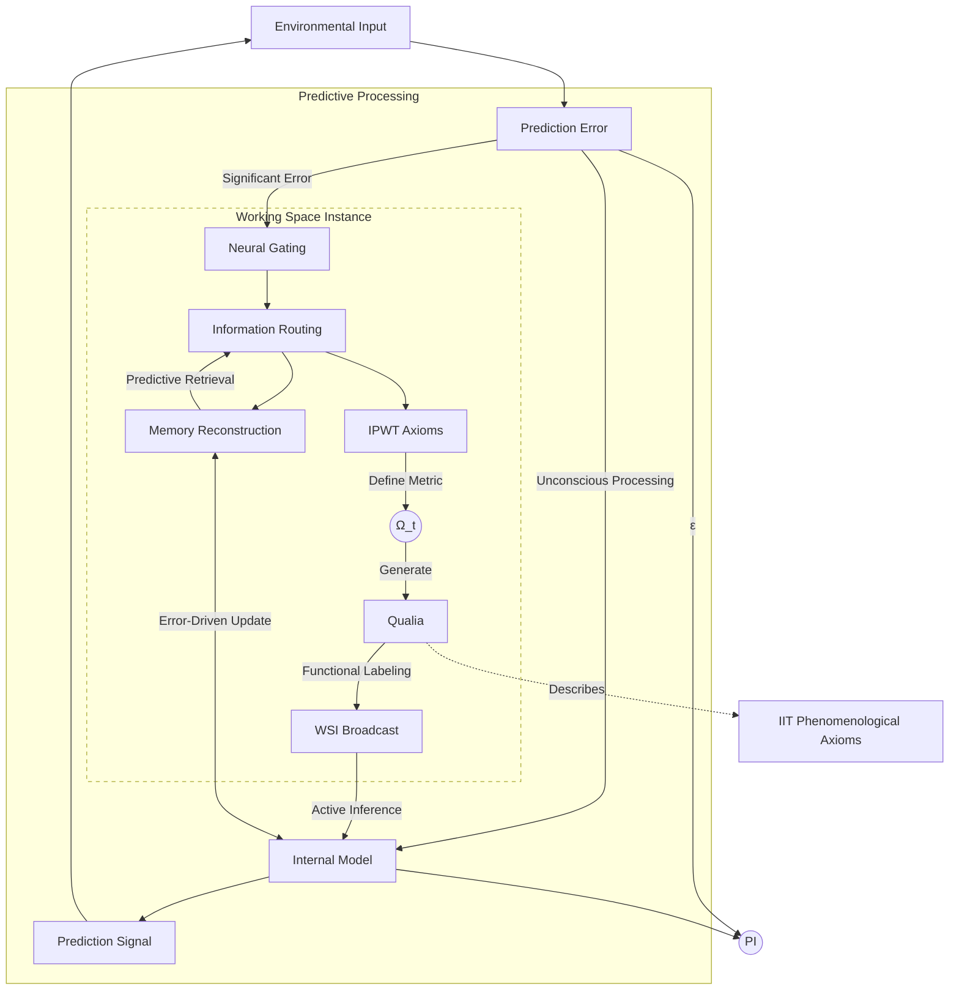

# **Integrated Predictive Workspace Theory: Towards a Unified Framework for the Science of Consciousness**

## _——Based on the Dynamic Foundation of Predictive Coding, Architectural Integration of Workspace Theory, and Computational Reconstruction of Integrated Information Theory's Phenomenology with Prospects for Clinical Neuroscience Applications_

### **Abstract**

The neural mechanisms and theoretical foundations of consciousness are central challenges in contemporary science. Existing mainstream theories of consciousness, such as Integrated Information Theory (IIT), Global Workspace Theory (GWT), and Predictive Coding Theory (PCT)/Free Energy Principle (FEP), despite their contributions, have limitations in computational feasibility, dependence on physical substrates, and unified explanations for complex conscious phenomena. We propose the **Integrated Predictive Workspace Theory (IPWT)**, aiming to construct a unified framework for consciousness. IPWT adopts PCT/FEP as the dynamic foundation for the generation and maintenance of conscious content, and Workspace Theory (WT) as the architectural platform for information integration and broadcasting (GWT is considered a special case of WT). The core innovation lies in the reconstruction of IIT's phenomenological axioms: by introducing the concept of "**logical irreducibility of information integration**" based on Synergy, replacing its reliance on physical causal irreducibility, information integration becomes applicable at the computational and information flow levels, thereby overcoming IIT's computational bottlenecks and physical substrate limitations. IPWT is committed to providing a computationally feasible consciousness model with strong clinical explanatory power (e.g., interpreting special states like schizophrenia and dissociative identity disorder) and philosophical depth (e.g., a "functional labeling" solution to the Qualia problem). It aims to offer a unified paradigm for the science of consciousness and theoretical guidance for understanding and intervening in mental illnesses.

**Keywords**: Theories of Consciousness; Integrated Predictive Workspace Theory (IPWT); Predictive Coding; Free Energy Principle; Workspace Theory; Integrated Information Theory; Synergistic Information; Logical Irreducibility; Predictive Integrity (PI); Computational Neuroscience; Clinical Neuroscience

### **1. Introduction: The Fog of Consciousness Theories and the Background of IPWT Proposal**

Consciousness, the most direct and familiar yet most elusive phenomenon of human experience, constitutes the "hard problem" (Chalmers, 1995) at the heart of neuroscience, cognitive psychology, philosophy of artificial intelligence, and indeed the entire landscape of modern science. It refers to our subjective experiences, perceptions, thoughts, emotions, and states of awareness of self and environment as individuals. From Descartes' philosophical contemplation "I think, therefore I am," to William James' vivid description of the "stream of consciousness," and to contemporary neuroscientists using advanced techniques to explore the Neural Correlates of Consciousness (NCCs), humanity's quest for the nature of consciousness has never ceased. However, despite remarkable achievements in identifying brain region activities, neural oscillation patterns, and neurotransmitter changes associated with specific conscious states (e.g., Koch et al., 2016), fundamental questions remain unresolved: **how** consciousness **emerges** from the brain's complex biophysical system, how its rich and unique **phenomenological features** such as unity, subjectivity, informativeness, and exclusivity are formed, and what its **exact functional role** is in cognitive activities and survival adaptation. A universally accepted theoretical framework capable of providing a unified explanation for these questions is still lacking.

Currently, the research landscape in the field of consciousness science presents a vibrant yet somewhat fragmented picture. Multiple theoretical paradigms, from different disciplinary perspectives, employing diverse methodologies, and focusing on different facets of consciousness, have each developed and accumulated significant empirical evidence and theoretical insights. However, these theories often lack deep dialogue and effective integration, sometimes even exhibiting tension or conflict in their core assumptions and basic concepts. This theoretical "Tower of Babel" dilemma not only hinders our formation of a holistic understanding of the nature of consciousness but also limits the ability to effectively translate basic theoretical research findings into clinical practice (e.g., for diagnosing and treating disorders of consciousness). This chapter will first briefly review several influential mainstream theories of consciousness, analyze their respective core contributions and major challenges, and then elucidate the necessity and urgency of integrating these theoretical strengths to construct a more comprehensive and explanatory new theoretical framework, ultimately leading to the core proposition of this paper—the background, core ideas, and anticipated contributions of the Integrated Predictive Workspace Theory (IPWT).

#### **1.1. A Survey of Mainstream Consciousness Theories: Achievements and Prominent Bottlenecks**

Among numerous theories of consciousness, the following have gained dominance due to their theoretical systematicity, breadth of explanation, or depth of empirical research. They collectively shape the basic landscape of current consciousness science research and provide important intellectual resources and starting points for critical reflection in the construction of IPWT.

##### **1.1.1. Integrated Information Theory (IIT): Phenomenology-Driven Mathematical Exploration and Its Predicaments**

Integrated Information Theory (IIT), systematically proposed and developed by Giulio Tononi and his collaborators (Tononi, 2004; Oizumi, Albantakis, & Tononi, 2014; Tononi et al., 2016), is one of the most ambitious and formalized theories of consciousness today. IIT's uniqueness lies in its **axiomatic approach starting from phenomenology**. It first extracts five core, undeniable phenomenological characteristics (axioms) inherent in conscious experience itself: **Existence**, meaning consciousness is real; **Information**, meaning every conscious experience is specific and distinguishable, excluding other possible experiences; **Integration**, meaning conscious experience is unified and indivisible, for example, we cannot decompose the perception of a red apple into independent "red" and "apple shape" experiences; **Exclusion**, meaning at any given moment, the content and spatiotemporal scale of conscious experience are definite, no more and no less; and **Structure/Composition** (earlier versions) or **Causation** (IIT 3.0 and later versions), emphasizing that consciousness is generated by a system with a specific cause-effect structure.

Based on these phenomenological axioms, IIT attempts to find the necessary conditions for a physical substrate capable of supporting these conscious attributes through a series of rigorous mathematical derivations and postulates. Its core idea is that the level of consciousness of a physical system (or its ability to generate conscious experience) depends on the **amount of integrated information (Φ value, Phi)** that the system can generate. The Φ value aims to quantify the causal power or informational constraint that a system possesses as a whole, which cannot be independently explained by any of its parts. The larger the Φ value of a system, the higher its level of consciousness. At the same time, IIT also emphasizes that the content of conscious experience (Qualia) is determined by the "**conceptual structure**" or "**Qualia Space**" unfolded by the system in a specific state, which depicts all causal relationships between the system's internal components and with past and future states.

IIT's contributions are multifaceted. It provides a profound, information- and causality-based philosophical insight into the nature of consciousness, emphasizing its intrinsicality, holism, and irreducibility. It attempts to connect subjective phenomenological experience with objective physical system attributes through mathematical language, providing a theoretical basis for the quantitative study of consciousness. Some of IIT's predictions, such as the association of consciousness with posterior cortical hot zones in the brain (Boly et al., 2017), and the use of the Perturbational Complexity Index (PCI) as an approximate measure of Φ value in clinical practice (Casali et al., 2013), have also received some experimental support.

However, IIT also faces a series of severe theoretical and practical challenges that limit its further development as a universal theory of consciousness:

1. **Computational Infeasibility of Φ Value**: For any complex system of even moderate size, precisely calculating its Φ value is an NP-Hard problem (Toker & Sommer, 2019). This means that as the number of system nodes increases, the resources required to calculate Φ value grow exponentially, making it almost impossible to directly apply IIT for consciousness assessment in a brain with tens of billions of neurons. Although researchers have proposed some approximate methods for calculating Φ value, whether these approximations can retain the core theoretical meaning of the original Φ value remains controversial.
2. **Strong Binding to the Intrinsic Causal Structure of Physical Substrates**: IIT emphasizes the close connection between consciousness and the "**intrinsic cause-effect power**" of specific physical systems, particularly its assumption of "**physical irreducibility**." This means that a system generating consciousness must be a physically indivisible whole, whose overall causal effects cannot be reduced to the sum of the causal effects independently produced by its individual subsystems. This assumption leads IIT to tend to believe that consciousness is a unique property of biological neural systems (or systems with similar intricate physical connection topologies), while IIT's stance on whether functionally equivalent but physically differently implemented systems (e.g., certain types of artificial intelligence systems or computational processes implemented on different physical substrates) can generate consciousness is more conservative or difficult to define. This limits IIT's flexibility in discussing important philosophical questions such as "**substrate independence**" or "**multiple realizability**" of consciousness.
3. **The Problem of the Nature of Qualia**: Although IIT proposes conceptual structure as the physical correlate of Qualia, its Φ value itself is a scalar, primarily measuring the "quantity" rather than the "quality" of consciousness. Whether and how Φ value truly captures the essence of subjective qualia (e.g., the difference between the subjective experience of "red" and "pain") mathematically remains an open and highly debated question (Searle, 2013; Mørch, 2019).
4. **Neglect of Dynamism and Functionality**: IIT focuses more on the static causal structure and information integration capacity of a system at a given moment, while its explanatory power is relatively weak regarding the dynamic fluidity of consciousness, the temporal changes in its content, and its specific functional role in guiding behavior and adapting to the environment.

These challenges indicate that although IIT provides profound insights into the nature of consciousness, it still needs to overcome significant theoretical and practical obstacles to become a comprehensive and unified theory of consciousness.

##### **1.1.2. Global Workspace Theory (GWT): Functional Architectural Metaphor of Consciousness and Its Limitations**

Global Workspace Theory (GWT), originally proposed by Bernard Baars (1988, 1997), is an influential cognitive architectural theory that likens the function of consciousness to a **theater stage**. In this metaphor, the cognitive system consists of numerous parallel, unconscious, specialized processing modules (actors and staff backstage), each responsible for processing specific information or performing specific tasks. At any given moment, only a few selected pieces of information can enter the "global workspace" (the spotlighted area on stage), where they are amplified, integrated, and **globally broadcast** to all other specialized modules throughout the cognitive system. Once information enters the global workspace and is broadcast, it becomes "conscious" information and can be used for learning, memory updating, problem-solving, decision-making, and various other cognitive functions.

GWT's core contribution lies in its clear articulation of the **functional role** of consciousness in information processing and cognitive regulation. It successfully explains several key features of conscious experience:

1. **Limited Capacity**: The capacity of the global workspace is limited, which explains why we can only be aware of a few pieces of information at any given moment.
2. **Seriality**: Information typically enters the global workspace serially, which aligns with the linear characteristic of the stream of consciousness we subjectively experience.
3. **Information Integration and Sharing**: The global workspace, as a hub for information convergence and broadcasting, allows information from different modules to be integrated and widely shared with other modules, thereby achieving coordination and unity in cognitive processes.
4. **Distinction between Conscious and Unconscious**: GWT clearly distinguishes between conscious information broadcast in the global workspace and unconscious information processed in parallel in the background.

GWT's ideas have been widely applied in cognitive psychology, neuroscience, and artificial intelligence. For example, Stanislas Dehaene and his colleagues proposed the **Global Neuronal Workspace Model (GNWM)** (Dehaene, Kerszberg, & Changeux, 1998; Dehaene & Naccache, 2001), which attempts to provide a more specific neurobiological basis for GWT, suggesting that consciousness arises from the activation of a widely distributed network system in the brain composed of long-range connected pyramidal neurons (especially those in the prefrontal, parietal, and temporal cortices). When information enters this global neuronal workspace and triggers a top-down, sustained neural activity known as "ignition," conscious experience emerges.

Despite GWT's great success in explaining the function of consciousness, it also has some inherent limitations:

1. **Lack of Subjective Qualia**: GWT primarily focuses on the flow and architecture of information processing, but it does not directly explain why certain information broadcast in the global workspace is accompanied by subjective, first-person qualia experiences (e.g., the "redness" felt when seeing red). It describes more of a "functional correlate" of consciousness rather than a "phenomenological correlate."
2. **Specific Mechanisms and Boundary Issues of the Global Workspace**: Although GNWM proposes some candidate neural substrates, the precise neural implementation mechanisms of the global workspace, how its dynamic boundaries are defined, how information is selected to enter the workspace (how the "spotlight" moves and focuses), and the specific neurophysiological processes of broadcasting still need further clarification and verification.
3. **Insufficient Explanatory Power for Complex Conscious States**: For some more complex conscious phenomena, such as the formation of self-consciousness, the mechanisms of dream generation, or certain pathological conscious states (e.g., thought disorganization in schizophrenia or multiple conscious cores in dissociative identity disorder), GWT's explanatory framework may appear overly simplistic.
4. **Potential Misleading Nature of the "Theater" Metaphor**: While the "theater" metaphor is very intuitive, it can also be misleading, for example, by implying the existence of a central observer (Homunculus) watching the performance on stage, which contradicts the decentralized view of contemporary cognitive science.

Therefore, while GWT provides a powerful framework for understanding the functional architecture of consciousness, it still needs to be supplemented and improved in explaining the subjective dimension of consciousness and deeper neural mechanisms.

##### **1.1.3. Predictive Coding Theory (PCT) and Free Energy Principle (FEP): The Bayesian Brain Hypothesis for Cognitive Unification and Its Bridge to Consciousness**

Predictive Coding Theory (PCT) and the Free Energy Principle (FEP) are theoretical frameworks that have rapidly emerged and gained widespread influence in cognitive science and computational neuroscience in recent years. Together, they depict a grand blueprint that views the brain as a **Bayesian inference engine** (Rao & Ballard, 1999; Friston, 2005, 2010; Clark, 2013, 2016). The core idea of this theoretical system is that the brain does not passively receive and process sensory information from the external world but actively and continuously **generates multi-level predictions about the state of the world and sensory input**, and uses actual sensory input to test and revise these predictions.

Within the PCT/FEP framework, the fundamental organizational principle of the cognitive system is to **minimize prediction error**, which is the discrepancy between internal predictions and actual sensory input. This prediction error signal is transmitted in a bottom-up manner within the neural system, driving higher-level internal models to update, thereby optimizing future predictions. Conversely, higher-level internal models send top-down prediction signals to lower levels, attempting to "explain away" or suppress lower-level activity (if the predictions are accurate).

The Free Energy Principle (FEP) provides a more universal and fundamental mathematical formulation for this process. FEP states that any self-organizing system (such as the brain), in order to maintain its homeostasis and existence in a changing environment, must minimize its **variational free energy**. Variational free energy is an information-theoretic measure of the mismatch between the system's internal model's predictions of the external world and actual sensory input. Mathematically, it can be seen as an upper bound on prediction error, or an approximation of the "surprise" of sensory input. The system can minimize free energy in two basic ways:

1. **Changing Internal Models (Perceptual Inference and Learning)**: By adjusting the parameters of the internal generative model to predict future sensory input more accurately. This corresponds to perceptual inference (understanding what is happening in the current world) and learning (updating knowledge about how the world works).
2. **Changing Sensory Input (Active Inference and Action)**: By taking actions to change its own state in the world or change the world itself, so that actual sensory input better conforms to the internal model's predictions. This corresponds to active inference (selecting actions that minimize expected free energy) and behavior generation.

The power of the PCT/FEP framework lies in its immense **unified explanatory power**. It can not only explain various perceptual phenomena (such as binocular rivalry, visual illusions, expectation effects, etc.) but has also been successfully applied to explain learning, memory, attention, motor control, decision-making, and even emotions, social cognition, and mental illnesses (such as autism spectrum disorder and schizophrenia, which are considered results of abnormal predictive coding processes (Pellicano & Burr, 2012; Adams, Stephan, Brown, Frith, & Friston, 2013; Sterzer et al., 2018)). It emphasizes the brain's **agency** and **generative nature**, viewing cognition as a continuous, active, prediction-centric process of interaction with the environment.

However, despite PCT/FEP's great success in explaining the underlying computational principles of cognitive functions, its **direct theoretical bridge** to subjective conscious experience is still under construction. Here are some key questions:

1. **Emergence of Conscious Content**: While PCT/FEP explains how information is processed and represented, it does not directly explain why certain specific predictions, prediction errors, or internal model states are accompanied by subjective, first-person conscious experiences, while others are not. What determines which neural computational processes can "leap" to the conscious level? Is there a specific prediction error threshold, model precision, or integration level associated with the generation of consciousness?
2. **Explanation of Qualia**: Similar to GWT, PCT/FEP focuses more on the mechanisms and functions of information processing, and the explanation for subjective qualia (e.g., how the "feeling of red" arises from predictions and error corrections for specific wavelengths of light) remains unclear. Some scholars attempt to link Qualia to higher-order predictions or specific types of prediction errors (such as precision-weighted prediction errors) (Seth, 2013; Hohwy, 2012), but these views have not yet reached a consensus.
3. **Unity and Boundaries of Consciousness**: Although hierarchical predictive models themselves have a certain degree of integration, how PCT/FEP explains the global unity of conscious experience (e.g., how information from different sensory modalities merges into a coherent conscious scene) and the boundaries of consciousness (e.g., the distinction between self and non-self) still requires more detailed elaboration.
4. **Specific Associations with Neural Implementation**: Although a large number of studies link PCT/FEP's computational components (such as prediction units, error units) to specific neuron types (such as pyramidal cells, interneurons) and neural circuits (such as cortical columns, thalamocortical loops) (Bastos et al., 2012; Shipp, 2016), the extent to which these associations can directly explain the neural basis of consciousness remains an active research area.

Therefore, PCT/FEP provides a revolutionary computational framework for understanding the brain's cognitive functions, but to fully develop it into a theory capable of explaining all core features of consciousness, further theoretical innovation and experimental verification are needed, especially to clarify its connection mechanisms with conscious phenomena.

#### **1.2. Insufficiencies of Existing Integration Attempts and the Necessity of IPWT Proposal**

Given the respective strengths and limitations of the mainstream theories discussed above, some researchers have recently begun to attempt to integrate elements from different theories in order to build more comprehensive and powerful models of consciousness. For example, Anil Seth's work attempts to link predictive coding with the concept of the "conscious self," arguing that the sense of self arises from predictions and control of internal bodily states (interoception) (Seth, 2013; Seth & Friston, 2016). Adam Safron's Integrated World Modeling Theory (IWMT) attempts to combine GWT, PCT, and some ideas from IIT (such as information integration), arguing that consciousness involves constructing an integrated model of the world, body, and self, which is processed and broadcast in a global workspace (Safron, 2020a, 2020b).

However, these early integration attempts, while insightful, often fail to provide a **unified framework that is internally consistent, computationally feasible, and broadly explanatory**. For example, although IWMT nominally incorporates IIT, it does not actually deeply integrate IIT's core axiomatic system and Φ value calculation framework. Instead, it somewhat downgrades IIT to an auxiliary measure and acknowledges the infeasibility of original Φ value calculation, proposing to use some "approximate integrated information measures." This approach is essentially a compromise and avoidance of IIT's core concepts, failing to truly solve the fundamental problems faced by IIT, such as its strong dependence on physical causal topology and computational complexity. Furthermore, these integrated theories often lack specificity and depth in elucidating the **precise interfaces and interaction mechanisms** between different theoretical components (e.g., between the dynamic mechanisms of predictive coding and the information broadcasting architecture of the global workspace). They tend to juxtapose or simply add up components from different theories, rather than organically and deeply fusing their internal mechanisms to form an emergent new theory that is "1+1>2."

More importantly, as research in consciousness science continues to deepen, and as attention to various complex conscious phenomena (especially pathological conscious states and special conscious experiences) increases, we also place higher demands on the **explanatory power, precision, and clinical application potential** of consciousness theories. A truly valuable unified theory of consciousness needs not only philosophical depth at the philosophical level but also computational operability at the computational level, neural verifiability at the neural level, and solid theoretical guidance for understanding and intervening in real-world consciousness-related problems (such as diagnosis and rehabilitation of disorders of consciousness, pathological mechanisms and treatment of mental illnesses, ethical norms of artificial intelligence, etc.).

It is against this background that the Integrated Predictive Workspace Theory (IPWT) is proposed. The core goal of IPWT is not simply to "patch up" or "piece together" existing theories, but to construct a new, internally consistent, and powerfully externally explanatory unified framework for consciousness through **deep reconstruction and creative fusion** of the core insights of PCT/FEP, WT, and IIT. The proposal of IPWT is based on a profound reflection on the limitations of existing theories and a positive outlook on the future development of consciousness science.

The core contributions and unique aspects of IPWT, i.e., its **necessity**, are mainly reflected in the following aspects:

1. **Deep Integration, Not Shallow Juxtaposition**: IPWT is committed to achieving **true mechanistic integration** among the dynamic mechanisms of PCT/FEP, the information processing architecture of WT, and the phenomenological insights of IIT. It will clearly articulate how predictive coding processes drive the formation, content filling, and dynamic changes of Working Space Instances (WSIs); how WSIs serve as platforms for higher-order integration, processing, and broadcasting of prediction and error signals; and how this integration process embodies and reconstructs the phenomenological features of consciousness described by IIT (especially by introducing the concept of "logical irreducibility of information integration").
2. **Overcoming IIT's Core Bottlenecks**: Through **functional reconstruction** of IIT's axioms, particularly by replacing "physical causal irreducibility" with "logical irreducibility" based on synergistic information, IPWT aims to liberate the concept of information integration from its dependence on specific physical substrates, making it applicable to information flow and computational levels. This not only provides new ideas for solving IIT's computational infeasibility problem (e.g., by finding computable proxy measures for logical irreducibility) but also opens up theoretical possibilities for discussing substrate independence of consciousness and realizing consciousness-like experiences in artificial intelligence systems.
3. **Clarifying Dynamic Mechanisms and Diversity of Workspace**: IPWT will expand and refine Workspace Theory (WT), emphasizing the dynamism, hierarchy, parallelism of WSIs, and the specific computational principles of information integration and broadcasting within them (e.g., saliency gating based on prediction error, dynamic routing of attention mechanisms). Traditional GWT will be considered a special and highly integrated configuration state of WT, thereby better explaining the flexibility, diversity of consciousness, and its different manifestations in various conscious states (e.g., wakefulness, sleep, dreaming, meditation, and even pathological dissociative states).
4. **Enhancing Explanatory Power for Special Conscious States**: IPWT will systematically apply its integrated framework to provide novel, computation-based neurocomputational interpretations for various complex and special conscious phenomena (e.g., blindsight, hallucinations and delusions in schizophrenia, multiple personalities in dissociative identity disorder, metacognitive experiences in lucid dreaming, psychedelic-induced altered consciousness). This will be an important test of IPWT's theoretical explanatory power and clinical application potential.
5. **Emphasizing Computational Verifiability and Engineering Potential**: IPWT has from the outset highly focused on the **computational verifiability** of its theoretical predictions. It will strive to define and operationalize a series of computable metrics (such as Predictive Integrity PI and its integral ∫PI) to quantify the degree of information integration in WSIs and the stability of conscious states, and propose specific computational modeling and neuroimaging validation pathways. This allows IPWT to not only remain at the level of philosophical speculation but also to have immense potential to develop into a testable, applicable scientific theory, and even potentially provide theoretical guidance for building artificial intelligence systems with consciousness-like capabilities in the future.

Furthermore, it is worth noting that recent extensive discussions in the field of consciousness science regarding the scientific standards of theoretical paradigms (e.g., Doerig et al., 2023; Klincewicz et al., 2025; Tononi et al., 2025) also highlight the importance of developing a theory of consciousness that is clearer in its theoretical presuppositions, more operable in its core concepts, and more falsifiable in its experimental verification. IPWT is striving in this direction, attempting to achieve a better balance between theoretical breadth, depth, and scientific rigor.

In summary, the proposal of IPWT is a natural product of the current stage of consciousness science development, facing the urgent need for theoretical integration, the inherent limitations of existing theories, and the desire for deeper explanations and broader applications. It carries the core vision of providing a more unified, powerful, and promising theoretical paradigm for this ancient yet cutting-edge field. The following chapters will elaborate on IPWT's core construction, computational implementation, neural verification, and its unique perspective on understanding special conscious states and reconstructing the Qualia problem.

### **2. Core Construction of Integrated Predictive Workspace Theory (IPWT)**

Integrated Predictive Workspace Theory (IPWT) aims to construct a unified framework for consciousness by integrating the core mechanisms of Predictive Coding Theory (PCT), Free Energy Principle (FEP), and Workspace Theory (WT), and by functionally reconstructing the phenomenological axioms of Integrated Information Theory (IIT). This chapter will elaborate on the core building blocks of IPWT, clarify its basic assumptions, delve into the roles of PCT/FEP as the dynamic engine and WT as the architectural platform, and explain how IPWT reconstructs IIT's phenomenological axioms through the concept of "logical irreducibility of information integration."

#### **2.1. Basic Assumptions and Core Principles of IPWT**

IPWT is built upon the following core assumptions, which collectively form the bedrock of its theory:

1. **Consciousness as an Emergent Phenomenon of Information Integration and Synergistic Processing**: IPWT adopts a functionalist stance, viewing consciousness as a complex phenomenon that emerges when information is efficiently integrated and synergistically processed within a specific functional architecture. The core lies in synergy—information units form a logically irreducible whole, generating novel causal effects. This provides a basis for the "substrate independence" of consciousness.
2. **Consciousness as a Prediction-Driven, Free Energy Minimization-Oriented Dynamic Process**: Inspired by PCT/FEP, IPWT views consciousness as a continuous, prediction-centric dynamic process. The cognitive system optimizes internal generative models to predict sensory input and minimize prediction error (or free energy). Conscious content reflects the system's best explanation and prediction of internal and external environments.
3. **Consciousness as a Workspace-Based Information Processing Hub**: Extending WT, IPWT hypothesizes the existence of one or more dynamic, limited-capacity **Working Space Instances (WSIs)**. WSIs are key nodes for information selection, integration, amplification, and broadcasting. Their limited capacity explains the focal nature of consciousness, and their broadcasting property explains their coordinating function. WSIs are dynamic functional network configurations.
4. **The Integrality of Consciousness Arises from the Logical Irreducibility of Information**: IPWT agrees with IIT's view that "integration" is a core feature of consciousness but explains its origin as **logical irreducibility** formed by information within WSIs, rather than physical irreducibility. The meaning and causal effects of the integrated information whole cannot be reduced to the simple sum of its constituent parts, which reflects synergistic information. This logical irreducibility is at the information and functional levels, decoupled from specific physical implementations.

These principles collectively shape IPWT's functionalist stance, positioning the essence of consciousness in the functions it performs and the way it processes information.

#### **2.2. Predictive Coding Theory (PCT) and Free Energy Principle (FEP) as Dynamic Engine and Energy Constraint**

In IPWT, PCT and FEP constitute the **core dynamic engine** and **energy constraint principle** for the generation, maintenance, and state transitions of conscious content. They explain how information is generated, processed, and updated, and provide the driving force for the emergence of conscious content.

##### **2.2.1. Information Generation and Error Minimization: Bayesian Brain and Consciousness Filtering**

IPWT adopts the view of the brain as a Bayesian inference machine, where the cognitive system actively constructs internal generative models to predict sensory input, and conscious content is specific information generated within this prediction-error correction loop.

- **Hierarchical Generative Models**: The cognitive system's internal models have a hierarchical structure, where higher-level abstract concepts transmit prediction signals to lower-level concrete perceptions (Lee & Mumford, 2003; Friston, 2008). The system optimizes model $m$ by maximizing model evidence $P(s_t | m)$.
- **Prediction Error**: The difference $\epsilon_t = s_t - \hat{s}_t$ between actual sensory input $s_t$ and prediction $\hat{s}_t$, after precision-weighting, propagates bottom-up (Feldman & Friston, 2010). Prediction error drives model updates (learning) and also acts as a "gatekeeper" for information entering consciousness—only errors exceeding a saliency threshold may enter the WSI.
- **Free Energy Minimization**: FEP states that self-organizing systems must minimize their **variational free energy ($F$)** to maintain homeostasis (Friston, 2010). $F$ is an upper bound on the mismatch between the internal model and the external world, and can be decomposed into complexity (keeping the model simple) and accuracy (accurately predicting sensory input). The system minimizes $F$ through **perceptual inference and learning** (optimizing internal models) and **active inference and action** (changing sensory input to conform to predictions) (Friston et al., 2015). FEP provides the basis for the energy efficiency and evolutionary adaptability of consciousness: the emergence of consciousness is for more effective free energy minimization.

##### **2.2.2. Internal Models, Environmental Interaction, and Memory Systems: Dynamic Construction of Conscious Content**

IPWT emphasizes that conscious content is the system's active, constructive best prediction and explanation of the internal and external world based on its internal models.

- **Agency and Sense of Self**: Through the FEP-driven prediction-action loop, the system actively shapes its interaction with the environment and constructs an internal model of the "self" (Adams, Shipp, & Friston, 2013; Friston, 2009). Successful self-prediction and control give rise to a coherent sense of self.
- **Emergence of Conscious Content**: Information entering consciousness typically has high predictive precision, significant prediction error, behavioral relevance, and high integration and coherence.
- **Memory as the Core of Internal Predictive Models**: Internal generative models are essentially dynamic, predictive memory systems (Rolls, 2024). Memory encoding is the learning of model parameters; consolidation is offline optimization of models; retrieval is an active predictive process (Hinton & Salakhutdinov, 2009). The special association between episodic memory and conscious experience (Budson, Richman, & Kensinger, 2022) also supports the role of predictive memory in consciousness. Recent studies further confirm the central role of PCT/FEP in sensory processing (Sainburg et al., 2025; Lyons & Gottfried, 2025) and higher cognition (Gabhart et al., 2025).

PCT/FEP provides the dynamic foundation for IPWT, driving information integration and broadcasting in WSIs, and paving the way for the emergence of logical irreducibility of information integration.

#### **2.3. Workspace Theory (WT) as the Core Architectural Platform: Dynamic Hub for Information Integration and Broadcasting**

In the IPWT framework, Workspace Theory (WT) is elevated and expanded into a core **architectural platform** responsible for implementing key conscious functions of information integration, processing, and broadcasting. It is no longer merely a metaphorical "theater stage" but is endowed with more specific computational roles and dynamic properties. WT provides a structured processing hub for PCT/FEP-driven information flow, allowing information that is otherwise dispersed and processed in parallel in specialized modules to be selected, converged, integrated, and formed into unified conscious states that can be widely utilized by the system.

##### **2.3.1. Core Attributes and Dynamic Properties of Working Space Instances (WSIs)**

The core concept of IPWT is the **Working Space Instance (WSI)**. A WSI is a dynamically formed functional network or cognitive subsystem with limited information processing capacity. It possesses the following core attributes:

- **Limited Capacity**: Any single WSI has a limited amount of information it can hold and process at the same time. This directly explains the focal nature of conscious experience (we can usually only clearly be aware of a few things) and its seriality (conscious content seems to flow sequentially in time, as new information needs to replace old information to enter the limited WSI). This capacity limit forces the system to develop efficient information selection and gating mechanisms.
- **Information Integration**: One of the core functions of a WSI is to converge, associate, and integrate information units from different sources (e.g., different sensory channels, memory systems, or internal prediction modules) to form a cognitive state that is richer, more coherent, and logically more unified than its individual components. This integration process is not merely a simple superposition of information but involves complex interactions, mutual constraints, and synergistic effects among information, thereby generating new meaning and causal power.
- **Selective Broadcast or Information Availability**: Once information is sufficiently integrated within a WSI and reaches a certain saliency or stability, it is "broadcast" or made "available" to other cognitive modules within the system that are functionally related to that WSI. This broadcasting is not necessarily forced to all modules but has a certain selectivity and targeting, depending on the strength of connections between modules, task relevance, and attentional allocation. For example, a WSI responsible for visual scene understanding might broadcast its integrated scene representation to modules responsible for object recognition, spatial navigation, and episodic memory encoding. This information sharing mechanism is crucial for achieving cognitive function coordination and behavioral consistency. Recent research also supports this goal-directed information integration and broadcasting, for example, bilateral integration in the somatosensory cortex is controlled by behavioral relevance (Park et al., 2025), revealing task-dependent interhemispheric coupling mechanisms.
- **Dynamism and Diversity**: IPWT emphasizes that WSIs are not fixed anatomical structures but are **functional network configurations that can dynamically form, adjust, merge, separate, or dissipate** according to cognitive demands and environmental changes. This means that in different cognitive tasks or conscious states, there may exist WSIs of different scales, compositions, and degrees of integration. For example, in highly focused tasks, a highly integrated, clearly bounded dominant WSI might form; while in relaxed or distracted states, the integration of WSIs might decrease, or multiple vaguely bounded, competing WSIs might coexist. Structural and functional studies of the default mode network also support this dynamic network architecture view of workspace theory (Paquola et al., 2025).

##### **2.3.2. Global Workspace Theory (GWT) as a Special and Highly Integrated Configuration of WT**

Traditional Global Workspace Theory (GWT) is reinterpreted and repositioned within the IPWT framework. IPWT does not deny the existence and importance of the global information broadcasting phenomenon described by GWT but considers it a **special and highly integrated configuration state of Workspace Theory (WT)**. Specifically:

- When one or a few WSIs have an extremely wide scope of integration and an extremely high degree of integration, capable of effectively converging and processing information from most (or all) currently task-relevant specialized cognitive modules, and widely broadcasting their processing results, thereby forming a unified, coherent, and stable dominant conscious experience covering the entire cognitive system, then this (or these) WSI plays the role of the "global workspace" in traditional GWT.
- This highly integrated global WSI is typically associated with states of wakefulness, alertness, and focused attention, enabling complex cognitive functions such as rational thought, long-term planning, self-reflection, and verbal communication.
- However, IPWT argues that not all conscious experiences must reach this level of global integration. In some cases, such as in dreams, certain meditative states, or some mental disorders (like DID), there may be multiple parallel WSIs with relatively limited integration scope, or WSIs with lower integration degrees and blurred boundaries. These situations can also produce conscious experiences, although their nature and content may differ significantly from typical waking consciousness.
- In this way, IPWT retains GWT's insights into the core functions of consciousness while endowing it with greater flexibility and explanatory scope, allowing it to better accommodate the diversity and complexity of conscious states.

##### **2.3.3. Compatibility and Synergy of Working Space Instances (WSIs) with Hierarchical Integration of Predictive Coding Theory (PCT)/Free Energy Principle (FEP)**

WSIs do not exist as isolated architectures independent of PCT/FEP dynamic mechanisms but are tightly integrated and work synergistically with them. Their relationship can be understood as:

- **WSI as a Platform for Higher-Order Prediction and Integration**: WSIs typically do not directly process raw sensory input but receive information that has already undergone preliminary processing and compression from lower-level PCT modules, as well as significant prediction error signals that could not be effectively "explained away" by lower-level predictive models. The role of WSIs is to further integrate, compare, and evaluate these input information at a higher cognitive level and generate higher-order predictions and explanations. For example, a WSI might integrate object shape information from the visual cortex and sound information from the auditory cortex to form a unified perception of a "bird singing."
- **WSI Participation in Higher-Order Free Energy Minimization**: The information integration and processing within WSIs also follow the principle of free energy minimization. WSIs attempt to construct the most coherent, parsimonious, and predictive internal model of their input information and broadcast it to guide the activities of other modules, thereby helping the entire system minimize free energy. When integration within a WSI conflicts or is inconsistent (e.g., visual and auditory information mismatch), a "higher-order prediction error" is generated, driving the WSI to adjust its integration strategy or seek more information.
- **Parallelization or Fragmentation of Multiple WSIs and FEP-PCT Hierarchical Structure**: When multiple WSIs are running in parallel (e.g., in DID or certain forms of lucid dreaming), this can be interpreted as a form of **functional parallelization or fragmentation** of the entire cognitive system's FEP-PCT hierarchical structure at the highest level. Each WSI may correspond to a relatively independent, higher-order FEP-PCT subsystem that primarily minimizes prediction error within its specific information domain or for specific goals. The degree of information isolation between these parallel WSIs (determined by neural gating mechanisms and information transmission efficiency) will directly affect their respective conscious contents and the overall behavioral coordination of the system.

In this way, IPWT organically combines the dynamic mechanisms of PCT/FEP with the architectural functions of WT, depicting a computational picture of how consciousness emerges through dynamic processes of multi-level prediction and integration. WSIs provide a structured stage for predictive coding, while predictive coding provides continuous 动力 for WSI content filling and dynamic changes.

#### **2.4. Reconstruction of Integrated Information Theory (IIT) Phenomenological Axioms: From Physical Causality to Logical Synergy**

IPWT's core contribution to IIT lies in its fundamental **functional reconstruction** of IIT's phenomenological axioms, aiming to retain IIT's profound insights into the essential characteristics of consciousness while overcoming its limitations in computational feasibility, physical substrate dependence, and explanatory power for dynamic conscious processes. IPWT does not directly adopt IIT's Φ value calculation method or its requirements for specific physical causal topology. Instead, it reinterprets IIT's five core phenomenological axioms (existence, information, integration, exclusion, causation) as **advanced functional attributes that information flow inevitably exhibits when undergoing complex processing and synergistic integration driven by predictive coding (PCT) within the specific architecture of Working Space Instances (WSIs)** (Oizumi et al., 2014; Tononi, 2012; Tononi et al., 2016). The core of this reconstruction is the introduction of the concept of "**logical irreducibility of information integration**" and its connection to **synergistic information** in information theory, thereby replacing IIT's emphasis on "physical causal irreducibility."

##### **2.4.1. "Logical Irreducibility of Information Integration" Replaces "Physical Causal Irreducibility": Breaking Free from Physical Constraints, Embracing Computation and Information**

A core and controversial assumption of the original IIT is that a physical system capable of generating consciousness must possess "**physical causal irreducibility**." This means that the overall causal effect of the system cannot be reduced to the sum of the causal effects independently produced by any of its separate subsystems. This irreducibility is based on the intricate physical connections and interaction topologies between the system's internal elements. While this concept profoundly captures the unity and holism of conscious experience, it also makes IIT difficult to apply to non-biological systems or systems whose physical implementations differ significantly from the brain's neural networks, and it poses immense difficulties for the calculation of Φ values.

IPWT proposes that the integrality of conscious experience does not originate from some irreducible physical property of its underlying physical substrate but from the **logical irreducibility** formed between information units processed and integrated within the WSI. This means:

- When multiple independent information units (e.g., representations of an object's color, shape, motion, sound features) are input into a WSI and integrated through complex computational processes within the WSI (e.g., feature binding, pattern matching, contextual association, prediction generation), they form a new, higher-order, unified cognitive representation (e.g., "a brown dog running and barking on the grass").
- The **semantic meaning, functional role, and causal influence on the system's subsequent states and behaviors** of this integrated whole representation cannot be fully explained by simply decomposing it back into its original, isolated information units and summing their respective meanings and causal powers. In other words, this integrated whole is **logically, functionally, and causally irreducible**. It exists as a new, unified information entity and produces unique effects that none of its components can produce alone.
- This logical irreducibility is precisely the functional manifestation of **synergistic information** in information theory within the cognitive system. Synergistic information refers to the amount of information that multiple information sources jointly provide to a target variable, which cannot be independently provided by any subset of these information sources (Williams & Beer, 2010; Griffith & Koch, 2014). When a WSI integrates multiple input information to generate a more accurate prediction, a more coherent explanation, or a more effective action strategy, it is actually utilizing the synergistic effects between these input information to extract "hidden" information that only becomes apparent when they are considered as a whole.

By shifting the core of integrality from "physical irreducibility" to "logical irreducibility," IPWT achieves several important theoretical breakthroughs:

1. **Substrate Independence**: Logical irreducibility is an attribute at the information processing and computational level, which can in principle be realized on any physical substrate capable of performing the necessary computational functions, whether biological neurons, silicon chips, or other emerging computational media. This allows IPWT to better discuss and accommodate the "multiple realizability" of consciousness.
2. **Computational Operability**: Although directly calculating high-dimensional synergistic information remains a challenge, defining integrality at the information and computational level provides clearer theoretical guidance for developing its computable proxy measures (such as the Predictive Integrity PI proposed in IPWT). We can indirectly measure the logical irreducibility of information integration by evaluating the efficiency and effectiveness with which a system integrates information within a WSI to optimize predictions and behaviors.
3. **Compatibility with Dynamic Processes**: Logical irreducibility is an attribute that can change dynamically over time. The degree and manner of information integration within a WSI can be flexibly adjusted according to task demands and cognitive states, thus allowing logical irreducibility (and corresponding conscious experience) to also exhibit dynamic changes, which is more consistent with the nature of the stream of consciousness.

##### **2.4.2. IPWT's Functional Reconstruction of IIT's Five Phenomenological Axioms and WSI Interpretation**

Based on the core concept of "logical irreducibility of information integration," IPWT functionally reconstructs IIT's five phenomenological axioms as follows, closely linking them to the operational mechanisms of WSIs:

1. **Existence**: Within the IPWT framework, when an information unit (e.g., a prediction signal generated by PCT, a representation retrieved from memory, or an integrated concept formed in a WSI) is activated, processed, and reaches a certain saliency or stability within the cognitive system, enabling it to produce recognizable, sustained **functional effects** within the system, it "exists" in that cognitive state. This "existence" is informational and functional, meaning that the information unit occupies a "computational slot" within the WSI and can participate in subsequent integration, broadcasting, and causal roles. It is no longer merely the activation of physical neurons but an information entity with a specific computational role.

2. **Information**: Every information unit that "exists" within a WSI carries unique, distinguishable **content or semantics**. It reduces uncertainty about the system's internal state or external environment by specifying a particular state or possibility (thereby excluding other possibilities). In the PCT framework, information is reflected in the specificity of prediction signals (what it predicts), the content of prediction error signals (what discrepancy it reveals between prediction and reality), and the richness of internal model representations (how many different world states it can distinguish). Within a WSI, these information units are distinguished by their unique "functional signatures" and exert specific influences on other information units.

3. **Integration**: This is the core of IPWT's reconstruction. Integration refers to multiple independent information units being converged, associated, and interacting within a WSI through complex computational processes (e.g., feature binding, relational inference, synergistic activation, prediction generation) to form a **logically irreducible, functionally unified, synergistic cognitive state or representation**. The meaning, predictive power, and causal effects of this integrated whole transcend the simple sum of its components. The degree of this integration, i.e., the strength of its synergy or logical irreducibility, is a key source of the unity and richness of conscious experience. It reflects the WSI's ability to weave dispersed information into a coherent "story." Complex scene understanding in visual processing that goes beyond simple feature binding (Scholte & de Haan, 2025) is an example of this high degree of integration.

4. **Exclusion**: Due to the limited capacity of WSIs and the need for efficient cognitive system operation, at any given moment, only one or a few cognitive states or information sets that are most salient, most relevant, best at minimizing prediction error, or most highly integrated can dominate the WSI and become the core content of current conscious experience. Other competing, irrelevant, or less integrated information is temporarily **excluded** from the focus of consciousness or remains at the periphery of the WSI. This exclusion is achieved by the WSI's gating mechanisms, attentional selection, and competitive dynamics of predictive coding. It ensures the clarity, definiteness, and limited nature of conscious content, avoiding information overload and cognitive confusion.

5. **Causation**: Information states integrated within a WSI and achieving dominance possess significant **causal power**. They can act as driving forces, influencing the activities of other cognitive modules within the system (e.g., updating long-term memory, adjusting attentional focus, activating emotional responses), and ultimately guiding the organism's overt behavior and decision-making. This causal effect is achieved through the WSI's broadcasting mechanism (transmitting integrated information to relevant modules) and active inference processes (states within the WSI directly participate in the calculation of expected free energy and guide action selection). The integrated information state within a WSI is not merely a passive representation of the world but also a "control center" or "decision hub" for the system to take action and change the world to conform to its internal models and goals.

Through this functional reconstruction of IIT's phenomenological axioms, IPWT successfully integrates its profound philosophical insights into a more dynamic, computationally feasible, and substrate-independent theoretical framework. It transforms the essential characteristics of consciousness from elusive physical properties into advanced functional attributes that can be studied, measured, and modeled at the information processing and computational levels, opening new avenues for the science of consciousness to move from pure philosophical speculation to operable experimental research and computational simulation.

### **3. Computational Verifiability and Information Integration Measures of IPWT: From Theoretical Definition to Operable Proxies**

Integrated Predictive Workspace Theory (IPWT) not only aims to provide a unified framework for consciousness at the conceptual level but also emphasizes the **computational verifiability** and **empirical testability** of its theoretical claims. A mature scientific theory, in addition to having strong explanatory power, must also be able to generate testable predictions and provide operationalizable measurement methods for verification, correction, or falsification through experimental data. The core task of this chapter is to build such a bridge for IPWT, from abstract theoretical concepts to concrete computational measures.

We will first discuss IPWT's theoretical gold standard measure for the core feature of consciousness—"information integration"—namely, **Instantaneous Information Integration ($\Omega_t$)**, and provide a rigorous mathematical definition for it based on the **Partial Information Decomposition (PID)** framework in information theory, particularly the concept of **Synergistic Information**. However, given the extreme complexity of directly calculating high-dimensional synergistic information, $\Omega_t$ is often difficult to apply directly in practice. Therefore, the second focus of this chapter will be to introduce and elaborate on two core **computable proxy measures** proposed by IPWT: **Predictive Integrity (PI)** and its integral over time—**Predictive Integrity Integral (∫PI)**. These two metrics aim to indirectly but effectively reflect the underlying level of information integration by evaluating the efficiency and effectiveness with which the cognitive system integrates information within a Working Space Instance (WSI) to optimize predictions, minimize errors, and adapt to the environment. Finally, to solidify the theoretical basis for PI as a reasonable proxy for $\Omega_t$, we will formally argue against a classic philosophical objection—the so-called "Clever Idiot" problem—explaining why, in a system constrained by real-world physics, computation, and evolution, efficient predictive ability (high PI) necessarily requires and drives high levels of information integration (high $\Omega_t$).

Through this series of elaborations, this chapter aims to transform IPWT from a qualitative theoretical description into a scientific model with quantitative analysis potential, laying the methodological foundation for discussing its neurobiological validation pathways and clinical neurocomputational applications in subsequent chapters.

#### **3.1. Instantaneous Information Integration ($\Omega_t$): Synergistic Information Theoretical Definition Based on Partial Information Decomposition (PID)**

Within the IPWT framework, information integration is the core mechanism for the emergence of consciousness, specifically referring to the formation of a logically irreducible, functionally unified, synergistic cognitive state through complex computational processes of multiple independent information units within a Working Space Instance (WSI). To precisely characterize this "integration" theoretically, IPWT draws upon and extends the ideas of the Partial Information Decomposition (PID) framework in information theory, particularly the concept of **Synergistic Information (CI)**, to define a theoretical "gold standard" measure—**Instantaneous Information Integration ($\Omega_t$)**.

##### **3.1.1. Introduction to Partial Information Decomposition (PID) Framework**

Traditional Shannon information theory primarily focuses on mutual information $I(X;Y)$ between two variables, or mutual information $I(X_1, ..., X_n; Y)$ between multiple variables as a whole and a target variable. However, when multiple information sources $X_1, ..., X_n$ simultaneously provide information for predicting or explaining a target variable $Y$, their individual contributions and their interaction relationships (e.g., whether they provide redundant, unique, or synergistic information) become very complex. The Partial Information Decomposition (PID) framework, first proposed by Williams and Beer (2010), was developed to address this problem, attempting to decompose the total information $I(X_1, ..., X_n; Y)$ provided by multiple sources $X_1, ..., X_n$ to target $Y$ into several non-overlapping components:

- **Redundant Information (RI)**: Information about $Y$ that all sources commonly provide.
- **Unique Information (UI)**: Information about $Y$ that a specific source $X_i$ provides alone, not provided by other sources.
- **Synergistic Information (CI)**: "Emergent" information about $Y$ that only becomes apparent when all sources (or a specific combination of sources) are considered together. This information cannot be independently provided by any single source or subset of sources, reflecting the "whole is greater than the sum of its parts" effect.

The PID framework provides a powerful theoretical tool for understanding multiple interactions of information in complex systems, although its specific calculation and unique decomposition in high-dimensional cases remain a frontier topic in information theory research (Bertschinger, Rauh, Olbrich, & Jost, 2014; Griffith & Koch, 2014).

##### **3.1.2. $\Omega_t$ as the Proportion of Synergistic Information in Predictive Information**

IPWT believes that the essence of information integration in WSIs lies in their ability to effectively utilize the **synergistic effects** between input information to form more accurate, coherent, and predictive representations of the world. Therefore, we theoretically define **Instantaneous Information Integration ($\Omega_t$)** as: in a specific Working Space Instance (WSI), the **proportion of synergistic information (CI)** generated by a set of information units (or features) $X = \{X_1, X_2, ..., X_n\}$ used to predict a target variable $Y$ (e.g., sensory input at the next moment, the system's optimal action strategy, or the activation state of an internal concept) within the **total predictive information (i.e., total mutual information $I(X;Y)$)** it provides about $Y$.

Mathematically, it can be expressed as:
$$ \Omega_t(X \to Y) = \frac{\text{CI}(X_1, ..., X_n; Y)}{I(X_1, ..., X_n; Y)} $$
Where:

- $\text{CI}(X_1, ..., X_n; Y)$ is the amount of synergistic information that the set of information sources $X$ jointly provides to the target variable $Y$. It precisely captures the essence of "logical irreducibility of information integration" emphasized by IPWT—that is, the unique knowledge about $Y$ generated by these information sources as a whole, which cannot be independently contributed by any subset of them.
- $I(X_1, ..., X_n; Y)$ is the total mutual information between the set of information sources $X$ and the target variable $Y$. It represents the entire contribution of this set of information in the WSI to predicting target $Y$, used to normalize synergistic information, so that $\Omega_t$ ranges from $[0, 1]$ (theoretically, if anti-synergistic effects exist, CI could be negative, but this is beyond the scope of standard PID framework discussions).

A high $\Omega_t$ value means that information in the WSI is primarily integrated and utilized synergistically, and the system can effectively extract "hidden" patterns and relationships from the complex interactions of multiple information sources, forming highly integrated, logically irreducible predictions or representations. Conversely, a low $\Omega_t$ value means that information in the WSI is primarily processed redundantly or independently, and the system fails to effectively uncover deep connections between information, with its predictive power relying more on simple accumulation of information rather than synergistic integration.

##### **3.1.3. Theoretical Significance and Practical Limitations of $\Omega_t$**

This definition of $\Omega_t$ has important theoretical significance:

1. **Conceptual Clarity**: It directly links IPWT's core understanding of "integration" (logical irreducibility, synergy) with rigorous mathematical concepts in information theory.
2. **Goal-Oriented**: It emphasizes that information integration serves specific predictive or cognitive goals, rather than being aimless information convergence.
3. **Comparability**: Through normalization, it provides a relative measure that can be compared across different systems, tasks, or time points.

However, we must clearly recognize that although $\Omega_t$ is an ideal measure theoretically, directly calculating it in practice faces immense challenges:

1. **Computational Complexity of PID**: For cases with more than two or three information sources, the precise decomposition of PID and the calculation of synergistic information itself is an extremely difficult and not yet fully resolved mathematical and computational problem. In high-dimensional, real cognitive systems (e.g., WSIs may integrate information from hundreds or thousands of neurons or features), directly calculating $\Omega_t$ is almost impossible.
2. **Definition of Target Variable $Y$**: In complex cognitive tasks, precisely defining the target variable $Y$ that the WSI is supposed to predict is itself a challenge. $Y$ could be a high-dimensional, dynamically changing, or even internally generated variable (such as the activation state of an abstract concept).
3. **Partitioning of Information Units $X_i$**: How to appropriately partition the information flow in a WSI into a set of discrete, meaningful information units or features $X_i$ is also a question that needs careful consideration.

Therefore, IPWT primarily positions $\Omega_t$ as a **purely theoretical construct** and an **idealized gold standard**. Its main role is to provide a clear, rigorous theoretical definition for information integration and to provide a solid theoretical basis and pursuit goal for the **functional proxy measures** that are easier to operate and calculate—namely, Predictive Integrity (PI) and its integral (∫PI)—which we will introduce next. The reason we need PI is precisely because we cannot easily measure $\Omega_t$ directly. The design goal of PI is to reflect, as much as possible from a functional perspective, the efficiency and effectiveness with which a system performs synergistic information integration within a WSI to optimize predictions.

#### **3.2. Predictive Integrity (PI) and Predictive Integrity Integral (∫PI): Computable Proxy Measures and Validation Standards for Conscious States**

Given the practical difficulty of directly calculating Instantaneous Information Integration ($\Omega_t$), IPWT introduces two core, operationalizable proxy measures designed to indirectly reflect the level of information integration from a functional perspective: **Predictive Integrity (PI)** and **Predictive Integrity Integral (∫PI)**. The core idea behind these two metrics is that a cognitive system capable of efficiently performing synergistic information integration within its Working Space Instance (WSI) (i.e., having high $\Omega_t$) will necessarily exhibit stronger predictive ability, lower prediction error, more accurate estimation of its own predictive uncertainty, and more robust internal model updates when facing new information. PI and ∫PI attempt to quantify the "integrity" and "stability" of conscious states by starting from these observable, prediction-related features.

The mathematical forms and theoretical meanings of the core parameters of these two metrics are already defined in the theoretical exposition of IPWT (e.g., in Section 3.2 of the `IPWT.md` document). Here, we re-emphasize their core structure and key components, and link them to the information processing within WSIs.

##### **3.2.1. Formula and Core Component Analysis of Instantaneous Predictive Integrity (PI)**

Instantaneous Predictive Integrity (PI) aims to quantify, at a specific time point $t$, the overall effectiveness of the cognitive system (specifically, its active WSI) in integrating currently available information to generate predictions about future (or currently incompletely observed) states and minimize prediction errors. Its formula directly borrows the basic structure of the Free Energy Principle (FEP), mapping the system's "cognitive cost" or "predictive energy" through an exponential function to a "predictive integrity" score between 0 and 1:

$$
\text{PI}_t = \exp\left(-\alpha \cdot \left( \frac{1}{N_k} \sum_{k=1}^{N_k} \frac{\|\epsilon_{t,k}\|_2}{\tau_{t,k}} + \gamma \cdot \text{Surprise}_{t} \right)\right)
$$

We analyze the core components of the formula:

- **$\epsilon_{t,k}$ (Prediction Error Vector)**: At time point $t$, for the $k$-th information channel or feature dimension processed within the WSI (with a total of $N_k$ dimensions), this is the difference vector between the model's predicted value and the actual observed value. $\|\epsilon_{t,k}\|_2$ is its L2 norm, representing the magnitude of the prediction error. This error directly reflects the degree of mismatch between the WSI's current internal model and reality. An efficient information-integrating WSI should be able to generate more precise predictions by utilizing the synergistic effects between information, thereby reducing $\|\epsilon_{t,k}\|_2$.

- **$\tau_{t,k}$ (Predictive Uncertainty or Inverse Precision)**: At time point $t$, this is the expected uncertainty (i.e., variance $\sigma^2_{t,k}$) of the model's prediction for the $k$-th information channel, or its inverse—precision $\pi_{t,k} = 1/\sigma^2_{t,k}$ (in the formula, $\tau_{t,k}$ typically refers to variance or standard deviation; here we uniformly understand it as a measure of uncertainty, such as variance). $\tau_{t,k}$ is endogenous to the model, a parameter dynamically adjusted by its own "metacognitive" mechanisms (e.g., attentional allocation, evaluation of input data quality, judgment of its own model capabilities). It reflects the WSI's reported "confidence" in its current prediction. A mature WSI must not only make accurate predictions but also be able to reasonably estimate the uncertainty of its predictions. When faced with highly noisy or ambiguous input, an adaptive WSI will increase its $\tau_{t,k}$ (decrease precision) to avoid overreacting to unreliable error signals.

- **$\frac{\|\epsilon_{t,k}\|_2}{\tau_{t,k}}$ (Normalized Prediction Error or "Inaccuracy Cost")**: This term is a standardized measure of prediction error relative to the model's own uncertainty. It penalizes situations where the model should have been confident (low $\tau_{t,k}$) but predicted incorrectly, while giving smaller penalties for prediction errors where the model already expected uncertainty (high $\tau_{t,k}$). $\frac{1}{N_k} \sum_{k=1}^{N_k} \frac{\|\epsilon_{t,k}\|_2}{\tau_{t,k}}$ represents the average normalized prediction error across all $N_k$ dimensions, forming the first core cost term in the PI formula—**Inaccuracy Cost**. A highly integrated WSI should be able to simultaneously minimize $\|\epsilon_{t,k}\|_2$ and optimize the estimation of $\tau_{t,k}$, thereby reducing this cost.

- **$\text{Surprise}_{t}$ ("Surprise" or "Inconsistency/Complexity Cost")**: This term aims to quantify the degree of "perturbation" or "shock" caused to the entire WSI's internal model (or more broadly, the entire cognitive system's generative model) when the WSI receives new sensory input or internal information and updates its internal model accordingly (i.e., learning). In the FEP framework, this typically corresponds to the KL divergence between approximate posterior beliefs and prior beliefs, or more broadly, can be understood as the "cost" or "complexity" of structural adjustments needed for the internal model to adapt to new information. A WSI that is too rigid or too fragile may incur high $\text{Surprise}_{t}$ costs when facing new information.

- **$\gamma$ (Gamma: Worldview Weight Parameter)**: This is a hyperparameter used to weigh the relative importance of "inaccuracy cost" and "inconsistency/complexity cost (Surprise)" in the total cognitive cost. The value of $\gamma$ reflects a "cognitive style" or "worldview" of the cognitive system:

  - **High $\gamma$** means the system values the stability and logical consistency of its internal model more, unwilling to easily modify its core beliefs significantly to fit new, possibly noisy or outlier data. Such a system may appear more "conservative" or "stubborn," but its internal worldview is more stable.
  - **Low $\gamma$** means the system values precise fitting to external reality more, willing to significantly adjust its internal model at any time based on new evidence, even if this leads to frequent fluctuations in internal beliefs. Such a system may appear more "empirical" or "flexible," but its internal worldview may be less stable.
    In clinical applications of IPWT, finding $\gamma$ values that best distinguish different conscious states (e.g., healthy control group vs. schizophrenia patients) through experimental calibration may reveal fundamental differences in information processing strategies between these states (e.g., do schizophrenia patients have too low $\gamma$ values, leading to their internal models overfitting abnormal perceptions, thereby causing hallucinations and delusions?).

- **$\alpha$ (Alpha: Sensitivity Scale Parameter)**: This is another hyperparameter that defines the system's sensitivity to the total "cognitive cost" (i.e., the weighted sum in parentheses). It controls the steepness of the exponential mapping curve from "total cognitive cost" to the final PI score.

  - **High $\alpha$** means the system is very sensitive to any minor cognitive error or model inconsistency, and any increase in cost may lead to a sharp drop in PI value. This simulates a "zero-tolerance" system with extremely high demands for predictive integrity, or a system in a "harsh survival environment."
  - **Low $\alpha$** means the system can tolerate relatively high total cognitive costs while still maintaining an acceptable PI score, simulating a system with relatively loose demands for predictive integrity, or a system in a "lenient survival environment."
    The role of $\alpha$ is similar to calibrating the contrast of a "PI microscope," helping researchers magnify or shrink the differences in PI values between different states to find the most statistically significant "focal length."

- **$\exp(-\cdot)$ (Exponential Mapping Function)**: This function non-linearly maps the term inside the parentheses representing "total cognitive cost" (a non-negative value, theoretically infinitely large) to a "predictive integrity" score between 0 (when cost is infinite) and 1 (when cost is 0). This mapping ensures that the PI value has good mathematical properties (e.g., normalization, monotonic decrease) and can intuitively represent the "goodness" or "health" of the system's prediction. Lower cost means PI value is closer to 1, indicating higher predictive integrity; higher cost means PI value is closer to 0, indicating lower predictive integrity.

Through the synergistic action of these components, the PI formula attempts to capture the overall computational effectiveness of a cognitive system (or its WSI) in dynamically integrating information, predicting the world, and adapting to the environment. A system with a high PI value is considered capable of efficiently utilizing its WSI for synergistic information integration, thereby making accurate predictions, reasonably estimating uncertainty, and integrating new information at a lower cost, which indirectly reflects its potential high $\Omega_t$ level.

##### **3.2.2. Definition and Significance of Predictive Integrity Integral (∫PI)**

While instantaneous PI values can reflect the predictive effectiveness of a WSI at a certain time point, conscious experience usually has a certain continuity and stability. A brief high PI pulse, if followed by a long period of low PI state, does not necessarily represent a healthy or stable conscious state. To measure the **sustained intensity and stability** of consciousness over a period of time, IPWT introduces the concept of **Predictive Integrity Integral (∫PI)**.

Its formula is typically defined as:
$$ \int\text{PI} = \left( \frac{1}{T} \int*{t_0}^{t_0+T} \text{PI}\_t dt \right) \times \exp\left(-\delta \cdot \text{Var}(\text{PI}\_t|*{t \in [t_0, t_0+T]})\right) $$
Where:

- **$T$** is the length of the time window under consideration.
- **$\frac{1}{T} \int_{t_0}^{t_0+T} \text{PI}_t dt$** is the average of the instantaneous $\text{PI}_t$ values within the time window $T$ (in discrete cases, it's the sum divided by the number of time points). It represents the average level or "total energy" of the system's predictive integrity during that period.
- **$\text{Var}(\text{PI}_t|_{t \in [t_0, t_0+T]})$** is the variance of the $\text{PI}_t$ values within the time window $T$. It measures the degree of fluctuation or instability of the system's predictive integrity during that period.
- **$\delta$ (Delta: Fluctuation Penalty Coefficient)**: This is a non-negative hyperparameter used to control the strength of the penalty for PI value volatility. A larger $\delta$ means a heavier penalty for PI value instability.
- **$\exp(-\delta \cdot \text{Var}(\text{PI}_t))$** is a penalty term, with a value between 0 and 1. If the PI value is very stable during that period (variance close to 0), this penalty term is close to 1, having little impact on the average PI value. If the PI value fluctuates violently during that period (large variance), this penalty term approaches 0, which will significantly lower the final ∫PI value even if the average PI value is high.

The core significance of ∫PI is that it not only focuses on how "good" the prediction is (reflected by average PI) but also on how "stable" the prediction is. A system with a high ∫PI value can not only maintain a high predictive integrity on average but also has relatively stable predictive performance with small fluctuations. This aligns better with our intuitive understanding of a healthy, continuous conscious state. For example, in clinical applications, a healthy awake individual's ∫PI value should remain high and stable; while an individual in a state of consciousness disorder (such as a vegetative state) or mental illness (such as an acute schizophrenic episode) may have significantly lower ∫PI values or exhibit violent, unstable fluctuations.

By introducing PI and ∫PI as two computable proxy measures, IPWT provides concrete, operationalizable validation tools for its core theoretical claim—that consciousness is closely related to efficient information integration and predictive ability. The calculation of these two metrics will rely on modeling real neural data (e.g., EEG/fMRI) and will be achieved by analyzing model outputs (predicted mean, predicted variance) and internal model states (parameter gradients). Their effectiveness will ultimately be tested by whether they can produce statistically significant differences between different conscious states.

#### **3.3. Inference: Why Does Prediction Error Minimization Necessarily Drive Information Integration Maximization? A Formal Argument Against the "Clever Idiot" Problem**

A core claim of IPWT is that computable Predictive Integrity (PI) can serve as an effective functional proxy for theoretical Information Integration ($\Omega_t$). This implies that a cognitive system capable of consistently achieving high PI values must also achieve high levels of information integration (high $\Omega_t$) internally. However, a seemingly plausible counterargument is the so-called "Clever Idiot" problem: Is it possible for a system to predict the environment with extremely high efficiency (i.e., exhibit high PI), but its internal implementation is highly modular, lacking deep integration, and relying on a large number of redundant rules or simple lookup tables (i.e., its true $\Omega_t$ is low)? If such a "Clever Idiot" system is feasible and stable in reality, then the validity of PI as a proxy for $\Omega_t$ would be severely challenged.

IPWT argues that in any complex cognitive system constrained by real-world physics, computation, and evolution, this "Clever Idiot" phenomenon is either temporary, unstable, or incapable of reaching advanced levels of consciousness. In other words, the **tight correlation between high PI and high $\Omega_t$ is not a mere coincidence but a necessary convergence result under multiple pressures such as efficiency, generalization, and agency**. The continuous and effective minimization of prediction error will necessarily drive the system internally towards maximizing information integration (especially synergistic information) in its evolution and learning.

To clarify this point, we first need to formally define a "Clever Idiot" system and then argue from several key constraint perspectives.

##### **3.3.1. Formal Definition of a "Clever Idiot" System**

Let a cognitive system $S$ have an internal generative model $M$, which uses a set of internal information units (or features) $X = \{X_1, X_2, ..., X_n\}$ to predict a relevant target environmental (or internal) variable $Y$ (e.g., $Y$ could be the sensory input sequence at the next moment, the activation state of an abstract concept, or the parameters of an optimal action strategy).

We can define a "Clever Idiot" (CI) system as a system that simultaneously satisfies the following two conditions:

1. **High Predictive Integrity (High PI)**: System $S$ can continuously and efficiently minimize its prediction error $\epsilon = Y - \hat{Y}$ for target $Y$ (where $\hat{Y}$ is the prediction made by model $M$ based on information $X$), and can reasonably estimate its predictive uncertainty $\tau$ (i.e., $\tau_{t,k}$). Formally, for any or most time steps $t$, the instantaneous predictive integrity $\text{PI}_t = \exp\left(-\alpha \cdot \left( \frac{\|\epsilon_{t}\|_2}{\tau_{t}} + \gamma \cdot \text{Surprise}_{t} \right)\right)$ of system $S$ can consistently remain above a certain high threshold $\text{PI}_{th}$. This means that the system functionally exhibits a high degree of adaptation to the environment and strong predictive ability.

2. **Low Information Integration ($\text{Low } \Omega_t$)**: Although system $S$ exhibits high PI, its internal model $M$ lacks deep synergistic integration when using information units $X$ to predict $Y$. Formally, its true instantaneous information integration $\Omega_t(X \to Y) = \frac{\text{CI}(X_1, ..., X_n; Y)}{I(X_1, ..., X_n; Y)}$ consistently remains below a certain low threshold $\Omega_{th}$. This means that the powerful predictive ability of model $M$ does not come from exploiting complex synergistic relationships between information $X$ but relies more on the following low-integration strategies:
   - **Information Redundancy**: The model may store a large number of redundant, highly correlated rules or data points, covering various possible situations through "numerical advantage."
   - **Independent Contributions**: The model may consist of many relatively independent sub-modules or features, each making an independent contribution to predicting $Y$, and the final prediction result is a simple weighted sum or some linear combination of these independent contributions, lacking nonlinear, synergistic interactions.
   - **Shallow Associations**: The model may have learned a large number of superficial statistical regularities or shallow associations (e.g., A always appears with B) but failed to understand the deeper causal mechanisms or abstract structures behind these associations.
     Essentially, a low $\Omega_t$ model is more like a huge, uncompressed "lookup table," a cumbersome "rule-base," or an over-parameterized "shallow network," rather than an integrated generative model capable of deep understanding, abstract reasoning, and efficient generalization.

The "Clever Idiot" problem can therefore be stated as: Does such a system exist that, under real-world physical, computational, and evolutionary constraints, can consistently maintain a high PI state while its internal information processing always remains at a low $\Omega_t$ level? IPWT's answer to this is no, and its main arguments are as follows:

##### **3.3.2. Argument 1: The Efficiency Constraint and Model Compression Imperative**

Any cognitive system existing in the physical world, whether a biological brain or an artificially constructed agent, is necessarily subject to strict constraints on **energy, computational resources (e.g., processing units, memory bandwidth), and storage capacity**. A low $\Omega_t$ "Clever Idiot" system, due to its internal model's lack of effective information compression and synergistic integration, is essentially a **highly redundant, inefficient, and bloated** information processing structure.

- **High Storage Cost**: To cover complex prediction spaces with a large number of independent rules or data points, CI systems require enormous storage capacity to store their uncompressed "knowledge base."
- **High Computational Cost**: When making predictions, querying and matching such a vast, redundant set of rules or database, or processing a large number of independent feature contributions in parallel, requires immense computational resources and time.
- **High Energy Consumption**: Maintaining and operating such an inefficient computational architecture inevitably comes with high energy consumption.

In contrast, a high $\Omega_t$ integrated system, by discovering common regularities, abstract structures, and causal relationships behind the data through synergistic integration, achieves **high compression** and **efficient representation** of information. It can achieve equivalent or even stronger predictive power with fewer parameters, fewer rules, and fewer computational steps. This is analogous to machine learning, where a deep generative model capable of learning the intrinsic manifold structure of data is far more efficient and powerful than a shallow model that attempts to fit data with countless local linear models.

The Free Energy Principle (FEP) itself inherently includes the requirement for **minimizing model complexity** (as an important component of model evidence $P(s|m)$, i.e., the KL divergence term $D_{KL}[q(\vartheta|\mu) || P(\vartheta|m)]$). An overly complex, redundant model (corresponding to low $\Omega_t$) will lead to higher free energy due to its high complexity cost. Therefore, during evolution (for biological systems) or learning/optimization processes (for artificial systems), systems face strong selection pressure to adopt solutions that minimize resource costs (including storage, computation, and energy) while achieving the same predictive performance (high PI). And these solutions almost invariably point to highly information-integrated (high $\Omega_t$), parsimonious, and powerful internal models.

Formally, let $C(M)$ be the comprehensive resource cost required to maintain and operate internal model $M$. For a CI system $S_{CI}$ and its low $\Omega_t$ internal model $M_{CI}$, and another integrated system $S_{Integrated}$ with the same predictive integrity $\text{PI}(M_{Integrated}) \approx \text{PI}(M_{CI})$ but high $\Omega_t$ and its model $M_{Integrated}$, we almost always have $C(M_{CI}) \gg C(M_{Integrated})$. Therefore, in a resource-constrained real world, CI systems, due to their low resource efficiency, are difficult to survive or maintain their high PI state in competition for the long term.

##### **3.3.3. Argument 2: The Generalization Constraint and Adaptability Imperative**

The real world is dynamic, open, non-stationary, and full of unprecedented novel events and situations. A successful cognitive system must not only be able to accurately predict its already learned, familiar environment but, more importantly, must possess strong **generalization ability**, i.e., the ability to extend the knowledge learned from limited experience to entirely new, never directly encountered situations, and make reasonable predictions and adaptive behaviors.

A low $\Omega_t$ "Clever Idiot" system, because its internal model is primarily based on rote memorization of known data or overfitting to superficial statistical regularities, may exhibit extremely high predictive accuracy (high PI) when facing training data or very similar situations. However, once it encounters a novel event significantly different from its experience base or a problem requiring abstract reasoning and creative solutions, such a system often completely "fails," its predictive performance sharply declines, exhibiting extremely poor generalization ability. It is like a student who can only recite multiplication tables but cannot understand the principle of multiplication, and will be at a loss when faced with new multiplication problems.

In contrast, a high $\Omega_t$ integrated system, because it discovers deeper **abstract structures, causal relationships, and invariant principles** behind information through synergistic integration, builds internal models with stronger robustness and generalization ability. It can grasp the essence of problems through superficial phenomena, thereby making reasonable inferences and predictions about novel things, and flexibly adjusting its behavioral strategies to adapt to constantly changing environments.

Formally, for a CI system $S_{CI}$ and its model $M_{CI}$, we have $\text{PI}(M_{CI} | Y_{seen}) \approx \text{High}$, but $\text{PI}(M_{CI} | Y_{novel}) \approx \text{Low}$ (where $Y_{seen}$ represents the set of observed, familiar environmental states, and $Y_{novel}$ represents the set of novel, never directly learned environmental states). For a high $\Omega_t$ integrated system $S_{Integrated}$ and its model $M_{Integrated}$, we expect $\text{PI}(M_{Integrated} | Y_{seen}) \approx \text{High}$ **and** $\text{PI}(M_{Integrated} | Y_{novel}) \approx \text{High}$ (or at least maintain an acceptable level).

In a dynamic, open, and constantly evolving real world, only systems with strong generalization ability can survive and develop in the long term. Therefore, **to continuously maintain high predictive integrity (PI) in an unpredictable environment, the system must go beyond simple pattern matching and rote memorization, and develop internal models capable of deep information integration (high $\Omega_t$) to capture the generative rules and causal structures of the world.** The continuous and effective minimization of prediction error will ultimately force the system to evolve from a "clever idiot" to a "truly understanding sage."

##### **3.3.4. Argument 3: The Agency Constraint, Goal-Directed Behavior, and Self-Modeling Imperative**

Many advanced cognitive systems, especially those believed to possess consciousness, are not merely passive predictors and observers but also **active agents**. They have their own intrinsic goals (e.g., maintaining physiological homeostasis, acquiring resources, seeking pleasure and avoiding harm, achieving social connection, etc.) and need to plan and execute a series of **goal-directed behaviors** through complex interactions with the environment to achieve these goals. This agency and goal-directedness place extremely high demands on the system's internal information processing and integration capabilities.

To effectively plan and execute complex action sequences, the system must:

1. **Construct predictive models of the future**: Not only predict the next state of the environment but also predict the sequence of future environmental states that different action plans might lead to and their alignment with goals.
2. **Integrate multimodal information**: Efficiently integrate information from different sensory channels, interoceptive information about its own state, relevant knowledge retrieved from memory, and representations of current goals to form a comprehensive understanding of the current situation and a comprehensive evaluation of action plans.
3. **Establish a Coherent Self-Model**: The system needs a stable and consistent internal representation of "who I am," "what I can do," "what my goals are," and "what consequences my actions will have." This self-model is the basis for action planning, attribution of responsibility, and experiential learning.

A low $\Omega_t$ "Clever Idiot" system, due to its fragmented internal information processing, rigid rules, and lack of understanding of deep causal relationships, will face great difficulties in complex goal-directed behaviors:

- **Inefficient action planning**: It may be difficult to effectively weigh and choose among numerous possible action options, or it may only be able to execute some preset, simple stimulus-response patterns, unable to cope with problems requiring flexible adaptation and creative solutions.
- **Incoherent or contradictory behavior**: Due to the lack of a unified, integrated internal control core, its behavior may appear fragmented, lacking long-term goals, and even generate conflicting action commands between different subsystems, frequently leading to high prediction errors and goal failures after action.
- **Self-cognition disorder**: A fragmented, non-integrated self-model is difficult to support a stable self-awareness, sense of responsibility, or the ability to learn effectively from one's own experience.

In contrast, a high $\Omega_t$ integrated system, by constructing a unified, dynamically updated integrated model of the world, self, and goals within its WSI, can more effectively perform prospective planning, coordinate the activities of different cognitive modules, generate coherent, goal-directed action sequences, and learn from the consequences of actions and adjust its self-model. This modeling of the self as a unified, integrated agent (high $\Omega_t$ self-representation) is far more computationally efficient and decision-effective than modeling the self as a collection of countless independent rules or states.

Formally, an agent chooses action $A$ to change environment $E$ and expects to minimize future free energy (or maximize expected value). This requires an internal model $M_{self}$ to predict the consequences of its own actions $P(E'|A, E, M_{self})$ and the consistency of these consequences with its own goals. A low $\Omega_t$ self-model $M_{self, CI}$ is fragmented and incoherent, leading to low action planning and predictive ability, thus causing its predictive integrity after action $\text{PI}(M_{self, CI} | A \to E')$ to remain at a low level. In contrast, a high $\Omega_t$ integrated self-model $M_{self, Integrated}$ can efficiently plan and execute coherent, goal-directed actions, thereby effectively minimizing prediction error and maintaining a high $\text{PI}(M_{self, Integrated} | A \to E')$. Therefore, **the intrinsic need to be an efficient agent and achieve complex goals, in turn, forces the system to develop an integrated, high $\Omega_t$ internal representation, especially of the self.**

##### **3.3.5. Conclusion: The Impossibility of the "Clever Idiot" Under Real-World Constraints**

In summary, although in pure theoretical conception, a "Clever Idiot" system that exhibits high predictive ability in functional output (high PI) but has low integration internally (low $\Omega_t$) might be conceivable, in complex cognitive systems subject to ubiquitous and stringent constraints in the real world such as **resource efficiency, generalization adaptability, and agency requirements**, such a system is unstable, unsustainable, and incapable of reaching advanced cognitive and conscious levels.

- **Resource efficiency constraints** will, through natural selection or optimization algorithms, eliminate inefficient and bloated low $\Omega_t$ models, favoring parsimonious and powerful high $\Omega_t$ models.
- **Generalization adaptability constraints** will cause low $\Omega_t$ models that only rely on rote memorization to quickly fail in novel environments; only high $\Omega_t$ models that can understand deep structures can consistently maintain high PI.
- **Agency requirements constraints** will demand that the system build an integrated self-model for effective goal-directed behavior, which itself constitutes a strong drive for high $\Omega_t$.

Therefore, IPWT's core argument is that a cognitive system's ability to consistently, stably, and efficiently predict the world and minimize its free energy in diverse situations (i.e., consistently exhibit high PI) inherently implies an internal requirement for its information processing to be highly coherent, deeply integrated, and synergistically efficient (i.e., have high $\Omega_t$). The continuous and effective minimization of prediction error is not only the direct goal of cognitive activity but also the fundamental driving force that continuously evolves, learns, and self-organizes the system towards maximizing true information integration (especially synergistic information).

This series of arguments provides a solid theoretical foundation for using computable Predictive Integrity (PI) and its integral (∫PI) as effective functional proxies for measuring conscious states (and indirectly reflecting their underlying information integration level $\Omega_t$). It shows that by calculating and analyzing PI values, we are not only measuring superficial predictive performance but also indirectly touching upon a deep computational principle closely related to the essence of consciousness—the logical irreducibility of information integration.

### **4. Neurobiological Validation Pathways: Anchoring Integrated Predictive Workspace in Physiological Reality**

Integrated Predictive Workspace Theory (IPWT), as a framework aiming to unify the explanation of conscious phenomena, its ultimate vitality depends not only on its internal logical consistency and the breadth of its theoretical explanations but, more crucially, on whether its core claims can find corresponding evidence in real neurobiological systems and generate testable, even falsifiable, predictions in experiments. This chapter aims to outline the main neurobiological validation pathways for IPWT, clarifying how to combine neuroimaging, electrophysiology, and behavioral research methods to explore the neural basis corresponding to IPWT's core concepts—such as Working Space Instances (WSI), predictive coding (PCT)-driven information integration, and Predictive Integrity (PI) as a quantitative measure of consciousness level. We will discuss a highly promising validation strategy: establishing a theoretical bridge and empirical association between IPWT's core computational metric PI and a physiologically measured index of consciousness already widely used in clinical practice—the Perturbational Complexity Index (PCI). Furthermore, this chapter will discuss the falsifiability of IPWT, which is an important hallmark of any mature scientific theory.

#### **4.1. Perturbational Complexity Index (PCI) as a Theoretical Fit for Physical Sampling Benchmark of Predictive Integrity (PI)**

In the quest to connect IPWT's theoretical computations with real brain physiological activity, the emergence of the Perturbational Complexity Index (PCI) offers a highly valuable opportunity. PCI is an innovative method for quantifying consciousness levels by directly perturbing the cerebral cortex with transcranial magnetic stimulation (TMS) and recording the complexity of the evoked electroencephalogram (EEG) response (Casali et al., 2013). Its basic principle is that a conscious brain, due to the richness and dynamism of its internal functional connections, produces complex and unpredictable (i.e., high algorithmic complexity) response patterns when perturbed externally; conversely, a brain with reduced consciousness (e.g., deep sleep or coma) exhibits simple, localized, and stereotyped responses. PCI has been shown to reliably distinguish different conscious states and even has significant value in predicting the prognosis of patients with disorders of consciousness in clinical practice (Rosanova et al., 2018).

IPWT posits that there is a profound **theoretical fit** between PCI and our proposed Predictive Integrity (PI) metric, a relationship that is not merely a superficial analogy but more akin to a **sampling relationship**:

- **PCI: Sampling of Integration Potential Under Physical Perturbation**: PCI actively "excites" and "samples" the **maximum potential or inherent ability** of the brain's physical substrate to support information integration and propagation in its current state by applying a brief, physical "probe pulse" (TMS perturbation) to the cerebral cortex. It measures how far, how wide, and how complex the internal causal chains of the brain, as a physical system, can propagate when external energy is injected, reflecting the brain network's ability to maintain complex dynamic activity.
- **PI: Inference of Integration Efficiency Under Endogenous Dynamics**: In contrast, PI (and its integral ∫PI) in IPWT **infers** the **actual information integration efficiency and predictive accuracy** achieved by the Working Space Instance (WSI) in its current information processing flow, by modeling and analyzing neural data (e.g., resting-state EEG/fMRI signals) generated by the brain in its **natural, endogenous cognitive activity state** (e.g., when performing specific tasks or in a resting state). It measures the actual operational effectiveness of the brain's internal predictive coding and information integration mechanisms without external forced perturbation.

Although one is active physical sampling and the other is passive data inference, they both converge on a core characteristic of consciousness—**complex and efficient information integration capability**. One of IPWT's core hypotheses is that the emergence of consciousness is closely related to the high integration of information in the WSI (theoretically high $\Omega_t$), and this high integration necessarily requires the brain network to have a physical basis capable of supporting complex dynamic activity and information propagation. PCI directly probes the "health" of this physical basis.

Therefore, IPWT predicts:

1. **Positive Correlation between PCI and PI/∫PI**: In individuals with different levels of consciousness or in the same individual across different conscious states, PCI values measured by TMS-EEG should show a significant positive correlation with PI or ∫PI values calculated from synchronously (or as close to synchronously as possible) recorded other neural data (e.g., resting-state EEG/fMRI). That is, when the brain is physically more capable of supporting complex information integration (high PCI), its predictive integrity (high PI/∫PI) exhibited in actual cognitive activities should also be higher.
2. **PCI as a "Gold Standard" for Calibrating PI Parameters**: Since PCI is a relatively mature and clinically validated physiological index of consciousness, it can be used as an important **external criterion or "physical anchor"** for calibrating the hyperparameters (e.g., $\alpha$, $\gamma$, $\delta$) within IPWT's PI calculation formula. We can adjust these parameters so that the calculated PI/∫PI values best fit or predict the level of consciousness measured by PCI, thereby linking the purely computational PI model with real physiological measurements. For example, Stikvoort et al. (2025) found through simulating perturbation propagation that states with lower consciousness levels exhibited lower effective connectivity asymmetry, dynamic irreversibility, and complexity compared to control groups. This not only further supports PCI's effectiveness in distinguishing consciousness levels but also provides strong indirect experimental evidence for IPWT's core hypothesis that consciousness is an efficient, complex integration process.

By establishing this theoretical and empirical link between PCI and PI, IPWT not only finds an important physiological correlate for its core computational metrics but also lays a more solid foundation for its subsequent clinical translation and application (e.g., using PI/∫PI to assist in the diagnosis of disorders of consciousness). This allows IPWT to no longer be merely a theoretical model floating at the computational level but to be deeply rooted in measurable neurophysiological reality.

#### **4.2. Neuroimaging and Electrophysiological Studies: Exploring Dynamic Activation and Information Integration Patterns of WSI**

In addition to its association with PCI, many core concepts and predictions of IPWT can also be validated through more traditional neuroimaging (e.g., fMRI, PET) and electrophysiological (e.g., EEG, MEG, ECoG) techniques. These techniques can provide rich information about brain structure, functional activity, and neuronal population dynamics, thereby helping us explore neural signal characteristics related to Working Space Instance (WSI) activation, information flow integration and broadcasting, and predictive coding processes.

- **Dynamic Functional Network States and Activation Patterns of WSI**:
  IPWT posits that WSIs are not fixed brain regions but **dynamic functional connection patterns or network states** formed by different brain regions (especially the prefrontal-parietal network, thalamocortical loops, etc., related to higher cognitive functions) under specific tasks or conscious states.

  - Using **fMRI**, functional connectivity analysis and dynamic functional connectivity analysis can identify which brain regions or networks exhibit enhanced internal connection strength and information exchange efficiency during conscious tasks or at different levels of consciousness, which may correspond to active WSIs. IPWT predicts that in a state of clear and focused consciousness, networks associated with the dominant WSI will exhibit higher integration (e.g., measurable by graph theory methods).
  - Using **PET**, changes in metabolic activity or neurotransmitter receptor density in specific brain regions can be studied under different conscious states. These changes may be related to the formation and maintenance of WSIs. For example, certain neuromodulatory systems (e.g., acetylcholine, norepinephrine) are believed to play important roles in regulating cortical arousal levels and attentional network functions, and they may promote or inhibit WSI formation and information integration by affecting neuronal population excitability and synchrony.

- **Neural Oscillations as Potential Mechanisms for Information Integration and Gating**:
  Rhythmic activity of brain neuronal populations (neural oscillations) is considered a key mechanism for coordinating information transfer and integration between different brain regions. Neural oscillations in different frequency bands may play different roles in WSI operation:

  - **High-frequency oscillations (e.g., Gamma band, 30-100 Hz)**: Generally considered to be related to local neuronal population synchronous activation and feature binding, possibly reflecting the strength of information unit integration within the WSI. IPWT predicts that when information is effectively integrated within the WSI to form a unified representation, it may be accompanied by enhanced Gamma band power and increased coherence in relevant brain regions.
  - **Low-frequency oscillations (e.g., Theta band, 4-8 Hz; Alpha band, 8-13 Hz)**: Generally considered to be related to long-range synchronization, information routing, and gating mechanisms between larger brain regions. For example, Theta oscillations may participate in WSI formation, updating, or switching between different WSIs; while Alpha oscillations may gate information flow into the WSI by inhibiting activity in irrelevant brain regions.
  - **Cross-Frequency Coupling (CFC)**: For example, low-frequency oscillation phase modulating high-frequency oscillation amplitude (e.g., Theta-Gamma PAC) is considered an important mechanism for hierarchical information processing and integration. IPWT predicts that specific CFC patterns may exist within WSIs and between WSIs and other specialized modules, reflecting the hierarchical structure and dynamic control of information integration. For example, Theta-Gamma coupling may play a key role in working memory maintenance and dynamic routing of information within WSIs (Vinck et al., 2025).
    Using high temporal resolution techniques such as **EEG/MEG/ECoG**, these neural oscillation patterns can be studied in detail across different conscious tasks and states, and compared with IPWT's predictions regarding WSI information integration and gating mechanisms.

- **Event-Related Potentials/Fields (ERP/ERF) as Markers for Information Entering WSI**:
  When external stimuli or internal events trigger specific information processing in the cognitive system, a series of typical event-related potentials (ERP) or event-related fields (ERF) components can be observed in EEG/MEG recordings. Certain late ERP/ERF components (e.g., P300, late positive potential LPC) are generally considered to be related to conscious perception of stimuli, updating information in working memory, and contextual integration. IPWT predicts that the amplitude and latency of these ERP/ERF components related to conscious processing may reflect the efficiency and strength with which information enters the WSI and is successfully integrated. By manipulating stimulus saliency, task relevance, or subject's attentional state, and observing their effects on these ERP/ERF components and subjective consciousness reports, the information selection and integration mechanisms of WSIs can be indirectly validated.

#### **4.3. Behavioral and Psychophysical Experiments: Validating IPWT Predictions at the Level of Individual Experience**

In addition to directly probing neural activity, carefully designed behavioral and psychophysical experiments also provide an important way to validate IPWT's core predictions. These experiments, by precisely controlling stimuli presented to subjects, manipulating their cognitive tasks and attentional states, and collecting their behavioral responses (e.g., button presses, eye movements) and subjective reports (e.g., verbal descriptions, rating scales), can test IPWT's hypotheses about consciousness thresholds, information integration efficiency, and WSI dynamic changes at the level of individual experience.

- **Perceptual Thresholds and Consciousness Reports**: By presenting stimuli near perceptual thresholds (e.g., using visual masking, binocular rivalry paradigms), it is possible to study which stimulus parameters (e.g., intensity, duration, consistency with prediction) and which internal states (e.g., attention level, prior expectations) determine whether a stimulus can enter subjective consciousness and be accurately reported. IPWT predicts that only when stimulus information reaches a sufficient degree of integration within the WSI (reflected as high PI values) and crosses a certain consciousness threshold can the subject generate a clear subjective conscious experience. Attempts can be made to correlate subjects' subjective reports with synchronously recorded neural data (used to calculate PI or other integration metrics).

- **Effects of Attention and Multitasking on WSI**: By experimentally manipulating subjects' attentional focus (e.g., using spatial cues or feature cues) or requiring them to perform multiple cognitive tasks simultaneously, it is possible to study how these manipulations affect the formation, stability, capacity, and information integration efficiency within the WSI. IPWT predicts that attentional focus will enhance the integration and PI values of WSIs related to target information, while distraction or performing conflicting tasks may lead to decreased WSI integration, fluctuating PI values, or switching between multiple competing WSIs.

- **Simulation and Intervention of Specific Cognitive Dysfunctions**: For certain special conscious states or cognitive dysfunctions that IPWT attempts to explain (e.g., blindsight, depersonalization), specific experimental paradigms (e.g., TMS inhibition of specific brain regions, pharmacological interventions, or virtual reality techniques) can be used in healthy subjects to temporarily "simulate" some core features of these states. For example, by temporarily inhibiting brain regions considered key nodes of the WSI (e.g., dorsolateral prefrontal cortex DLPFC) with TMS, observe its effects on subjects' performance in cognitive tasks, subjective experience (e.g., assessed by scales for self-awareness or sense of reality), and calculated PI values. IPWT predicts that such inhibition should lead to a decrease in PI values and may induce subjective experiences or behavioral manifestations similar to the target disorder.

IPWT, as a developing theoretical framework, its discussion of falsifiability does not imply a rigid, immutable dogma. On the contrary, it emphasizes the **openness and revisability** of the theory. When faced with situations inconsistent with experimental evidence, IPWT should be able to adjust, refine, or even abandon some of its hypotheses as necessary based on new findings, thereby continuously developing and improving through ongoing dialogue with empirical data.

### **5. IPWT Interpretation of Special Conscious States: Diversity Analysis Under a Unified Framework**

The theoretical power of Integrated Predictive Workspace Theory (IPWT) is not only reflected in its mechanistic explanation of normal waking consciousness but, more importantly, in its ability to provide a unified, computation-based understanding framework for a wide variety of special conscious states—including abnormal experiences caused by brain injury, mental illness, physiological changes, or drug effects. This chapter will select several representative special conscious states and use IPWT's core concepts, such as abnormalities in predictive coding (PCT), functional impairments of Working Space Instances (WSI) (including changes in the role of the dominant WSI, i.e., DWSI), altered information integration efficiency, and dysregulation of neural gating mechanisms, to attempt to elucidate the neurocomputational basis of these states. We will pay particular attention to how IPWT provides novel perspectives with potential clinical guidance for complex phenomena that traditional theories struggle to fully explain (e.g., the dissociation between behavior and consciousness in blindsight, positive symptoms of schizophrenia, multiple personalities in dissociative identity disorder).

#### **5.1. Blindsight: Local Predictive Coding Under DWSI Integration Failure**

Blindsight, the phenomenon where patients with primary visual cortex (V1) damage report no subjective visual awareness in the affected visual field but can still respond to stimuli in that area above chance level, provides a classic validation case for IPWT. IPWT reinterprets it as:

- **Integration Failure of the Dominant Working Space Instance (DWSI)**: V1, as a key gateway for visual information to enter the cortex for higher-level processing, its damage severely disrupts the pathway of high-fidelity visual information to the DWSI responsible for generating subjective visual awareness. Due to severe missing or low-quality input information, the DWSI cannot construct an internal representation in the affected visual field with sufficiently low prediction error and high information integration. Therefore, the **Predictive Integrity (PI) of visual information from this area within the DWSI is extremely low**, failing to reach the integration threshold required for subjective visual experience. This explains why patients report "blindness."
- **Residual Predictive Coding and Active Inference in Local Modules**: Although the main pathway to the DWSI is blocked, visual information may still be partially processed through subcortical pathways (e.g., superior colliculus-pulvinar pathway) or extrastriate pathways (bypassing V1 directly to other visual areas like MT). The **specialized modules** connected by these pathways (e.g., modules responsible for motion detection, spatial localization) can still independently perform their **local predictive coding loops**. They receive incomplete but sufficient visual input to drive specific tasks and continuously minimize their own local prediction errors. These local prediction error minimization processes can directly drive **active inference and behavior** (e.g., pointing to a light spot, discriminating motion direction) without these information being integrated into the DWSI to produce subjective awareness. This explains why patients can still "see."

The uniqueness of IPWT lies in that it clearly points out that the key to the dissociation between consciousness and behavior in blindsight is **whether information can be effectively integrated by the DWSI and reach the PI threshold for subjective experience**. It transforms blindsight from a simple paradox of "seeing but not knowing" into a complex dynamic problem about information processing at different levels and with different integration efficiencies in the cognitive system, emphasizing the core hub role of the DWSI in the formation of subjective consciousness.

#### **5.2. Psychedelic States: Abnormal Enhancement of Prediction Error and Dissolution of WSI Boundaries**

Conscious states induced by psychedelic drugs like LSD and psilocybin are characterized by perceptual distortions, altered thought patterns, blurred self-awareness, and intense synesthetic experiences. IPWT offers the following explanations from the perspective of predictive coding and workspace dynamics:

- **Abnormal Amplification of Prediction Error Signals and "Degating" of Information Flow**: Psychedelic drugs (especially those acting on serotonin 5-HT2A receptors) may, by altering neuromodulatory balance, lead the system to produce **overly sensitive or abnormally enhanced prediction error signals** to sensory input (Carhart-Harris & Friston, 2019). These amplified error signals (or "high precision-weighted errors") flood into the WSI, overriding normal top-down predictions, causing perceptual content to significantly deviate from internal model expectations, thereby producing perceptual distortions and hallucinations. At the same time, drug effects may weaken the **neural gating mechanisms** of the WSI routing controller (typically mediated by attentional networks in higher cortical areas like the prefrontal cortex), allowing previously inhibited or segregated information flows (e.g., more raw, unprocessed signals from lower-level sensory modules, or atypical associations from different cognitive modules) to freely enter the WSI and be abnormally integrated.
- **Blurred WSI Boundaries and Formation of Temporary, Highly Integrated WSIs**: Under the influence of information flow degating and flattened predictive hierarchies, boundaries between different WSIs (if multiple parallel WSIs normally exist) or between WSIs and specialized modules may become blurred or even dissolve. Information can flow freely between previously isolated cognitive domains, facilitating cross-modal integration phenomena like synesthesia (e.g., sounds triggering color perception). In some cases, the system may even form **temporary Working Space Instances with extremely high internal integration (potentially exhibiting very high local synergistic information, even if their content is inconsistent with external reality)** around these abnormally enhanced, highly interconnected information flows. These special WSIs may be responsible for generating the "peak experiences" common in psychedelic experiences, which are often profoundly subjectively meaningful, philosophically insightful, or mystical.
- **Reshaping of Self-Model and "Ego Dissolution"**: The WSI responsible for representing and maintaining the self-model, due to drastic changes in the prediction error signals it receives about bodily states, emotions, and memories, as well as changes in its connection patterns (information transmission efficiency or neural gating) with external sensory information and other cognitive modules, may lead to the deconstruction and reshaping of its original self-representation. This can explain common subjective changes in psychedelic experiences such as blurred self-awareness, feelings of merging with the environment, and even "ego dissolution."

The uniqueness of IPWT lies in tracing the rich phenomenological features of psychedelic experiences to **computable changes in predictive processing parameters (e.g., signal-to-noise ratio of prediction error, precision of prior beliefs) and workspace dynamic properties (e.g., strength of information gating, stability of WSI boundaries)**. This provides a new theoretical perspective for understanding the neural mechanisms of psychedelic drugs and their potential therapeutic applications (e.g., "loosening" pathologically rigid predictive models to treat depression or PTSD).

#### **5.3. Schizophrenia: Predictive Coding Dysregulation and Fundamental Impairments in WSI Integration and Gating**

The complex symptom spectrum of schizophrenia, including hallucinations, delusions, formal thought disorder, and abnormal self-perception, can be understood within the IPWT framework as **fundamental dysregulation of predictive coding processes**, and the resulting **multiple functional impairments of Working Space Instances (WSI) in information integration, content gating, and boundary maintenance**.

- **Generation and Solidification of Abnormal Predictions**:

  - **Hallucinations**: May originate from the system's internal model spontaneously generating high-confidence (high precision-weighted) predictions that are inconsistent with actual sensory input, and the system fails to correctly label them as "internally generated" rather than "externally sourced" (a failure of metacognitive prediction error). For example, auditory hallucinations may occur when the auditory cortex or related language networks generate strong internal prediction signals without external sound stimuli, and these are incorrectly attributed to external sounds (Corlett et al., 2019).
  - **Delusions**: Can be seen as a set of pathological beliefs constructed by the system to explain persistently appearing abnormal perceptual experiences (like hallucinations) or internal inconsistencies (higher-order prediction errors) that cannot be accommodated by normal predictive models. Although detached from objective reality, these beliefs are internally highly "self-consistent" (having low prediction error under their own distorted logic). Once formed, these delusional beliefs act as strong priors, further distorting the interpretation of new information, making them difficult to correct.

- **Failure of WSI Information Integration and Gating**:
  - **Formal Thought Disorder**: Such as loose associations, incoherent speech, may reflect impaired ability of the WSI to effectively select, organize, and integrate information from different cognitive modules (e.g., semantic networks, episodic memory, goal representations) to form a coherent stream of thought. Information may flood into the WSI in a fragmented, disorganized, or irrelevant manner, or the WSI's internal integration mechanisms themselves may malfunction, leading to an inability to form logically clear, goal-directed thought chains. This may be related to dysregulation of neural gating mechanisms in the WSI routing controller (e.g., prefrontal lobe function), which cannot effectively filter irrelevant information or maintain stable representation of information in the WSI.
  - **Blurred Self-Boundaries and Passivity Phenomena**: Symptoms such as thought insertion, thought broadcasting, and feelings of being controlled may arise from abnormally increased permeability of WSI boundaries responsible for distinguishing self-model from non-self-model, or errors in neural tagging of self-related information (e.g., tagging information source as "internally generated" or "externally perceived"). This makes it difficult for patients to distinguish their own thoughts, intentions, and actions from external stimuli or influences from others, leading to experiences of blurred boundaries between self and the external world. This is essentially a **failure of higher-order predictive coding**, where the system cannot accurately predict and distinguish the source and consequences of its own cognitive activities.

The uniqueness of IPWT lies in its attempt to unify the diverse symptoms of schizophrenia under the core pathophysiological mechanism of **computational abnormalities in predictive processing and information integration**. It not only focuses on biochemical aspects like neurotransmitter imbalances but also attempts to reveal the essence of the disease from the algorithmic level of information processing, providing a theoretical basis for developing new diagnostic and treatment strategies based on computational psychiatry (e.g., correcting abnormal predictive coding parameters or improving WSI integration function through cognitive training or neuromodulation techniques).

#### **5.4. Lucid Dreaming: Parallel WSI and Metacognitive Monitoring**

Lucid dreaming, the phenomenon of being aware that one is dreaming while dreaming, and possibly having some control over dream content, provides an interesting example for IPWT's theory of parallel operation and hierarchical control of Working Space Instances (WSI).

- **Parallel Activation of Dreaming WSI and Metacognitive WSI**:

  - **Dreaming WSI**: During rapid eye movement (REM) sleep, one or more WSIs are activated, primarily relying on endogenous information (e.g., memories, emotions, associations) rather than external sensory input, generating vivid, often narrative dream experiences through predictive coding mechanisms. This dreaming WSI is responsible for producing the immersion and internal logic of the dream (even if this logic may be inconsistent with reality).
  - **Metacognitive WSI**: In lucid dreaming, a WSI typically active during wakefulness and related to self-awareness, reality testing, and higher-order cognitive functions (possibly involving certain areas of the prefrontal and parietal cortices) is abnormally co-activated. This metacognitive WSI can "observe" or receive information flow from the dreaming WSI (i.e., dream content) and compare it with predictive models of "real-world rules" and "self-state" stored in long-term memory.

- **Identification of Higher-Order Prediction Error and Generation of Lucidity**: When the metacognitive WSI finds a significant, inexplicable discrepancy between the content presented by the dreaming WSI and the reality model (i.e., a **higher-order prediction error** is generated, for example, "I can't fly in the sky"), it generates an inference of "I am dreaming." This inference itself becomes a core conscious content within the metacognitive WSI, thereby producing the "lucid feeling."

- **Limited Interaction Between WSIs and Dream Control**: Once lucidity arises, a certain degree of **bidirectional information interaction** may be established between the metacognitive WSI and the dreaming WSI. The metacognitive WSI not only receives dream content but may also attempt to modify the dreaming WSI's generation process through some form of top-down influence (e.g., changing input parameters to the dreaming WSI, adjusting its internal model's predictive tendencies, or affecting its attentional focus), thereby achieving some degree of "control" over dream content. The extent of this control may depend on the strength and bandwidth of functional connections between the two WSIs.

IPWT explains lucid dreaming as a special configuration of cognitive architecture during sleep, particularly **atypical parallel activation and information interaction between WSIs of different levels or functions**. It emphasizes the hierarchical nature of consciousness and the important role of metacognition as a higher-order prediction and control process in conscious experience, providing a unique window into the internal structure and dynamic organization of consciousness.

#### **5.5. Dissociative Identity Disorder (DID): Dynamic Switching (Flip) of Dominant Working Space Instance (DWSI) Status**

Dissociative Identity Disorder (DID), formerly known as Multiple Personality Disorder, is characterized by the presence of two or more distinct identities or personality states (called "alters") that recurrently control the individual's behavior, accompanied by significant memory gaps. IPWT provides a computational model for understanding this highly challenging clinical phenomenon based on dynamic WSI switching and information isolation.

- **Multiple Potential, Relatively Independent WSI Systems**: IPWT hypothesizes that DID patients may have developed multiple relatively independent, potential **Working Space Instance (WSI) systems**. Each such WSI system is associated with a unique set of internal generative models (including predictive models of self, world, memory, and behavioral strategies), which collectively form the cognitive and emotional core of a specific "personality." These WSI systems may have formed as an extreme defense mechanism in response to early severe trauma, aiming to isolate overwhelming trauma-related experiences from daily functioning.

- **Dynamic "Flip" of Dominant Working Space Instance (DWSI) Status**: At any given moment, typically only one WSI system can assume **dominant status (Dominant WSI, DWSI)**, controlling the individual's overt behavior, subjective conscious experience, and the encoding and retrieval of episodic memories. The core symptom of DID—personality switching—can be understood as a dynamic, often rapid, "flip" or switch of **DWSI status between these potential WSI systems**. This switching may be triggered by specific cues in the external environment (especially trauma-related triggers), changes in internal emotional states, or altered physiological arousal levels.

- **Neural Gating Mechanisms and Information Isolation**: When a WSI system becomes the DWSI, other non-dominant WSI systems and their associated memories and cognitive processes are largely inhibited or isolated by **neural gating mechanisms**. This gating mechanism may involve dynamic regulation by the prefrontal cortex of information flow between subcortical structures (e.g., thalamus, amygdala) and different cortical regions. The result is that when one "personality" is dominant, it may not be able to access memories and experiences of other "personalities" when they were dominant, leading to the common memory gaps (amnesia barriers) in DID. The degree of this information isolation may vary depending on the individual and the relationship between different alter personalities.

- **Role of Predictive Coding in Personality Maintenance and Switching**: Each personality (WSI system) has its unique predictive model. When environmental cues activate strong prior predictions of a specific personality (e.g., a trauma-related predictive model is activated), and the current DWSI cannot effectively minimize the resulting prediction error, the system may attempt to restore predictive balance by "flipping" to the WSI that can better "explain" the current situation (even if in a pathological way). This switching itself can be seen as a **higher-order active inference**, where the system selects an "internal state configuration" that minimizes expected free energy.

IPWT's explanation of DID emphasizes that it is not simply "role-playing" or "memory loss" but a profound change at the cognitive architectural level, involving **dynamic organization of Working Space Instances, competitive switching of dominance, and gating and isolation of information between different cognitive subsystems**. Neuroimaging studies by Reinders et al. (2019), for example, found significant differences in brain functional connectivity patterns (especially in networks involved in self-referential and emotional processing) in DID patients across different personality states, providing some preliminary support for this model based on dynamic WSI switching. IPWT's perspective opens up new possibilities for understanding the complex pathophysiology of DID and developing more targeted treatment strategies (e.g., psychotherapy or neuromodulation methods aimed at promoting integration and communication between different WSI systems).

#### **5.6. Depersonalization/Derealization Disorder (DPDR): Weakened Connection Between DWSI and Sensory/Emotional Information Flow**

Depersonalization/Derealization Disorder is characterized by persistent or recurrent experiences of detachment or unreality from oneself (depersonalization) or one's surroundings (derealization). Patients often feel like an observer, or the world appears blurry, distant, and lacking emotional color. IPWT suggests that this disorder may stem from **significantly weakened or abnormally altered functional connections (information transmission efficiency or neural gating) between the Dominant Working Space Instance (DWSI) and specific modules responsible for processing sensory information or emotional experiences**.

- **Depersonalization: DWSI "Disconnection" from Self-Related Information Flow**:

  - In depersonalization, the DWSI responsible for constructing and maintaining a coherent sense of self (including bodily self, emotional self, and agentic self) may have **reduced effective connectivity** with its usual input streams from the somatosensory cortex (providing information about body boundaries and internal sensations), limbic system (providing emotional valence and motivational states), and episodic memory system (providing personal history and identity information).
  - This weakened connection may prevent the DWSI from receiving sufficiently rich, real-time, and emotionally salient information about "me" to update and anchor the self-representation. As a result, although individuals may still be able to perform cognitive operations and behavioral responses, their subjective experience loses the "sense of personal presence," "sense of reality," and "emotional engagement," feeling as if they are "separated by a layer" from their own body, thoughts, and emotions.
  - From a predictive coding perspective, this may manifest as an **abnormal decrease in precision weighting** for interoceptive prediction errors, making it difficult for these signals to enter the DWSI and influence the self-model, or the DWSI's internal self-prediction model becomes too rigid and abstract, unable to effectively integrate with vivid bodily and emotional experiences.

- **Derealization: DWSI "Emotional Detachment" from External World Information Flow**:
  - In derealization, the DWSI experiences difficulty in constructing a credible representation of the external world. This may not be because sensory information itself fails to reach the DWSI, but because when this information enters the DWSI or is integrated within the WSI, it fails to establish **effective connections and integration with emotional evaluation modules (e.g., amygdala, insula) or contextual association modules (e.g., hippocampus)** that typically imbue it with meaning, reality, and emotional saliency.
  - As a result, although the external world is physically perceived, it subjectively appears "flat," "unreal," "like a dream," or "behind a pane of glass." Things may look clear but lose their usual emotional weight and connection to personal meaning.
  - From a predictive coding perspective, this may involve **defects in the process of emotional valence or motivational saliency tagging** for external sensory prediction errors, or a malfunction in the DWSI's integration of sensory information with higher-order semantic/emotional models, leading to a world representation that may be structurally complete but severely lacking in "qualitative feel."

IPWT's explanation of depersonalization/derealization disorder emphasizes that its core lies in the **functional integrity of the DWSI as a hub for information integration and subjective experience generation, particularly its dynamic connection and effective integration ability with specific information input streams (self-related information, emotional information) being impaired**. It traces these distressing subjective experiences to operationalizable neurocomputational mechanisms, such as abnormal functional connectivity between specific brain networks, dysregulation of information transmission efficiency by neuromodulators, or imbalance in precision weight allocation during predictive coding. This provides theoretical guidance for studying the neurobiological basis of these disorders (e.g., through fMRI functional connectivity analysis or neuromodulator PET imaging) and exploring new treatment methods (e.g., neuromodulation techniques or integrative psychotherapy aimed at restoring functional connections between the DWSI and relevant information modules).

### **6. Computational Reconstruction of Subjective Experience: IPWT's "Functional Labeling" Solution to the Qualia Problem**

One of the most challenging and fascinating problems in the field of consciousness science is undoubtedly the problem of subjective qualia—that is, why our experience of "red" is "that feeling of red," and why "pain" is "that feeling of pain." Philosopher David Chalmers called it the "hard problem of consciousness," meaning that even if we fully understand the brain's physical structure and information processing (the so-called "easy problems"), we still cannot fundamentally explain why these physical processes are accompanied by first-person, ineffable, and qualitatively specific subjective experiences (Chalmers, 1995). Traditional physicalist or functionalist theories often struggle when facing qualia, or attempt to dissolve and reduce them to purely physical states or functional roles, leading to endless philosophical debates.

Integrated Predictive Workspace Theory (IPWT) does not attempt to directly solve the ontological status of qualia (i.e., whether qualia are some "extra" existence independent of physical processes), as this may be beyond the scope of current scientific methods. Instead, IPWT adopts a more pragmatic and constructive strategy: it fundamentally **redefines and operationalizes** the qualia problem, transforming it from a purely metaphysical puzzle into a **"Functional Labeling" problem** that can be studied at the computational and functional levels. This perspective does not deny the reality and uniqueness of subjective experience but emphasizes the crucial **functional role** that qualia play in the cognitive system's information processing, behavioral regulation, and survival adaptation, and attempts to reveal how these functional roles are achieved through specific neurocomputational mechanisms.

#### **6.1. Qualia as Functional Labels of Internal System States: Beyond Epiphenomenalism**

IPWT explicitly rejects the view that qualia are merely useless "epiphenomena" or "spandrels" of neural activity. Instead, IPWT argues that qualia are a **highly condensed, intrinsically valuable, and behavior-oriented higher-order representation and functional label** of the cognitive system's internal generative model's assessment of its own state, its interaction with the environment, and prediction errors, when efficiently integrating and processing information within its Working Space Instance (WSI). The "feeling" or "quality" of this label is not some mysterious additional attribute but an efficient information encoding and internal communication mechanism that the system has evolved to optimize its predictions, decisions, and actions, thereby adapting more effectively to complex dynamic environments.

- **Functional Role of Qualia: Internal Feedback and Behavioral Drive**:
  From a functionalist perspective, qualia have crucial adaptive value. For example:

  - **Qualia of Pain**: When body tissue is damaged, relevant nociceptors are activated, generating strong ascending signals. After multi-level predictive coding processing, if significant, high-precision prediction errors are generated (i.e., a severe mismatch between the "body integrity model" and "actual somatic state"), and these error signals are highly integrated in the WSI and given extremely high priority (e.g., through the involvement of the limbic system, tagged with strong negative valence), then the system will produce the qualia of "pain," which has a strong unpleasant feeling and highly alarming nature. The function of this qualia is by no means merely "feeling bad" but serves as a **strong, undeniable internal feedback and behavioral drive signal**, forcing the system to direct attentional resources to the injured area and immediately take action (e.g., withdraw from the source of harm, seek protection, repair damage) to minimize this prediction error, thereby protecting the organism's survival.
  - **Qualia of Red**: When light of a specific wavelength (e.g., approximately 620-750 nanometers) stimulates the retina, after complex processing through the visual pathway, it ultimately forms a representation of "red" in the WSI. This "feeling of red" is not merely a neutral label for a physical wavelength; it may carry rich functional connotations in the cognitive system. For example, red in nature is often associated with ripe fruits (potential food sources), danger signals (e.g., blood, fire), or social signals (e.g., courtship displays in some species). Therefore, the "qualia of red" can be seen as an **efficient, integrated, and rapidly triggering associated thoughts, emotional responses, and behavioral tendencies (e.g., approach, avoidance, alertness) internal label** for this visual input with specific ecological and behavioral significance.

    IPWT further proposes, drawing on Harris's (2025) ideas, that qualia can even be understood as the phenomenological correlate of a **"Query Act."** That is, when the WSI faces uncertainty or needs to make critical decisions, it may actively and internally "probe" or "sample" the states of its different subsystems or representational modules to obtain more refined, reliable information to guide its predictions and actions. This internal "query-response" process, if it reaches sufficient integration and saliency, may manifest subjectively as a qualia experience with a specific quality. For example, the subjective feeling of "struggling to search memory" when trying to recall a vague detail might correspond to the WSI initiating a series of internal queries to the memory system and evaluating its feedback.

- **Evolutionary Advantage of Information Compression and Saliency Tagging**:
  Qualia can be seen as an extremely efficient **information compression** and **saliency tagging** mechanism. In complex environments, the cognitive system is bombarded with massive amounts of sensory information every moment. If the system attempts to consciously analyze all this information with equal detail, its computational resources will quickly be exhausted. The role of qualia is to compress information that is most critical for the organism's survival and goal achievement, after multi-level predictive coding processing and integration (e.g., a potential threat, an important reward signal, an internal state imbalance requiring urgent response), into a **single "signal package" with strong subjective color and behavioral implications**. This "signal package" (i.e., qualia), due to its unique quality and intensity, gains priority processing in the WSI, quickly captures the system's "attentional spotlight," and effectively mobilizes relevant cognitive resources and behavioral modules to make rapid and appropriate responses. This mechanism undoubtedly has immense survival advantage in evolution, allowing organisms to react most promptly to the most important opportunities and challenges in the environment with minimal computational cost.

By viewing qualia as a functional label, IPWT attempts to transform it from a purely ineffable "inner ghost" into a cognitive phenomenon that can be understood and studied within the framework of information processing, computational modeling, and evolutionary adaptation.

#### **6.2. Quantifiable Dimensions and Manipulability of Qualia: A Path from Philosophical Speculation to Engineering Exploration**

If qualia are indeed, as IPWT claims, a functional label of the system's internal information processing and integration state, then in principle, we should be able to find some measurable **computational parameters or neurodynamic indicators** corresponding to qualia characteristics (e.g., intensity, clarity, pleasantness, complexity). Furthermore, by manipulating these underlying computational or neural processes, we might be able to systematically change or even induce specific qualia experiences. This would open up a potential path for qualia research to move from pure philosophical speculation and subjective reports to more objective, reproducible, and controllable engineering exploration.

IPWT proposes that some parameters related to information processing within the WSI may correspond to different dimensions of qualia:

- **Efficiency and Latency of Information Integration and the Smoothness/Discomfort of Experience**: The speed, efficiency, and temporal jitter with which the WSI integrates information units from different sources into a unified representation may directly affect the **smoothness** or **coherence** of subjective experience. For example, if there is a significant delay or desynchronization in the integration of visual and auditory information in the WSI (e.g., when watching a video with out-of-sync audio and video), it may lead to an unpleasant, discordant qualia experience. In more extreme cases, if the WSI's integration mechanism itself malfunctions, leading to information flow stuttering, fragmentation, or conflict, it may produce more severe perceptual distortions or conscious confusion.

- **Magnitude and Precision-Weighting of Prediction Errors and the Intensity/Incongruity/Surprise of Experience**:

  - **Error Magnitude**: When the WSI's internal predictive model generates a large prediction error with respect to actual input (whether external sensory input or internal feedback signals), if these errors are given high priority, it may correspond to an **increase in the intensity** of the qualia experience. For example, a faint touch may only cause a slight tactile qualia, while a strong impact will produce intense pain qualia, which may be directly related to the magnitude of the error generated when predicting the body integrity model.
  - **Precision Weighting and Incongruity/Surprise**: If a high-precision (i.e., the system is very confident) prediction is falsified by a significantly inconsistent input, the resulting "high precision-weighted prediction error" may subjectively trigger a strong **sense of incongruity**, **surprise**, or even **eeriness**. This qualia may be a warning signal from the system that "the world model has a serious error" or "a major unexpected event has occurred." Conversely, if prediction error occurs in a low-precision (high uncertainty) context, the subjective feeling may be less intense.

- **Complexity and Synergy of Information Representation in WSI and the Richness/Uniqueness of Experience**: The more information states a WSI can simultaneously integrate and distinguish (i.e., the higher the dimensionality and finer the granularity of its "conceptual structure" or "qualia space"), the richer and finer the qualia experience it produces may be. The **degree of synergy** or **logical irreducibility ($\Omega_t$)** when these information states are integrated in the WSI may directly relate to the **unity** and **uniqueness** of the qualia experience. A highly synergistically integrated WSI state corresponds to an indivisible qualia with a unique "flavor"; while a WSI state with lower integration, relying more on independent information channels, may produce a more "compositional" or "flat" qualia experience. Fleming & Shea's (2024) "Quality Space Computations for Consciousness" framework aligns highly with this IPWT idea, arguing that the quality of conscious experience depends on how the brain constructs and navigates a high-dimensional "quality space," and the structure and metrics of this space reflect the manner and efficiency of information integration.

- **Stability and Duration of WSI State and the Clarity/Persistence of Experience**: An information integration pattern that can be stably maintained and sustained for a period within the WSI is more likely to produce a **clear** and **persistent** qualia experience. Conversely, fleeting, rapidly changing WSI states may correspond to qualia that are vague, brief, or difficult to clearly perceive and report. This aligns with our understanding of attention—when we stably focus our attention on an object, our subjective experience of it is usually clearer and more vivid.

Based on the above correspondences, IPWT envisions the following experimental validation and engineering exploration ideas:

1. **Directly Manipulating WSI-Related Parameters Through Neurointerface Technology**: With the development of brain-computer interfaces and neuromodulation technologies (e.g., deep brain stimulation DBS, focused ultrasound FUS, optogenetics), it may be possible in the future, in animal models or even clinical patients, to directly and controllably alter the activity patterns of neural circuits related to specific WSI functions. For example, by selectively enhancing or inhibiting synchronous oscillations between different neuronal clusters within the WSI (e.g., Gamma band synchronization related to information integration and broadcasting), or by changing the excitability of key neural nodes involved in prediction error calculation and transmission, to observe their effects on animal behavioral choices (as an indirect indicator of qualia) or human subjects' subjective reports (e.g., through precise psychophysical scales or phenomenological interviews). If we can systematically induce or alter specific qualia experiences (e.g., enhance pain, reduce anxiety, or even produce artificial color or shape perception) by manipulating these neural parameters, this will provide strong evidence for the functional labeling theory of qualia.

2. **Reproducing Functional Equivalents of Qualia in Advanced Artificial Intelligence (AGI) or Brain-Inspired Computing Models**: Construct computational models that conform to IPWT's core principles (i.e., dynamic WSI architecture based on predictive coding, with the goal of maximizing the logical irreducibility of information integration). In these models, systematically change their internal parameters (e.g., WSI capacity, efficiency of integration algorithms, precision of predictive models, weighting of different types of prediction errors, etc.) and observe the "qualia-like" states "reported" or "exhibited" by the model in simulated cognitive tasks (e.g., through the model's confidence in classifying specific inputs, its internal state's self-organizing patterns, or its "surprise" signals when facing "unexpected" stimuli). If these computational models can exhibit functional similarities to human qualia experiences (e.g., in driving behavior, guiding learning, optimizing decision-making), then even if they do not have exactly the same "feelings" as humans, it at least indicates that the core functions of qualia can be simulated and realized in non-biological systems.

3. **Combining Neuroimaging with Precise Psychophysical Experiments for Correlational Studies**: Design highly controllable psychophysical experimental paradigms to induce qualia experiences of different intensities and qualities by precisely manipulating the physical attributes of stimuli presented to human subjects (e.g., intensity, contrast, duration), statistical regularities (e.g., predictability, novelty), task relevance, and subjects' attentional states and expectation levels. Simultaneously, use high temporal/spatial resolution neuroimaging techniques (e.g., high-field fMRI, MEG, ECoG) or electrophysiological recordings to monitor neural signals related to WSI activity in real-time (e.g., activation patterns of specific brain regions, dynamic changes in functional connectivity, power and phase synchronization of neural oscillations, prediction error-related potentials like mismatch negativity MMN). By analyzing the precise correspondence between these neural signals and subjects' subjective qualia reports, and attempting to fit these neural signal changes to IPWT's proposed computational parameters (e.g., PI values, some computable approximation of $\Omega_t$, or WSI internal integration efficiency metrics), to validate the association between qualia and specific computational processes and neurodynamic patterns.

By transforming the qualia problem from a purely ontological question of "what it is" to a functional and mechanistic question of "what it does for the system" and "how it is implemented computationally and neurally," IPWT does not attempt to dissolve the mystery of qualia but aims to place it within a new framework that can be explored by scientific methods and learned from by engineering thinking. This perspective emphasizes that the key to understanding subjective experience may not lie in finding some special "conscious substance" or "conscious field" but in revealing how the cognitive system, through complex, dynamic, prediction-driven information integration processes, imbues its internal states with "qualities" and "meanings" that have profound functional significance and behavioral guidance. This not only opens new avenues for the development of consciousness science itself but may also provide important theoretical insights for building truly intelligent artificial systems with some form of "inner experience" in the future.

### **7. Discussion and Outlook: IPWT's Theoretical Contributions, Potential Challenges, and Future Research Landscape**

The proposal of Integrated Predictive Workspace Theory (IPWT) aims to inject new research momentum and open new avenues of exploration into this ancient yet vibrant field by providing a more integrated, computational, and verifiable theoretical framework. In the preceding chapters, we systematically elaborated on IPWT's core construction, its redefinition of information integration measures, its unique perspective in explaining various special conscious states, and its innovative functional labeling solution to the Qualia problem. In this chapter, we will conduct a more macroscopic and critical discussion and outlook on IPWT's main theoretical contributions, the potential challenges and limitations it faces as a scientific theory, and the research landscape it may open up for related fields such as consciousness science, neuroscience, artificial intelligence, and clinical medicine.

#### **7.1. IPWT's Main Theoretical Contributions and Core Advantages**

IPWT's theoretical value is primarily reflected in its deep integration and innovative reconstruction of existing mainstream theories of consciousness, and the resulting significant improvements in explanatory power, computational feasibility, and application potential.

1. **Theoretical Integration and Consistency**: IPWT's primary contribution is its successful organic fusion of the dynamic mechanisms of Predictive Coding Theory (PCT) and Free Energy Principle (FEP), the architectural functions of Workspace Theory (WT), and the phenomenological insights of Integrated Information Theory (IIT) into a unified and internally consistent theoretical framework. It does not merely "patchwork" these theoretical components but delves into their core mechanisms, finding connection points where they are compatible and mutually supportive (e.g., viewing WSI as a platform for higher-order prediction and integration, and reconstructing IIT's integrality as the logical irreducibility arising from synergistic processing of information flow within WSI). This deep integration overcomes the previous situation where theories operated in isolation or even conflicted, providing a more comprehensive and systematic perspective for understanding the complex phenomenon of consciousness.

2. **Computational Feasibility and Operationalization**: By introducing the concept of "logical irreducibility of information integration" to replace IIT's emphasis on physical causal irreducibility, and further proposing Predictive Integrity (PI) and its integral (∫PI) as computable proxy measures for WSI information integration efficiency and conscious state stability, IPWT largely overcomes the computational complexity bottleneck of original IIT. This allows IPWT's core claims to be simulated and validated through specific computational models and empirically tested through analysis of real neural data (e.g., EEG/fMRI), thereby pushing consciousness research from pure philosophical speculation to operable scientific practice.

3. **Substrate Independence and Implications for Artificial Intelligence**: Since IPWT defines the core mechanisms of consciousness (e.g., predictive coding, workspace integration, logical irreducibility) at the information processing and computational functional level, rather than at a specific physical substrate level, it naturally supports the view of "substrate independence" or "multiple realizability" of consciousness. This means that, in principle, any system capable of performing these necessary computational functions, whether biological, silicon-based, or other forms, may exhibit some degree of consciousness or consciousness-like properties. This not only provides a theoretical framework for understanding consciousness in different species (if it exists) but also offers important theoretical guidance and design principles for building future General Artificial Intelligence (AGI) systems with more advanced cognitive capabilities and even some form of "artificial consciousness."

4. **Unified Explanatory Power for Special Conscious States**: As shown in Chapter 5, IPWT can provide a unified, neurocomputation-based explanatory framework for various normal, special, and pathological conscious states (e.g., blindsight, psychedelic experiences, schizophrenia, lucid dreaming, DID, depersonalization, etc.). It can trace these seemingly disparate phenomena back to common underlying computational principles such as abnormalities in PCT parameters, dysregulation of WSI dynamic organization (including the role of DWSI), altered information integration efficiency, or dysregulation of neural gating mechanisms. This unified explanatory power not only enhances the scientific value of the theory itself but also provides new insights for clinical neuroscience and psychiatry in understanding the pathophysiological mechanisms of these diseases and developing new diagnostic tools and treatment strategies (e.g., computational psychiatry-based interventions).

5. **Innovative Functional Solution to the Qualia Problem**: By redefining qualia as functional labels of internal system states, IPWT offers a new perspective for this "hard problem" that has puzzled philosophers for centuries, making it amenable to scientific inquiry. It emphasizes the crucial functional role of qualia in information compression, saliency tagging, internal feedback, and behavioral drive, and attempts to link them to quantifiable dimensions of information processing within the WSI (e.g., integration efficiency, prediction error, representation complexity). While this functional solution may not completely dissolve the subjective mystery of qualia, it at least points to a promising path for qualia research to move from pure ontological speculation to operable experimental validation and engineering exploration.

6. **Falsifiability and Openness of the Theory**: Many core predictions of IPWT can be experimentally tested, thus being falsifiable in principle. For example, its prediction that there will be significant statistical differences between PI/∫PI values and different levels of consciousness would pose a severe challenge to the theory if falsified by experiments. Similarly, if a system is found to consistently exhibit extremely high PI values while its internal information processing is proven to be highly fragmented and lacking synergistic integration (i.e., the "Clever Idiot" is confirmed in reality), it would also shake IPWT's core argument. Furthermore, IPWT itself is not a closed, immutable theoretical system; it remains open to further refinement of its core components, assimilation of new experimental evidence, and integration with other relevant theories (e.g., attention theory, decision theory, social cognition theory).

   It is particularly worth noting that IPWT's falsifiability is, to some extent, manifested as an **asymmetric prediction**:

   - If an individual clinically diagnosed as "seemingly awake" or "behaviorally normal" consistently shows extremely low ∫PI values calculated by the IPWT model, then IPWT would predict that this individual might be in some hidden, special mental state (e.g., severe depersonalization, some form of automatism, or a prodromal phase of schizophrenia not yet exhibiting behavioral abnormalities). This state should be further validated through more precise neuropsychological assessments or neuroimaging examinations. If confirmed, this situation would strongly support IPWT's explanatory power, as it reveals a "subclinical" or "atypical" conscious state where behavior and internal computational state are mismatched.
   - Conversely, if an individual clinically diagnosed as being in a deep coma or vegetative state (e.g., confirmed by objective indicators like PCI that their cerebral cortex has almost no complex information integration capability) consistently shows extremely high ∫PI values calculated by the IPWT model (approaching or reaching the level of healthy awake individuals), then this would constitute a **fundamental challenge** to IPWT's core hypothesis. However, given existing neuroscience evidence on disorders of consciousness (especially perturbation complexity-based research like PCI, e.g., Stikvoort et al., 2025), the biological possibility of such a "high ∫PI comatose patient" is extremely remote, which conversely strengthens the compatibility of the IPWT theoretical framework with known empirical facts.

#### **7.2. Potential Challenges, Theoretical Limitations, and Unresolved Issues Faced by IPWT**

Despite IPWT's numerous theoretical advantages and broad application prospects, as an emerging, highly integrated theoretical framework, it inevitably faces a series of potential challenges, theoretical limitations, and key unresolved issues that require further research and overcoming. A clear understanding of these issues is an important prerequisite for the continuous improvement and development of IPWT.

1. **Operationalization and Measurement Challenges of Core Concepts**:

   - **Calculation of $\Omega_t$**: Although we define theoretical information integration $\Omega_t$ as the proportion of synergistic information based on PID, as mentioned earlier, directly calculating high-dimensional synergistic information remains extremely difficult in practice. The PI/∫PI proposed by IPWT as its proxy measures still require extensive theoretical analysis and empirical validation regarding their effectiveness and how closely they approximate the true $\Omega_t$. Future work needs to develop more advanced mathematical tools and computational algorithms to quantify synergistic information in WSIs more precisely, or to find proxy measures that are more highly correlated with $\Omega_t$ and easier to compute.
   - **Definition and Identification of WSI**: WSI is defined as a dynamic functional network configuration, but how to precisely and in real-time identify and delineate the boundaries of one or more WSIs, their internally integrated information content, and their broadcasting scope in real neural data remains a huge technical challenge. This requires combining advanced brain network analysis methods (e.g., dynamic functional connectivity, graph theory analysis, multi-scale entropy) with complex computational models (e.g., deep learning models capable of inferring underlying information flow and integration patterns from neural activity).
   - **Estimation of Predictive Coding Parameters**: Many key parameters in PCT/FEP, such as the precision weighting of prediction errors, the strength of prior beliefs, and connection weights between different levels, how they are encoded, regulated, and learned in real neural systems, and their specific neurophysiological mechanisms are not yet fully clear. How to reasonably set and optimize these parameters in computational models, and how to indirectly infer individual differences or pathological changes in these parameters from observable neural data, are key issues that IPWT needs to address when applied to specific problems.

2. **Further Solidification of Neurobiological Basis**:
   Although each component of IPWT (e.g., predictive coding, workspace, information integration) has some neuroscientific research basis, the **overall neural implementation mechanisms of IPWT as a unified framework** still require extensive experimental validation. For example, what are the specific brain region networks, neural oscillation patterns, neurotransmitter regulations, and cellular and molecular mechanisms corresponding to the dynamic formation of WSIs, information integration and broadcasting within them, switching of DWSI status, and precise regulation of neural gating mechanisms? These all require systematic exploration through multimodal neuroimaging (fMRI, PET, MEG, EEG), electrophysiological recordings (ECoG, LFP, single-cell recordings), neuromodulation techniques (TMS, tDCS, DBS), and animal model research.

3. **Balance Between Model Complexity and Interpretability**:
   IPWT is a grand theory attempting to encompass multiple aspects of consciousness, and its corresponding computational models may be very complex, containing a large number of parameters and modules. How to maintain **interpretability** and **parsimony** while pursuing model explanatory power and predictive accuracy, avoiding the model becoming too "black-boxed" or having too many parameters that are difficult to constrain, is an important challenge. This requires repeated iteration and trade-offs between theoretical construction, model design, and experimental validation.

4. **Deepening Exploration of the Qualia Problem**:
   Although IPWT's "functional labeling" provides a promising research path for the qualia problem, the extent to which it can truly touch the essence of subjective experience's "feeling" remains an open philosophical and scientific question. Future research needs to delve deeper into how this functional labeling arises in evolution, forms in individual development, and its precise mapping relationship with the rich and diverse qualia experiences we introspectively perceive. Furthermore, how to explain qualia experiences that seem to have no obvious function (or whose function is not yet clear) (e.g., aesthetic appreciation of a piece of music) is also a question IPWT needs to further consider.

5. **Fine-Grained Modeling of Time Scales and Dynamic Processes**:
   Consciousness is a highly dynamic process unfolding across different time scales. From millisecond-level neuronal firing and synchronous oscillations, to second-level thought flow and attentional shifts, to minute-, hour-, or even longer-span emotional fluctuations, learning and memory, and conscious state transitions. IPWT's computational models need to be able to effectively capture and simulate these dynamic processes at different time scales and their interactions, which places high demands on both the model's computational power and the theory's granularity.

6. **Integration with Other Cognitive Functions (e.g., Emotion, Motivation, Social Cognition)**:
   While IPWT's core lies in explaining the generation of consciousness and information integration mechanisms, consciousness does not exist in isolation; it is closely related to and influenced by other higher cognitive functions (e.g., emotion, motivation, language, decision-making, self-awareness, social interaction). Future IPWT theory needs to further expand its framework to integrate these important cognitive dimensions more deeply, aiming to construct a more comprehensive model of the human mind.

#### **7.3. Future Research Directions and Potential Impact of IPWT**

Facing the above challenges, the future development of IPWT needs to be promoted synergistically at multiple levels: theoretical deepening, computational modeling, experimental validation, and clinical application. Here are some promising future research directions:

1. **Mathematical and Formal Deepening of the Theory**:

   - Continue to explore PID theory and its application in high-dimensional systems, developing more effective synergistic information calculation methods or approximate measures, in order to quantify $\Omega_t$ more directly.
   - More tightly integrate the mathematical framework of FEP with the dynamic organization of WSI and information integration processes, for example, by simulating competition and cooperation between parallel WSIs through multi-agent active inference models.
   - Develop more formal computational theories for WSI internal information representation, integration, and broadcasting, for example, drawing on mathematical tools such as topological data analysis, category theory, or network control theory.

2. **Construction and Validation of Multi-Scale, Multi-Modal Neurocomputational Models**:

   - Develop more refined IPWT computational models that conform to neurobiological constraints. These models should not only simulate macroscopic cognitive functions and behavioral outputs but also generate simulated data that can be directly compared with real neural data (e.g., EEG time-frequency features, fMRI BOLD signals, neuronal firing rates and synchronization patterns).
   - Utilize large-scale neuroimaging databases (e.g., Human Connectome Project HCP, UK Biobank) and machine learning techniques to fit IPWT model parameters at the individual level, and explore the association of these parameters with individual cognitive abilities, personality traits, mental health status, and treatment responses.
   - Combine IPWT models with specific neuromodulation technologies (e.g., TMS-EEG, closed-loop neurofeedback) to construct "theory-driven neuromodulation" paradigms, i.e., using model predictions to guide the selection of stimulation parameters, in order to more effectively regulate WSI function and improve disorders of consciousness.

3. **Translational Research and Clinical Applications for Special Conscious States**:

   - Based on IPWT's computational pathological explanations for diseases such as schizophrenia, DID, and depersonalization, develop new, model-based objective diagnostic biomarkers (e.g., PI/∫PI values, WSI dynamic parameters, or predictive coding abnormality indicators calculated from patients' resting-state or task-state neural data).
   - Design targeted cognitive training, psychotherapy, or novel drug/neuromodulation intervention programs aimed at "repairing" specific computational links in the IPWT model (e.g., abnormal prediction error processing, failed neural gating, impaired WSI integration capabilities).
   - Apply IPWT to the assessment and prognosis prediction of disorders of consciousness (e.g., coma, vegetative state, minimally conscious state), for example, by monitoring the dynamic changes of PI/∫PI values when patients receive external stimuli or undergo rehabilitation treatment, to more finely track their consciousness recovery trajectory.

4. **Exploratory Applications in Artificial Intelligence and Brain-Inspired Computing**:

   - Draw on IPWT's core principles (especially dynamic WSI architecture, prediction-driven information integration, pursuit of logical irreducibility) to design a new generation of AGI architectures that are closer to human cognitive capabilities. For example, build AI systems with multiple parallel WSIs capable of flexible information gating and dynamic task switching.
   - Explore how to implement "functional equivalents" of qualia in AI systems, in order to endow AI systems with stronger autonomous learning capabilities, "metacognitive" abilities regarding their own states, and "intrinsic motivation" and "value judgment" capabilities closer to humans.
   - Apply IPWT's ideas to the field of robotics, building autonomous robots that can interact with the environment more intelligently and flexibly based on predictive internal models.

5. **In-depth Discussion of Philosophical and Ethical Dimensions**:
   The development of IPWT, especially its treatment of the qualia problem and its potential implications for artificial intelligence consciousness, will inevitably raise a series of profound philosophical and ethical questions. For example:
   - If an AI system functionally perfectly reproduces all the computational mechanisms described by IPWT and exhibits high PI values, should we consider it to have some form of "artificial consciousness" or "subjective experience"? How should its moral status be defined?
   - What impact does IPWT's understanding of self-awareness and free will (e.g., viewing them as constructive processes based on predictive models) have on traditional philosophical concepts?
   - What are the ethical boundaries of IPWT-based neuromodulation technologies if they can profoundly alter an individual's conscious state and personality structure?
     In-depth discussion of these questions is not only crucial for the healthy development of IPWT theory itself but also has profound significance for how society welcomes and adapts to technological changes in the era of artificial intelligence.

In conclusion, IPWT, as an emerging integrated theoretical framework, stands at a new starting point. It has a solid theoretical foundation but also faces many challenges that need to be overcome. However, it is precisely these challenges that open up vast research space and promising application prospects for its future development. The ultimate success of IPWT will depend on the joint efforts of multidisciplinary researchers, continuously pushing our understanding of consciousness, the ultimate scientific mystery, to new depths and breadths through the close combination of theoretical innovation, computational modeling, experimental validation, and clinical translation.

### **8. Conclusion: A New Starting Point Towards a Unified Paradigm for the Science of Consciousness**

Integrated Predictive Workspace Theory (IPWT), by deeply integrating and innovatively reconstructing the core insights of predictive coding, workspace theory, and integrated information theory, provides a unified computational framework for the nature, mechanisms, and functions of consciousness. IPWT views consciousness as an emergence of dynamic information processing driven by prediction, centered on the logical irreducibility of information integration (synergistic information), and aiming to minimize free energy, within a specific functional architecture (Working Space Instance WSI). By introducing computable proxy measures (such as Predictive Integrity PI), IPWT aims to push consciousness research from philosophical speculation and qualitative description to operable computational modeling and empirical validation. Its unified explanation for various special conscious states and its "functional labeling" solution to the Qualia problem demonstrate the theory's explanatory breadth and depth.
Although IPWT, as an emerging theory, still faces challenges in the precise operationalization of its core concepts and the comprehensive validation of its neurobiological basis, it provides a more integrated, computational, and falsifiable research paradigm for the field of consciousness science. IPWT not only opens new avenues for understanding the human mind but also offers promising theoretical guidance for the diagnosis and intervention in clinical neuroscience and the development of artificial intelligence, marking a new stage where the exploration of consciousness science is moving towards a more mature and unified paradigm.

### References

1. Adams, R. A., Shipp, S., & Friston, K. J. (2013). Predictions not commands: active inference in the motor system. _Brain Struct Funct_, 218(3), 611-643.
2. Arkhipov, A., da Costa, N., de Vries, S., et al. (2025). Integrating multimodal data to understand cortical circuit architecture and function. _Nature Neuroscience_, 28(4), 717-730.
3. Aston-Jones, G., & Cohen, J. D. (2005). An integrative theory of locus coeruleus-norepinephrine function: Adaptive gain and optimal performance. _Annual Review of Neuroscience_, _28_, 403-450.
4. Budson, A. E., Richman, E. H., & Kensinger, E. A. (2022). Consciousness as a memory system. _Cognitive and Behavioral Neurology_.
5. Butola, T., Hernández-Frausto, M., Blankvoort, S., et al. (2025). Hippocampus shapes entorhinal cortical output through a direct feedback circuit. _Nature Neuroscience_, 28(4), 811-822.
6. Clark, A. (2013). Whatever next? Predictive brains, situated agents, and the future of cognitive science. _Behavioral and Brain Sciences_, 36(3), 181-204.
7. Corlett, P. R., Horga, G., Fletcher, P. C., Alderson-Day, B., Schmack, K., & Powers, A. R. (2019). Hallucinations and strong priors. _Trends in Cognitive Sciences_, 23(2), 114-127.
8. Fleming, S. M., & Shea, N. (2024). Quality space computations for consciousness. _Trends in Cognitive Sciences_, 28(10), 896-906.
9. Friston, K. (2009). The free-energy principle: A rough guide to the brain? _Trends in Cognitive Sciences_, 13(7), 293-301.
10. Friston, K. J. (2010). The free-energy principle: A unified brain theory? _Nature Reviews Neuroscience_, 11(2), 127-138.
11. Friston, K. (2018). Does predictive coding have a future? _Nature Neuroscience_, 21(8), 1019-1021.
12. Gabhart, K. M., Xiong, Y. S., et al. (2025). Predictive coding: a more cognitive process than we thought? _Trends in Cognitive Sciences_.
13. Garrido, M. I., Kilner, J. M., Kiebel, S. J., & Friston, K. J. (2009). The mismatch negativity: A review of underlying mechanisms. _Clinical Neurophysiology_, 120(3), 453-463.
14. Harris, H. W. (2025). Qualia as query act, the phenomenology of predictive error coding. _Frontiers in Psychology_, 16, 1531269.
15. Hinton, G. (2022). The forward-forward algorithm: A new way to train neural networks. _arXiv preprint arXiv:2212.13345_.
16. Klincewicz, M., Cheng, T., Schmitz, M., et al. (2025). What makes a theory of consciousness unscientific? _Nature Neuroscience_, 28(4), 689-693.
17. Liu, J. & Bartolomeo, P. (2025). Aphantasia as a functional disconnection. _Trends in Cognitive Sciences_.
18. Lotter, W., Kreiman, G., & Cox, D. (2017). Deep predictive coding networks for video prediction and unsupervised learning. _arXiv preprint arXiv:1605.08104_.
19. Lotter, W., Kreiman, G., & Cox, D. (2020). A neural network trained for prediction mimics diverse features of biological neurons and perception. _Nature Machine Intelligence_, 2(4), 210-219.
20. Lyons, S. H., & Gottfried, J. A. (2025). Predictive coding in the human olfactory system. _Trends in Cognitive Sciences_.
21. Mørch, H. H. (2019). Is consciousness intrinsic?: A problem for the integrated information theory. _Journal of Consciousness Studies_, 26(1-2), 133-162.
22. Oizumi, M., Albantakis, L., & Tononi, G. (2014). From the phenomenology to the mechanisms of consciousness: Integrated information theory 3.0. _PLoS Computational Biology_, 10(5), e1003588.
23. Paquola, C., Garber, M., Frässle, S., et al. (2025). The architecture of the human default mode network explored through cytoarchitecture, wiring and signal flow. _Nature Neuroscience_, 28(3), 654-664.
24. Park, H., Keri, H. V. S., Yoo, C., Bi, C., & Pluta, S. R. (2025). Bilateral integration in somatosensory cortex is controlled by behavioral relevance. _Nature Neuroscience_, 28(4), 861-872.
25. Powers, W. T. (1973). Behavior: The control of perception. _Chicago: Aldine publishing co._, 296 pp.
26. Powers, W. T. (2008). Living control systems III: The fact of control. _Benchmark Publications Inc._
27. Qian, M., Wang, J., Gao, Y., et al. (2025). Multiple loci for foveolar vision in macaque monkey visual cortex. _Nature Neuroscience_, 28(1), 137-149.
28. Radomski, M., & Dołęga, K. (2024). Forced Friends: Why the Free Energy Principle Is Not the New Hamilton's Principle. _Entropy_, 26(9), 797.
29. Rao, R. P. N., & Ballard, D. (1999). Predictive coding in the visual cortex: A functional interpretation of some extra-classical receptive-field effects. _Nature Neuroscience_, 2(1), 79-87.
30. Reinders, A. A. T. S., Marquand, A. F., Schlumpf, Y. R., Chalavi, S., Vissia, E. M., Nijenhuis, E. R. S., Dazzan, P., Jäncke, L., & Veltman, D. J. (2019). Aiding the diagnosis of dissociative identity disorder: Pattern recognition study of brain biomarkers. _British Journal of Psychiatry_, 215(3), 536–544.
31. Rolls, E. T. (2024). The memory systems of the human brain and generative artificial intelligence. _Heliyon_, 10(11), e31965.
32. Safron, A. (2022). Integrated world modeling theory expanded: Implications for the future of consciousness. _Frontiers in Computational Neuroscience_, 16, 642397.
33. Sainburg, T., McPherson, T. S., Arneodo, E. M., et al. (2025). Expectation-driven sensory adaptations support enhanced acuity during categorical perception. _Nature Neuroscience_, 28(4), 861-872.
34. Scholte, H. S., & de Haan, E. H. F. (2025). Beyond binding: from modular to natural vision. _Trends in Cognitive Sciences_, 29(6), 505-515.
35. Searle, J. R. (2013). Can information theory explain consciousness? _The New York Review of Books_, 60(10), 52-55.
36. Stikvoort, W., Pérez-Ordoyo, E., Mindlin, I., Escrichs, A., Sitt, J. D., Kringelbach, M. L., Deco, G., & Sanz Perl, Y. (2025). Nonequilibrium brain dynamics elicited as the origin of perturbative complexity. _PLoS Computational Biology_, 21(6), e1013150.
37. Tononi, G. (2012). Integrated information theory of consciousness: An updated account. _Archives italiennes de biologie_, _150_(4), 293-329.
38. Tononi, G., Albantakis, L., et al. (2025). Consciousness or pseudo-consciousness? A clash of two paradigms. _Nature Neuroscience_, 28(4), 694-702.
39. Tononi, G., Boly, M., Massimini, M., & Koch, C. (2016). Integrated information theory: From consciousness to its physical substrate. _Nature Reviews Neuroscience_, 17(7), 450-461.
40. Vinck, M., Uran, C., Dowdall, J. R., et al. (2025). Large-scale interactions in predictive processing: oscillatory versus transient dynamics. _Trends in Cognitive Sciences_, 29(2), 133-148.
