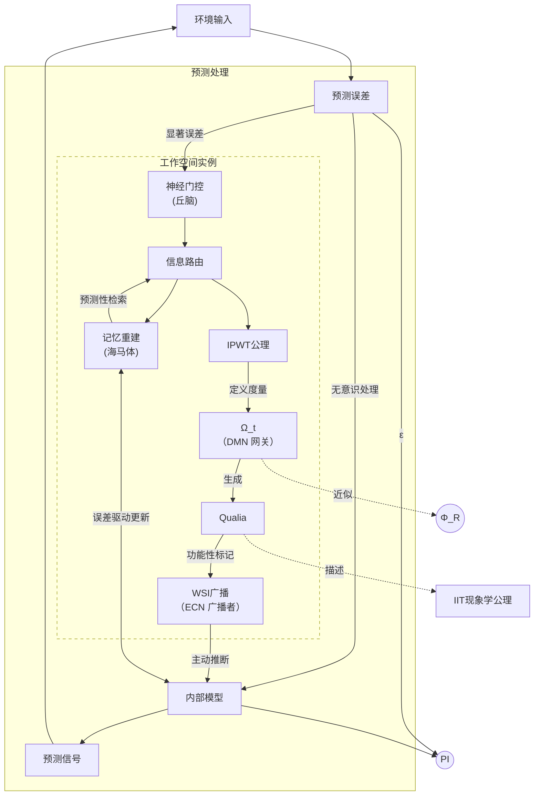

```mermaid
graph TD
    ENV[环境输入]

    subgraph PCT[预测处理]
        PE[预测误差]
        IM[内部模型]
        PS[预测信号]

        subgraph WSI[工作空间实例]
            style WSI stroke-dasharray: 5 5
            NG["神经门控<br/>(丘脑)"]
            IR[信息路由]
            MR["记忆重建<br/>(海马体)"]
            AXI[IPWT公理]
            INT["Ω_t<br/>（DMN 网关）"]
            QUA["Qualia"]
            BCST["WSI广播<br/>（ECN 广播者）"]
        end
    end

    ENV --> PE
    PE -->|无意识处理| IM
    IM --> PS
    PS --> ENV
    PE -->|ε| PI(("PI"))
    IM --> PI

    PE -->|显著误差| NG
    NG --> IR
    IR --> AXI
    AXI -->|定义度量| INT
    INT -->|生成| QUA
    QUA -->|功能性标记| BCST

    IR --> MR
    MR -->|预测性检索| IR
    BCST -->|主动推断| IM
    MR <-->|误差驱动更新| IM

    IIT[IIT现象学公理]:::iit
    QUA -. 描述 .-> IIT

    INT -.->|近似| PHIR(("Φ_R"))
```
