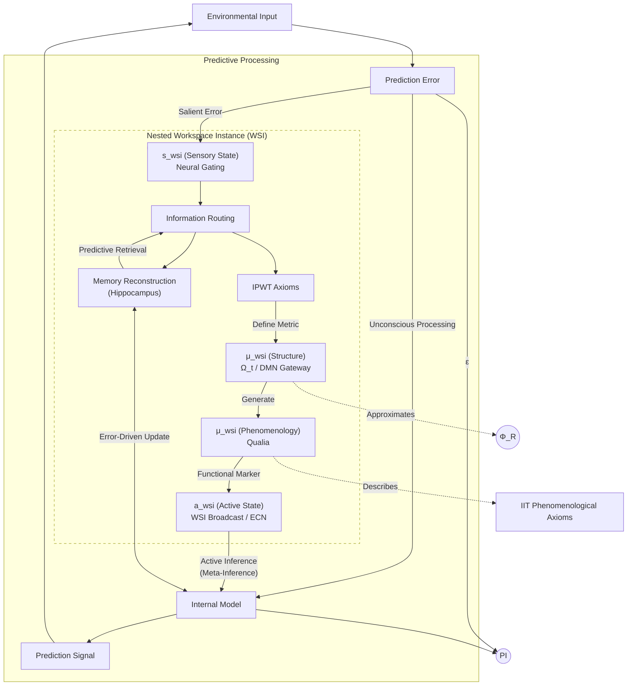

```mermaid
graph TD
    ENV[Environmental Input]

    subgraph PCT[Predictive Processing]
        PE[Prediction Error]
        IM[Internal Model]
        PS[Prediction Signal]

        subgraph WSI["Nested Workspace Instance (WSI)<br/>(Markov Blanket)"]
            style WSI stroke-dasharray: 5 5
            NG["s_wsi (Sensory State)<br/>Neural Gating"]
            IR[Information Routing]
            MR["Memory Reconstruction<br/>(Hippocampus)"]
            AXI[IPWT Axioms]
            INT["μ_wsi (Structure)<br/>Ω_t / DMN Gateway"]
            QUA["μ_wsi (Phenomenology)<br/>Qualia"]
            BCST["a_wsi (Active State)<br/>WSI Broadcast / ECN"]
        end
    end

    ENV --> PE
    PE -->|Unconscious Processing| IM
    IM --> PS
    PS --> ENV
    PE -->|ε| PI(("PI"))
    IM --> PI

    PE -->|Salient Error| NG
    NG --> IR
    IR --> AXI
    AXI -->|Define Metric| INT
    INT -->|Generate| QUA
    QUA -->|Functional Marker| BCST

    IR --> MR
    MR -->|Predictive Retrieval| IR
    BCST -->|"Active Inference<br/>(Meta-Inference)"| IM
    MR <-->|Error-Driven Update| IM

    IIT[IIT Phenomenological Axioms]:::iit
    QUA -. Describes .-> IIT

    INT -.->|Approximates| PHIR(("Φ_R"))
```
