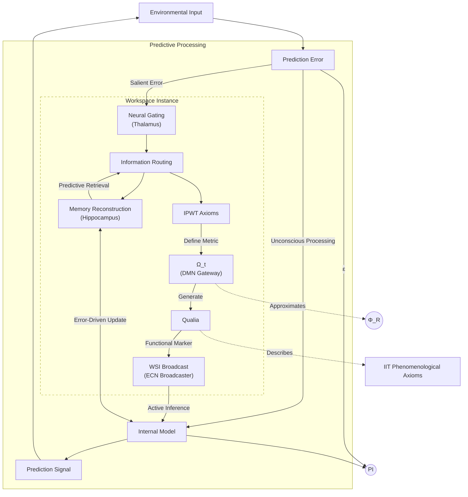

```mermaid
graph TD
    ENV[Environmental Input]

    subgraph PCT[Predictive Processing]
        PE[Prediction Error]
        IM[Internal Model]
        PS[Prediction Signal]

        subgraph WSI[Workspace Instance]
            style WSI stroke-dasharray: 5 5
            NG["Neural Gating<br/>(Thalamus)"]
            IR[Information Routing]
            MR["Memory Reconstruction<br/>(Hippocampus)"]
            AXI[IPWT Axioms]
            INT["Ω_t<br/>(DMN Gateway)"]
            QUA["Qualia"]
            BCST["WSI Broadcast<br/>(ECN Broadcaster)"]
        end
    end

    ENV --> PE
    PE -->|Unconscious Processing| IM
    IM --> PS
    PS --> ENV
    PE -->|ε| PI(("PI"))
    IM --> PI

    PE -->|Salient Error| NG
    NG --> IR
    IR --> AXI
    AXI -->|Define Metric| INT
    INT -->|Generate| QUA
    QUA -->|Functional Marker| BCST

    IR --> MR
    MR -->|Predictive Retrieval| IR
    BCST -->|Active Inference| IM
    MR <-->|Error-Driven Update| IM

    IIT[IIT Phenomenological Axioms]:::iit
    QUA -. Describes .-> IIT

    INT -.->|Approximates| PHIR(("Φ_R"))
```
