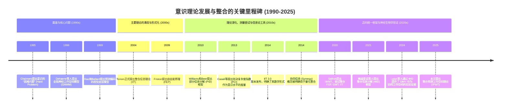

# 时间线

```mermaid
timeline
    title 意识理论发展与整合的关键里程碑 (1990-2025)
    section 奠基与核心问题 (1990s)
        1995 : Chalmers提出意识的<br>“困难问题” (Hard Problem)
        1998 : Dehaene等人提出<br>全局神经工作空间模型 (GNWM)
        1999 : Rao和Ballard提出预测编码<br>的视觉皮层模型
    section 主要理论的涌现与形式化 (2000s)
        2004 : Tononi正式提出整合信息理论 (IIT)
        2009 : Friston提出自由能原理 (FEP)
    section 理论深化、测量尝试与信息论工具 (2010s)
        2010 : Williams和Beer提出<br>部分信息分解 (PID) 框架
        2013 : Casali等提出扰动复杂度指数 (PCI) 作为意识水平的度量
        2014 : IIT 3.0 版本发布，明确了其数学形式
        2014 : 协同信息 (Synergy) 概念被明确用于量化整合
    section 迈向统一框架与神经生物学验证 (2020s)
        2020 : Safron提出 IWMT，尝试整合 FEP, GWT, IIT
        2021 : 梅迪亚诺等人提出<br>整合信息分解 (ΦID) 框架
        2024 : Luppi等人通过 ΦID 提供了 DMN 作为<br>协同工作空间的实验证据
        2025 : 本文提出<br>整合预测工作空间理论 (IPWT)
```
