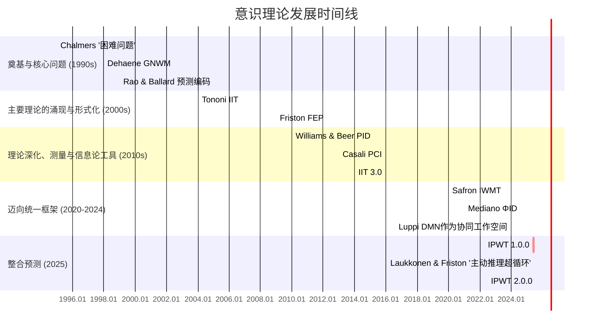

```mermaid
gantt
    title 意识理论发展时间线
    dateFormat YYYY-MM
    axisFormat %Y.%m
  
    section 奠基与核心问题 (1990s)
    Chalmers '困难问题'           :done, 1995-01, 2d
    Dehaene GNWM                   :done, 1998-01, 2d
    Rao & Ballard 预测编码         :done, 1999-01, 2d

    section 主要理论的涌现与形式化 (2000s)
    Tononi IIT                     :done, 2004-01, 2d
    Friston FEP                    :done, 2009-01, 2d
  
    section 理论深化、测量与信息论工具 (2010s)
    Williams & Beer PID            :done, 2010-01, 2d
    Casali PCI                     :done, 2013-01, 2d
    IIT 3.0                        :done, 2014-01, 2d

    section 迈向统一框架 (2020-2024)
    Safron IWMT                    :done, 2020-01, 2d
    Mediano ΦID                    :done, 2021-01, 2d
    Luppi DMN作为协同工作空间      :done, 2024-01, 2d

    section 整合预测 (2025)
    IPWT 1.0.0                     :crit, 2025-06, 2d
    Laukkonen & Friston '主动推理超循环' :crit, 2025-07, 2d
    IPWT 2.0.0                     :crit, 2025-08, 2d
```