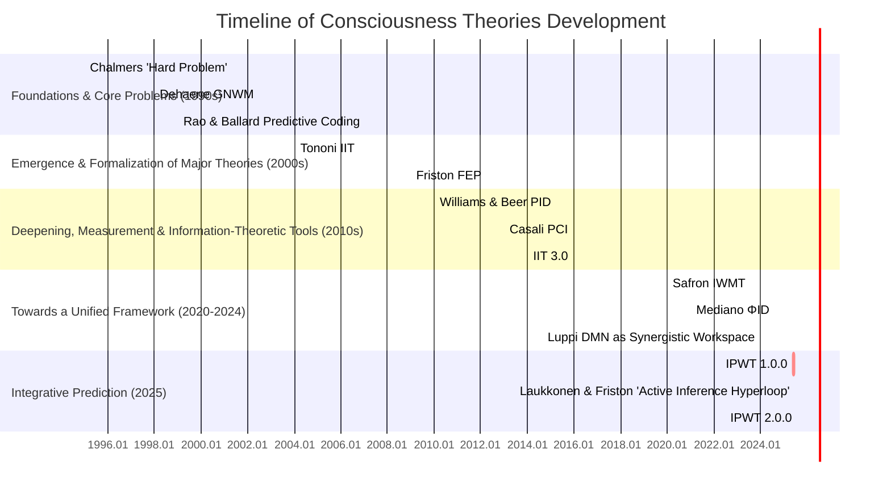

```mermaid
gantt
    title Timeline of Consciousness Theories Development
    dateFormat YYYY-MM
    axisFormat %Y.%m

    section Foundations & Core Problems (1990s)
    Chalmers 'Hard Problem'        :done, 1995-01, 2d
    Dehaene GNWM                   :done, 1998-01, 2d
    Rao & Ballard Predictive Coding:done, 1999-01, 2d

    section Emergence & Formalization of Major Theories (2000s)
    Tononi IIT                     :done, 2004-01, 2d
    Friston FEP                    :done, 2009-01, 2d

    section Deepening, Measurement & Information-Theoretic Tools (2010s)
    Williams & Beer PID            :done, 2010-01, 2d
    Casali PCI                     :done, 2013-01, 2d
    IIT 3.0                        :done, 2014-01, 2d

    section Towards a Unified Framework (2020-2024)
    Safron IWMT                        :done, 2020-01, 2d
    Mediano ΦID                        :done, 2021-01, 2d
    Luppi DMN as Synergistic Workspace :done, 2024-01, 2d

    section Integrative Prediction (2025)
    IPWT 1.0.0                         :crit, 2025-06, 2d
    Laukkonen & Friston 'Active Inference Hyperloop' :crit, 2025-07, 2d
    IPWT 2.0.0                         :crit, 2025-08, 2d
```